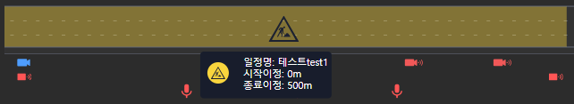
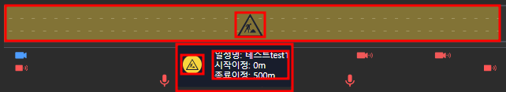

# D3의 tooltip 기능 개념정리 

---

>[참고 사이트1](https://gramener.github.io/d3js-playbook/tooltips.html)
>
>[참고 사이트2](https://d3-graph-gallery.com/graph/interactivity_tooltip.html)
>
>[참고 사이트3](https://codelib.tistory.com/8)

## Tooltip 사용 이유 

1. D3 객체에 마우스를 이용한 이벤트를 추가해 객체의 정보를 표출하는 기능을 만들고자 했다.  

## ToolTip 문제

1. 태그의 처럼 사용되지만 스타일 중 `background` 등 속성값을 사용하지 못하거나 명칭이 다르다. 
   1. `text-color`는 `fill` 로 사용되야 한다. 
   2. `background-color` 는 rect 이라는 태그를 생성해 상자를 뒤에 표출해서 만들었다. 
2. 위치 조절 
   1. 태그처럼 하위에 넣어 위치를 잡는것이 아닌 viewport 로 선형 변환된 위치값을 이용해야한다. 
3. D3 순서
   1. D3는 그려지는 순서대로 객체가 표시된다. 
   2. 즉, 그리는 순서가 중요해 순차적으로 의미에 맞게 그려줘야한다. 
   3. 예를들어, 백그라운드 상자로 사용될 rect 태그를 그린 후 , 그 위에 content를 표시해야 한다. 

### D3 순서 조절 방법

1. 객체 추가시 순서에 맞춰 추가한다. 
   1. 즉, 가장 위에 표시되어야 할 객체는 가장 나중에 생성 후 추가한다. 
2. 내장 함수 사용
   1. raise() 나 lower() 같은 d3의 내장함수를 사용해 순서를 변경할 수 있다. 
   2. raise() : d3 요소들 중 **가장 위**에 표출한다. 
   3. lower() : d3 요소들 중 **가장 아래**로 표출한다. 
3. 단점
   1. 가장 위로, 가장 아래로 밖에 조절할 수 없음. 
   2. 즉, 순차적으로 순번을 주기가 어려움
   3. 가장 위로 표시된 객체로 인해 연관되지 않는 다른 객체가 묻혀버릴 수 있다. 

## Tooltip 생성 코드 

1. 결과 사진 



2. d3로 그린 요소 표시 



```js
    // 공사이정 그리기 
drawSchedule: function (schedule) {
      var me = this;
      var width = this.width;
      var startPosition = this.scheduleStartPosition; 
      var endPosition = this.scheduleEndPosition;
      let laneY = 0;

      if(schedule.bound == 1) { // 위, 아래에 따라 다른 위치로 표시 
        laneY = this.upLaneY;
      }else{
        laneY = this.downLaneY;
      }

      let scheduleStartP = schedule.startPosition;
      let scheduleEndP = schedule.endPosition;
      // 노란색 그려질 범위의 길이 
      let drawScheduleWidth = scheduleEndP - scheduleStartP;
      var svg = this.svg;

      // 선형변환 함수 제작 (화면 너비로 변경)
      var scaleLinear = d3
        .scaleLinear()
        .domain([startPosition, endPosition])
        .range([0, this.width]);

      // 선형변환 값 
      var linearStartP = scaleLinear(scheduleStartP);
      var linearWidth = scaleLinear(drawScheduleWidth);
      var lane = this.getLaneData(linearStartP, laneY, linearWidth);
    	
      var scheduleGroup = svg.append("g").attr("class", "scheduleGroup" + schedule.bound); // 1. 전체 감싸는 그룹
      let scheduleTooltipGroup = d3.select(".scheduleTooltipGroup"); // 2. text를 포함한 나머지 요소들의 그룹
      let scheduleTooltip = d3.select(".scheduleTooltip"); // 3. tooltip 안에 표시될 text 

        // 순서 조절 
      scheduleGroup.raise();
      d3.select(".scheduleTooltipGroup").raise();

      // 해당 요소 있는지 체크. 없다먼 생성, 있다면 content만 만 변경 
      if(!scheduleTooltipGroup.node()){ 
        // scheduleTooltipGroup과 그 하위에 scheduleTooltip 추가 
        scheduleTooltip = svg
          .append("g")
          .attr("class", "scheduleTooltipGroup") // 상위 요소 
          .style("visibility", "hidden")
          .append("text")
          .attr("class", "scheduleTooltip") // 하위 요소로 추가 
          .style("height", "20px")
          // .style("background-color", "#181D2C")
          .style("text-color", "white")
          .style("text-align", "left")
          .style("border-radius", "3px")
          .style("border-width", "2px")
          .style("font-size", "10pt")
          .style("position", "absolute")
          .style("min-width", "max-content")
      }
      
      // 선을 이용해 노란색 범위 표시 
      scheduleGroup
        .append("path")
        .attr("class", "construction" + schedule.no)
        .attr("id", "construction")
        .attr("d", this.curveFunc(lane))
        .attr("stroke", "#F9D53D")
        .attr("stroke-width", laneHeight )
        .attr("opacity", 0.4) // 투명도 
        .attr("title", "construction" + schedule.no + ", scheduleName : " + schedule.scheduleName)
        

      // 이벤트 추가 
      scheduleGroup
        .on("mouseover", function() { // 마우스 오버시 호출
          me.event.scheduleMouseover(d3.event, schedule,linearStartP, laneY, linearWidth, scheduleTooltip);
        })
        .on("mouseout", function () { // 마우스 아웃시 호출
          me.event.scheduleMouseout();
        });

      // 노란 범위 가운데 이미지 추가 
      scheduleGroup.append("svg:image")
        .attr(
          "xlink:href","/resources/img/svg/construction.svg"
        )
        .attr("class", "constructionImg")
        .attr("x", linearStartP)
        .attr("y", laneY -15 )
        .attr("width", linearWidth -5 )
        .attr("height", laneHeight -20 )
        .attr("opacity", 1)

      return scheduleGroup;
    },

```

```javascript
// 마우스 오버시 호출
scheduleMouseover: function (event, schedule, linearStartP, laneY, linearWidth, scheduleTooltip) {
    	// 요소 있다면 제거 후 다시 그림 
        const scheduleTooltipGroup = d3.select(".scheduleTooltipGroup");
        scheduleTooltipGroup.selectAll("rect").remove();
        scheduleTooltipGroup.selectAll("image").remove();
        scheduleTooltipGroup.style("visibility", "visible") // 요소 표출 
    
        var textWidth = scheduleTooltipGroup.node().getBoundingClientRect().width;
        // var textWidth = scheduleTooltip.node().getBoundingClientRect().width;

    	// background-color 표시하기 위한 rect 요소 생성 -> 너비 및 높이는 뒤에서 요소 추가 후의 너비로 설정함
        scheduleTooltipGroup.insert("rect", "text")
          .attr("x", x 위치 설정 ) 
          .attr("y", y 위치 설정)
          .attr("rx", 5) // 둥근 모서리
          .attr("ry", 5)
          .attr("fill", "#181D2C")
          ;

    	// text 줄바꿈 위한 배열 
        const textLines = [
          "일정명: " + schedule.scheduleName ,
          "시작이정: " + schedule.startPosition * 1000 + "m",
          "종료이정: " + schedule.endPosition * 1000 + "m"
        ];
    
        // 기존 텍스트 제거
        scheduleTooltip.selectAll("tspan").remove();
    
    	// 텍스트 요소 추가 
        const textElement = scheduleTooltip
          // .attr("x", bbox.x )
          // .attr("y", bbox.y)
          .attr("y", 텍스트 표시 Y 위치 )
          // .style("left", d3.event.pageX - 50 + "px")
          // .style("top", d3.event.pageY - 85 + "px")
          .style("text-align", "center")
          .style("width", "auto") // 글자 공간만큼 너비 조절
          .style("height", "auto") // 글자 공간만큼 높이 조절
          .style("background-color","white")
          .transition()
          .duration(200)
          .on("start", function () {
            // 텍스트의 넓이 계산
            // var textWidth = scheduleTooltip.node().getBoundingClientRect().width;
            // var textHeight = scheduleTooltip.node().getBoundingClientRect().height;
            // 계산된 넓이로 업데이트
            // scheduleTooltip.style("width", textWidth + "px");
            // scheduleTooltip.style("height", textHeight + "px");
          });

    	// 글자 그리기 
        textLines.forEach(function(line, index) {
          scheduleTooltip.append("tspan")
            .attr("x", 텍스트 표시 x 위치) 
            .attr("fill", "white")
            .attr("dy", index === 0 ? "0em" : "1.2em") // 첫 번째 줄은 기본, 그 이후 줄은 다음 줄로 이동
            .text(line)
            
        });

        // 이미지 표시하기 위한 circle 범위 생성 
        scheduleTooltipGroup.append("rect")
          .attr("x",  x 위치 설정)
          .attr("y",  Y 위치 설정 )
          .attr("width", circleSize + "px")  // 이미지의 너비
          .attr("height", circleSize + "px") // 이미지의 높이
          .attr("fill", "rgb(249,213,61)")
          .attr("rx", 15) // 둥근 모서리
          .attr("ry", 15);

        // circle 범위에 img 생성 
        scheduleTooltipGroup.append("image")
          .attr("x", X위치 설정 ) 
          .attr("y", Y위치 설정)
          .attr("width", imgSize + "px")  // 이미지의 너비
          .attr("height", imgSize + "px") // 이미지의 높이
          .attr("href", "/resources/img/svg/construction.svg")

    	// rect 범위를 요소 추가한만큼 조절 
        scheduleTooltipGroup
          .select("rect")
          .attr("width", scheduleTooltipGroup.node().getBoundingClientRect().width +15)
          .attr("height", scheduleTooltipGroup.node().getBoundingClientRect().height +15)

  },
  scheduleMouseout: function () {
    const scheduleTooltipGroup = d3.select(".scheduleTooltipGroup");
    scheduleTooltipGroup
      .style("visibility", "hidden");
  },
```

