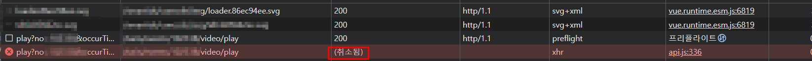

# api cancle 방법(axios이용)

---

>

## 문제상황

1. 팝업 표출에서 사용된 api call 이 팝업이 닫히고 나서 실행되는 문제 발생
2. 방법 2가지
   1. flag 세워서 일일히 처리 
   2. api cancle 로 해당 api cancle 처리 
3. 두가지 방법 중 안해본 api cancle 을 사용해보기로 했다. 

## axios 이용 `AbortController` vs `CancelToken` 비교

| 항목            | `AbortController`    | `CancelToken`             |
| --------------- | -------------------- | ------------------------- |
| 지원 여부       | ✅ 최신, 표준 Web API | ❌ deprecated              |
| 코드 간결성     | 매우 깔끔함          | 복잡함                    |
| Axios 공식 추천 | ✅                    | ❌ 더 이상 사용 권장 안 함 |

## axios 이용 api cancle

##### 사용조건

| axios 버전     | 지원 여부   | 설명                                                         |
| -------------- | ----------- | ------------------------------------------------------------ |
| **0.21 이하**  | ❌ 미지원    | `signal` 옵션 자체가 없음. 대신 `CancelToken` 사용해야 했음 (deprecated) |
| **0.22 ~ 1.0** | ✅ 도입됨    | `AbortController`와 `signal`을 사용한 요청 취소 기능이 실험적으로 추가됨 |
| **1.1 이상**   | ✅ 안정 지원 | `signal` 옵션이 안정화되어 공식 문서에도 등재됨              |

##### 동작 방식

1. `AbortController`를 생성한다.
2. `axios` 요청 시 `{ signal: controller.signal }`을 옵션에 추가한다.
   1. `{ params, signal }` 형태로 **Axios 요청 옵션에 넣는다(권장 방식)**
3. 언제든지 `controller.abort()`를 호출하면 요청이 취소된다.
4. `catch` 블록에서 `err.code === 'ERR_CANCELED'`로 취소 여부를 확인한다.

##### 예제 코드



```js
// api call 
async downLoadF(event) {
  try{
    // api 요청 여부 확인 
    if (this.downloadController) {
      this.downloadController.abort() // 이전 요청 cancle 
    };

    // api 요청 캔슬
    this.downloadController = new AbortController();
    let signal = this.downloadController.signal; 

    const response = await this.downLoadFunction(event, signal);

    if(!response){
      const err = new Error("cancled download");
      err.name = "CanceledError";
      err.code = "ERR_CANCELED"; 
      throw err
    }
    else if(response.data?.success) {
      var data = response.data.data;
      ...
    } else {
      this.fileUrl = null; 
      this.videoDownloadFail(response.data.error.message)
    }
  }
  catch(err){
    if (err.name === 'CanceledError' || err.code === 'ERR_CANCELED') {
      console.log('video download Canceled: The request was canceled');
    } else{
      console.log("~ downLoadF ~ err:", err)
    }
  }
},
```

```js
// param 전달  
const downLoadFunction = async (event, signal) => {
  return await api.downloadVideo({
    param1: param1,
    param2: param1,
  }, signal);
};

// axios.get
downloadVideo(params, signal) {
    return this.axios.get("events/" + params.no + "/video/play", {
      params: params, // GET 파라미터
      signal: signal  // 취소 토큰
    });	
},
```

```js
// modal closed (api cancle 실행)
onBtnCancel() {
  document.activeElement?.blur();

  // api 요청 캔슬 
  if (this.downloadController) {
    this.downloadController.abort(); 
    this.downloadController = null;
  }
  this.onVideoClean();

},
```

## axios 요청 취소시 return 객체 

- Axios 요청이 `AbortController`에 의해 취소되면, Axios는 다음과 같은 에러 객체를 던져 response는 존재하지 않는다. 즉, `undefined` 상태가 된다.
  - 서버 응답이 오지 않은 상태(예: 요청 취소, 네트워크 오류 등)에서는 `response` 자체가 없다. 
  - cancle 한 api response 에 `undefined` 처리 추가해줘야함 (자동으로 api cancle 되면 try-catch문에 걸림)

  ```js
  // axios 의 interceptors.response.use() 에 해당 로직 포함해야함 
  
  //API cancel
  if (!error.response){
    return;
  }
  ```

- 또한 Axios가 취소된 요청은 **명시적으로 `ERR_CANCELED`를 부여**한다. 

```js
{
  name: 'CanceledError',            // 표준 AbortController 이름
  message: 'canceled',              // 메시지
  code: 'ERR_CANCELED',             // Axios 전용 코드
  config: { ... },                  // 요청 정보
  isAxiosError: true                // Axios 요청임을 나타냄
}
```