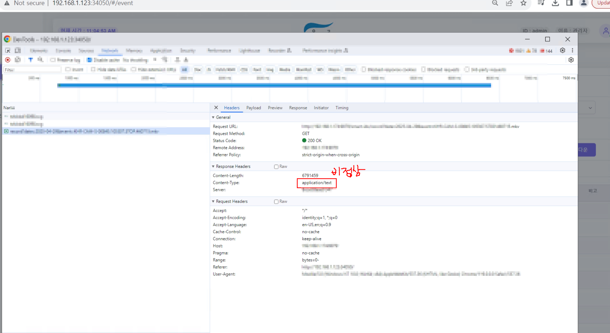
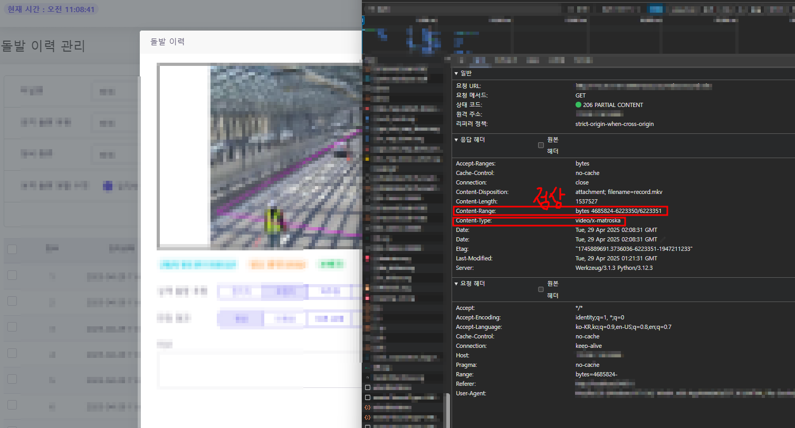

# 비디오 스트리밍 컨트롤을 위한 HTTP 헤더 정리

---

>

## 문제점

브라우저에서 `<video>` 태그로 비디오를 재생할 때,
- 탐색(스크럽), 정지, 빠른 이동 등이 작동하지 않음
- 이유
  1. 서버 응답에 Content-Type 이 `video` 가 아닌 `application/text` 헤더 포함 
  2. 서버 응답에 **Range 요청 대응 헤더 누락**
- 즉, `Content-Type`이 비디오로 맞지 않으면, `Content-Range`가 있어도 비디오 컨트롤은 불가능하다.





## 개선점

##### [ 기존 방식 및 문제점 ]

- 백엔드 서버가 비디오 전체 파일(Byte) 다운로드 → 프론트엔드 전달 → 프론트에서 Blob 형태로 영상 표출
- 문제점
  1. **영상 서버 과부하**
     - `nB × m명 = n × mB` 수준의 트래픽 및 디스크/메모리 사용 발생
     - 서버 리소스 소모 심화로 인한 시스템 성능 저하
  2. **프론트엔드 메모리 과다 사용**
     - Blob 데이터를 브라우저 메모리에 직접 적재해 메모리 사용량 증가
- 즉, 
  - 서버 장애 발생 가능성 및 사용자 대기 시간 증가, 영상 로딩 지연이 있을 수 있습니다. 

##### [ 개선 방향 (현재 변경 코드) ] 

- 직접 비디오 URL을 호출하여 `<video>` 태그로 재생

- 기대 효과

  1. **백엔드 부하 제거**
     - 비디오 서버에만 트래픽 발생, 백엔드 서버 리소스 사용 최소화
  2. **스트리밍 재생 지원**
     - 전체 다운로드 없이 초반 데이터만으로 즉시 재생 시작
     - 사용자 대기 시간 단축
  3. **브라우저 메모리 최적화**
     - `<video>` 태그의 기본 메모리 관리 기능을 활용하여 프론트 메모리 사용량 감소

  

## 브라우저의 비디오 재생 흐름

브라우저는 Content-Type → Accept-Ranges → Content-Range 순서로 검사해서 비디오 스트리밍과 컨트롤을 결정한다.

```
[서버 응답 수신]
       │
       ▼
[Content-Type 검사]
       │
       ├── (video/mp4, video/webm 등) → [스트리밍 준비]
       │
       └── (application/text 등) → [재생 실패] (끝)

[스트리밍 준비 완료]
       │
       ▼
[Accept-Ranges 검사]
       │
       ├── 있음 → [탐색(스크럽) 가능 준비]
       │
       └── 없음 → [전체 다운로드 후 재생] (탐색 제한 가능)

[사용자 타임라인 조작]
       │
       ▼
[브라우저 Range 요청 전송 (bytes=start-end)]
       │
       ▼
[서버 Content-Range 응답 검사]
       │
       ├── 올바른 Content-Range 제공 → [부분 데이터 수신 → 탐색 성공]
       │
       └── Content-Range 없음/이상함 → [탐색 실패]
```

##### 1. Content-Type 검사

- 서버 응답의 `Content-Type` 확인
- `video/mp4`, `video/x-matroska` 등 비디오 MIME 타입이어야 재생 시작
- 잘못된 타입(ex: application/text)이면 **재생 실패**

##### 2. 스트리밍 준비

- Content-Type이 비디오면 `<video>` 태그에 스트림 연결
- 브라우저가 스트리밍 모드로 대기

##### 3. Accept-Ranges 검사

- 응답에 `Accept-Ranges: bytes` 있으면
- 브라우저가 탐색(스크럽)을 시도할 수 있다고 인식

##### 4. Range 요청

- 사용자가 타임라인을 조작하면
- 브라우저가 `Range: bytes=start-end` 요청

##### 5. Content-Range 응답 확인

- 서버가 `206 Partial Content`로 응답하면서
- `Content-Range: bytes start-end/total` 헤더를 포함해야 탐색 이어받기 가능

##### 6. 비디오 디코딩 및 탐색

- 받은 데이터로 비디오 디코딩 진행

## 개념

### Content-Type
- 역할 
  - 응답 콘텐츠가 비디오라는 것을 브라우저에게 알려줌
  - 

- 예시 
  - `video/mp4, video/x-matroska, application/text`
  - 만약 `application/text` 라면 브라우저는 "이건 텍스트 파일이구나"라고 인식

- 중요도
  - 필수


### Content-Range

- 역할 
  - 응답 데이터가 **전체 파일 중 일부 범위임을 명시**
- 예시
  - `Content-Range: bytes 1000-1999/10000`
- 중요도
  - 필수 (탐색 기능 작동에 핵심)

### Accept-Ranges

- 역할 
  - 클라이언트에게 서버가 범위 요청을 수락한다고 알림

- 예시
  - `Accept-Ranges: bytes`

- 중요도
  - 권장 (있으면 브라우저가 탐색 기능 시도)


## 해결 방법 

1. 서버 응답 구성 변경
   1. `Content-Type, Content-Range` 추가 후 video 라는걸 인식 

```http
GET /video/record.mp4 HTTP/1.1
Host: example.com
Range: bytes=1000-1999

HTTP/1.1 206 Partial Content
Content-Type: video/mp4
Content-Length: 1000
Content-Range: bytes 1000-1999/10000
Accept-Ranges: bytes
```

## 핵심 요약

| 헤더             | 설명                                      | 필수 여부           |
| ---------------- | ----------------------------------------- | ------------------- |
| `Content-Type`   | 비디오 형식 명시 (`video/mp4`, etc.)      | 필수                |
| `Accept-Ranges`  | Range 요청 허용 여부 (`bytes`)            | 권장                |
| `Content-Range`  | 현재 응답 범위 명시 (`bytes 0-1023/5000`) | 필수 (부분 응답 시) |
| `Content-Length` | 응답 바이트 길이                          | 필수                |

## 정리

- 나의 문제는 총 2가지 였다. 
  1. 잘못된 `Content-Type` 지정
  2. 헤더 `Content-Range` 없음 
- 즉, 비디오 스트리밍 **컨트롤**(탐색, 일시정지 등)을 위해선 서버가 반드시
  1. **`Content-Type`을 적절히 지정하고**
  2. **`Range` 요청을 수락하며**
  3. **`Content-Range`로 응답 범위를 정확히 명시**해야 한다.
- 단순 전체 응답 (`200 OK`)만으로는 컨트롤이 제한될 수 있음