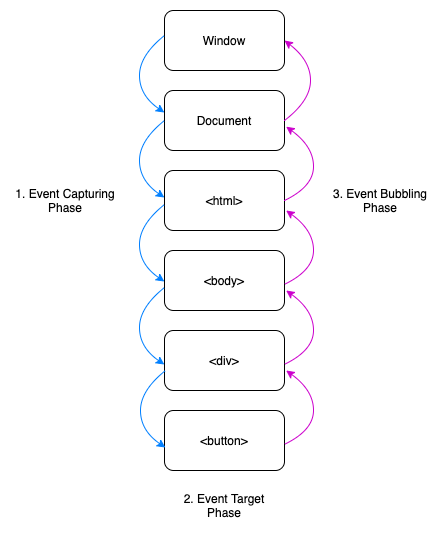
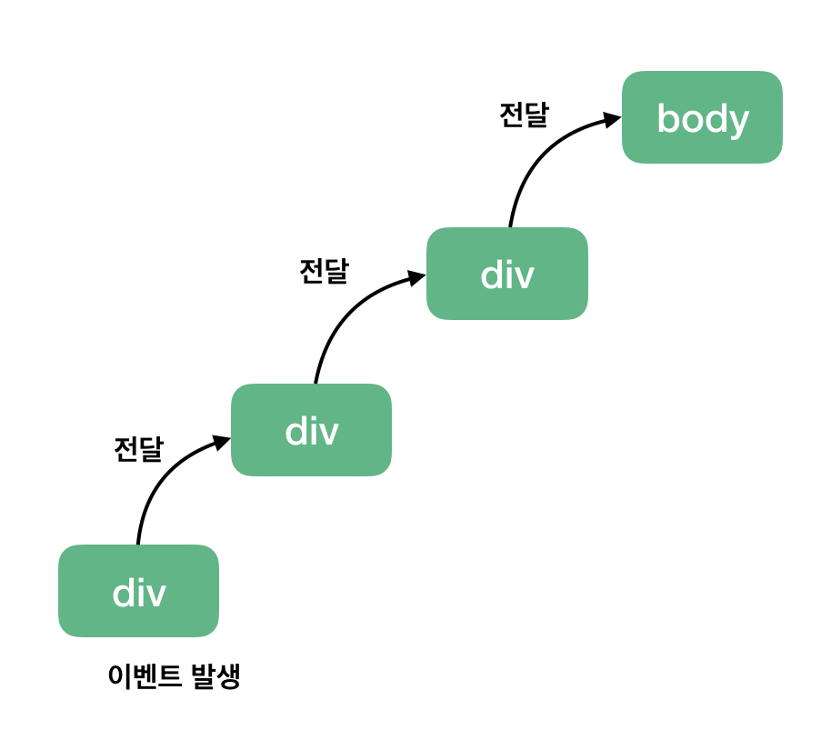

# 이벤트 버블링과 이벤트 캡쳐 개념정리

---

>[참고 사이트1](https://joshua1988.github.io/web-development/javascript/event-propagation-delegation/)

## 이벤트 버블링

### 정의

- **자바스크립트**에서 사용되는 개념으로**, 특정 태그**에서 발생한 **이벤트**가 상위로 올라가며 **최종적으로 부모 요소로 전파**되는 방식을 뜻한다. 



### 이벤트 버블링 vs 이벤트 캡쳐

1. 이벤트 버블링 

   - 발생한 이벤트가 상위로 올라가며 최종적으로 부모 요소로 전파되는 방식

   

2. 이벤트 캡쳐

   - 이벤트 버블링과 반대 방향으로 진행되는 이벤트 전파방식 
   - 따라서 최상위 요소인 document 객체로부터 이벤트가 발생한 target 요소에 도달할 때까지 하위로 이벤트가 전파된다. 

   

### 예시

```html
<div id="parent">
  <div id="child">
    <button>Click Me</button>
  </div>
</div>
```

1. "Click Me" 버튼을 클릭하면 클릭 이벤트가 발생
2. 이벤트가 버튼에서 시작해서 부모인 `#child` 요소, 그리고 `#parent` 요소로 전파

### 이벤트 위임

- 하위 요소에 각각 이벤트를 붙이지 않고 상위 요소에서 하위 요소의 이벤트들을 제어하는 방식

- 실제 바닐라 JS로 웹 앱을 구현할 때 자주 사용하게 되는 코딩 패턴이다. 

  ```html
  <h1>오늘의 할 일</h1>
  <ul class="itemList">
  	<li>
  		<input type="checkbox" id="item1">
  		<label for="item1">이벤트 버블링 학습</label>
  	</li>
  	<li>
  		<input type="checkbox" id="item2">
  		<label for="item2">이벤트 캡쳐 학습</label>
  	</li>
  </ul>
  <script>
  // 해당 태그에만 이벤트 적용
  var inputs = document.querySelectorAll('input');
  inputs.forEach(function(input) {
  	input.addEventListener('click', function(event) {
  		alert('clicked');
  	});
  });
  
  // li 태그 전체에 적용 
  var itemList = document.querySelector('.itemList');
  itemList.addEventListener('click', function(event) {
  	alert('clicked');
  });
  
  </script>
  ```


