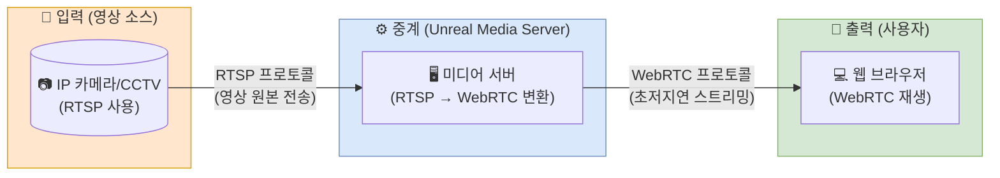

# 미디어 관련(WebRTC, Unreal Media Server, RTSP) 개념 및 차이점 정리

---

>

- 미디어 서버 환경에서 자주 등장하는 3가지 핵심 개념(RTSP, UMS, WebRTC)이 헷갈리는 이유는 각자의 **역할과 위치**가 다르기 때문이다. 
- 이를 **"CCTV 영상을 웹에서 실시간으로 보는 상황"**으로 흐름을 정리해보려고 한다. 

## 1. 한 눈에 보는 개념도 (데이터 흐름)

- 카메라 영상이 우리 눈에 보이기까지의 과정이다. 

---

## 2. 3가지 개념의 쉬운 비유와 설명

### ① RTSP (Real-Time Streaming Protocol)
> **비유: "화물 트럭"** (무겁지만 표준화됨)

*   **정의**: 스트리밍 데이터를 제어하기 위한 통신 규약
*   **주 역할**: **영상 소스(카메라)가 영상을 서버로 보낼 때** 주로 사용한다. 
*   **특징**:
    *   대부분의 IP 카메라/CCTV가 이 언어를 사용함
    *   하지만 **웹 브라우저(크롬, 엣지 등)는 RTSP를 직접 재생하지 못합니다.**
    *   그래서 중간에 변환해줄 "서버"가 필요

### ② Unreal Media Server (UMS)
> **비유: "물류 센터 & 통역사"** (받아서, 바꾸고, 뿌려줌)

*   **정의**: 다양한 미디어 프로토콜을 지원하는 **소프트웨어 서버**
*   **주 역할**:
    1.  카메라로부터 **RTSP** 신호를 받는다. (Ingest).
    2.  웹 브라우저가 이해할 수 있는 **WebRTC** 신호로 실시간 **변환**한다. 
    3.  여러 사용자가 접속해도 볼 수 있게 영상을 **복제/분배**한다. 

### ③ WebRTC (Web Real-Time Communication)
> **비유: "직통 퀵서비스"** (엄청 빠름)

*   **정의**: 웹 브라우저 간에 플러그인 없이 실시간으로 데이터를 주고받는 기술이다. 
*   **주 역할**: **서버에서 사용자(브라우저)까지 영상을 전달**하는 "마지막 구간(Last Mile)"을 담당한다.
*   **특징**:
    *   **초저지연 (Ultra Low Latency)**: 딜레이가 0.5초 미만으로 거의 실시간
    *   별도의 프로그램 설치 없이 크롬 등에서 바로 표출 가능 
    *   CCTV 제어나 화상 회의처럼 "즉각적인 반응"이 필요할 때 필수

---

## 3. 요약 비교표

- **"카메라(RTSP)의 영상을 웹(WebRTC)에서 딜레이 없이 보고 싶기 때문에, 중간에 Unreal Media Server가 변환을 해주는 것"** 

| 항목 | RTSP | Unreal Media Server (UMS) | WebRTC |
| :--- | :--- | :--- | :--- |
| **구분** | **프로토콜** (통신 규칙) | **서버 소프트웨어** (프로그램) | **기술 통신 규격** (API/프로토콜) |
| **주 사용처** | 카메라 ➡ 서버 | 서버 내부 (중계/변환) | 서버 ➡ 브라우저 |
| **지연 시간** | 보통 (1~2초 이상) | 처리 속도에 의존 | **매우 빠름 (< 0.5초)** |
| **웹 재생** | 불가 (별도 플레이어 필요) | - | **기본 지원** (Chrome, Safari 등) |
| **한마디로** | 카메라가 영상을 보내는 방식 | 영상을 변환하고 뿌려주는 허브 | 웹에서 영상을 실시간으로 보는 기술 |

