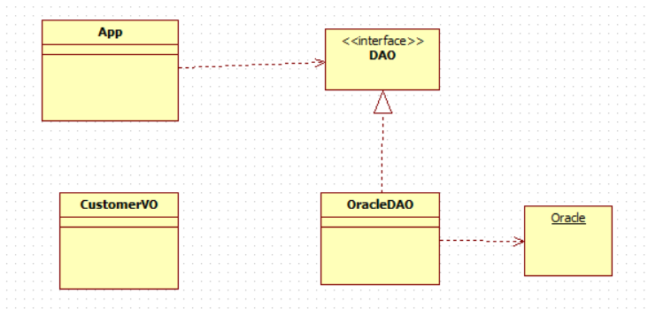

# 10일차
---

> 추상클래스 개념을 다시한번 정리한다. 
>
> 인터페이스에 대해 학습한다. 
>

## 1.  추상 클래스
   + 실체 (새, 곤충, 동물 ) 와 추상( 동물 ) 로 나눌수 있다. 
   + 동물은 의미만 존재하고 실제로 존재하지 않는다. 
   + 따라서 실체클래스는 추상클래스를 상속받아서 진행된다. 
   + 이때, 추상클래스로만은 객체를 생성할 수 없다. 
   + 목적
     + 실체 클래스의 공통된 필드와 메소드의 이름을 통일시키기 위함
     + 실체 클래스를 작성할 때 시간을 절약할 수 있다. 
   + 실체 클래스의 **설계 규격**을 만들고자 할때 사용된다. 
   + 함수
     + 추상 함수 
       + 반드시 상속관계에서 구현되야할 메소드
     + 일반 함수 
       + 오버라이딩 되어 사용되어질 메소드 

## 2.  인터페이스 



1. 동일한 목적을 가지고 동일한 기능을 수행하는 것으로 ,클래스의 기본 틀이 된다.
+ 특징
  1. **다중상속**을 지원한다. 
  2. 인터페이스의 모든 필드는 **public static final** 이여야 한다. 
  3. 인터페이스의 모든 메소드는 **abstract** 이여야 한다. 
     1. 묵시적으로 abstract가 생략된다. 
3. 인터페이스의 일반함수 구현 
  + public default void connect() {} 
    + 인터페이스 안에 일반함수 넣으려면 **default **키워드를 붙인다. 
4. 인터페이스를 사용하기 위해서는 해당 클래스에서 **implement** 키워드로 불러와 사용한다. 

## 3.  추상클래스 vs   인터페이스

1. 추상클래스를 상속받으면 generalize
2.  인터페이스를 상속 받으면 Realization

## 4.  OracleDAO

1. 오라클 데이터베이스에 연결하기 위해 사용 
2.  User 라는 키워드는 이름으로 사용하지 않는것이 좋다 .
    + 왜냐하면, oracle의 예약어이기 때문이다. 
3.  데이터베이스와 connect작업을 한 후 , close 를 해야한다. 

## 5.  ArrayList

1. 배열을 대체한다. 
+ 배열은 생성시 길이를 정해줘야 생성할 수 있다. 
  + 따라서 현업에서는 거의 사용되지 않는다. 
+ 배열과는 다르게 크기가 자동으로 조절된다. 
+ ArrayList<Customer>  list = new ArrayList<>();
  + list.add(c)

## 6. Map

   + Key , value 로 저장되어있는 공간 

   + 순차적으로 검색하는것이 아닌 key를 검색해 찾아낸다. 

     + 따라서 list와는 다르게 값이 순차적으로 저장되어 있지 않다. 

   + 값 넣기 

     + map.put("key","value") 

   + 값 가져오기

     + map.get("key")

   + 값 삭제 

     + map.put("key")

   + key가 있는지 확인

     + map.containsKey("key")

   + map에서 값 찾기 

     + keySet() 메소드는 Map의 모든 Key를 모아서 Set 자료형으로 리턴한다

     ```java
     // 출력 방법 1
     Collection<CustomerVO> col = map.values();
     Iterator<CustomerVO> it = col.iterator();
     ArrayList<CustomerVO> list = new ArrayList<>();
     
     while(it.hasNext()) {
         CustomerVO has_c = it.next();
         list.add(has_c);
     }
     
     for(CustomerVO list_c : list) {
         System.out.println(list_c);
     }
     
     //출력 방법 2
     Iterator<String> keys = map.keySet().iterator(); 
     while(keys.hasNext()) {
         String key = keys.next();
         System.out.println("iterator hasNext 이용: " + map.get(key));
     }
     
     //출력 방법 3
     for(String keys2 : map.keySet()) {
         System.out.println("향상된 for문 이용 : " + map.get(keys2));
     }
     ```

## 7.문제 만들기

1.  인터페이스를 이용하여 fruit 의 정보들을 Create, Read, Update, Delete 하기
2.  fruit 객체는 과일의 이름, 가격, 상태를 저장한다. 
    + 객체는 Map을 이용해 저장한다. 
3.  생성, 읽기, 업데이트, 삭제 를 통해 Map을 익힌다. 

