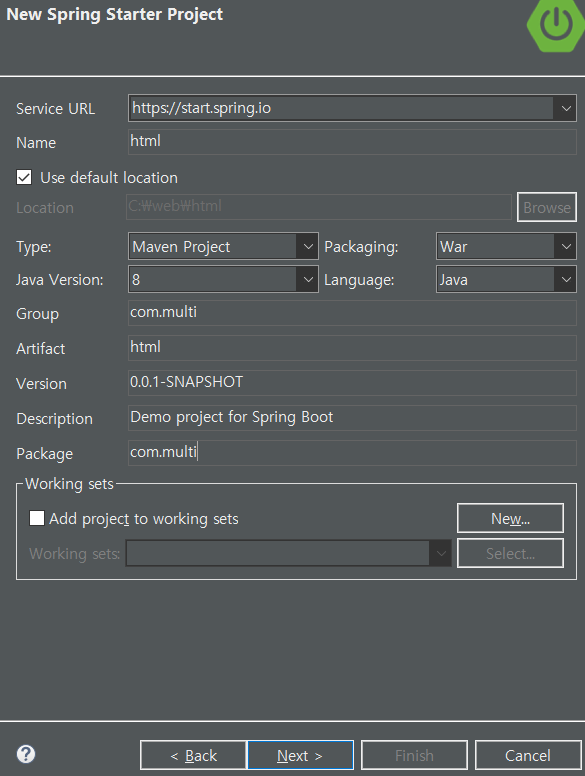
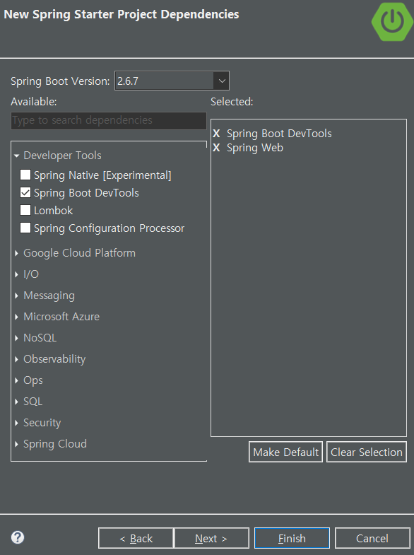

# 21일차

---

> Spring Tools 설치
>
> 웹 프로그래밍 배경에 대해 학습한다.
>
> Spring project를 생성하고 다뤄본다.
>
> 기본적인 html 파일의 구조에 대해 학습한다.

## 1. 이클립스 workspace 변경

- 이클립스 -> File -> Switch workspace -> 저장공간 변경

## 2. 스프링 툴 설치 및 프로젝트 생성

1. 스프링 툴 설치

   1. 이클립스 -> Help -> marketplace -> sts 검색 -> Spring Tools 3 Add-on for Spring Tools 4 3.9.22.RELEASE 를 인스톨 한다. -> Restart
   2. Window -> preparence -> Java -> Installed JREs -> 선택 후 Edit -> Directory Select -> C\Program Files\Java\jdk1.8.0_291선택
      1. jdk를 다시 설정해주는 과정이 필요하다.
      2. 디폴트로 지정되어있는 jdk는 오픈소스로 연결되어있는 것이다.

2. 프로젝트 생성 및 설정

   ```java
   1. project 생성
   2. Spring Boot > Spring Starter Project 선택
   3. 프로젝트명 입력
   4. Group과 Package 명 선택, 반드시 두개 이상의 package 명으로 입력
   5. Dependencies 선택
   	1) Spring Boot DevTools
   	1) Spring Web
   6. pom.xml 추가
    <!-- @Inject -->
   		<dependency>
   			<groupId>javax.inject</groupId>
   			<artifactId>javax.inject</artifactId>
   			<version>1</version>
   		</dependency>
   		<!-- Servlet -->
   
   		<dependency>
   			<groupId>org.apache.tomcat.embed</groupId>
   			<artifactId>tomcat-embed-jasper</artifactId>
   			<scope>provided</scope>
   		</dependency>
   
   
   		<dependency>
   			<groupId>javax.servlet</groupId>
   			<artifactId>javax.servlet-api</artifactId>
   			<version>3.0.1</version>
   			<scope>provided</scope>
   		</dependency>
   		<dependency>
   			<groupId>javax.servlet</groupId>
   			<artifactId>jstl</artifactId>
   			<version>1.2</version>
   		</dependency>
   		
   		<!-- json request -->   
   
   		<dependency>
   			<groupId>com.googlecode.json-simple</groupId>
   			<artifactId>json-simple</artifactId>
   			<version>1.1</version>
     		</dependency>
   
   
   7. Directory 생성
           src > main > webapp > WEB-INF > views
   
   8. Proejct Properties > Java Build Path > 	Source에서 Add Folder
   WEB-INF > views 선택 추가
   
   
   9. src/main/resources 에 applications.properties 파일 수정 (반드시 메모장으로 열것)
   // 서버가 80포트를 사용할 수 있도록 만든다.
   server.port=80
   spring.mvc.view.prefix=/WEB-INF/views/
   //화면을 해당 폴더 밑에 만든다.
   spring.mvc.view.suffix=.jsp
   //화면을 jsp로 만든다.
   10. 80 port 문제 시
   제어판 > 시스템 및 보안 > 관리도구 > 서비스 > World Wide Web Publishibg  서비스중시 및 수동으로 전환

|  |  |
| :----------------------------------------------------------- | :----------------------------------------------------------- |
| JDK8 버전을 사용할 것이기 때문에 버전을 마맞춰줘야 하고, War로 packing을 할 것이다. 여기서 중요한것은 Package이름이다. | JDK가 제공하는 도구들로는 부족해서 Maven으로부터 추가적인 도구들을 불러오기 위해 사용한다. |


## 3. 인터넷 생성 배경

- ARPA에서 1969년 현재 웹의 모태가 되는 아파넷을 개발한다.
- 우리나라는 구미 한국전자기술연구소에서 인터넷을 처음 만들었다. 일반인의 사용은 1995년이다.
- 지금 사용중인 HTML5 는 2014년에 발표되었다.
###  W3C
  - [w3c](https://www.w3schools.com/)
  - HTML 표준을 비롯한 웹 표준안을 제작하거나 제안하는 일을 하는 국제적인 웹 표준화 단체이다.
  - 이곳에 들어가면 HTML, CSS, Javascript 들의 표준 규격과 학습기능을 이용할 수 있다. 


## 4. 웹 동작

1. ### URL
   
   - 웹에서 어떤 대상을 구분하는 방법을 총칭한 것
   - 웹 서버의 주소라고도 한다.
2. ### 포트 사용 
   
   1. 웹은 80포트를 사용한다.
   2. 포트 생략하더라도 자동으로 80 포트로 셋팅된다.
   
3. ### 요청과 응답
   
   - **클라이언트**
     - 요청하는 쪽
     - 사용자와 가까운 곳에 있기 때문에 **프론트엔드** 프로그램이라고 한다 .
   - **서버**
     - 응답하는 쪽
     - 사용자와 먼 곳에 있기 때문에 **백엔드** 프로그램이라고 한다.
     - 자바, 파이썬, 자바스크립트, 루비, C# 같은 프로그래밍 언어로 개발
4. ### 웹 서버 개발에 사용되는 tool
   
   1. 기본 웹 프레임워크
      - ASP, NET, JSP, PHP등
   2. MVC 프레임워크
      - ASP, NET, Spring MVC, Ruby on Rails 등
   3. 비동기 프레임워크
      - Node.js, Express, Jetty
5. ### 웹 표준언어
   
   1. 현재 웹 표준언어는 **CSS, Javascript, HTML** 3가지가 있다.
   2. 역할
      1. HTML
         - 클라이언트 프로그램이 Html로 요소를 생성
      2. CSS
         - Html 파일을 디자인 함
      3. JavaScript
         - 자바스크립트로 프로그래밍 요소를 부여

## 5. 이클립스 Spring 폴더구조

1. ### src
   
   - 실질적인 저장공간이다.
   - 모든 것들은 여기에 저장된다.
2. ### src/main/java
   
   - src 밑에있는 폴더를 좀더 쉽게 찾아갈 수 있도록 제공한다.
3. ### Maven Dependencies
   
   - 프로젝트에서 사용할 패키지들을 메이븐 서버로부터 받아와 저장하는 곳
   - 자동으로 build path의 Library에 경로가 설정된다.
   - "C:\Users\82102\.m2\repository" 에 저장되어있다.
4. ### pom.xml
   
   - 메이븐 서버에 접속하여 사용시 필요한 패키지들을 받아오기 위해 필요한 파일
   - 이곳에 적혀있는 파일들을 다운로드하여 Maven Depandencies 폴더에 저장한다.
   - 오류시 다시 다운로드 방는 방법
     1. pom.xml 오른쪽 마우스로 클릭 -> Maven -> Update Project 클릭 
     하는 이유는 pom.xml을 다시 실행하겠다는 뜻이다. pom.xml에는 tomcat서버를 추가하는 곳이 있다. 

## 6. 구조

1. 브라우저(클라이언트)가 Server로 html을 요청한다.
2. Server 는 HTML을 브라우저에게 보낸다.
3. 브라우저는 사용자에게 html문서를 보여준다.

## 7. html 문법

### 1. html 태그

   - 사용자에게 보여지는 내용

### 3. style 태그

   - 태그들을 꾸미는 역할을 한다.


   - style 시트의 우선순위는
        - 태그의 속성

          - style 태그
          - 외부데이터
          - 디폴트

          - 셀렉터 : HTML 태그의 모양을 꾸밀 스타일 시트를 선택하는 기능
   - 특징
        - ' : ' 를 사용한다.
        - 새로운 기능을 정의한다.
        - ' ; ' 세미콜론으로 끝내야 한다.

### 4. script 태그

- 웹 페이지의 행동을 정의하는 곳으로, **동적인 텍스트(function)** 기능을 사용한다.

- ```html
  <!DOCTYPE html><!-- html5 라는 것을 나타냄 -->
  <html>
  <head>
  <meta charset="EUC-KR">
  <title>Insert title here</title>
  
  <link rel="stylesheet" href="css/p52.css">
  <script src="js/p52.js">
  /* 프로그래밍 */
  </script>
  
  <style>
  /* CSS를 넣는 곳  */
  h1{
  	color:orange;
  	backgroung:blue;
  }
  
  h3{
  	color:orange;
  	background:red;
  }
  
  </style>
  </script>
  </head>
  <body>
  
  <h1> Main Page</h1>
  <h2> header2 </h2>
  <h3 style="color:red"> header3 </h3>
  
  <button onclick="go()"> Click </button>
  
  
  </body>
  </html>
  ```
