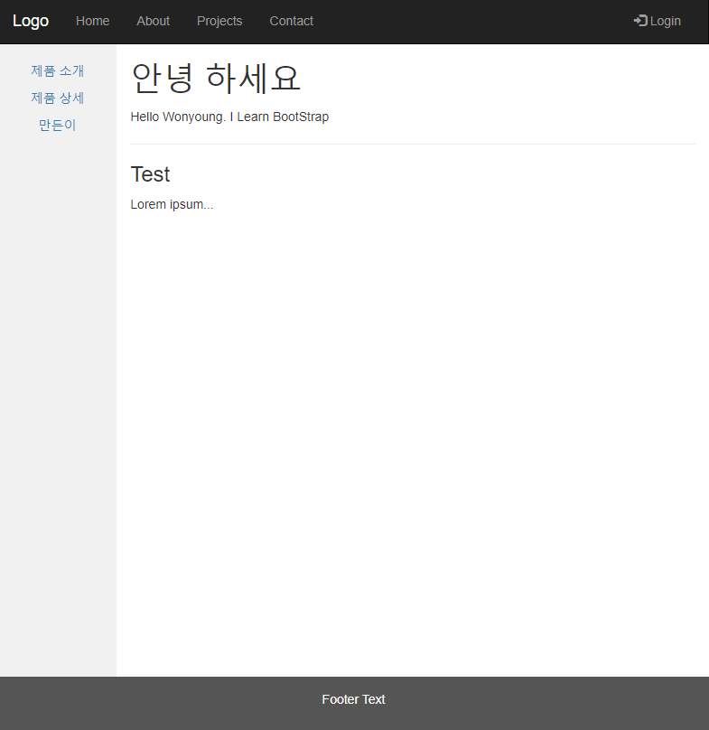
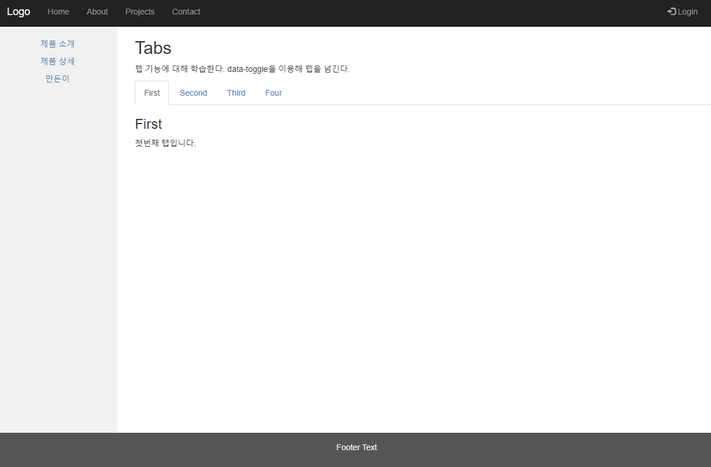
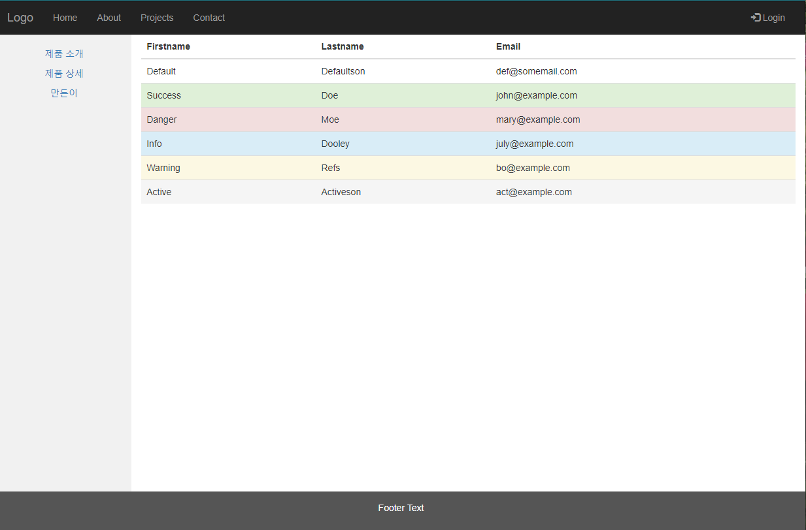
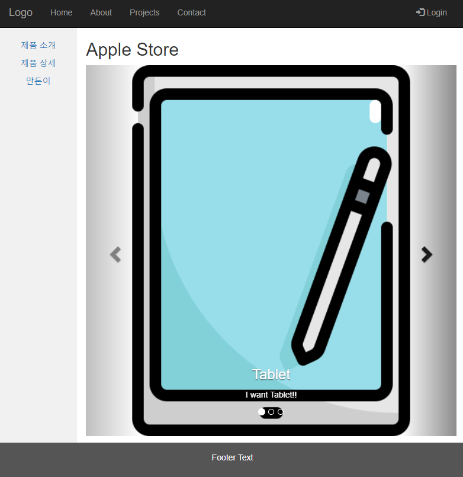
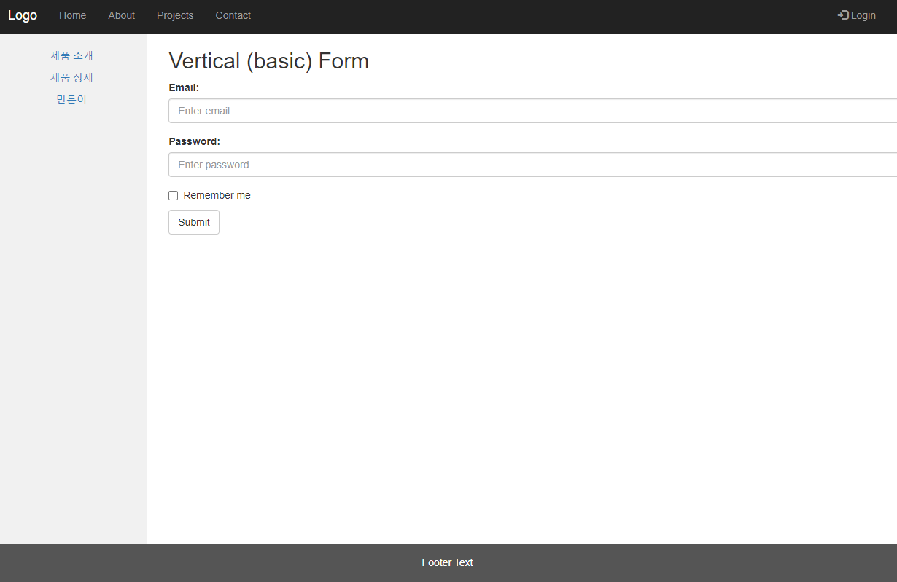

# 24일차

------

> 반응형 웹 에대해 학습한다. 
>

## 1. JSP 파일 호출

   - jsp파일은  url 에서 바로 호출이 불가능하다. 
   - 서버가 controller에서 알맞은 jsp 파일을 찾아 html로 바꿔 전달해주는형식이기 때문이다. 

## 2. 반응형 웹

   1. pc화면, 모바일화면 등 다양한 디바이스에서 같은 형태로 볼 수 있게 한다. 

   2. 만드는 방법

      1. \<meta> 태그를 이용해 viewport 속성을 추가한다.  정보를 추가한다. 

         ```html
         <meta name="viewport" content="user-scalable=no, initial-scale=1,maximum-scale=1">
         ```

      2. \<style> 태그를 이용해 @media 를 설정한다 .

         ```css
         @media screen and (max-width:767px){/* 화면 크기가 767 보다 작은경우 표시 */
             body{
                 background: red;
             }
         }
         @media screen and (min-width:768px) and (max-width:959px){/* 768~959 사이면 실행 */
             body{
                 background: green;
             }
         }
         ```

## 3. thymeleaf 사용

   1. pom.xml 에 다음 코드 추가 

      ```xml
      <dependency>
      			<groupId>org.springframework.boot</groupId>
      			<artifactId>spring-boot-starter-thymeleaf</artifactId>
      </dependency>
      ```

      

   2. main.html 파일에 \<html xmlns:th="http://www.thymeleaf.org"> 을 추가한다. 

   3. controller가 String 형을 리턴하면 **templates 파일 바로 밑에있는 html파일**을 찾는다. 

      1. 리턴전에 Model 객체에 값을 설정할 수 있다.
         1.  Model에 담긴 객체를 이용해서 main.html의 section태그안에 들어갈 파일명을 자유롭게 변경할 수 있다. 
         2. .html 을 쓰지 않아도 thymeleaf 에서는 자동으로 파일명.html 로 찾아서 보여준다. 

      ```java
      // Controller.java
      
      // 앞에서 한것과 다른점은 jsp파일을 사용하지 않는다는 것이다. 
      
      @RequestMapping("/")
      public String main(Model m) {
          //resource - templates 파일의 html파일에서 main을 호출한다. 
          m.addAttribute("center","center");
          return "main";
      
      }
      
      @RequestMapping("/home")
      public String home(Model m) {
          m.addAttribute("center","home");
      
          return "main";
      
      }
      
      @RequestMapping("/home1")
      public String home1(Model m) {
          m.addAttribute("center", "home");
          m.addAttribute("scenter", "home/home1");
      	//home.html 안에 있는 section의 scenter에 home/home1 을 넣어준다. 만약 scenter가 없다면 기본설정값인 home/homeMain 을 들어가도록 설계한다. 
          return "main";
      }
      ```

      ```html
      <!-- home.html -->
      
      <aside id="left_aside">
      	<ul>
      		<li><a href="home1">home1</a>
      		<li><a href="home2">home2</a>
      		<li><a href="home3">home3</a>
      	</ul>
      
      </aside>
      <aside id="right_aside" th:include="${scenter} ? ${scenter} : @{home/homeMain}"></aside>
      
      ```

      ```html
      <!-- main.html -->
      
      <!DOCTYPE html>
      <html xmlns:th="http://www.thymeleaf.org">
      <head>
      <meta charset="UTF-8">
      <title>Insert title here</title>
      <link rel="stylesheet" href="css/global.css">
      </head>
      <body>
      <h1>Main page</h1>
      <header>
      <h1><a href="/"> Shopping Mall </a></h1>
      </header>
      <nav>
      <ul>
      	<li><a href="home">home</a>
      	<li><a href="food">food</a>
      	<li><a href="wear">wear</a>
      	<li><a href="media">Media</a>
      </ul>
      </nav>
      <!-- center가 있으면 ${center}.html를, 없으면 center.html를 출력. 
      이때 ${center} 는 controller에서 Model에 설정한 객체의 변수 값 이다. 
      -->
         
      <section th:include="${center} ? ${center} : center">
      </section>
      <footer></footer>
      </body>
      </html>
      
      
      ```

   4. thymeleaf의 특징은 jsp파일을 사용하지 않는다는 것이다. 

## 4. Bootstrap 템플릿 이용해서 반응형 웹 만들기 

   1. 방법 볼 수 있는 곳 

         1. [startBootstrap](https://startbootstrap.com/)
         2. [w3c](https://www.w3schools.com/bootstrap/)

   2. 링크를 이용해서 bootstrap 에서 제공하는 css들을 사용할 수 있다. 

      1. 대표적으로 위치를 잡는 기능인    \<div class="**col-sm-9** text-left" > 같은것이 있다. 
      2. col-sm : bootStrap 에서 행, 열을 잘 맞출 수 있도록 제공하는기능이다. 
         1. 총 12까지 할 수 있다. 
         2. 따라서 3칸, 9칸만큼 사용하고 싶다면, col-sm-3 ,col-sm-9 이렇게 나눠 사용하면 된다. 

   ### 3. MyProject

1. bootstrap 을 이용하여 반응형 웹을 만들어본다. 
2. 총 5가지의 기능을 이용했다. 
    1. thyemleaf -> 반응형 웹을 사용할 수 있도록 도와줌 
    2. Table
    3. Taps / Pills
    4. Carousel
    5. Login

   4. | main & Taps / Pills |  |
      | ------------------- | ------------------------------------------------------------ |
      | Table & Carousel    |  |
      | Login               |  |