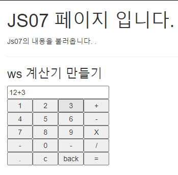
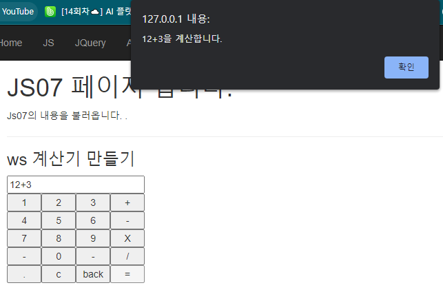
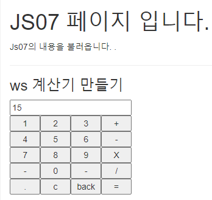

# 25일차

------

> HTML5에 추가된 신규 기능에 대해 학습한다. 
>
> JavaScript에 대해 학습한다. 
>
> project : JavaScript를 이용해 나만의 계산기를 만들어본다. 

## 1. HTML5의 신규 기능

1. ### 브라우저에 Database가 탑제되었다. 
   
   - 이것을 **로컬 스토리지** 라고도 한다. 
   - 인터넷 접속이 끊긴 상태에서도 이미 살펴보았던 게시판이나 웹 메일을 볼 수 있도록 만들 수 있다. 
2. ### 드래그앤드롭
   
   - ERD Cloud에서 이용되는 기능이다. 
   - 웹 페이지상에서 원하는 항목을 드래그할수 있게 해주는 API
3. ### 지오로케이션
   
   - 여러 포털 사이트에서 제공하는 공개지도 API와 함께 사용하면 웹 브라우저가 현재 내 위치를 알수 있다. 
   - 내가 있는 위치를 아는것이 아닌, 네트워크를 통해 위치를 아는것이다. 
   - 디바이스의 GPS로 위치를 알아내는 것이 아닌 브라우저가 내가 이용중인 네트워크를 통해 위치를 아는것이다. 
4. ### 캔버스(Canvas) 2D
   
   - canvas 요소와 그리기 API를 제공하여 웹에서 직접 그림을 그릴수 있게 해준다. 
5. ### 웹 워커
   
   - 스레드와 관련되어 있는 것으로, 여러 워커로 나누어 백그라운드에서 작업하면 실행속도에 서로 영향을 주지 않고 실행할 수 있다. 
6. ### 인덱스드
   
   - SQL 같은 별도의 언어를 배우지 않아도 되며 간단한 자바스크립트 API만으로 데이터베이스를 조작할 수 있다. 
7. ### 웹 소켓
   
   - 순수 웹 환경에서 실시간 양방향 통신을 위한 기능을 제공한다. 
   - 금융권에서 실시간으로 변경되는 사항을 볼 수 있도록 해줬다 .

## 2. JavaScript

### 1. 필요성

   - 모든 이벤트 처리를 제어할 수 있다. 
   - Web page에서 프로그램 부분을 담당한다. 
   - Css를 자유롭게 변경한다. 
   - HTML 내부 Context를 자유롭게 변경 추가할 수 있다. 

### 2. 위치

   - 통상적으로 \<hea> 안에 \<style> 밑에 사용한다. 
   - 또는 \<body> 태그 안에서 가장 마지막에 들어간다. 

### 3. 변수 

   - 모두 Variable( **var** ) 로 사용한다. 

### 4. 규칙

   - HTML 태그에서는 " " 을 사용하고, 
   - 자바스크립트 에서는 ' ' 를 사용한다. 
   - 스크립트 태그는 위에서 아래로 흐른다. 
     - **따라서 컴파일 하지 않고 1라인부터 차례대로 흘러 내려간다. **
   - 순서가 중요시 된다. 스크립트 태그의 위치에 따라 에러가 날 수 도 있다. 
     - 1라인부터 차례대로 실행되기 때문에 만약 스크립트 태그가 \<head> 태그 안에 있으면 화면이 출력되는 \<body> 보다 앞에 있기 때문에 값을 사용할 때 주의해야 한다. 

### 5. 데이터 타입 (typeof() 함수로 확인가능 )

   - 문자 숫자 타입 변경

     1. 숫자로 타입 변경 

        - number(str)   :  number 타입이 아닌 변수를 number로 변경

        - parseInt() : 정수형으로 변경 

        - parseFloat() : 실수 형으로 변경 

     2. 문자로 타입 변경 

        - toString() 

        - toFixed() : 특정 수까지 반올림 한다. 

        - toPrecision() : 두자리에서 반올림 

   1. undefined

      - 어떠한 데이터 타입도 선언되지 않은 상태

   2. number

      - 정수, 실수를 모두 포함한다. 

   3. boolean

   4. String

      - 문자열, character 모두 포함. " " ,  ' ' 로 표현
      - 사칙연산 중 + 만 빼면 "문자 + 숫자"  연산이 가능하다. 

   5. array

      - 배열, 다양한 타입을 포함할 수 있다. 데이터 타입은 Object으로 표현.
      - \[ ] 를 사용

   6. **object = JSON(Java Script Object Notation)**

      - 객체 타입을 의미.
      - 배열안에 객체가 있는 형태이다. 
      - { }  로 사용
      - ex ) a  = [ { id:'id01', name: 'name01'}];

   7. function

      - 함수를 의미
      - JavaScript에서는 함수를 하나의 타입으로 선언하여 사용할 수 있다. 

   8. ```javascript
      //1. number
      var num = 10;
      
      //2. character
      var str = '100';
      
      //3. undefined
      var v;
      
      //4. boolean
      var b = true;
      
      //5. 배열
      var arr = [1,2,3,4,5];	 
      
      //6. JSON( Java Script Object Notaion)
      var obj = {id:'id01', pwd:'pwd01',name:'lee', age:10}; //object
      
      //7. 함수 
      var f = function(){
          return 333;
      };
      
      var type = typeof(num);/* typeof() : 현재 선언한 변수의 타입을 가져온다.  */
      h2.innerHTML = num + ' = ' + type;
      h2.innerHTML += '<br>' + str + ' = '  + typeof(str);
      h2.innerHTML += '<br>' + arr + ' = '  + typeof(arr);// 배열그냥 출력 가능 
      h2.innerHTML += '<br>' + obj.name + ' = '  + typeof(obj);
      ```

### 6. 기능

   1. document.querySelector()

      - 문서에서 쿼리 셀렉터 객체를 가져온다. 

      - ```javascript
        var h2 = document.querySelector('h2');
        /* 문서에서 h2태그의 쿼리 셀렉터를 가져온다. */
        h2.innerHTML = 'Change Header2';
        h2.style = 'background : yellow';
        ```

   2. window.onload()

      - 화면 (\<body> 부분) 이 출력되면 자동으로 실행되는 함수 

      - ```javascript
        window.onload = function(){	
        	var h3 = document.querySelector('#hh3');
        	h3.innerHTML = ' Replace header3 => For window.onload()';    
        }
        ```

   3. console.log()

      - 브라우저 ->  f12 -> console 부분에  값을 출력한다. 

   4. 함수

      1. javaScript는 **데이터 타입으로 함수형**을 가질 수 있다. 

         - 따라서 함수에 매개변수로 함수를 넘겨줄 수 있다. 

         - ```javascript
           function c(){
               // javascript는 데이터 타입으로 함수를 가지고 있어 함수를 리턴할 수 있다. 
               return function(){
                   return 100;
               };
               //함수를 리턴 
           };
           
           var r1 = c();//r1은 데이터타입이 함수이다. 
           alert(r1());
           ```

   5. 문자열 관련 함수

      1. indexOf('@') 

         - @ 가 몇번째 인덱스에 있는지 알 수 있다. 

      2. substring(start , end)

         - start 지점부터 end 전까지 문자열을 출력 

         ```javascript
         // email 이름과 도메인을 분류 
         var id = txt.substring(0,txt.indexOf('@'));
         var domain = txt.substring(txt.indexOf('@')+1, txt.indexOf('.'));
         ```

   6. setInterval(함수, 시간)

      - 반복적으로 함수를 호출한다. 

      - ```javascript
        function display(){
        
            setInterval(function(){
                var d = new Date();
                var result = d.getHours() + ' ' + d.getMinutes() + ' ' + d.getSeconds();
                document.querySelector('#time').innerHTML = result;
        
            }, 1000);//1초에 한번씩 tf함수를 호출 
        
        };
        
        window.onload = function(){
            display();
        
        };
        ```

   7. eval()

      - 문자열을 계산해주는 함수이다.

## 3. Project _ JavaScript 이용해서 나만의 계산기 만들기 

1. ### 클릭 이벤트와 document.querySelector() 를 이용하여 계산기 만들기 

   1. 숫자 버튼과 사칙연산 (+,-,x,/)버튼을 누르면 input 박스에 누른 값이 입력된다. 
   2. = 버튼을 누르게 되면 eval()함수를 이용해 계산한다. 
   3. 'back' 버튼을 누르게 되면 맨 뒤의 글자가 하나 지워진다. 
   4. 'c ' 버튼을 누르면 input박스가 리셋된다. 

2. ### 추가 기능으로 Backspace, All delete, eval() 을 만든다. 

3. ```html
   <meta charset="UTF-8">
   <style>
   table{
   	width:200px;
   }
   table input {
   	width:200px;
   }
   table td button{
   	width:50px;
   }
   </style>
   <script>
   	function calc(n){
   		var text = document.querySelector('#txt').value;
   		
   		if(n == '='){
   			document.querySelector('#txt').value = eval(text);
   			alert(text + '을 계산합니다. ');
   			return ;
   		}
   		if(n == 'back'){
   			document.querySelector('#txt').value = text.substring(0,text.length-1);
   			return ;
   		}
   		if(n == 'c'){
   			document.querySelector('#txt').value = '';
   			return ;
   		}
   		document.querySelector('#txt').value += n;
   	}
   
   </script>
   <h1>JS07 페이지 입니다.</h1>
   <p>Js07의 내용을 불러옵니다. .</p>
   <hr>
   <h3>ws 계산기 만들기</h3>
   
   <table>
   	<tbody>
   		<tr>
   			<td colspan=4><input type='text' id='txt'></td>
   			
   		</tr>
   		<tr>
   			<td><button onclick="calc(1)">1</button></td>
   			<td><button onclick="calc(2)">2</button></td>
   			<td><button onclick="calc(3)">3</button></td>
   			<td><button onclick="calc('+')">+</button></td>
   		</tr>
   		<tr>
   			<td><button onclick="calc(4)">4</button></td>
   			<td><button onclick="calc(5)">5</button></td>
   			<td><button onclick="calc(6)">6</button></td>
   			<td><button onclick="calc('-')">-</button></td>
   		</tr>
   		<tr>
   			<td><button onclick="calc(7)">7</button></td>
   			<td><button onclick="calc(8)">8</button></td>
   			<td><button onclick="calc(9)">9</button></td>
   			<td><button onclick="calc('*')">X</button></td>
   		</tr>
   		<tr>
   			<td><button>- </button></td>
   			<td><button onclick="calc(1)">0</button></td>
   			<td><button>- </button></td>
   			<td><button onclick="calc('/')">/</button></td>
   		</tr>
   		<tr>
   			<td><button onclick="calc('.')">.</button></td>
   			<td><button onclick="calc('c')">c</button></td>
   			<td><button onclick="calc('back')">back</button></td>
   			<td><button onclick="calc('=')">=</button></td>
   		</tr>
   	</tbody>
   </table>
   ```

4. |  |  |
   | ------------------------------------------------------- | ------------------------------------------------------- |
   |  |                                                         |

