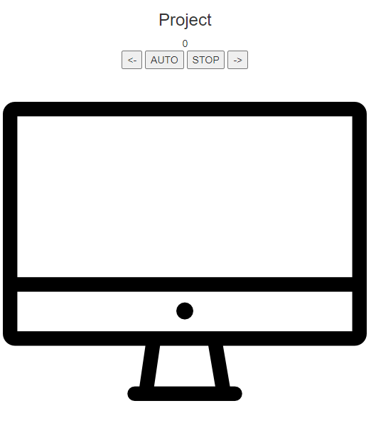
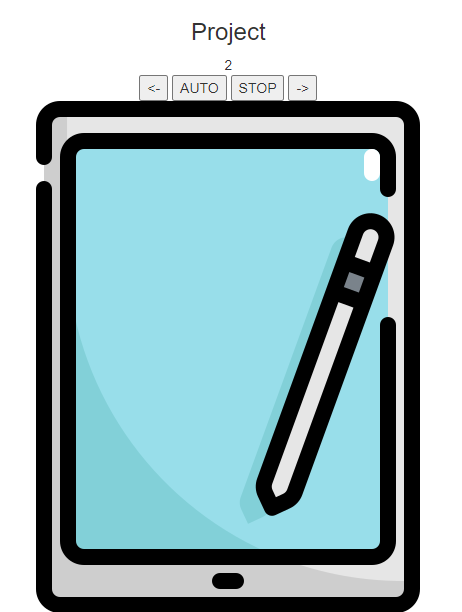

# 27일차

------

> JQuery 에대해 학습한다. 
>
> project : JQuery를 이용해 이미지를 순환시킨다. 

1. JQery

   ## 1. 메소드

      1. for문과 each문 비교

         1. ```javascript
            $(d).each(function(index,item){
                //index와 item이 자동으로 들어간다. 
                //index는 몇번째인지, item에는 value 가 들어간다. 
                txt += '<h3>';
                txt += item.id + ' ' + item.name + ' ' + item.age;
                txt += '</h3>';
            });//각각의 배열만큼 func 을 실행한다. 
            
            
            for(var i in d){
                txt += '<h3>';
                txt += d[i].id + ' ' + d[i].name + ' ' + d[i].age;
                txt += '</h3>';
            }
            
            ```

      2. show() , hide(), fadeIn(), fadeOut()

         - ```javascript
           //해당 컨텐츠를 화면에서 보여주거나 숨긴다. 
           $('#show').click(function(){
               $('#result').show();
           });
           $('#hide').click(function(){
               $('#result').hide();
           });
           
           // show 와 hide에 애니매이션효과 부여 
           //천천히 나타나고 천천히 사라진다. 
           $('#show').click(function(){
               $('#result').show();
           });
           $('#hide').click(function(){
               $('#result').hide();
           });
           
           // 천천히 내려오고 올라가게 만든다. 
           $('#show').click(function(){
               $('#result').slideDown();
           });
           $('#hide').click(function(){
               $('#result').slideUp();
           });
           
           ```

      3. keyup(), keydown()

         - 키가 눌리거나 키를 땠을 떄 실행

         - ```javascript
           $('#n1').keydown(function(){
               if($(this).val().length > 6 ){
                   // 입력된 길이가 6자리면 다음 input 으로 포커스 이동 
                   $('#n2').focus();
               }
           });
           ```

      4. addClass() , removeClass

         1. 태그에 클래스를 추가 삭제할 수 있다. 

         2. ```javascript
            $('h1').hover(function(){
                $(this).addClass('myclass');
            }, function(){
                $(this).removeClass('myclass');
            });
            ```

      5. first(), last(), eq()

         1. first

            - 해당 태그들 중 천번째 태그를 선택

         2. last

            - 해당 태그들 중 마지막 태그를 선택 

         3. eq

            - 태그들중 특정 위치에 있는 태그만 선택 

         4. ```javascript
            $('td').first()// td태그의 첫번째만 가져옴 
            $('td').last()// td 태그의 마지막만 가져옴 
            $('td').eq(2)// td의 2번째 태그만 가져옴
            ```

      6. TimeOut vs setInterval

         1. timeout()
         
            1. setTimeout() : 시간을 지정하고 지정된 시간에 함수를 실행하게 만든다.
         
            2. clearTimeout() : 위에서 실행한 그 함수를 취소할 때 사용한다.
         
            3. ```javascript
               // 타이머 설정 
               timer = window.setTimeout(function(){
               },3000);
               
               // 타이머 지우기 
               window.clearTimeout(timer);
               ```
         
         2. setInterval()
         
            1. clearInterval()로 제거가능 
         
      7. 이미지 무한 돌리기 

         1. ```javascript
            $(document).ready(function(){
            	var imgs = ['img/imac.png','img/iphone1.png','img/tablet.png'];
            	var cnt = 0;
            
            	
            	setInterval(function(){
            		$('#images').attr('src',imgs[cnt % imgs.length]);
            		cnt++;
            		$('#hh1').text(cnt);
            	},1000);//1초에 한번씩 함수 호출 
            	
            });
            ```

      8. 무한 스크롤 기능

         1. ```javascript
            $(document).ready(function(){
            	$(window).scroll(function(){
            /* 		
            $('h1').text($(document).height() + ' ' 
            				+ $(window).scrollTop() + '' + $(window).height()); 
            				*/
                    //문서의 총 높이가 스크롤 윈도우의 높이와 같아지면 다시 로드한다. 
            		var doch = $(document).height();
            		var winh = $(window).scrollTop() + $(window).height();
            		if( doch <= winh + 50 ){//50은 오차범위 설정임 
            			getdata();
            			
            		}
            		
            	});//scroll은 윈도우에 있다. 
            });
            ```

      9. not

         1. ```javascript
            $('button').not($(this)).removeClass('myclass');
            //선택된 태그(나 자신)만 뺴고 class를 remove함
            ```

   ## 2. 애니매이션

      1. ```javascript
         $('#box').css({
         'width':'100px',
         'height': '100px',
         'background' : 'red'
         }).animate({
         'width':'500px',
         'opacity':'0.6'
         });	
         ```

   ## 3. 객체의 삽입 삭제 

      1. 삽입

         1. append
         2. prepend
         3. after
         4. before

      2. 삭제

         1. remove
         2. empty

      3. ```javascript
         //객체 삽입
         $('#append').click(function(){// 내용물 맨 뒤에 추가 
             $('#result').append('<h4> Add Element' + i + '</h4>');
             i++;
         });
         $('#prepend').click(function(){// 내용물 맨앞에 추가
             $('#result').prepend('<h4> Add Element' + i + '</h4>');
             i++;
         });
         $('#after').click(function(){// 해당 태그 뒤에 추가 
             $('#result').after('<h4> Add Element' + i + '</h4>');
             i++;
         });
         $('#before').click(function(){// 해당 태그 전에 추가 
             $('#result').before('<h4> Add Element' + i + '</h4>');
             i++;
         });
         
         
         //객체 삭제
         $('#remove').click(function(){
             $('#result').remove();//태그자체를 삭제 
         });
         $('#empty').click(function(){
             $('#result').empty();//내용물만 삭제 
         });
         ```

# 2. Project

   1. 기능 설명

      - JQery를 이용해서 이미지의 순환을 왼쪽, 오른쪽, Auto로 변경될 수 있게 만든다. 
      - 1. 왼쪽 버튼을 누르면 이전의 이미지를 보여주고, 오른쪽 버튼을 누르면 이후의 이미지를 보여준다.
        2.  auto버튼을 누르면 자동으로 배열에 있는 이미지를 차례로 계속 순환하며 보여준다. STOP 버튼을 누르면 Auto의 기능을 멈춘다. 

   2. 사용 메소드

      1. setInterval
      2. clearInterval
      3. click
      4. attr

   3. 코드

      - ```html
        <style>
        #container{
        	text-align:center;
        }
        </style>
        <script>
        
        $(document).ready(function(){
        	var cnt = 0;
        	var imgs = ['img/imac.png','img/iphone1.png','img/tablet.png'];
        	$('#images').attr('src',imgs[0]);
        	var start;
        	var stop;
        	
        /* 	$('#img_before').addClass('left carousel-control');
        	$('#img_after').addClass('right carousel-control'); */
        	
        	$('#auto_go').click(function(){
        		
        		start = setInterval(function(){
        			if(cnt == imgs.length-1){
        				cnt = -1;
        			}
        			cnt++;
        			$('#images').attr('src',imgs[cnt % imgs.length]);
        			$('#result').text(cnt);
        		},1000);//1초에 한번씩 함수 호출 
        	});
        	
        	$('#auto_stop').click(function(){
        		stop = clearInterval(start);
        		
        	});
        	
        	$('#img_before').click(function(){
        		if(cnt == 0){
        			cnt = imgs.length;
        		}
        		cnt--;
        		$('#images').attr('src',imgs[cnt % imgs.length]);
        		$('#result').text(cnt);
        	});
        	
        	$('#img_after').click(function(){
        		if(cnt == imgs.length-1){
        			cnt = -1;
        		}
        		cnt++;
        		$('#images').attr('src',imgs[cnt % imgs.length]);
        		$('#result').text(cnt + '');
        	});
        
        });
        
        
        </script>
        
        <h1>Jq15 </h1>
        <p> Jq15의 내용을 불러옵니다. .</p>
        <hr>
        
        
        <div id="container">
        	<h3>Project</h3>
        	<div id="result">
        		0
        	</div>
        	<div id="group">
        		<button id="img_before"> <- </button>
        		<button id="auto_go"> AUTO </button>
        		<button id="auto_stop"> STOP </button>
        		<button id="img_after"> -> </button>
        	</div>
        
        	<div id="main_div">
        		
        	</div>
        
        </div>
        ```

   4. 결과물

      - |  |  |
        | :------------------------------: | :------------------------------: |
        |             초기화면             |             실행화면             |

        
