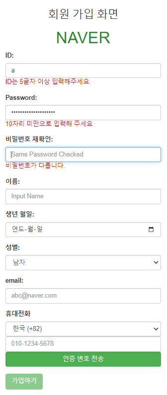
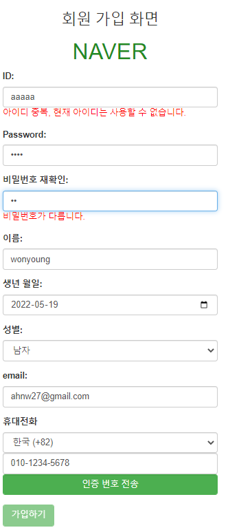

# 28일차

------

> AJAX 에대해 학습한다. 
>

## 1. AJAX ( Asynchronous JavaScript And XML )
   1. ### AJAX 란?
      
      1. **비동기 방식** 으로 통신하는 방법으로, 현재 화면을 유지하면서 특정 부분만 데이터를 받아와서 변경해준다. 
      2. 
      3. 2005년에 만들어진 비동기 통신을 지원하는 새로운 방식이다. 
      4. 새로운 언어가 아닌 JavaScript에 추가된 통신 방식이다. 
      5. **화면 전체 (html파일) 를 재로드 하지 않고도 서버에서 특정 데이터를 송수신 할 수 있다. **
      6. ex) 네이버의 실시간 이슈 검색기능
      
   2. ### 동작 방식
      
      1. 클라이언트가 요청시 AJAX 통신방식으로 html파일을 요청
      2. 클라이언트와 서버가 네트워크로 연결이 됨 
      3. 서버가 HttpServletResponse 매개변수로 받아서 일을 처리하고 rep.getWriter().print() 로 응답한다. 
      4. 네트워크가 끊어짐
      5. 화면에 요청한 데이터만 바뀐 html 을 클라이언트가 본다. 
      6. 이때 실시간 정보들만 AJAX 통신을 이용해 서버로부터 요청하고 받는다. 
      
      - 브라우저 -> f12 -> 네트워크를 보면 ajax방식으로 통신하는 것을 알 수 있다. 
      
      - ```java
        @RequestMapping("/gettime")
        public Object gettime() {
            Date d = new Date();
            SimpleDateFormat sdf = new SimpleDateFormat("yyyy-MM-dd hh:mm:ss");
            return "서버시간 " + sdf.format(d);
        }
        ```
      
      - ```javascript
        function display(data){
        	$('#result').text(data);
        }
        
        function getdata(txt){
        	$.ajax({
        		url:'search',
        		data:{'s':txt,},//서버에게 data 변수 s로 데이터를 보낸다. 
        		success:function(data){
        			//연결에 성공하면 실행 data에는 controller에서 리턴한 값이 들어간다. 
        			display(data);
        		},
        		error:function(){}
        	});	
        }
        
        $(document).ready(function(){
        	$('button').click(function(){
        		var txt = $('#txt').val();
        		getdata(txt);
        	});
        });
        
        ```
      
      - ```java
        @RestController//AJAX 통신에 적합한 애너테이션 -> @Controller와 다름 
        public class AJAXController {
        	@RequestMapping("/gettime")
        	public Object gettime() {
        		Date d = new Date();
        		SimpleDateFormat sdf = new SimpleDateFormat("yyyy-MM-dd hh:mm:ss");
        		return "서버시간 " + sdf.format(d);
        	}
        }
        ```

## 2. Project

   1. ### 기능설명

      1. 만들었던 naver 회원가입 페이지를 AJAX 와 JQuery를 이용해 동적으로 만든다. 
      2. ID 항목 입력시 조건을 준다. 
         1. AJAX 를 사용하여 Database에 있는 아이디와 중복되면 실시간으로 사용할 수 없다는 문구를 띄워준다. 
         2. keyup 기능을 이용해 5글자 이상 들어가도록 한다. 
      3. password 확인란과 password가 다르다면  알려주는 문구를 나타낸다. 
         1. 초기 register 버튼을 비활성화 시키고, 이후에 비밀번호 조건을 만족하면 버튼을 활성화 한다. 

   2. ### 코드

      1. ```html
         <meta charset="UTF-8">
         <style>
         #div_logo{
         	text-align:center;
         	
         }
         #logo{
         	color: #228B22;
         }
         
         #mybtn,#register{
         	background: #4CAF50;
         	color : white;	
         	border : 2px solid #4CAF50; 
         	transition-duration : 0.4s;
          	text-decoration: none;
         }
         
         #mybtn:hover,
         #register:hover{
         	background : lightgreen;
         	color : gray;
         }
         
         </style>
         
         <script>
         function checkID(id){// 데이터베이스에 있는 ID들과 중복 비교 
         	$.ajax({
         		url:'checkID',
         		data:{'id':id},
         		success:function(data){
         			if(data == '1'){//중복이 아닌 경우
         				$('#id_span').css('color','green');
         				$('#id_span').text('사용 가능한 아이디 ');
         				
         			}else{// 중복인 경우 
         				$('#id_span').css({'color':'red'});
         				$('#id_span').text('아이디 중복, 현재 아이디는 사용할 수 없습니다. ');
         			}
         		},
         		error:function(){}
         	});
         	
         };
         
         
         $(document).ready(function(){
         	$('#register').attr('disabled','disabled');// 버튼 막기 
         	
         	$('#id').keyup(function(){
         		var id = $('#id').val();
         		if(id.length < 5){
         			$('#id_span').text('ID는 5글자 이상 입력해주세요.');
         			$('#id_span').css('color','red');
         			
         		}else{
         			checkID(id);
         			
         		}
         	});
         	
         	$('#pwd').keyup(function(){// 비밀번호가 10자리 이상이면 못하게 막기 
         		var pwd = $('#pwd').val();
         		if(pwd.length < 10){
         			$('#pwd_span').text('');
         		}else{
         			$('#pwd_span').text('10자리 미만으로 입력해 주세요');
         			$('#pwd_span').css({'color':'red'});
         		}
         	});
         	
         	$('#samepwd').keyup(function(){
         		var pwd = $('#pwd').val();
         		var samepwd = $('#samepwd').val();
         		
         		if(pwd != samepwd){
         			$('#samepwd_span').text('비밀번호가 다릅니다. ');
         			$('#samepwd_span').css('color','red');
         			$('#register').attr('disabled','disabled');//버튼 막기 
         		}else{
         			$('#samepwd_span').text('일치합니다. ');
         			$('#samepwd_span').css('color','green');
         			$('#register').removeAttr('disabled');// 버튼 활성화 
         			
         		}
         		
         	});
         	
         	$('#register').click(function(){
         		var pwd	= $('#pwd').val();
         		var samepwd = $('#samepwd').val();
         		
         		
         		if(pwd.length >= 10){
         			alert('pwd error')
         			$('#pwd').focus();
         			return;
         		}else{
         			
         		}
         		
         		if(pwd != samepwd){
         			alert('samepwd error')
         			$('#samepwd').focus();
         			return;
         		}else{
         			
         		}
         		
         		$('#register_form').attr({
         			'action':'naver_loginOK',
         			'method':'post'
         		});
         		$('#register_form').submit();
         	});
         });
         
         
         </script>
         
         <h1>AJAX04 </h1>
         <p> AJAX4의 내용을 불러옵니다. .</p>
         <hr>
         
         <div class="container col-sm-3">
         
         </div>
         <div class="container col-sm-6">
         <div id="div_logo">
         <h3>회원 가입 화면 </h3>
         <h1><div id="logo">NAVER</div></h1>
         </div>
         <form id="register_form">
         	<div class="form-group">
         		<label for="name">ID:</label>
         		<input type="text" class="form-control" name="id" id="id" placeholder="Input ID(Min length : 5)">
         		<span id="id_span"></span>
         	</div>
         	
         	<div class="form-group">
         		<label for="pwd">Password:</label>
         		<input type="password" class="form-control"  name="pwd" id="pwd" placeholder="Input Password">
         		<span id="pwd_span"></span>
         	</div>
         	
         	<div class="form-group">
         		<label for="samepwd">비밀번호 재확인:</label>
         		<input type="password" class="form-control"  name="samepwd" id="samepwd" placeholder="Same Password Checked">
         		<span id="samepwd_span"></span>
         	</div>
         	
         	<div class="form-group">
         		<label for="name">이름:</label>
         		<input type="text" class="form-control"  name="name" id="name" placeholder="Input Name">
         	</div>
         	
         	<div class="form-group">
         		<label for="birthday">생년 월일:</label>
         		<input type="date" class="form-control"  id="birthday" name="birthday">
         	</div>
         	
         	<div class="form-group">	
         		<label for="gender">성별:</label>
         		<select name="gender"  class="form-control" >
         			<option value="남자"> 남자 </option>
         			<option value="여자"> 여자 </option>
         		</select>
         	</div>
         	
         	<div class="form-group">
         		<label for="email" >email:</label>
         		<input type="email" class="form-control"  name="email" id="email" placeholder="abc@naver.com">
         	</div>
         	
         	<div class="form-group">
         		<label for="contry">휴대전화 </label>
         		<select name="contry" class="form-control" >
         			<option value="+82"> 한국 (+82) </option>
         			<option value="+1"> 미국 (+1) </option>	
         		</select>
         		<input type="tel" name="telphone" id="telphone"  class="form-control" placeholder="010-1234-5678" >
         		<button onclick="" class="form-control" id="mybtn"> 인증 번호 전송 </button>
         	</div>
         	
         	<div class="form-group">
         	<button type="button" class="btn btn-success" id="register"> 가입하기 </button>
         	</div>
         	
         </form>
         </div>
         
         <!-- 
         아이디(사용가능 여부 확인 )
         비밀번호
         비밀번호 재확인
         이름
         생년 월일 (년4글자) (월 선택) (일 선택)
         성별 (select)
         본인 확인 이매일
         휴대전화 (대한민국 +82, 미국 +1) (전화번호 입력 |인증번호 받기 버튼)
         가입하기 
          -->
         
         
         
         ```

   3. ### 결과물

      1. |  |      |
         | ------------------------------------------------------------ | ---- |
         |  |      |
         |     |      |
