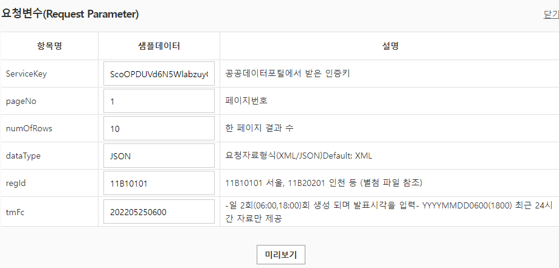

# 31일차

------

> Project_AppleSite 발표
>
> KaKAo Map API를 다뤄본다. 

## 1. KaKao Map 이용

   1. 여러개 마커 추가 ,이벤트 추가 및 인포윈도우 추가 

      1. 배열을 이용해 for문으로 marker를 추가해준다. .

      2. ```javascript
         $(pos).each(function(index, item) {
             var marker = new kakao.maps.Marker({
                 map : map,
                 position : new kakao.maps.LatLng(item.lat, item.lng),
         
             });
             var infowindow = new kakao.maps.InfoWindow({
                 content : item.content,
                 // position은 뒤에 event 에서 marker 로 설정해 주기 때문에 주지 않아도 된다. 
         
             });
         
             // 마커에 마우스오버 이벤트를 등록합니다
             kakao.maps.event.addListener(marker, 'mouseover', function() {
                 // 마커에 마우스오버 이벤트가 발생하면 인포윈도우를 마커위에 표시합니다
                 infowindow.open(map, marker);
             });
         
             kakao.maps.event.addListener(marker, 'mouseout', function() {
                 infowindow.close();
             });
         
             kakao.maps.event.addListener(marker, 'click', function() {
                 location.href = item.target;
             });
         
         });
         
         ```

   2. 오픈 API를 사용해서 날씨 정보 가져오기 

         1. [공공데이터 ](https://www.data.go.kr/)
         2. 오픈 API를 사용하면 실시간 정보를 얻어올 수 있다. 
         3. 사용 방법
               1. 로그인 후 마이페이지 -> 인증키 발급 
               2. 사용하고자 하는 오픈 API 활용신청 
               3. 마이페이지 -> 활용 -> 참고문서의 형식으로 사용할 수 있다. 
               4. 
               5. 미리보기 클릭하면 데이터가 나온다. 이떄 URL 을 보면 어떤 데이터가 보내졌는지 알 수 있다. 
         4. 오류
               1. 내 로컬 브라우저에서 내 서버가 아닌 다른 서버로 접속하게 되면 보안상 문제가 발생해 브라우저가 접속을 막는다. 
                  - 이것을 해결하기 위해서는 브라우저가 다른 서버에 바로 접속하는 것이 아닌 내 로컬 서버를 통해 다른 서버의 데이터를 받아오면 된다. 
