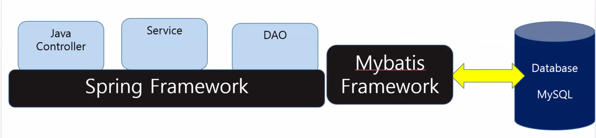

# 33일차

------

> Spring 사용에 대해 학습한다. 
>
> MyBatis Framework 를 사용해 Database와 연동해본다. 

# 의존성 주입 ( DI : Dependency Injection ) 

   - 방법 2가지 

##   1.XML 에서 DI 사용

  1. Spring이 객체간의 의존성을 부여한다. 
  2. 객체 스스로가 의존 객체를 생성 
  3. 모듈간 결합도를 낮춰 재사용성을 높임 

##   2.Annotation 에서 DI 사용

- 자동으로 스캔해서 해당하는 이름으로 넣어서 동작시킨다. 

```xml
<!-- DI를 Annotation으로 사용하겠다는 뜻 --> 
<context:component-scan base-package="com.*"/><!--com. 밑에 모든것을 자동으로 스캔   -->
```

```java
@org.springframework.stereotype.Service("pservice")
public class ProductService implements Service<Integer, ProductVO>{
    @Autowired
	Dao<Integer,ProductVO> dao;//자동으로 dao를 검색해서 가져와라 . 
}

@Repository("pdao")
public class ProductDao implements Dao<Integer, ProductVO> {
    @Override
	public void register(ProductVO v) {
		dao.insert(v);
	}
}
```

# AOP (관점 지향 프로그램 )

## 1. 배경
   - 보안코드를 모든 클래스에 넣어야 한다. 이때 자바 객체지향의 문제인 여러 클래스에 보안코드를 일일히 적용시키려면 클래스마다 일일히 작성해야 하는 번거로움이 발생한다. 
   - **Spring을 이용해 동일한 코드를 객체에 넣을 수 있게 되었다. **
## 2. 방법
   1. XML 이용
   2. Annotation 이용


## 3. MyBatis Framework

1. **데이터 베이스에 연동**할때 쉽게 사용할 수 있도록 도와주는 것 이다. 

   

2. 설정

   1. pom.xml 에서 Mysql Driver 설정

      ```xml
      <!-- MySQL Driver -->
      <dependency>
          <groupId>mysql</groupId>
          <artifactId>mysql-connector-java</artifactId>
          <version>8.0.17</version>
      </dependency>
      ```
   
   2. Spring.xml에 셋팅

      1. Mybatis에 대한 셋팅을 한다

         ```xml
         <?xml version="1.0" encoding="UTF-8"?>
         <beans xmlns="http://www.springframework.org/schema/beans"
         	xmlns:xsi="http://www.w3.org/2001/XMLSchema-instance"
         	xmlns:context="http://www.springframework.org/schema/context"
         	xmlns:aop="http://www.springframework.org/schema/aop"
         	xmlns:tx="http://www.springframework.org/schema/tx"
         	xsi:schemaLocation="
                http://www.springframework.org/schema/beans 
                http://www.springframework.org/schema/beans/spring-beans-3.0.xsd
                http://www.springframework.org/schema/context 
                http://www.springframework.org/schema/context/spring-context-3.0.xsd
                http://www.springframework.org/schema/aop 
                http://www.springframework.org/schema/aop/spring-aop-3.0.xsd
                http://www.springframework.org/schema/tx 
                http://www.springframework.org/schema/tx/spring-tx-3.0.xsd
                ">
         ```
   
2. 사용 방법 

   1. ### 먼저 Service의 객체를 생성한다. 

      ```java
      Service<String, ProductVO> service = (Service<String, ProductVO>) factory.getBean("pservice");
      ```

      - 객체를 생성할 때 XML 파일을 이용해 생성한다. 이떄 XML 파일에는 컴포넌트와 annotation을 자동으로 스캔해주는 태그가 있어 getBean("pservice") 를 Spring이 찾아준다. 

        ```xml
        <context:component-scan base-package="com.*" />	<!--com. 밑에 모든것을 자동으로 스캔 -->
        <tx:annotation-driven transaction-manager="txManager" /><!-- Annotation을 자동으로 스캔 -->
        ```

   2. ### 객체 생성시 xml 파일을 통해 데이베이스, Mapper등 DB와 연동할 수 있는 여러 설정들이 진행된다. 

      ```xml
      <!-- 1. Database Setting --><!-- 데이터베이스의 정보를 입력하는 곳   -->
      <bean id="dataSource"
            class="org.springframework.jdbc.datasource.DriverManagerDataSource">
          <property name="driverClassName"
                    value="com.mysql.cj.jdbc.Driver"/>
          <property name="url"
                    value="jdbc:mysql://127.0.0.1:3306/shopdb?serverTimezone=Asia/Seoul"/>
          <property name="username" value="admin1" />
          <property name="password" value="0000" />
      </bean>
      
      <!-- 2. Transaction Setting -->
      <bean id="txManager"
            class="org.springframework.jdbc.datasource.DataSourceTransactionManager">
          <property name="dataSource" ref="dataSource" />
      </bean>
      
      <!-- 3. MyBatis Setting -->
      <bean id="sqlSessionFactory"
            class="org.mybatis.spring.SqlSessionFactoryBean">
          <property name="dataSource" ref="dataSource" />
          <property name="configLocation"
                    value="classpath:com/config/mybatis.xml" />
      </bean>
      <!-- 4. Spring Mybatis Connect -->
      <bean id="sqlSessionTemplate"
            class="org.mybatis.spring.SqlSessionTemplate">
          <constructor-arg ref="sqlSessionFactory" />
      </bean>
      <!-- 5. Mapper Setting -->
      <bean class="org.mybatis.spring.mapper.MapperScannerConfigurer">
          <property name="basePackage" value="com.mapper" /><!-- mapper를 설정한다.  -->
      </bean>
      ```

   3. ### Service 객체가 생성되면 Service 인터페이스에 정의되어있는 기능들을 사용할 수 있게 된다. 

      ```java
      service.remove("4");
      ```

   4. ### 해당 기능들을 사용하기 위해 호출하면 인터페이스를 구현한 com.service 패키지의 *Service.java 가 호출된다. 

      - 클래스별로 설정되어있는 Service 에는 Mapper 라는 dao가 설정되어있다. 

      ```java
      @org.springframework.stereotype.Service("pservice")
      public class ProductService implements Service<String,ProductVO>{.
          @Autowired
      	ProductMapper dao;//Mapper 인터페이스 호출시 xml파일에 설정되어있는 com.mapper 를 호출
      	
      	@Override
      	public void remove(String k) {
      		int n = Integer.parseInt(k);//product의 id는 int형이기 때문에 
      		dao.delete(n);
      	}
      ```
   
   5. ### dao 변수는 Mapper 인터페이스의 데이터 타입으로 되어있다. Mapper는 Database와 연동에 필요한 SQL문으로, CRUD가 기본적이다. 
   
      - 패키지 구분
        1. Mapper 패키지
           - 인터페이스가 있는 곳 
        2. config 패키지
           - 인터페이스 호출시 DB와 연결할 수 있도록 SQL문을 가진 곳 
   
      ```java
      public interface ProductMapper {//여기가 불리면 자동적으로 com.config 에 있는 usermapper가 호출된다
      	//com.config 에 있는 usermapper.xml 에서 작성한 id를 변수에 저장 
      	public void insert(ProductVO obj);
      	public void delete(int obj);
      	public void update(ProductVO obj);
      
      	public ProductVO select(int n);
      	public List&lt;ProductVO&gt; selectAll();
      }
      ```

   6. ### Mybatis 설정에 의해 자동 호출된 mapper가 데이터베이스와 SQL문을 통해 상호작용 한다. 
   
      1. Mapper 인터페이스가 호출되면 Mybatis 에 의해 Spring.xml 에 설정되어 있는 com.config 패키지에있는 알맞은 mapper가 호출된다. 
         - **ProductMapper 인터페이스 호출**시 **\<mapper namespace="com.mapper.ProductMapper"> 로 설정되어있는 내용에 의해 CRUD가 실행**된다. 
      
      ```xml
      <?xml version="1.0" encoding="UTF-8"?>
      <!DOCTYPE mapper
      PUBLIC "-//mybatis.org/DTD Mapper 3.0//EN"
      "http://mybatis.org/dtd/mybatis-3-mapper.dtd">
      <mapper namespace="com.mapper.ProductMapper">
      <!-- productMapper 라는 인터페이스가 호출되면 자동으로 이곳이 실행된다.  -->
          <!-- SELECT 문 -->
      	<select id="select" parameterType="String" resultType="product">
      		SELECT * FROM product WHERE ID=#{obj}
      	</select>
      	<select id="selectAll" resultType="product">
      		SELECT * FROM product
      	</select>
      	
          <!-- INSERT 문 -->
      	<insert id="insert" parameterType="product">
      		INSERT INTO product VALUES (NULL,#{name},#{price},sysdate(),#{rate})
      	</insert>
          
          <!-- UPDATE 문 -->
      	<update id="update" parameterType="product">
      		UPDATE product SET NAME=#{name},PRICE=#{price},regdate=sysdate(),RATE=#{rate} WHERE ID=#{id}
      	</update>
          
          <!-- DELETE 문 -->
      	<delete id="delete" parameterType="String">
      		DELETE FROM product WHERE ID=#{obj}
      	</delete>
      	
      </mapper>
      ```
