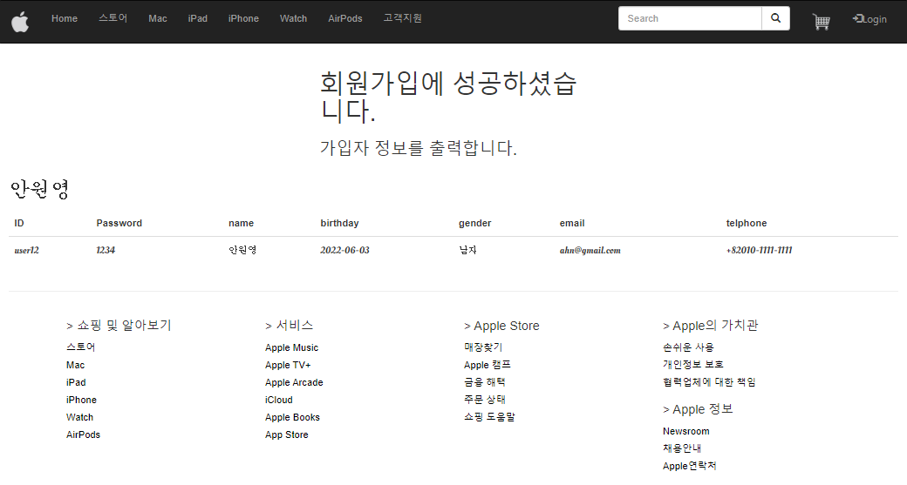

# Project _ Apple Site 

------

> BootStrap 을 이용해서 Apple Site 를 만들어본다  
>

# Project 설명

1. Apple Site와 같은 화면을 만들어 본다.
   - bootStrap에서 제공하는 틀을 기본으로 사용하여 구현한다. 
   - Apple에 있는 기능들을 구현해본다. 
2. Apple site에 없는 기능들을 추가해 본다. 
   - 로그인 기능 
     - qr 코드 생성기 ( plugin 사용 )
     - 일회용 번호 제공 ( AJAX 이용)
     - 회원가입 화면 (BootStrap 이용)
     - 로그인 유지 ( LocalStrorage 이용 )
   - map 기능 
     - KakaoMap을 사용
3. 추후에 추가할수 있는 기능 
   1. 차트 이용 
   2. 쇼핑 카트
   3. 구매
   4. 회원 가입 폼( 제약 조건 추가 )
      1. 각각의 input 에서 작성완료되면 완료 작게 표시
      2. 이메일 형식 지정
         - @ 나 . 이 들어가도록 구현 
      3. 비밀번호 8 자리 이상이 보안에 강하다는 것을 알려줌
      4. 이름 형태
      5. 우편 번호
      6. 번호 입력시 - 자동 입력  
   5. 로그아웃 기능


# 사용 한 기능 설명

## 1. qr 코드 생성기

   1. 검색하던 중 qr코드를 쉽게 만들 수 있는 플러그인을 발견하였다. 해당 플러그인을 이용해서 qr코드 생성기를 만들어 본다. 

   2. 참고 사이트

      1. [사용법 정리](https://jh91.tistory.com/entry/JS-QR%EC%BD%94%EB%93%9C-%EB%A7%8C%EB%93%A4%EA%B8%B0)
      2. [필요한 파일 ](https://github.com/davidshimjs/qrcodejs)

   3. 사용 방법

      1. input 태그에 입력된 값을 이용해 qrcode를 생성한다. 

      2. 플러그인에 필요한 \<javascript> 2개를 사용하고자 하는 project 경로( Spring boot 기준 src/main/resources > static 파일 안) 에 넣어준다. 

         1. jquery.min.js
         2. qrcode.js

      3. 사용할 html 파일에 script 파일을 추가해 qrcode 를 생성한다.  

         ```html
         <script type="text/javascript" src="qrcode/jquery.min.js"></script>
         <script type="text/javascript" src="qrcode/qrcode.js"></script>
         
         <script type="text/javascript">
         	window.onload = function() {
         		
         		var qrcode = new QRCode(document.getElementById("qrcode"), {
         			width : 100,
         			height : 100
         		});
         
         		function makeCode() {
         			var elText = document.getElementById("text");
         
         			if (!elText.value) {
         				elText.focus();
         				return;
         			}
         			console.log("Calculare QR");
         			qrcode.makeCode(elText.value);
         		}
         
         		makeCode();
         
         		$("#text").on("blur", function() {
         			makeCode();
         		}).on("keydown", function(e) {
         			if (e.keyCode == 13) {
         				console.log("Apasar ENTER");
         				makeCode();
         			}
         		});
         		
         		$("#qrcode > img").css({"margin":"auto"});//qrcode 그림 중간에 오도록 하기 
         	};
         </script>
         <!-- <script type="text/javascript">
         window.onload = function() {
         	new QRCode(document.getElementById("qrcode"), "http://naver.com");
         	
         }
         
         </script> -->
         
         
         <body>   
         <input type="text" id="text" value="https://www.apple.com/kr">
         <h3>QR코드로 로그인 합니다.</h3>
         <div id="qrcode"></div>
         </body>
         ```

   4. 발생한 오류

      1. javascript qrcode error Cannot read properties of null (reading 'appendChild')
         1. 해당 오류는 qrcode 객체생성 순서로 인한 오류이다. 따라서 qrcode 객체를 DOM 객체가 생성된 후 만드는 것이 적절하다. 
         2. 해결 방법
            - window.onload = function() {}  안에서 qrcode 객체를 생성하여 사용한다. 

   5. 결과 화면 

      

## 2. 일회용번호

   1. AJAX 통신을 이용해 3초 간격으로 8자리의 랜덤한 숫자를 출력해 준다. 

   2. 사용법 

      1. \$.ajax({ url : ' ', success : function(data){ } }) 형식으로 ajax 통신을 한다. 
      2. url 에 적힌 주소와 같은 server 의 controller를 호출한다. 
         1. controller 에서 JSONObject 형식이나 여러 데이터 타입으로 JSONArray에 데이터를 담는다. 
         2. controller 에서 return 값으로 JSNOArray 를 리턴한다. 
         3. 리턴한 값은 success 에 적힌 data 로 들어간다. 
         4. data 는 Object 형식으로, 인덱스를 이용해 출력할 수 있다. 
      3. 동일한 페이지에서 AJAX 통신을 이용한 값만 변경된다. 

   3. 코드 

      ```javascript
      // 일회용 넘버 8자리를 랜덤으로 생성 
      var start = setInterval(() => {
      	getnumber();
      }, 3000);
      
      function getnumber(){
          $.ajax({
              url : '/getnumber',
              success : function(data){
                  display(data);
              }
          });
      }
      
      function display(data){
          /* 		$(data).each(function(index, item){
      			$('#menu1 p').text(item +" : " + index);
      		}); */
      
          //$('#menu1 p').text(typeof(data));
      
          $('#menu1 #disposable').text(data[1]);
          $('#menu1 #time').text(data[0]);
      
      }
      ```

      ```java
      @RestController//AJAX 통신에 적합한 애너테이션 
      public class AJAXController {
      	@RequestMapping("/getnumber")
      	public Object getdata() {//데이터를 JSON 형식으로 내려준다. 
      		JSONArray ja = new JSONArray();
      		JSONObject jo = new JSONObject();
      		Date d = new Date();
      		SimpleDateFormat sdf = new SimpleDateFormat("yyyy-MM-dd hh:mm:ss");
      		Random r = new Random();
      		int random= 0;
      		String txt = "";
      		
      		//JSON : [{},{},{}] 의 형태
      		for(int i=0; i<8; i++) {
      			txt += r.nextInt(10);
      		}
      		
      		//현재 시간 
      		String date = sdf.format(d);
      		
      		// JSNO Array에 객체 추가 
      		ja.add(0, date);
      		ja.add(1, txt);
      		
      //		ja.add(date);
      //		ja.add(txt);
      //		
      //		System.out.println(ja.get(0));
      //		System.out.println(ja.get(1));
      		
      		return ja;
      	}
      }
      ```

   4. 결과 화면

   

## 3. local Storage 이용해서 로그인 유지 하기 
   1. [참고 사이트](https://hianna.tistory.com/697)

   2. 사용 메소드 

      1. window.localStorage.setItem('id', id);
      2. window.localStorage.getItem('id') 

      ```javascript
      $(document).ready(function(){//로그인 성공시 key="id" 값으로 userName이 들어간다. 
      	if(window.localStorage.getItem('id') == null){// 로그인 하지 않았다면 
      		$('#user').html('<span class="glyphicon glyphicon-log-in">Login</span> ');
      	
      	}else{
      		$('#user').html('<span>' + window.localStorage.getItem("id") + ' 님 환영합니다!! </span>');
      		$('#user').attr({
      			'href' : '#',
      		});
      	}
      });
      
      ```

   4. 결과 화면 

      
      
      

## 4. 회원가입 화면  

   1. 자세한 설명은 Day28.md의 Project 에서
      1. [Day28 바로가기](https://github.com/wonyoung0207/TIL/blob/master/MultiCampus/Day28.md)
      
      2. 기능
         1. 만들었던 naver 회원가입 페이지를 AJAX 와 JQuery를 이용해 동적으로 만든다. 
         2. ID 항목 입력시 조건을 준다. 
            1. AJAX 를 사용하여 Database에 있는 아이디와 중복되면 실시간으로 사용할 수 없다는 문구를 띄워준다. 
            2. keyup 기능을 이용해 5글자 이상 들어가도록 한다. 
         3. password 확인란과 password가 다르다면  알려주는 문구를 나타낸다. 
            1. 초기 register 버튼을 비활성화 시키고, 이후에 비밀번호 조건을 만족하면 버튼을 활성화 한다. 

   3. 결과창 
      
      
