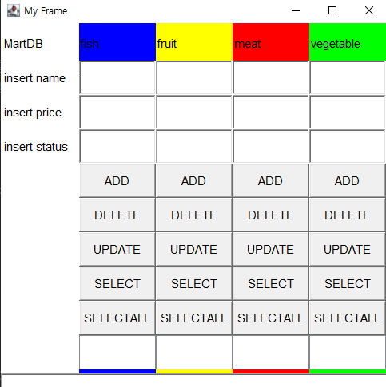
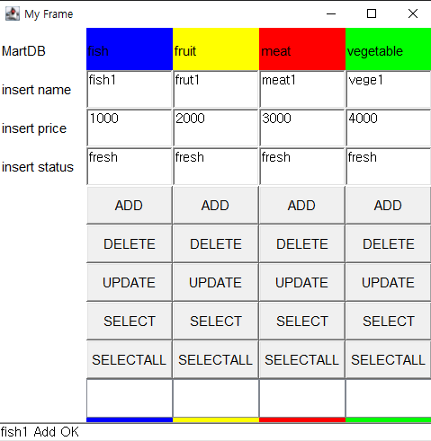
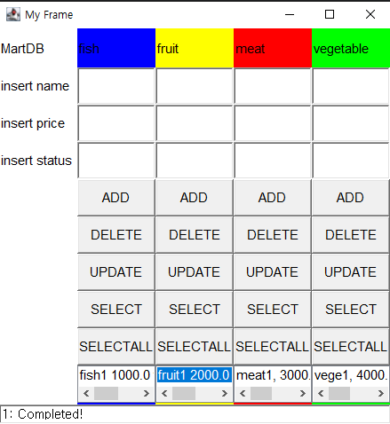

# Mart Project

---

> 자바와 데이터베이스를 연동하여 데이터를 저장, 관리한다.
>
> MySQL연동을 위한 JDBC Programming과 OOP개념을 적용한 시스템 구축
>
> CRUD 기법을 이용해 데이터 베이스에 정보를 삽입, 삭제, 업데이트, 데이터 가져오기를 사용해본다.

1. 설계

   1. MySQL 데이터베이스 서버에 두 개의 테이블을 구축 한다.
   2. 각 테이블의 CRUD SQL문을 작성 한다
   3. Java Application을 이용하여 CRUD 프로그램을 작성 한다
      3-1. VO(Value Object)를 설계 한다.
      3-2. 각 테이블의 CRUD 기능을 설계 한다.
      3-3. 각 테이블의 DAO(Data Access Object)를 구현 한다.
      3-4. CRUD 기능에 대한 테스트 프로그램을 작성 한다.
   4. Java Application을 구현 하여 각 기능을 통합 테스트 한다.

2. 구현 내용

   1. DAO 를 이용해 Mysql과 이클립스를 자바 언어를 통해 연결시킨다.
      - DAO는 **추상클래스로 구현**하였다.
      - CRUD 기능을 객체별로 진행할 수 있도록 **제네릭**을 사용하였다.
   2. 저장할 데이터 만큼의 테이블을 Mysql에서 만들고, VO 패키지에서 해당 내용에 대한 객체를 만든다.
      - **martdb 라는 데이터베이스**를 만들었다.
      - 그 안에는 Fish, Fruit, Meat, Vegetable 총 4개의 테이블이 있다.
      - 4개의 테이블에 저장하기 위한 객체를 VO 패키지에 만들어 준다.
   3. 만든 객체들을 이용해 객체마다**DAO를 만들어 CRUD** 를 구현한다.
      - DAO를 상속받아 **Fish, Fruit, Meat, Vegetable 총 4개의 객체별로** CRUD를 구현하였다.
      - fram 패키지의 **sql 문을 저장**하고 있는 sql.java객체를 만들었다.
        - 해당 객체는 sql문을 한군데에 작성하여 관리한다.
      - Exception이 발생할 수 있으므로 **try catch를 이용해 예외처리**를 한다.
   4. 사용자가 편리하게 사용할 수 있도록 **java.awt 를 이용하여 화면UI**을 만들었다.
      - 총 4개의 테이블에 CRUD를 손쉽게 할 수 있다.

3. 구현 화면

| 1    |  |
| ---- | --------------------------------------- |
| 2    |  |
| 3    |  |

   
