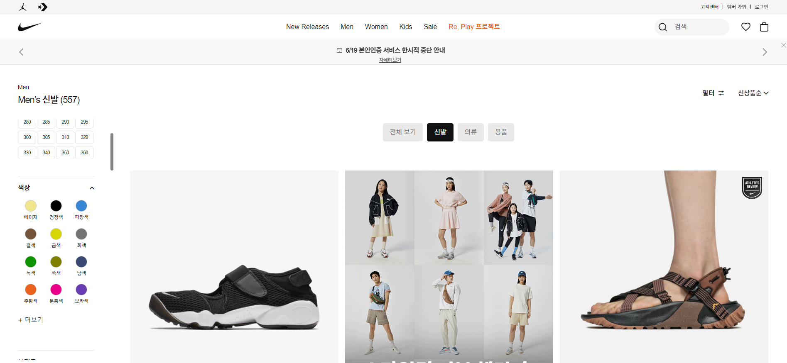
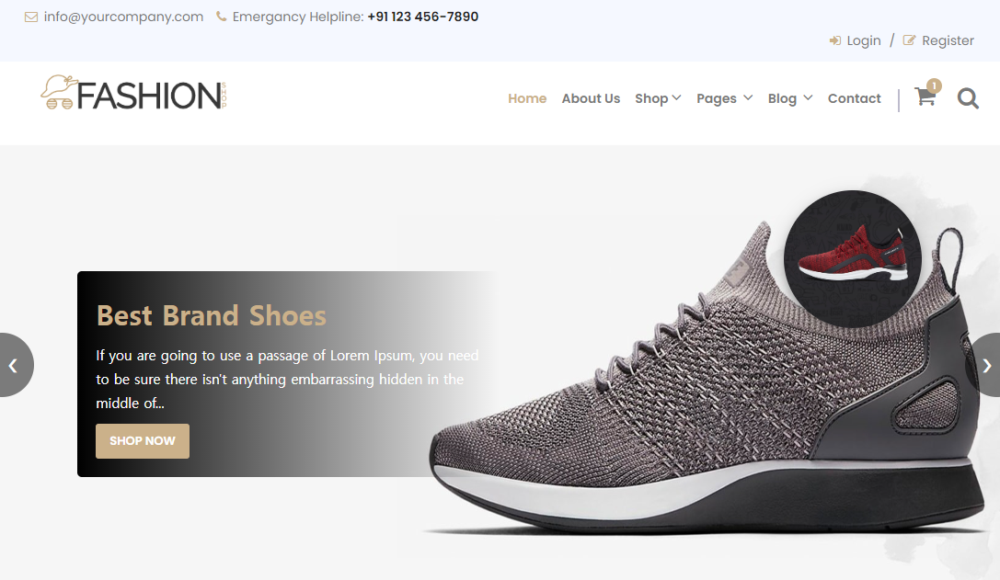
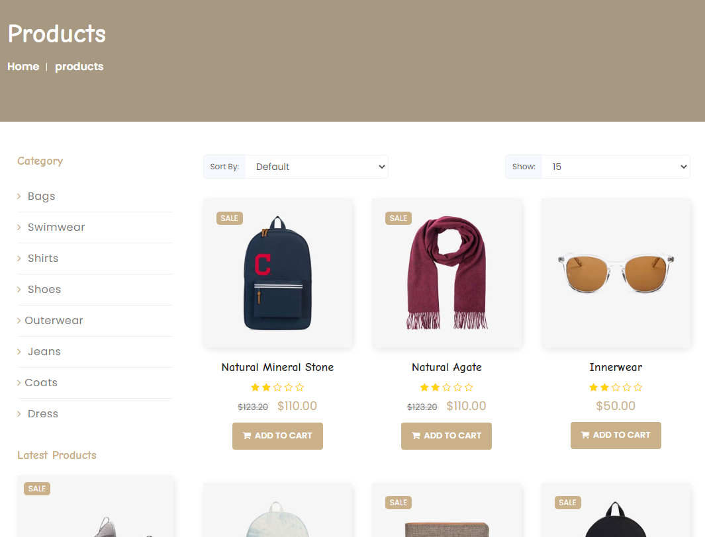
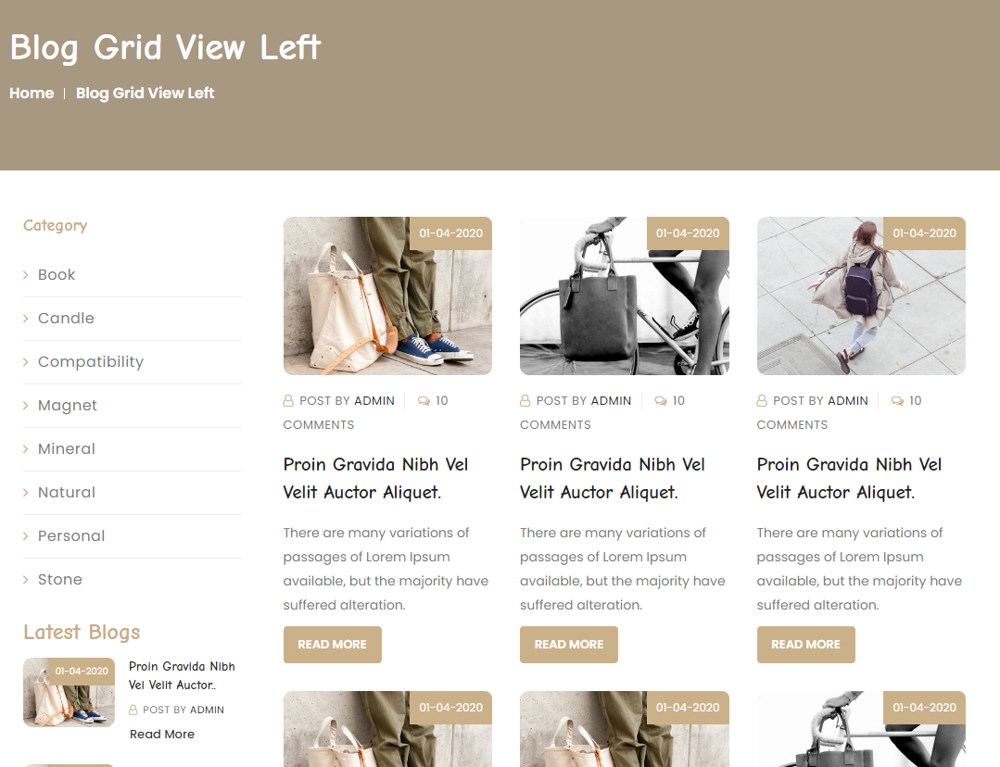
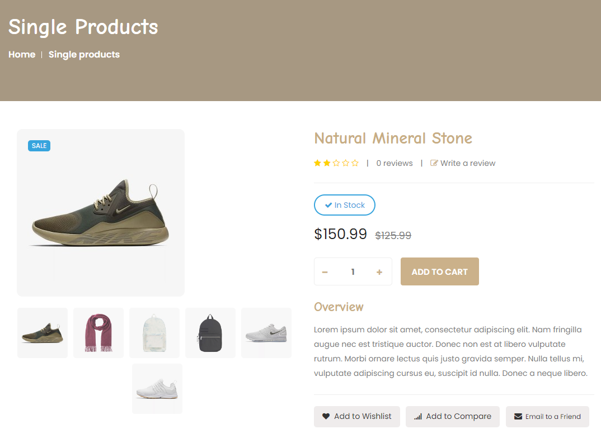
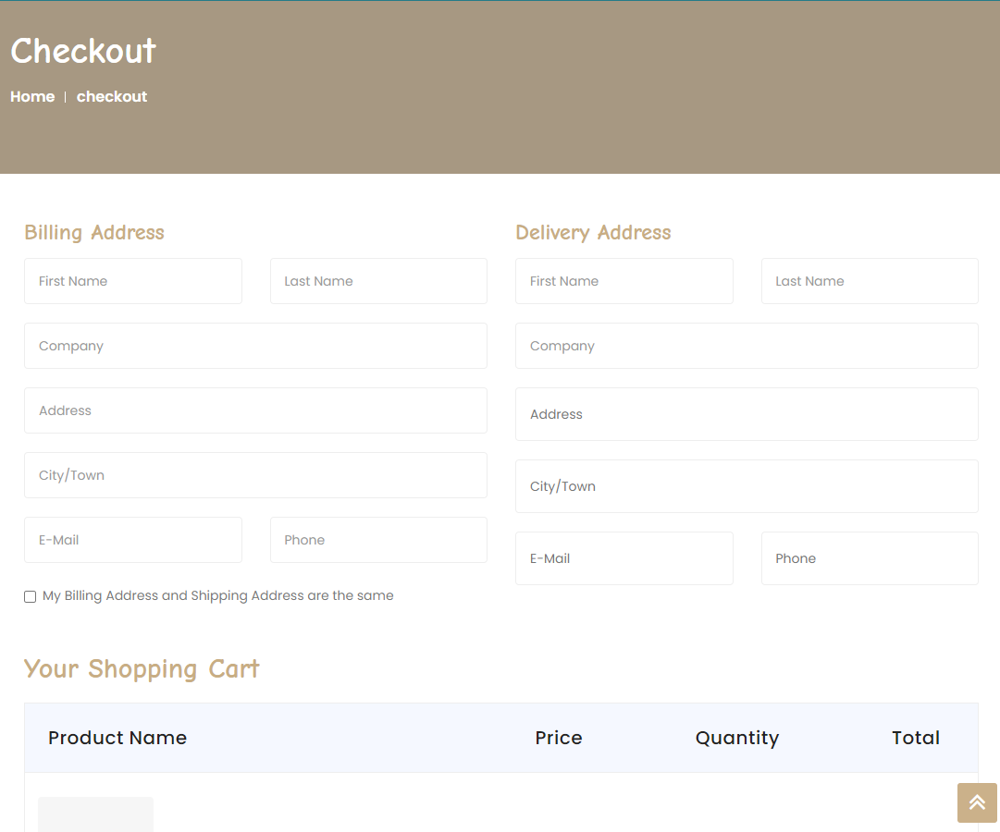
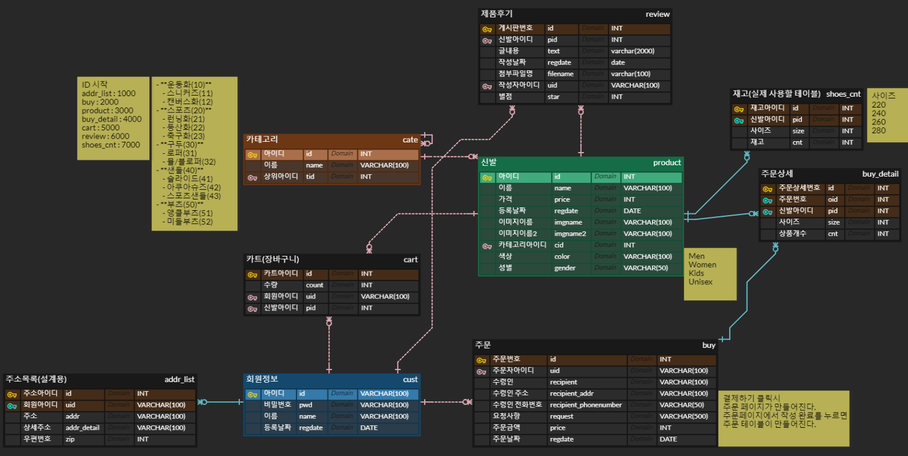

# Shoes Site 

(프레임워크 기반의 서비스 개발 프로젝트)

팀 : MultiCampus 14회차 Team2

팀원 : 김민식, 서예린, 안원영, 유정아 

---

> BootStrap으로 제작된 Template를 사용하여 Shoes Site 를 제작한다. 

## 1. 프로젝트 주제

여러 물품을 팔 수 있는 쇼핑몰로 확장 가능한 신발 쇼핑몰 제작

## 2. 주제 선정배경 또는 이유

여러 물건을 파는 쇼핑몰은 구조적으로 복잡하다. 이런 쇼핑몰을 만들기 전 "신발" 이라는 키워드를 사용해 보다 완벽한 쇼핑몰 사이트를 만들고자 한다. 개발 완료시 여러 카테고리를 추가시켜 쿠팡이나 옥션, 11번가 같은 플렛폼을 만드는 것이 목표이다. 

## 3. 프로젝트 개요

## 4. 프로젝트 환경 및 사용된 툴

|     언어      |                      웹                      |                    개발도구                     | DataBase |                           협업도구                           |
| :-----------: | :------------------------------------------: | :---------------------------------------------: | :------: | :----------------------------------------------------------: |
| java SQL | HTML CSS3 JS JQuery Ajax | Eclipse Spring MyBatis BootStrap |  MySql   | Zoom [Github](https://github.com/minsiks/Team2-Semi_Project) [ERDCloud](https://www.erdcloud.com/d/tBFT5AzhSeSA2sXz7) [Padlet](https://padlet.com/tidnjrk010/Bookmarks) [Notion](https://www.notion.so/hi-syl/d9931d43fcd740328b8c45b34269994d) |

## 5. 가이드

BootStrap으로 구현되어있는 무료 Templat 이용하여 Nike site 를 참조하여 Site를 제작한다. 제작에 참조한 사이트는 ABCMart, Nike 이다. 

[무료 Template](https://templatebazaar.in/fashion-shop-bootstrap-template)

[Nike Site](https://www.nike.com/kr/ko_kr/w/men/fw)

## 절차

> 주제선정
>
> 데이터 수집 및 전처리

### 1. 주제 선정

- 여러 쇼핑몰 사이트를 비교
- 가장 심플하면서 사용자가 사용하기 편리한 사이트를 선정

### 2. 템플릿 선정

- [Fashion](https://www.templatebazaar.in/demo/fashion_shop/products.html)
  - 최종 결정 템플릿
  - 깔끔한 디자인, 만들고자하는 목표와 비슷
- [Watch](https://graygrids.com/templates/estore-free-bootstrap-ecommerce-template/)
  - 유로버전, 무료버전이 따로 존재
  - 나이키와 같은 체크박스로 제품 필터링 하는 섹션 존재
- [Shop UI](https://keenthemes.com/products/ecommerce)
  - 나이키와 같은 체크박스로 제품 필터링 하는 섹션 존재
- [W3School 제공](https://www.w3schools.com/w3css/tryw3css_templates_clothing_store.htm)
  - W3School 제공 템플릿
- [Shop](https://demo.htmlcodex.com/1479/online-shop-website-template/)
  - 메인화면 조금 복잡
  - shop페이지에 체크박스 존재 -> 응용가능 

### 3. 추가 기능 및 참고 자료 검색 

1. [팀 소개 페이지](https://startbootstrap.com/previews/agency)
2. [배너](https://www.miricanvas.com/templates/web_banner_hor/1186w-%EB%85%B8%EB%9E%91%EC%83%89%EA%B3%BC-%ED%8C%8C%EB%9E%91%EC%83%89%EC%9D%98-%EB%84%A4%EC%98%A8-%EC%BB%A8%EC%85%89-%EC%9D%98%EB%A5%98-%ED%94%84%EB%A1%9C%EB%AA%A8%EC%85%98-%EA%B0%80%EB%A1%9C%ED%98%95)

### 4. 템플릿 수정 

- [사용 템플릿](https://www.templatebazaar.in/demo/fashion_shop/products.html)

  

  

  

  

  

  

- 페이지 상단

  - 상단바 카테고리로 수정
  - 상단바에 호버하면 나타나는 것들을 상세카테고리로 수정
  - main page 상단에 mail 클릭시 바로 메일 보낼 수 있도록 제작 (참고 사이트 : https://frontcode.tistory.com/33)
  - navbar saerch 기능 수업에서 배운내용으로 구현

- 메인 페이지

  - 홈페이지 ***\*Our Fashion Shop Work For You →\**** ajax 활용해서 브랜드 수, 상품 수, 구매 수 등등 노출 가능
  - 메인페이지 footer는 간단하게

- 상품 페이지, 상품상세 페이지

  - 상품페이지 왼쪽에 제품 필터링 추가
  - Main Menu 중 Blog Grid View Left 에서 왼쪽 menu의 tag 기능으로 물품 검색 (체크박스 부분은 다른 무료 부트스트랩의 소스를 이용 할 수도 있음)
  - 물품 리스트 아래에 있는 페이지 넘김 버튼 제작 할것인지 => < 1 2 3 4 5> 
  - 제품별 review 저장하는 Table이 필요
  - 상품페이지의 Related Product를 띄우는 기준 설정이 필요

- Contact

  - Contact Us- Map설정을 멀티캠퍼스 선릉으로 설정하기
  - Contact 페이지에 있는 이메일 또는 주소 클릭시 클립보드 복사 (참고 사이트 : http://b1ix.net/364)

- form(로그인, 회원가입, 결제)

  - Register 페이지에 JavaScript로 조건 추가하기
  - 결제 페이지에서 우편번호 API와 결제 API 사용

### 5. 카테고리 설정

- Women, Men, Kids 3가지로 결정
- 신발 종류는 추후 설정 

### 6. ERD 작성

- [ERD설계](https://www.erdcloud.com/d/tBFT5AzhSeSA2sXz7)

  

- 제품 성별 결정

  - Men
  - Women
  - Kids
  - Unisex

- 신발 사이즈

  - 220
  - 240
  - 260
  - 280

- 주문 발생

  - 재고파악 및 재고 변화

### 7. 역할분담

- [역할분담 예시](https://velog.io/@hello1358/1%EC%B0%A8-%EC%BD%94%EB%94%A9-%ED%8C%80-%ED%94%84%EB%A1%9C%EC%A0%9D%ED%8A%B8-%ED%9A%8C%EA%B3%A0%EB%A1%9DMarket-ChoKurly)

- 회원가입, 로그인, Mypage(회원정보 조회, 수정, 주문내역확인, 카트(링크)

  → form, ajax, 정규식

  → 안원영

- 결제, 카트

  → 결제(API), 카트 합계(ajax) 난이도⬆️

  → 김민식

- 제품리스트, 제품상세

  → 제품 필터링 난이도⬆️

  → 서예린

- 제품 Search, 메인페이지(메뉴), Contact

  → 유정아

- 추후 설계 (관리자페이지 )

  → 회원관리, 상품관리, 입출고관리, 주문관리(주문상세도 띄워야함), 후기조회, 카트조회

### 8. 구현할 기능 제시

1. 페이지별 상세 기능 정하기

   무조건 카트에 넣어서 구매

   비회원구매 불가

2. 카테고리 정하기(ABC mart 참고)

   - 운동화(10)
     - 스니커즈(11)
     - 캔버스화(12)
   - 스포츠(20)
     - 런닝화(21)
     - 등산화(22)
     - 축구화(23)
   - 구두(30)
     - 로퍼(31)
     - 뮬/블로퍼(32)
   - 샌들(40)
     - 슬라이드(41)
     - 아쿠아슈즈(42)
     - 스포츠샌들(43)
   - 부츠(50)
     - 앵클부츠(51)
     - 미들부츠(52)

3. 제품리스트 왼쪽 필터 종류 정하기

   (필터 중복체크가 적용되게 설계)

   - 하위카테고리
   - 가격대
   - 색상
   - 사이즈

4. Sort by(제품리스트 순서)

   - 이름순
   - 별점순
   - 가격순

5. 로그인 기능

   - 배운 내용

   - 아이디/비번찾기, 아이디 기억, 자동로그인

6. 카트 기능

   - 배운내용

   - 전체선택, 개별선택

### 9. [SQL문 작성](https://github.com/wonyoung0207/TIL/tree/master/MultiCampus/Project_ShoesSite/SQL)

- DDL (Data Define Language) 
  + **Create, Drop, Alter **
  + 테이블 생성, 드랍 제약상황 
  + 테이블 관리에 사용 

- DML (Data Manipulation Language) 
  + **Select, Insert, Delete, Update**
  + 테이블의 내용들을 다루는 명령어
  + 데이터 관리에 사용 

