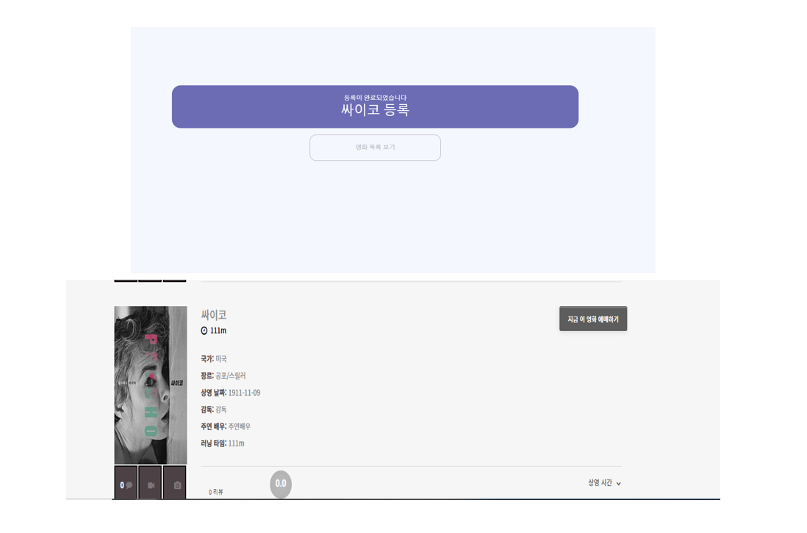

# 티켓사조
### Spring boot를 활용한 클래식 영화관 티켓팅 웹 서비스 및 NCP AI플랫폼을 활용한 고객편의기능 구현


- [웹 개발 포트폴리오-영화관 사이트 시연 영상](https://youtu.be/nv4Ajon3jRM) 
- [웹 개발 포트폴리오-영화관 관리자 사이트 시연 영상](https://youtu.be/2yBuQ4x1oUM) 


팀명: 티켓 사조  

팀장: 김민식

팀원: 안원영, 장효준, 정세연


## 프로젝트 정보

### 1. 프로젝트 주제
Spring boot를 활용한 클래식 영화관 티켓팅 서비스 및 NCP AI 플랫폼을 활용한 고객편의 기능 구현

### 2. 프로젝트 목적
1. 클라우드 환경 사용
2. 자리 예매 기능 구현
3. AI Platform(CLOVA OCR)을 활용한 영수증사지을 이용한 적립금 기능 구현
4. AI Platform(CLOVA CFR)을 활용한 닮은 꼴 배우 찾기 이벤트 페이지 구현
5. 네이버, 구글, 페이스북 등 다양한 로그인 API를 활용한 로그인 기능 구현

### 3. 프로젝트 기능 구현
1. 영화 좌석 선택 및 예약
2. AI를 활용한 영수증 인식 후 포인트 적립, 적립 내역 조회 기능
3. 로그인 API(OAuth) 사용해 로그인 및 회원가입 기능
4. 결제 API 기능 
5. 영화 필터 검색 기능
6. 성별, 나이 정보를 바탕으로 통계표 기능
7. 리뷰, 평점 기능
8. CLOVA Face Recognition(CFR)을 이용한 닮은 꼴 배우 찾 이벤트 페이지 구현

### 4. 프로젝트 역할 분담 
| 이름 | 역할 |
|------------|-----------|
| 김민식 |영화 상세 페이지(통계차트), 영화리스트 페이지, CHATBOT, Contact Us 페이지(구글맵, 문의사항 메일로 전송), CLOVA Face Recognition (CFR), Admin 페이지 (고객/영화/스케줄/쿠폰/포인트 관리, 예매내역 조회, 로그인, 회원가입) &nbsp; &nbsp;  &nbsp; &nbsp; |
| 안원영 | 메인 페이지, 로그인 API(**Spring boot 의 OAuth 2.0**), 리뷰 순위 페이지, 쿠폰발급 페이지, NCP AI CLOVA OCR (광학 문자 인식기 이용 포인트 적립), Admin 페이지(메인 페이지) &nbsp;|
| 장효준 | 예매 기능(스케줄 선택, 좌석선택, 결제, 발권), 결제 API(Import), Admin 페이지(스케줄 관리),FULLCALENDAR |
| 정세연 |회원가입, 일반 로그인, MyPage(나의 예매내역, 내 포인트 내역 조회, 내 쿠폰 내역 조회, 회원탈퇴, 회원정보변경, 비밀번호 변경)|

### 5. 프로젝트 개발 환경 및 수행 도구


|  **언어** |                            **웹**                            |   **개발도구**   | **DataBase** |                         **협업도구**                         |      **FrameWork**       |                           **API**                            |
| :-----------: | :----------------------------------------------------------: | :--------------: | :----------: | :----------------------------------------------------------: | :----------------------: | :----------------------------------------------------------: |
| JAVA<br />SQL | HTML5<br />CSS3<br />JS<br />jQuery<br />Ajax<br />Bootstrap<br />Thymeleaf | Eclipse<br />NCP |    Mysql     | Zoom<br />Google Docs<br />Github<br />ERD Cloud<br />Padlet<br />Notion | Spring Boot<br />Mybatis | FullCalendar<br />Google Map <br />Naver CFR<br />Naver ChatBot<br />Naver OCR<br />Spring Boot OAuth 2.0 <br />Import |


### 6. 데이터베이스 설계

ERD: [티켓사조](https://www.erdcloud.com/d/Gb6vzq6LdsJjFpduL)


### 7. UI 설계


----
## 프로젝트 결과 
### 1. 회원가입 화면

* 어느 한 칸이라도 빈칸일 시 '필수황목입니다.' 메세지 띄우기

* Ajax를 이용해 데이터베이스에 동일한 아이디가 존재하는지 비교

* 비밀번호 조건 미충족 시 '보안에 취약합니다. 5자리 이상이어야 합니다.' 메세지 띄우기

* 비밀번호 확인: 위 비밀번호와 일치하지 않을 시 '일치하지 않습니다. 비밀번호를 다시 입력해주세요.' 메세지 띄우기

* 모든 조건 충족 시 회원가입 성공


* 어느 한 조건이라도 미충족 시 회원가입 불가


### 2. 로그인 화면 

#### 로그인 성공 전 메인 화면
 <p align="center"></p>

#### 로그인 실패 시 화면 
* 데이터베이스에 저장된 아이디와 비밀번호 값과 일치하면 로그인 성공 후 메인 페이지로 이동 / 일치하지 않을 시 하단에 '아이디 또는 비밀번호를 잘못 입력했습니다. 입력하신 내용을 다시 확인해주세요.' 메세지 띄우기
<p align="center"></p>

#### 로그인 성공 시 메인 화면 
 <p align="center"></p>

### 3. 마이페이지

* 로그인 성공 시에만 화면에 보여짐
* 로그인한 아이디값에 따른 정보 불러옴(쿠폰내역, 포인트 내역, 예매내역, 회원정보)

<p align="center"></p>

#### 포인트 내역
* 사용 가능한 포인트 정보 띄우기
<p align="center"></p>

#### 쿠폰 내역
* 발급 받은 쿠폰 정보 띄우기(사용한 쿠폰일 경우 사용한 날짜 표시)
<p align="center"></p>

#### 예매 내역
* 예매 내역에 따른 정보 띄우기
<p align="center"></p>

* 마이페이지에서 예매번호 누르면 예매 정보 화면으로 간편하게 넘어감
<p align="center"><im src= https://user-images.githubusercontent.com/103159709/184600810-59bbd238-0341-4345-bd61-9738070a071b.png></p>

* 마이페이지에서 영화제목(ex싸이코) 누르면 티켓이 나옴
<p align="center"></p>

#### 회원수정
* 회원정보 수정(아이디는 readonly로 수정 불가 / 이름만 변경 가능)
<p align="center"></p>

* 수정 완료 시 확인창 띄우기

<p align="center"></p>

#### 비밀번호 변경
* 빈칸이 있을 시 submit불가

<p align="center"></p>

* 현재 사용중인 비밀번호와 같은 비밀번호로 바꿀 시 '사용불가: 비밀번호 재작성이 필요합니다.' 메세지 띄우기
<p align="center"></p>

* 새 비밀번호와 새 비밀번호 확인이 불일치 시 alert창 띄우기

<p align="center"></p>

#### 회원탈퇴
* 비밀번호 입력 안하고 탈퇴 버튼 누를 시 '비밀번호를 다시 확인해주세요' 메세지 띄우기
<p align="center"></p>

* 현재 사용중인 비밀번호와 일치하지 않을 시 회원탈퇴 불가 / 오류 메세지 띄우기
<p align="center"></p>

* 회원탈퇴 성공 시 'used'필드 값 변경(완전 삭제 ×/ 0: 탈퇴한 계정, 1: 사용 중인 계정) 
<p align="center"></p>

---

### 1. 메인 Page

#### 상단 슬라이드

- 영화관에서 필요한 규칙이나 현재 상영하고 있는 인기있는 영화들의 포스터와 영상을 이용해 손쉽게 흥미를 가질 수 있도록 구현

  <p align="center"></p>

#### 평점 높은영화 순 정렬 6개. 

- 평점순으로 영화를 정렬하여 상위 6개의 영화를 추려 보여줌

  - 평점과 간단한 영화 정보를 볼 수 있으며 해당 포스터를 클릭했을 경우 해당 영화의 상세 페이지로 연결 

- 반응형 웹이 적용되어있어 화면의 크기에 따라 보여지는 영화 포스터의 갯수와 형태가 달라짐

- "오늘의 상영작 확인하러가기" 를 누르게되면 포커스가 "오늘 상영 영화"로 이동 

  

  

#### 영화 검색기능

- 장르, 배우, 감독, 국가 별 검색기능을 제공

  - 각 검색기능에 따라 이미지, 추천 키워드, 버튼내용을 다르게 적용 
  - 검색을 누르게 되면 동적 SQL 문을 이용하여 선택한 태마에 따른 검색 결과를 보여짐 

  

  


#### 오늘의 상영작

- 해당 요일에 상영되는 영화정보를 가져와 출력

  - 상영 영화가 없으면 없다고 표시
  - 상영 영화가 있다면  간단한 영화 정보,별점과 포스터를 표시해 직관적으로 볼 수 있도록 함

- 영화 포스터나 제목을 눌렀을 경우 해당 영화의 상세 페이지로 넘어감 

- 반응형 웹을 이용해 포스터를 표시. -> 모바일 말고 화면 줄이는것도 다른화면 됨

  

  

#### 영화에 대해 궁금한 것 검색

- google search를 통해 movie에 대한 정보를 검색

- 새창을 띄워 검색한 키워드를 google에 검색

  


### 2. 영화  - 평점 랭킹 Page

#### 영화 순위 정렬

- sql 문을 이용해 평점 랭킹 순으로 모든 영화를 정렬하여 정보를 가져옴

- 영화를 클릭하면 해당 영화 detail 페이지로 넘어감


#### 페이징 기법 사용

- sql문의 limit을이용한 paging 기법을 통해 평점순으로 5개씩 나눠서 보여짐

- 첫번째 페이지에서는 "이전" 버튼이 활성화되지 않도록 하였고, 마지막 페이지에서도 "다음" 버튼의 활성화를 막음

  

### 3. 이벤트 - 쿠폰발급 Page

#### 로그인 전

- 현재 날짜를 기준으로 진행중인 쿠폰만 볼 수 있도록 만듦

  - 쿠폰은 보기 쉽도록 할인 가격이 높은 순으로 정렬 

- 쿠폰 발급을 누르면 모달을 이용해 "발급받겠습니까? " 를 물어보고 발급버튼을 누르면 로그인이 되어있는지 체크 

  - 로그인이 되어있으면 해당 아이디로 쿠폰발급을 진행하고 만약 비로그인이라면 로그인을 할것인지 물어보는 모달창을 보여짐 
  - 로그인 버튼을 누르면 로그인 페이지로 넘어가게 되고, 이때 **_request.getHeader("Referer")_**  를 이용하여 모든 페이지에서 로그인페이지로 들어갔을 경우 이전 페이지를 기억하여 돌아갈 수 있도록 구현했다. 

  

#### 로그인 후 

- 로그인이 완료되면 "보유중 or 발급가능" 문구를 통해 로그인한 아이디에서 발급받을 수 있는 쿠폰을 직관적으로 구분할 수 있도록 제작 

  - 만약 보유중 쿠폰을 다시 발급받았다면 "발급실패" 모달을 통해 요청을 취소한다. "발급가능" 쿠폰을 클릭했을 경우 정상적으로 발급되고 "close " 버튼을 누르면 페이지를 리로드

- 반응형 웹으로 제작 

  

  

  

### 3. 이벤트 - 포인트 적립 Page

#### NCP OCR 

- 표를 현장발권했을 경우 추가적으로 적립할 수 있도록 영수증 적립 이벤트를 구현 

- 해당 페이지에서는 NCP 에서 제공하는 CLOVE OCR 기능을 이용

  

  

  

  

#### 영수증 검사

- 영수증 검사 버튼을 눌러 OCR 기능을 이용해 업로드된 사진의 영수증 텍스트들을 인식하여 이용할 수 있는 영수증인지 판별 

- 이때 판별이 끝나면 결과를 알려주는 텍스트로 자동 스크롤 되도록 구현

- 이용할 수 있는 영수증이라면 적립가능하도록 하였고, 만약 조건에 맞지않는 영수증 (영수증 상단 이름, 발급일이 7일이상 지난 날짜) 이라면 적립버튼을 활성화 되지 않음 

  

  

  

  


#### 포인트 지급 

- 만약 조건에 만족하는 영수증이라면 영수증 금액의 5% 를 포인트로 지급 

- 또한 같은 영수증을 연속적으로 사용할 수 있는 문제를 방지하여 바코드 번호를 관리하는 테이블을 만들어 중복 적립을 피할 수 있음 

  

  

### 4. 로그인 - 플랫폼 로그인 Page

> [Spring boot OAuth 2 모든 내용 정리](https://github.com/wonyoung0207/Spring-boot-Security-OAuth-2.0)

#### 참고 강의 

1. [Spring boot Security 구현 강의](https://www.inflearn.com/course/스프링부트-시큐리티/dashboard)
   - [깃허브 자료](https://github.com/codingspecialist/-Springboot-Security-OAuth2.0-V3)
2. [유튜브 강의-나도코딩](https://opentutorials.org/course/2473/16571)
3. [생활코딩 OAuth ](https://www.inflearn.com/course/web2-oauth2/unit/36283?tab=curriculum) 
4. [참고 유튜브 강의](https://www.youtube.com/watch?v=9ui2i-SgBpk)
5. [내용 참고 ](https://deeplify.dev/back-end/spring/oauth2-social-login)

- 플랫폼 로그인 구현은 Spring boot 에서 제공하고 있는 OAuth2.0 기능을 이용
- Spring boot 에서 제공하는 OAuth 를 사용하여 각종 소셜 플랫폼에 등록되어있는 로그인 API 기능들을 이용하여 플랫폼 아이디로 로그인 할 수 있도록 만듦
- OAuth 를 이용하면서 가장 어려움이 컸던것은 보안문제 였다. 보안으로 인해 8번의 과정을 거처 사용자 정보들을 받아올 수 있음
- 자세한 내용은 [Spring boot OAuth 2.0 정리](https://github.com/wonyoung0207/Spring-boot-Security-OAuth-2.0) 이곳에서 볼 수 있음 

#### Spring boot Security 구조


1. **_사용자( Owner )_** 가 client 와 연결
   - client는 내가 개발하는 web, app 
2. 플랫폼 로그인 진행시 **_Client_** 의 화면에서 사용자에게 Resorce Server 로 요청하기 위한 **계정 동의** 를 구한다. -> 동의 버튼은 **_Resorce Server_** 로 연결되어 있어 바로 3번이 진행됨
   - Resorce Server 는 신뢰할 수 있는 기업인 google, naver, Kakao 같은 server 를 뜻함
   - 계정 동의는 해당 플랫폼의 id, password로 로그인하는것을 뜻함
3. 동의를 구하면 Resorce Server 로 계정 인증 내용을 보냄 
4. Resorce Server 가 인증요청을 받고 **_Client에서 필요로 하는 정보 ( Scope List )_** 가 무엇인지 사용자에게 보여준다. 사용할 정보 리스트( Scope List ) 를 가지고 Client가 이용할 수 있도록 허락하는지 사용자에게 물어봄 
   - scope List 의 내용을 사용자가 허락할 것인지 창으로 보여줌 
5. 이때 동의 버튼을 클릭하면  Resorce Server 가 Client에게 사용자의 정보 ( Scope List ) 를 볼 수 있도록 허락하는  **_비밀번호 ( Code )_** 를 보냄 
   - 따라서 Code에는 사용자가 자신의 정보를 볼 수 있도록 Client에게 권한을 줬다는 것을 뜻 함 
6. Client가 Resorce Server 로부터 받은 Code를 **_Client id, Client secretKey_** 와 함께 묶어 다시 Resorce Server 로 보냄 
   - Resorce Server 는 전달받은 3가지의 정보 ( Code와 해당 클라이언트 id. SecretKey) 가 맞는지 판단함
7. Resorce Server 가 판단을 통해 Client에게 **_Access Token_** 을 보내줌 
   - Access Token을 가지고 Client는 해당 사용자가 허락한 범위 내에서 정보를 열람할 수 있음 
8. Client 는 Access Token을 가지고 API를 사용할 수 있음

#### 결과화면 

- 로그인은 **"google 로그인 버튼 클릭 -> 계정 선택 -> 데이터 정보 요구 동의 -> 로그인"**  순서로 진행 

  

- 소셜 API 콘솔에 들어가면 만든 TicketSajo 어플리케이션이 존재 

  

  

  

  

- 로그인이 완료되면 다음 데이터를 받아와 세션에 사용자 정보를 저장 

  ```java
  google 로그인 요청
  getAttributes : {sub=xxx, name=안원영, given_name=원영, family_name=안, picture=https://xxx, email=xxx@gmail.com, email_verified=true, locale=ko}
  principalDetails : CustVO(id=xxx@gmail.com, pwd=0000, name=안원영, birth=Wed Feb 07 00:00:00 KST 1996, point=0, sex=men, used=true, usepoint=0)
  ```
https://github.com/JangHyojoon/Ticket_SaJo/blob/f4ab88841021c9cfb1246d5d236abd5211e1bc33/Ticket_SaJo/src/main/java/com/multi/security/config/SecurityConfig.java#L23-L59
---

### 1. 영화 목록 페이지


- 상영 영화 데이터 연동, 화면에 노출
- AJAX로 각 예약 스케쥴 날짜 선택 시 날짜별 표시 (해당 영화의 날짜별 상영관, 스케줄 등 비동기식 정보 가져와서 노출) 
- 리뷰 별점 데이터 연동해서 CSS활용 별점 퍼센트로 채우기 기능 구현


- 각 전체, 개봉일 오래된 순, 별점 순, 리뷰많은 순, 상영중인 영화 기준으로 정렬 기능 구현


- 페이징 기능 구현 (최초의 페이지에선 이전 버튼을 표시하지 않음, 정렬마다도 페이징 가능)


- 각 영화당 리뷰, 동영상, 포스터 이미지 아이콘 클릭시 모달로 정보 표시 기능 구현

### 2. 영화 상세 페이지

#### 2-1 영화 상세 정보 (정보, 차트)


- 해당 영화에 대한 정보 및 리뷰와 사진 및 동영상 등 상세정보 표시 기능 구현

- 차트 기능 구현 (연령별, 성별별 차트 기능 구현)
- 슬라이드를 이용 영화 포스터를 노출, 드래그시 이동 가능
- 각 슬라이드 마다 클릭시 이벤트 다르게 기능 구현

#### 2-2 첫번째 슬라이드


- 첫번째 슬라이드를 클릭할 때 발생하는 이벤트
- 데이터 속 영화 제목과 유튜브를 연동하여 유튜브에서 해당 영화 제목으로 검색

#### 2-3 두번째 슬라이드


- 각 영화들 마다 티저 영상이나, 예고편을 보여줌
- 모달이 닫히면 영상도 자동으로 정지

#### 2-4 그외 슬라이드


- 포스터 이미지와 그 외의 해당 영화의 관련된 이미지 정보들을 노출
- 슬라이드, carousel 기능으로 화살표 클릭시 돌아가면서 이미지 노출

#### 2-5 리뷰 표시 및 리뷰 남기기 기능


- 리뷰 표시 (n일전, 날짜 및 요일, 이름(아이디), 리뷰 내용, 별점 개수)
- 로그인 비활성화시 리뷰 남기기란 표시 X (리뷰 작성 불가)
- 로그인 활성화시 별점 체크 후 리뷰 작성 가능 (남은 글자 수 표시)

#### 2-6 구글맵 연동 및 토글 기능 추가 (영화관 위치 표시)


- 구글맵 연동 및 영화관 위치 표시
- 영화 상세 페이지 안에서 토글로 구글맵을 열고 닫을 수 있는 기능 구현

### 3. Contact 페이지

#### 3-1 연락처 표시 및 문의사항 접수(폼으로 이메일 전송)


- 컨택트 (사용자 문의 및 편의 기능 위주) 페이지 기능 구현
- 정적 HTML form태그에서 메일 보내기 : Google Apps Mail 
- 해당 폼에 문의 내용과 이름, 이메일을 기입하여 전송 버튼을 누를시, 구글 스프레드시트를 통하여 직접적으로 설정된 이메일로 정보들이 전송
- 설정된 이메일에서 전송된 정보 확인 가능
- 성공시 성공메시지 Fade In 표시 기능 구현

#### 3-2 구글맵 연동


- 컨택트 페이지 하단에 구글맵 연동하여 표시
- 해당 영화관위치가 마커 아이콘으로 표시 (BOUNCE 애니메이션 효과 추가)
- 마커 아이콘 클릭시 맵이 축소되며 상세 위치정보 표시 이벤트 추가
- 해당 a태그를 클릭하면 직접적인 구글 맵으로 이동하여 정보 확인 가능

### 4.  닮은꼴 찾기 이벤트 페이지

#### 4-1 유명배우 사진,영상 팝업으로 표시 기능 구현


- 페이지가 심심하지 않기위해 유명 배우 사진을 나열
- 해당 이미지를 클릭할시 사진 아이콘은 해당 배우의 사진이, 영상 아이콘은 해당 배우 관련 유튜브 영상을 볼 수 있는 기능 구현

#### 4-2 Naver AI CLOVA를 활용 얼굴 인식 및 닮은꼴 찾기 기능 구현


- Naver CLOVA Face Recognition API(이하 CFR API) 활용 기능 구현
- 입력한 이미지 데이터의 얼굴 인식 결과를 json 형태로 반환하는 서비스를 제공
- 사진파일 입력과 동시에 화면에 표시
- 반환된 json 형태의 데이터를 정제하여 표시된 이미지 하단에 정보 표시
- a링크 클릭시 해당 관련인물 구글 이미지 검색 페이지로 이동


- 얼굴이 아닌 사진, 너무 많은 얼굴이 많은 사진 등 입력된 사진 데이터가 불안정하다면 '사진을 한번 더 확인해 주세요'라는 문구 'Fade In'으로 노출

### 5. ChatBot


- Naver CLOVA ChatBot을 활용 고객 편의 기능 구현
- 헤더에 챗봇문의 버튼 추가, 버튼 클릭시 모달로 챗봇 이벤트 발생(클릭시 웹소켓 커넥트)
- 모달 발생시 자동으로 메세지 발생, 질문 유도
- 질문 입력시 챗봇에게 받은 데이터를 화면에서 출력
- 챗봇 대화 빌드 작성 및 공통메시지(실패메시지) 작성
- 모달 닫힐 시 웹소켓 디스커넥트 이벤트 발생

### 6. 사용자 화면 UI 1차 변경 및 정리, 구성


- 1차적으로 포스터 위치, 크기, 전체 주제에 맞는 컬러 선정, 폰트 선정

- 화면을 효과적으로 구성하기 위해 그라데이션, div 크기 재설정, 이미지 및 영상 추가 등 시도

- 테마의 CSS 변경 (버튼 컬러, 폰트 컬러 및 크기,  백그라운드 이미지 재설정 등)

---

# 예매 시스템

## 페이지 구성: 스케줄 선택 --> 좌석 선택 --> 결제 --> 발권


### 1. [스케줄 선택](https://github.com/JangHyojoon/Ticket_SaJo/blob/master/Ticket_SaJo/src/main/resources/templates/book/book2.html)


내용 요약

현재 상영중인 영화의 목록을 보여주고 영화와 날짜 시간을 선택하면 해당 날짜의 상영시간 표시

상영시간을 선택하면 다음페이지 이동 버튼이 표시되도록 하여 상영시간을 선택하지 않으면 진행되지 않음

또 로그인이 되어있지 않다면 로그인 팝업이 나타나도록 구현 하였고, 해당날짜에 해당 영화의 스케줄이 없다면 그에 대한 안내 텍스트를 구성


#### 1) 스케줄 선택 개요


영화 포스터는 슬라이더 플러그인  Swiper를 사용, 날짜는 JQuery의 위젯인 Datepicker를 사용하여 구현

상영시간의 정보는 사용자의 클릭에 따라 바로 확인 할 수 있도록 Ajax를 사용하여 해당 정보를 불러옴

상영시간에 대한 정보를 불러오기 위해선 본 프로젝트의 데이터베이스 구조상 2번의 Ajax 통신이 필요

때문에 Ajax를 동기 처리 방식으로 설정하여 해당 기능을 구현

선택한 영화의 상영일에 상영스케줄이 없는 경우 안내가 표시되고 상영시간을 선택했을 때 다음 페이지로 진행하는 버튼 표시


#### 2) 로그인 확인


다음 페이지 버튼을 눌렀을 때 로그인 세션이 없다면 로그인 팝업이 나타나며 로그인 페이지로 안내


### 2. [좌석 선택](https://github.com/JangHyojoon/Ticket_SaJo/blob/master/Ticket_SaJo/src/main/resources/templates/book/book2.html)


내용 요약

선택한 스케줄의 좌석정보를 표시 

페이지가 시작할 때 예매가 완료된 좌석은 회색으로 표시되어 선택이 불가능하도록 구현

웹소켓을 이용하여 사용자가 해당페이지에서 있을 때 좌석이 예매 된다면 실시간으로 좌석이 회색으로 칠해지도록 구현

좌석을 선택하지 않고 다음페이지 버튼을 눌렀을 때 알람창이 표시되도록 구현


#### 1) 좌석선택 페이지 개요


좌석 선택 페이지는 페이지가 준비될 때 예매된 좌석에 대한 정보를 불러와 좌석을 표시

좌석을 선택하지 않고 다음 페이지 버튼을 누르면 알람창이 나타나고 진행되지 않음

좌석 칸을 클릭하여 좌석을 선택하며 좌측에 선택한 좌석 정보와 가격이 나타남


#### 2) 실시간 좌석 예매 현황 표시


페이지  시 웹소켓이 연결되어 사용자가 좌석 선택 페이지에 있는 도중 

타인이 좌석을 선택하면 실시간으로 최신 예매된 좌석 정보를 불러와 표시

웹소켓으로 좌석 정보를 불러오는 시점은 타인이 결제페이지에서 결제하기를 누르고 결제가 성공하는 시점
https://github.com/JangHyojoon/Ticket_SaJo/blob/fefaa1048b5c1cd9136341d18439abf1dd5a0c77/Ticket_SaJo/src/main/java/com/multi/controller/BookController.java#L268-L284


### 3. [결제](https://github.com/JangHyojoon/Ticket_SaJo/blob/master/Ticket_SaJo/src/main/resources/templates/book/book3.html)


내용 요약

사용자가 선택한 스케줄과 좌석의 정보가 출력

사용자가 보유한 쿠폰이 있다면 셀렉트 창에 표시되며 보유한 적립금도 표시

쿠폰을 선택하고 사용할 적립금을 입력하면 최종금액에서 할인금액을 차감

만약 예매하고자 하는 좌석이 예매도중 선점된다면 결제가 실패하고 좌석선택 페이지로 이동


#### 1) 결제 페이지 개요
 


결제페이지에선 영화, 날짜, 상영관, 상영시간, 좌석이 표시되며 사용자가 보유한 쿠폰과 적립금을 사용할 수 있도록 구현

쿠폰을 사용하면 그 금액만큼 최종 금액에서 차감

적립금은 보유 적립금이 표시되며 입력한 값만큼 최종금액에서 차감

입력할 수 있는 적립금은 최종금액을 넘을 수 없음. 이때의 최종금액은 쿠폰금액을 제한 최종금액임 

또 보유 적립금보다 많은 값을 입력할 수 없음

이 두가지의 경우보다 높은 값을 입력할 경우 입력할 수 있는 가장 높은 값으로 자동 입력 가능

예1) 최종금액이 16000원이고 보유 적립금이 7000원인 경우 최대 입력값은 7000원

예2)최종 금액이 16000원이고 보유 적립금이 20000원인 경우 최대 입력값은 16000원

결제 시스템은 아임포트(import) 테스트로 카드 결제를 구현


#### 2) 좌석선점


예매 진행 도중 좌석이 선점되면 결제가 되지 않고 좌석선택으로 되돌아감

좌석선점은 데이터베이스에 '예매된 좌석' 테이블을 만들어 스케줄번호,상영회차번호,좌석번호 3가지의 정보를 기본키로 설정하여 구현

좌석 선점 방식은 특정 스케줄의 특정 상영회차의 좌석번호는 기본키로 중복이 불가하여 다시 입력된 경우 입력이 실패하는 방법으로 구현


예매 실패시 콘솔에 나타나는 에러 메시지


#### 3) 트랜잭션 

다수의 좌석 예매를 시도 했을 때 좌석중 한 좌석이 선점되어있을 경우의 처리

만약 사용자가 A1,A2,A3,A4 좌석의 예매를 진행하는 도중 A4좌석이 선점되었을 경우 A1,A2,A3의 좌석이 예매되어 데이터베이스에 반영되고 A4좌석이 실패하고 롤백되는 문제점 발생

이는 다수의 좌석을 예매하는 방식이 반복문으로 데이터베이스에 INSERT되는 방식이기 때문임

문제를 해결하기 위해서 해당 반복문을 트랜잭션 어노테이션을 사용해 하나의 트랜잭션 단위로 설정

이 덕분에 만약 반복문이 진행되는 도중 실패하게 된다면 해당 반복문 전체가 롤백되도록 함
https://github.com/JangHyojoon/Ticket_SaJo/blob/5b985a0f1dbaa63c29fd9b5bb987bdc7914eb9ad/Ticket_SaJo/src/main/java/com/multi/biz/BookedBiz.java#L45-L62


### 4. 결제완료 및 티켓

결제 완료시 결제정보가 출력되고 버튼을 클릭시 티켓이 표시


## TicketSaJo(티켓사조) 관리자 사이트

### 1. 로그인 페이지

<p align="center"></p>


- 관리자사이트 로그인 기능 구현
- DB에 관리자사이트 회원관련 데이터와 비교하여 로그인 가능
- 관리자사이트는 회원 정보가 담긴 Session값이 없으면 모든페이지 로그인 페이지로 Return
- 잘못된 로그인 정보 입력시 간단 확인 메시지 출력으로 유효성 검사

### 2. 회원가입 페이지


- 관리자 페이지의 보안 강화를 위해 간단한 인증 절차 진행
- master에게 부여받은 코드를 전달받아 입력 해야 회원가입 가능
- 코드를 잘못 입력하면 '코드가 잘못되었습니다'라는 메시지 출력
  
- 마스터인 회원정보에서만 코드보기 버튼 표시
- 마스터가 코드 확인후 전달 (코드는 주기적으로 변함)
- 코드 확인후 정확한 코드와 아이디 비밀번호 입력 시 회원가입 성공

### 3 .어드민 메인 페이지


- 관리자의 매출과 상관이 있는 오늘 사이트 방문자수와 오늘, 내일 개봉할 영화 수, 누적회원 수와 탈퇴 회원 수, 당일날 예매된 영화 수를 직관적으로 볼 수 있도록  수치화를 이용하여 간단하게 정보를 표시했다. 

- 먼저 chart 를 이용해 해당 페이지에 방문하는 사람 수를 통해 "7일간 방문한 사람수" 와 "누적 평균 방문 수" 를 볼 수 있는 그래프를 만들었습니다. 

- 당일 페이지 방문자 수는 cookie를 통해 집계하였고 데이터 베이스의 공간을 보다 효율적으로 사용할 수 있도록 mysql의 이벤트 스케쥴러를 이용하여 데이터를 관리하였습니다. 데이터는 하루마다 "당일 방문자 수" 를  "요일별 방문자 수 테이블 "로 저장하고 저장한 "당일 방문자 수 "는 초기화 될 수 있도록 하였습니다. 

### 4. 고객 관리 페이지

#### 4-1 고객 등록 페이지

<p align="center"></p>

<p align="center"></p>

- 고객 정보 입력, 등록
- 날짜는 숫자로 입력 ('-' 자동 생성, 날짜 범위 벗어나면 버튼 클릭시 alert로 다시 확인 메시지 출력)
- 아이디, 비밀번호 유효성 검사 (Ajax 데이터 보내서 데이터 유효성 검사), 간단하게 alert로 출력
- 성공시 성공페이지 출력

#### 4-2 고객 목록 페이지

<p align="center"></p>

- 고객 정보 나열 및 각 고객별 쿠폰목록 정보, 수정 삭제 기능 구현, 페이징 기능 구현
- 검색 기능 구현 (고객 관련 아무 정보나 서치 가능)
- 쿠폰함 클릭시 해당 아이디의 쿠폰 정보 나열, 삭제 가능
- 수정 삭제 버튼 클릭시 수정 및 삭제 가능

### 5. 영화 관리 페이지

#### 5-1 영화 등록




- 영화 정보 입력, 등록
- :zap: 영화 포스터 이미지 파일의 데이터는 관리자, 사용자 페이지에 모두 전송
- 즉시 사용자 페이지에도 적용 
- 날짜는 숫자로 입력 ('-' 자동 생성, 날짜 범위 벗어나면 버튼 클릭시 alert로 다시 확인 메시지 출력)
- 성공시 성공페이지 출력

#### 5-2 영화 목록 페이지

<p align="center"></p>

- 영화 정보 나열 및 각 영화별 리뷰 정보, 수정 삭제 기능 구현, 페이징 기능 구현
- 검색 기능 구현 (영화 관련 아무 정보나 서치 가능)
- 리뷰 관리 클릭시 해당 영화의 리뷰 목록 확인, 삭제 가능
- 수정 삭제 버튼 클릭시 수정 및 삭제 가능

### 6. 장르 관리 페이지

#### 6-1 장르 추가


- 장르 정보 입력, 등록
- 상위 장르는 데이터베이스의 상위 장르들을 나열 그 중 SELECT만 가능하도록 구현

#### 6-2 장르 목록


- 장르 정보 나열 및 각 장르별 수정 삭제 기능 구현
- 수정 삭제 버튼 클릭시 수정 및 삭제 가능

### 7. 쿠폰 관리 페이지

#### 7-1 쿠폰 추가


- 쿠폰 정보 입력, 등록
- 날짜는 숫자로 입력 ('-' 자동 생성, 날짜 범위 벗어나면 버튼 클릭시 alert로 다시 확인 메시지 출력)

#### 7-2 쿠폰 목록


- 쿠폰 정보 나열 및 각 쿠폰별 수정 삭제 기능 구현
- 수정 삭제 버튼 클릭시 수정 및 삭제 가능

### 8. 스케줄 관리 페이지

#### [8-1 스케줄 표시](https://github.com/JangHyojoon/Ticket_SaJo/blob/master/Ticket_SaJo_Admin/src/main/resources/templates/schedule/calendar.html)


- 오픈소스 라이브러리 Fullcalendar를 사용하여 스케줄을 구현

- 캘린더의 해당날짜에 등록된 스케줄이 표시

- 데이터는 Ajax로 데이터베이스에서 받아오며 데이터 형식은 JSON으로 정제
https://github.com/JangHyojoon/Ticket_SaJo/blob/eebaf0a771c1636ebb414f8b62ca2437965aadd8/Ticket_SaJo_Admin/src/main/java/com/multi/controller/AJAXControllerjhj.java#L19-L58

- 스케줄을 클릭하면 스케줄을 수정할 수 있는 상세페이지로 이동

- 리스트 버튼을 누르면 스케줄을 리스트 형식으로 열람 가능


#### [8-2 스케줄 등록](https://github.com/JangHyojoon/Ticket_SaJo/blob/master/Ticket_SaJo_Admin/src/main/resources/templates/schedule/add.html)


- 캘린더에서 날짜를 선택했을 경우 상영날짜에 선택한 날짜가 자동입력

- 리스트에서 스케줄 추가 버튼을 클릭 했을 경우 날짜는 빈칸

- 상영관과 상영영화, 상영날짜를 입하여 다음 버튼을 클릭하면 상세 스케줄 등록 페이지로 이동

#### [8-3 상세 스케줄 등록](https://github.com/JangHyojoon/Ticket_SaJo/blob/master/Ticket_SaJo_Admin/src/main/resources/templates/schedule/adddetail.html)


- 상세 스케줄 등록은 회차와 시작시간을 입력

- 시작시간은 숫자 입력시 자동으로 포맷이 마춰지며 24:00이상 

- 시작시간을 입력하면 자동으로 끝나는 시간이 입력

- 끝나는 시간은 영화 테이블의 runningtime 정보를 불러와 10자리 수에서 올림 처리하여 시작시간에서 더함

- 예를 들어 시작시간이 09:30이고 영화의 runningtime이 112분이라면 120분으로 올림되어 끝나는 시간은 11:30

- 회차와 시작시간을 입력하고 ADD를 눌러야 등록상태가 됩니다.  추가 버튼을 눌렀을 때 등록상태가 된 정보만 등록.

- 등록상태가 된 회차는 다른 칸의 회차 선택창에서 나타나지 않음

#### [8-4 스케줄 수정](https://github.com/JangHyojoon/Ticket_SaJo/blob/master/Ticket_SaJo_Admin/src/main/resources/templates/schedule/add.html)


- 스케줄 캘린더에서 스케줄을 클릭하거나 스케줄 리스트에서 상세보기를 클릭했을 때 스케줄 상세 확인 가능

- 스케줄 상세에서 해당 스케줄의 영화 타이틀, 상영관, 상영날짜, 회차, 상영시간과 좌석 현황을 열람

- 스케줄 수정과 삭제 가능 


- 해당 스케줄에 예약된 좌석이 있다면 수정과 삭제가 불가능

- 스케줄 삭제시 하위의 상세스케줄들도 삭제되기 때문에 상세스케줄의 삭제가 실패하면 스케줄 삭제가 롤백되도록 트랜잭션을 설정
https://github.com/JangHyojoon/Ticket_SaJo/blob/eebaf0a771c1636ebb414f8b62ca2437965aadd8/Ticket_SaJo_Admin/src/main/java/com/multi/biz/Detail_SchedulesBiz.java#L65-L69

#### [8-5 상세 스케줄 수정](https://github.com/JangHyojoon/Ticket_SaJo/blob/master/Ticket_SaJo_Admin/src/main/resources/templates/schedule/detail.html)


- 스케줄 상세 페이지에서 상세스케줄 수정 버튼을 클릭하면 상세스케줄 수정 페이지로 이동

- 예매가 진행된 상세 스케줄은 수정 할 수 없습

- 상세스케줄 수정 페이지는 등록되어있는 상세 스케줄 정보와 예매된 좌석이 표시

- 등록되어있는 상세 스케줄 정보의 캔슬버튼을 누르면 등록상태가 해제되며 이후 업데이트 버튼을 누르면 해당 상세 스케줄이 삭제

- 등록되어있는 상세 스케줄 정보의 캔슬버튼을 누르면 등록상태가 해제되며 내용을 수정후 ADD 버튼을 누르고 등록상태 이후 업데이트 버튼을 누르면 수정

- 새로운 상세 스케줄을 입력하여  ADD 버튼을 누르고 등록상태 이후 업데이트 버튼을 누르면 새 정보가 등록

- 예매가 진행된 상세 스케줄은 수정 불가

### 9. 예매내역 조회 페이지


- 예매된 전체 내역을 조회하는 페이지를 구현
- 예매 상세 버튼을 클릭하면 해당 예약건의 상세 정보가 출력(좌석, 상영 회차 등)
