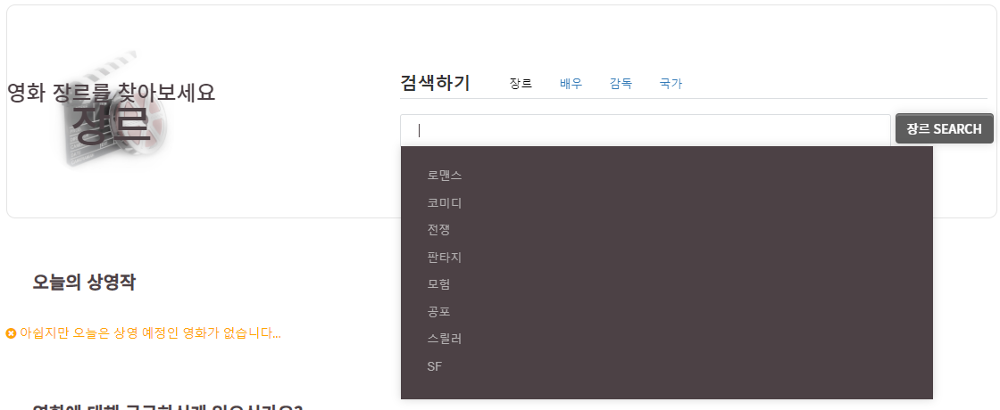

# 프로젝트 개발 내용 정리 

---

## 사용자 사이트

---

## 메인 Page

### 상단 슬라이드

- 영화관에서 필요한 규칙이나 현재 상영하고 있는 인기있는 영화들의 포스터와 영상을 이용해 손쉽게 흥미를 가질 수 있도록 구현했습니다. 

  <img src="../images/FinalProject/mainslide.png"

  <img src="../images/FinalProject/mainslide2.png"

### 평점 높은영화 순 정렬 6개. 

- 평점순으로 영화를 정렬하여 상위 6개의 영화를 추려 보여줍니다. 

  - 평점과 간단한 영화 정보를 볼 수 있으며 해당 포스터를 클릭했을 경우 해당 영화의 상세 페이지로 연결됩니다. 

- 반응형 웹이 적용되어있어 화면의 크기에 따라 보여지는 영화 포스터의 갯수와 형태가 달라집니다. 

- "오늘의 상영작 확인하러가기" 를 누르게되면 포커스가 "오늘 상영 영화"로 이동합니다. 

   모바일 말고 화면 줄이는것도 다른화면됨
- 오늘 사영 영화가 없는 경우 

  <img src="../images/FinalProject/main_schedul1.png"
- 오늘 상영영화가 있는 경우 

  <img src="../images/FinalProject/main_schedul2.png"
- 영화 상세 페이지 이동

  <img src="../images/FinalProject/main_schedul3.png"
- 반응형 웹 적용

  <img src="../images/FinalProject/main_schedul4.png"

  <img src="../images/FinalProject/main_schedul5.png"

### 영화에 대해 궁금한 것 검색

- google search를 통해 movie에 대한 정보를 검색합니다.

- 새창을 띄워 검색한 키워드를 google에 서치해줍니다.

  <img src="../images/FinalProject/main_googlesearch1.png"

  <img src="../images/FinalProject/main_googlesearch2.png"

## 영화  - 평점 랭킹 Page

### 영화 순위 정렬

- sql 문을 이용해 평점 랭킹 순으로 모든 영화를 정렬하여 정보를 가져옵니다.

- 영화를 클릭하면 해당 영화 detail 페이지로 넘어갈 수 있습니다.

   <img src="../images/FinalProject/reviewrank1.png"

### 페이징 기법 사용

- sql문의 limit을이용한 paging 기법을 통해 평점순으로 5개씩 나눠서 보여줍니다.

- 첫번째 페이지에서는 "이전" 버튼이 활성화되지 않도록 하였고, 마지막 페이지에서도 "다음" 버튼의 활성화를 막았습니다.

  <img src="../images/FinalProject/reviewrank2.png"

  <img src="../images/FinalProject/reviewrank3.png"

## 이벤트 - 쿠폰발급 Page

### 로그인 전

- 현재 날짜를 기준으로 진행중인 쿠폰만 볼 수 있도록 만들었다.

  - 쿠폰은 보기 쉽도록 할인 가격이 높은 순으로 정렬했다. 

- 쿠폰 발급을 누르면 모달을 이용해 "발급받겠습니까? " 를 물어보고 발급버튼을 누르면 로그인이 되어있는지 체크한다. 

  - 로그인이 되어있으면 해당 아이디로 쿠폰발급을 진행하고 만약 비로그인이라면 로그인을 할것인지 물어보는 모달창을 띄운다. 
  - 로그인 버튼을 누르면 로그인 페이지로 넘어가게 되고, 이때 **_request.getHeader("Referer")_**  를 이용하여 모든 페이지에서 로그인페이지로 들어갔을 경우 이전 페이지를 기억하여 돌아갈 수 있도록 구현했다. 

  <img src="../images/FinalProject/event_coupon1.png"

  <img src="../images/FinalProject/event_coupon2.png"

  <img src="../images/FinalProject/event_coupon3.png"

  <img src="../images/FinalProject/event_coupon4.png"

### 로그인 후 

- 로그인이 완료되면 "보유중 or 발급가능" 문구를 통해 로그인한 아이디에서 발급받을 수 있는 쿠폰을 직관적으로 구분할 수 있도록 제작하였다. 

  - 만약 보유중 쿠폰을 다시 발급받았다면 "발급실패" 모달을 통해 요청을 취소한다. "발급가능" 쿠폰을 클릭했을 경우 정상적으로 발급되고 "close " 버튼을 누르면 페이지를 리로드 시킨다. 

- 반응형 웹으로 제작했다. 

  <img src="../images/FinalProject/event_coupon5.png"

  <img src="../images/FinalProject/event_coupon6.png"

  <img src="../images/FinalProject/event_coupon7.png"

  <img src="../images/FinalProject/event_coupon8.png"

  

## 이벤트 - 포인트 적립 Page

### NCP OCR 

- 표를 현장발권했을 경우 추가적으로 적립할 수 있도록 영수증 적립 이벤트를 구현했다. 

- 해당 페이지에서는 NCP 에서 제공하는 CLOVE OCR 기능을 이용했다. 

  <img src="../images/FinalProject/ocr8.png"

  <img src="../images/FinalProject/ocr9.png"

  <img src="../images/FinalProject/ocr10.png"

  <img src="../images/FinalProject/ocr_recipt.png" width="200px" hight="500"

### 영수증 검사

- 영수증 검사 버튼을 눌러 OCR 기능을 이용해 업로드된 사진의 영수증 텍스트들을 인식하여 이용할 수 있는 영수증인지 판별한다. 

- 이때 판별이 끝나면 결과를 알려주는 텍스트로 자동 스크롤 되도록 구현하였다. 

- 이용할 수 있는 영수증이라면 적립가능하도록 하였고, 만약 조건에 맞지않는 영수증 ( 영수증 상단 이름, 발급일이 7일이상 지난 날짜) 이라면 적립버튼을 활성화 하지 않는다. 

  <img src="../images/FinalProject/ocr1.png"

  <img src="../images/FinalProject/ocr2.png"

  <img src="../images/FinalProject/ocr3.png"

  <img src="../images/FinalProject/ocr4.png"

  <img src="../images/FinalProject/ocr5.png"

  

### 포인트 지급 

- 만약 조건에 만족하는 영수증이라면 영수증 금액의 5% 를 포인트로 지급한다. 

- 또한 같은 영수증을 연속적으로 사용할 수 있는 문제를 방지하여 바코드 번호를 관리하는 테이블을 만들어 중복 적립을 피할 수 있다. 

  <img src="../images/FinalProject/ocr6.png"

  <img src="../images/FinalProject/ocr7.png"

## 로그인 - 플랫폼 로그인 Page

- 플랫폼 로그인 구현은 Spring boot 에서 제공하고 있는 OAuth2.0 기능을 이용했다. 
- Spring boot 에서 제공하는 OAuth 를 사용하여 각종 소셜 플랫폼에 등록되어있는 로그인 API 기능들을 이용하여 플랫폼 아이디로 로그인 할 수 있도록 만들었다. 
- OAuth 를 이용하면서 가장 어려움이 컸던것은 보안문제 였습니다. 보안으로 인해 8번의 과정을 거처 사용자 정보들을 받아올 수 있었다. 
- 자세한 내용은 [Spring boot OAuth 2.0 정리](https://github.com/wonyoung0207/Spring-boot-Security-OAuth-2.0) 이곳에서 볼 수 있다. 
- <img src="../images/FinalProject/login_social1.png"

---

## 어드민 메인 Page

- 관리자의 매출과 상관이 있는 오늘 사이트 방문자수와 오늘, 내일 개봉할 영화 수, 누적회원 수와 탈퇴 회원 수, 당일날 예매된 영화 수를 직관적으로 볼 수 있도록  수치화를 이용하여 간단하게 정보를 표시했다. 
- 먼저 chart 를 이용해 해당 페이지에 방문하는 사람 수를 통해 "7일간 방문한 사람수" 와 "누적 평균 방문 수" 를 볼 수 있는 그래프를 만들었습니다. 
- 당일 페이지 방문자 수는 cookie를 통해 집계하였고 데이터 베이스의 공간을 보다 효율적으로 사용할 수 있도록 mysql의 이벤트 스케쥴러를 이용하여 데이터를 관리하였습니다. 데이터는 하루마다 "당일 방문자 수" 를  "요일별 방문자 수 테이블 "로 저장하고 저장한 "당일 방문자 수 "는 초기화 될 수 있도록 하였습니다. 