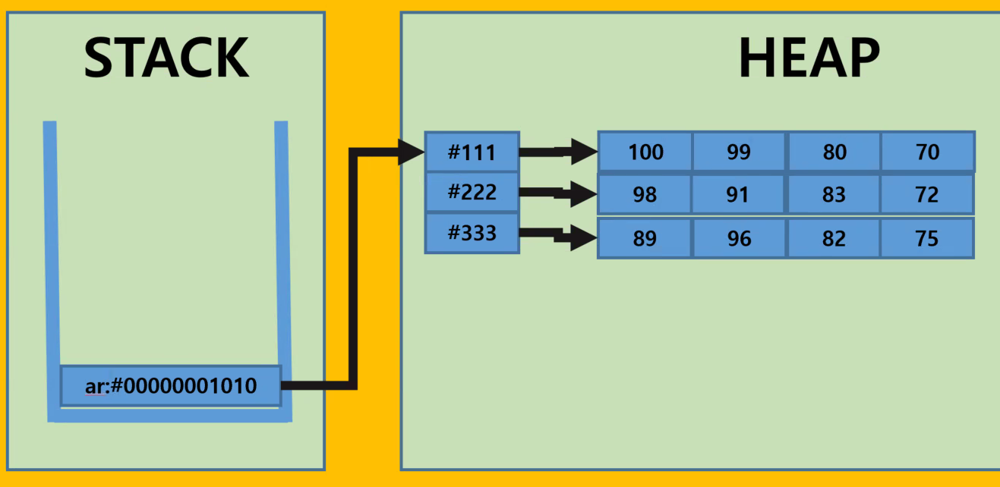

# 6일차

---

> 2차원 배열 저장구조에 대해 알아본다.
>
> 반복문과 조건문을 이용해 문제를 만들어본다. 

## 1. 2차원 배열 저장구조 

   + 2차원 배열은 1차원 배열이 합쳐진 구조이다. 
   + 따라서 2차원배열의 행만큼의 배열을 가진다. 
   + 2차원 배열의 **0번째 행이 시작 주소**가 되고, 그 주소를 **Stack 영역**에서 주소로 가진다. 

   

## 2. **내가 만든 문제**

   1. 예산을 입력하면 어떤 과일을 몇개 살수 있는지 알려주는 문제

      + 5개의 과일을 저장하고 있는 2차원 배열을 생성한다. 
      + 1개의 행 안에는 하나의 과일 정보가 들어간다. 
        + 0열 : 과일이름 ,   1열: 과일 가격
      + 예산을 입력받는다. 
      + 해당 예산으로 살수있는 과일의 이름과 갯수를 출력한다. 
      + 사고싶은과일을 입력받는다. 
      + 입력받은 과일로 살 수 있는 최대한의 갯수로 과일을 사고 거스름돈을 계산한다. 
   2. 랜덤한 숫자 1개를 5번의 기회로 찾기.

      + 1~99사이의 랜덤한 숫자 하나를 생성한다.
      + 사용자에게 값을 입력받는다. 
      + 값을 입력받는 횟수를 기록한다. 수 입력 기회는 총 5회로 5회를 넘어가면 게임이 종료된다.
      + 입력값과 랜덤값을 비교한다. 입력값이 랜덤값 보다 크면 DOWN을 출력하고 작을 시 UP을 출력한다.
      + 입력값과 랜덤값이 같을 시, 사용자의 입력 횟수와 "번 만에 숫자를 찾았습니다."를 출력한다.
   3. 로또 당첨
      + 1~45까지의 숫자중 중복되지 않은 6개의 숫자를 배열에 저장 출력한다.
      + 로또 맞출 숫자 6번 입력받는다.
        + 입력된 값은 중복시 다시 입력받는다. 
        + 범위에 벗어난 값은 다시 입력받는다.
      + count 변수 선언 -> 몇개 맞췃는지 
      + 1등은 6개, 2등은 5개, 3등은 4개, 4등은 3개 5등은 2개 6등은 1개 0개는 꽝
