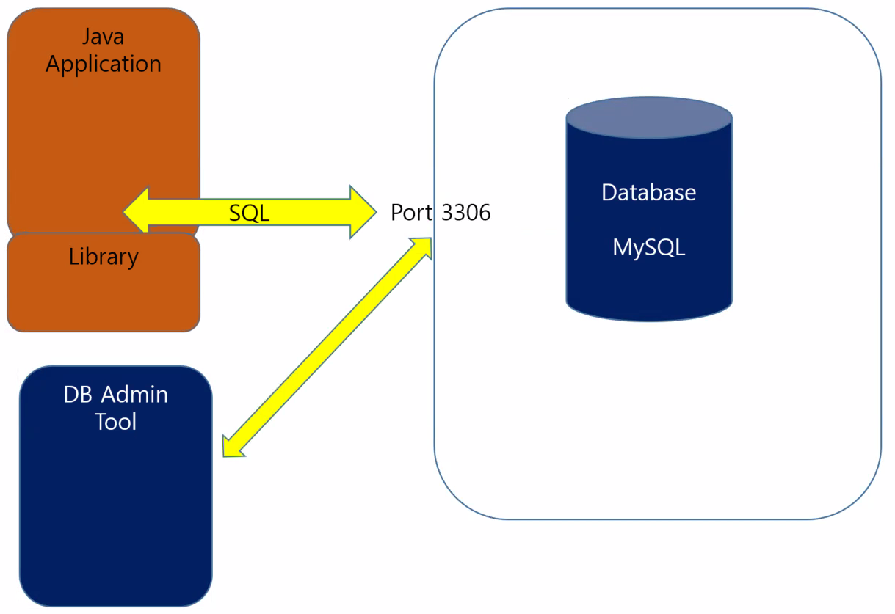

# 13일차

---

> 멀티 쓰레드에 대해 학습한다. 
>
> 쓰레드와 프로세스의 차이점을 알아본다. 
>
> 스레드를 3가지 방법으로 만들어본다. (상속, 인터페이스, 익명클래스 )


## 1. **프로세스**

   + **실행중인** 하나의 프로그램
     + 자바의 클래스를 실행시키면 하나의 프로세스가 된다. 
   + 프로그램을 실행시키면 프로세스가 된다. 

## 2. 멀티 프로세스

   + 두 가지 이상의 작업을 동시에 처리하는 것
   + 멀티 프로세스 vs 멀티 스레드
     1. 멀티 프로세스 
        + **독립적**으로 프로그램들을 실행하고 여러 가지 작업처리
        + 여러개의 프로세스가 모여 멀티 프로세스가 된다. 
     2. 멀티 스레드
        + 프로세스 안에서 동작되는 **여러가지 일 **
          + ex) 크롬의 다중 창 열기 
        + 하나의 클래스 안에 있는 메소드를 스레드라고 한다. 
        + 여러 스레드가 모여 멀티 스레드(프로세스) 가 된다. 

## 3. 프로세스와 스레드 차이

   1. **프로세스**는 실행한 프로그램으로 인터넷 창을 여러개 띄워 실행하는 것
      + 프로세스는 메모리를 차지한다. 

   2. **스레드**는 하나의 창 안에서 여러개의 브라우저를 띄운것

   + 따라서 여러개의 프로세스가 실행되면 컴퓨터는 느려진다.  
   + 느려지는 것을 해결하기 위해 **하나의 프로세스 안에 여러개의 스레드가 실행되는 구조**를 사용한다. 

## 4. 멀티 스레드 만드는 방법

   1. **상속**

      1. 클래스를 만든 후 Thread를 상속받는다. 

      2. **run()** 메소드를 구현한다. 

      3. 구현하기 위해서는 main에서 객체 생성 후 start() 메소드를 호출한다. 

         ```java
         MyThread1 t1 = new MyThread1();
         t1.start();
         ```

         

   2. **인터페이스**

      1. **Runnable** 인터페이스를 implements 한다.

      2. 실행하기 위해서는 main에서 객체 생성 후, **Thread 객체에 넣어 실행**해야한다. 

         ```java
         MyThread2 t2 = new MyThread2();
         Thread tt2 = new Thread(t2);
         tt2.start();
         ```

      + 메인 스레드에서 해당 스레드 객체를 만들고, 호출하여 실행한다. 
      + 이때, 메인스레드는 안에서 선언한 스레드가 끝날때까지 끝나지 않느다. 

   3. **익명 클래스** (많이 사용함 )

      ```java
      Thread t1 = new Thread(new Runnable() {//익명클래스를 이용해서 스레드 생성 
          public void run() {
          }
      });
      ```

      

## 5. MySQL 



   + **스키마 (데이터 베이스 )**

     + mysql안에 있는 커다란 공간으로, 데이터 베이스라고 한다. 
     + create schema ''이름''

   + 테이블

     + 스키마(데이터 베이스) 안에 특성별로 나눠놓은 것 
     + ex) 학생 테이블, 교수 테이블 => 테이블 안에는 해당 특성에 맞는 필드들이 존재한다

   + CRUD

     ```sql
     # SQL 문이 끝나면 꼭 ; 로 마감해야 한다. 
     CREATE TABLE ITEM(
     	id int PRIMARY KEY,
         name VARCHAR(30),
         price FLOAT 
     );
     # sql 문은 대소문자를 구분하지 않는다. 하지만 SQL 문은 대문자로 쓰는것이 규칙이다. 
     # 테이블 명은 소문자로 한다. 
     # 필드는 소문자로 작성한다. 
     
     # Create
     INSERT INTO CUST VALUES('id02',  'pwd02', '이말숙');
     
     # Read
     SELECT * FROM CUST;
     
     # Update
     UPDATE CUST SET pwd='1111', name='홍말숙' WHERE id='id01';
     # UPDATE CUST SET PWD='1111', name='홍말숙2' WHERE ID='id01'; # 같은 결과나옴 
     
     # Delete
     delete from cust where id='id02';
     
     ```

   + **PRIMARY KEY**

     + 테이블 안에서  특정 필드를 키를 지정하면 해당 필드의 값들은 중복될 수 없다. 

   + workbench 단축키

     + ctrl + shift + enter : 선택한 영역 실행 , 아무것도 선택안하면 전체실행됨
     + **ctrl + enter** : 커서 위치 쿼리를 실행 
     + ctrl + b : 보기 편하도록 줄을 변경 
     + ctrl + t : 새로운 쿼리 에디터 열기 

## 6. 자바와 Mysql 연결

   + 해당 프로젝트 속성 -> JRE 추가 ->  추가할 connector.jar 추가-> apply and close
   + url에 연결할 데이터베이스 이름을 써준다. 
   + String url = "jdbc:mysql://127.0.0.1:3306/shopdb";
   + 이해안되면 이클립스 -> JSP_Web 프로젝트 -> 기말 -> 13week -> dbconnect보기 
   + root로 접속 못하기 때문에 계정 하나 만들어야 함
     + mysql workbench ->  Administration -> user and privileges -> Adminstrative roles 에서 모두다 선택 -> 계정 생성 
     + mysql workbench -> connection -> edit connection -> userName변경 

   ```java
   package day13;
   
   import java.sql.Connection;
   import java.sql.DriverManager;
   import java.sql.PreparedStatement;
   import java.sql.SQLException;
   
   
   //String url = "jdbc:mysql://localhost:3306/JSPBookDB";
   ///* 사용할 jdbc의 diver를 가져올 주소와 프로토콜,사용할DB */
   //String user = "root";
   //String password = "0000";/* mysql 접속 패스워드 */
   //
   //Class.forName("com.mysql.jdbc.Driver");
   ///* JDBC 드라이버 로드. 이때 DriverManager 사용할 수 있게 됨 */
   //conn = DriverManager.getConnection(url,user,password);
   /* 데이터베이스 연결 */
   
   public class UpdateCust {
   	public static void main(String[] args) {
   		//JDBC (Java Database Connectivity) Program
   		
   		// 1. 변수선언
           
   		Connection con = null;//어떤 데이터베이스에 접속할 건지 
   		PreparedStatement ps = null;// SQL 문을 날릴때 사용 
   		String sql = "UPDATE CUST SET pwd=?, name=? WHERE id=?";//sql 문장이 들어갈 변수 
   		
   		// 2. MySQL JDBC Driver Loading
           
   		// 사용할 라이브러리 가져오기 
   		try {
   //			Class.forName("com.mysql.jdbc.Driver");//.jar 파일 안의 driver 클래스를 올린다. 
   			Class.forName("com.mysql.cj.jdbc.Driver");
   			System.out.println("Mysql JDBC Driver Loading....");
   		} catch (ClassNotFoundException e) {
   			//컴퓨터 내에서 파일을 삭제했을 경우, 해당 드라이버를 찾을 수 없기때문에
   			e.printStackTrace();
   		}
   		
   		
   		// 3. MySQL Connect
           
   		//mysql에 접속할 때 필요한 id와 비밀번호 
   		// root , 0000
   //		String url = "jdbc:mysql://localhost:3306/shopdb?serverTimezone=Asia/Seoul";//"jdbc:mysql://192.168.0.8";
   //		String url = "jdbc:mysql://192.168.0.8:3306/shopdb?serverTimezone=Asia/Seoul";
   		//127.0.0.1 이 내 컴퓨터의 아이피이다.
   		
   		String url = "jdbc:mysql://192.168.0.8:3306/shopdb?serverTimezone=Asia/Seoul";
   		String mid = "admin1";//root로는 접속이 안된다. -> 사용자를 만들어줘야한다. 
   		String mpwd = "0000";
   		
   		try {
   			con = DriverManager.getConnection(url,mid,mpwd);
   			System.out.println("Mysql Server Connected...");
   		} catch (SQLException e) {
   			e.printStackTrace();
   		}
   		
   		
   		// 4. SQL 을 이용한 요청	
   		try {
   			ps = con.prepareStatement(sql);
   			//sql 변수의 ? 에 순차적으로 들어간다. 
   			ps.setString(1, "1111");//0이 아닌 1부터 시작한다. 
   			ps.setString(2, "정말숙");
   			ps.setString(3, "id11");
   			
   			// 5. 요청 결과를 확인
   			int result = ps.executeUpdate();
               //int result = ps.executeUpdate();
               //테이블을 변경하고자 할때는 executeUpdate 사용
   			//ResultSet rs = ps.executeQuery();//테이블을 가져오기만 할 경우 executeQuery()
   			//rs.next();//query 사용시 한칸을 이동하고 꺼내야 한다. 
               	
   			System.out.println(result);//몇개가 업데이트 되는지 출력 
   			
   		} catch (SQLException e) {
   			e.printStackTrace();
   		}finally {//무조건 실행되는 구간
   			//6. MySQL Close
   			//사용하고 나면 꼭 close로 닫아줘야 한다. 
   			if(ps != null ) {
   				try {
   					ps.close();
   				} catch (SQLException e) {
   					e.printStackTrace();
   				}
   			}
   			if(con != null) {
   				try {
   					con.close();
   				} catch (SQLException e) {
   					e.printStackTrace();
   				}
   			}
   		}
   	}
   
   }
   
   ```
