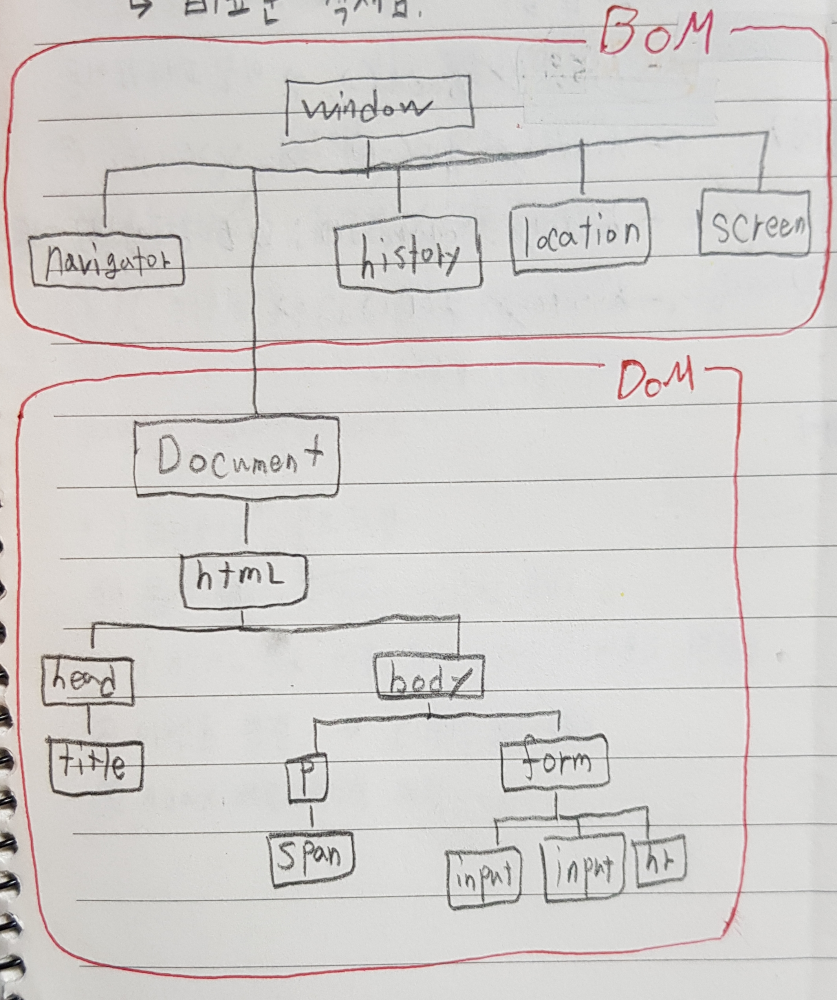
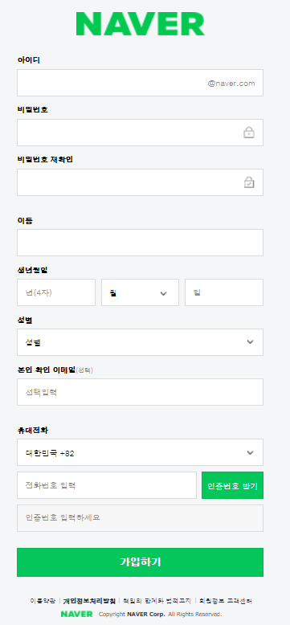
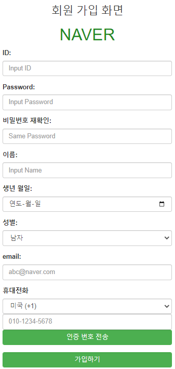
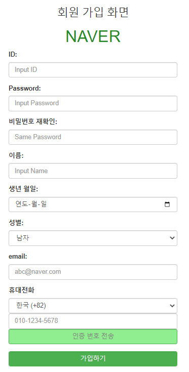

# 26일차

------

> DOM 에 대해 학습한다. 
>
> BOM 에 대해 학습한다. 
>
> JQuery 에대해 학습한다. 

## 1. DOM

   1. ### DOM 이란?
      
      1. **HTML 문서에 사용되는 태그들을 DOM 이라고 한다. **
      2. **트리구조**로 이루어저 있다. 
      3. 정의
         1. W3C에서 제정한 문서 표준이다. 
         2. 프로그램 및 스크립트를 동적으로 액세스하여 문서의 콘텐트, 구조 및 스타일을 갱신 할 수 있도록 플랫폼 및 언어 중립 인터페이스이다. 
         3. DOM() 은 문서를 액세스 하기 위한 표준을 정의한다. 
      4. **즉, HTML DOM은 웹 브라우져를 위한 문서 표준이며, HTML을 위한 프로그램 인터페이스다.**
   2. ### 종류
      
      1. Document 
         - 가장 상위
      2. html
      3. head body 등...
   3. ### 구성요소
   4. ### this 키워드
      
      1. 객체 자신을 가리키는 자바스크립트 키워드
      2. DOM 객체에서 자신을 가리키는 용도로 사용 
   5. ### HTML 페이지 로딩 과정
      
      1. 브라우저가 HTML 페이지 로드 전 빈 상태의 document 생성
      2. 브라우저가 html 페이지를 위에서 아래로 해석
      3. html 태그들을 document 객체에 담아 간다. 
      4. \<html> 태그 만나면 document 객체를 완성하고 닫는다. 

## 2. BOM

   1. ### BOM이란?
      
      1. **브라우저를 제어하기 위해 지원되는 객체 **
      2. JavaScript를 통해 Brower에서 제공하는 기능을 제어하는 방법을 제공
      3. 즉,**보안상 위험한 Brower  기능들을 다루기 위해 사용**되는 것
   2. ### 종류
      
      1. window
         - Brower 창 정보를 사용 할 수 있다. 
      2. screen
         - 현재 시스템의 화면 정보를 사용 할 수 있다. 
      3. location
         - URL 정보를 사용할 수 있다. 
      4. navigator
         - 웹 브라우저 정보를 사용할 수 있다. 
      5. popup
         - 다양한 popup box를 제공한다. 
      6. timing
         - 다양한 Timer를 사용할 수 있다. 
   3. 

## 3. JQuery

   1. ### Jquery란?

      1. 모든 브라우저에서 동작하는 자바스크립트 라이브러리이다. 

      2. 파일 확장자는 '.js' 이다. 

      3. ```javascript
         $('h1').css('color','red');
         $('h1').css({'color','red'},{'background','blue'});
         //형식으로 사용된다. 
         ```

   2. ### 기능

      1. 문서 객체에 **속성** 추가 및 제거

         - 태그의 속성을 추가 및 제거할 수 있다. 

         1. 추가
            - $('h1').attr(width, 200)
            
            - ```javascript
              /* 내용을 고치지 못한다. */
              $('#name').attr('disabled', 'disabled')
              
              
              $('form').attr({
                  'action':'/registerimpl',
                  'method':'get'
              });
              
              
              // checkbox 와 radio , selelct 의 초기선택값을 지정함 
              $('input[name="ch"]:checkbox[value="op3"]').val('op3').attr('checked', true);
              
              $('input[name="optradio"]:radio[value="op3"]').val('op2').attr('checked',true);
              
              $('#sel').val('2').attr('selected','selected');
              ```
            
         2. 제거
            - $('h1').removeattr('width')

      2. 문서 객체에 클래스 추가 및 제거

         - 태그에 클래스를 추가 및 제거할 수 있다. 

         1. 추가
            1. $('h1').addClass('item')
         2. 제거
            - $('h1').removeClass('select')

      3. 스타일 

         1. $('h1').css( 'color','red')

      4. 객체 내부( context ) 

         - html() VS text() 

           1. html()
              - $('h1').html('\<h1> 내용추가 \</h1>');
              - 태그 이름 인식

           1. text()
              - $('h1').text('내용추가');
              - 태그 이름 인식 불가 

   3. ### 메소드

      1. on
         - 이벤트를 이벤트 리스너로 적용되게 함
         - $('h1').on( 'click', function(){});
      2. hover
         - 마우스 over와 out 시 동작을 설정
         - $('h1').hover( fun1, fun2);
           - fun1은 마우스가 올라갔을 경우 실행 
           - fun2는 마우스가 내려갔을 경우 실행 
      3. off
         - 이벤트 연결 제거
         - $('h1').off() ;
      4. context
         - 태그가 적용하는 범위를 한정시킴 
      5. trigger
         - 이벤트를 강제로 발생 
      6. submit
         - 입력된 값을 무조건 url 상에 담아 전달 

   4. ### innerHTML  과  val()차이

      1. innerHTML 
         - 태그 내에 포함된 text의 내용을 뜻한다. 
      2. val()
         - form에서 입력된 값을 뜻한다. 

## 4. Project

1. ### 기능 설명

   1. BootStrap을 이용해 회원가입 화면을  만들어 본다. 
   2. 네이버 회원가입 화면과 최대한 똑같이 만든 후 나만의 스타일로 꾸며본다. 

2. ### 사용한 기능

   1. BootStrap 에서 사용하는 class 와 col-sm-x 로 너비 맞추기 
      1. col-sm-3 : 화면의 가로를 12로 나눈 것 중 3칸의 너비로 설정
      2. form-control , form-group 클래스를 이용해 콘텐츠 묶기 
   2. input
      1. text
      2. password
      3. date
      4. email
      5. select
   3. placeholder 와 button animation 적용

3. ### 코드

   1. ```html
      <style>
      #div_logo{
      	text-align:center;
      	
      }
      #logo{
      	color: #228B22;
      }
      
      #mybtn{
      	background: #4CAF50;
      	color : white;	
      	border : 2px solid #4CAF50; 
      	transition-duration : 0.4s;
       	text-decoration: none;
      }
      
      #mybtn:hover{
      	background : lightgreen;
      	color : gray;
      }
      
      </style>
      
      <h1>Jq04 </h1>
      <p> Jq04의 내용을 불러옵니다. .</p>
      <hr>
      
      <div class="container col-sm-3">
      
      </div>
      <div class="container col-sm-6">
      <div id="div_logo">
      <h3>회원 가입 화면 </h3>
      <h1><div id="logo">NAVER</div></h1>
      </div>
      <form>
      	<div class="form-group">
      		<label for="name">ID:</label>
      		<input type="text" class="form-control" name="id" id="id" placeholder="Input ID">
      	</div>
      	
      	<div class="form-group">
      		<label for="pwd">Password:</label>
      		<input type="password" class="form-control"  name="pwd" id="pwd" placeholder="Input Password">
      	</div>
      	
      	<div class="form-group">
      		<label for="samepwd">비밀번호 재확인:</label>
      		<input type="password" class="form-control"  name="samePwd" id="samePwd" placeholder="Same Password">
      	</div>
      	
      	<div class="form-group">
      		<label for="name">이름:</label>
      		<input type="text" class="form-control"  name="name" id="name" placeholder="Input Name">
      	</div>
      	
      	<div class="form-group">
      		<label for="birthday">생년 월일:</label>
      		<input type="date" class="form-control"  id="birthday" name="birthday">
      	</div>
      	
      	<div class="form-group">	
      		<label for="gender">성별:</label>
      		<select name="gender"  class="form-control" >
      			<option value="남자"> 남자 </option>
      			<option value="여자"> 여자 </option>
      		</select>
      	</div>
      	
      	<div class="form-group">
      		<label for="email" >email:</label>
      		<input type="email" class="form-control"  name="email" id="email" placeholder="abc@naver.com">
      	</div>
      	
      	<div class="form-group">
      		<label for="contry">휴대전화 </label>
      		<select name="contry" class="form-control" >
      			<option value="+82"> 한국 (+82) </option>
      			<option value="+1"> 미국 (+1) </option>	
      		</select>
      		<input type="tel" name="telphone" id="telphone"  class="form-control" placeholder="010-1234-5678" >
      		<button onclick="" class="form-control" id="mybtn"> 인증 번호 전송 </button>
      	</div>
      	
      	<div class="form-group">
      	<button onclick="" class="form-control" id="mybtn"> 가입하기 </button>
      	</div>
      	
      </form>
      </div>
      ```

4. ### 결과물

   1. | 네이버 회원가입 화면      |   |
      | :------------------------ | ------------------------------------------- |
      | 내가 만든 회원가입 화면 1 |  |
      | 내가 만든 회원가입 화면 2 |  |
