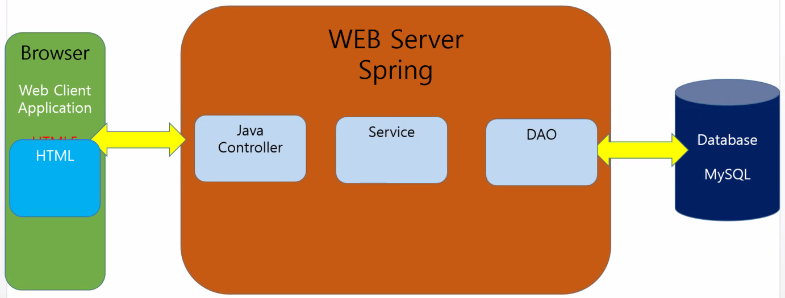
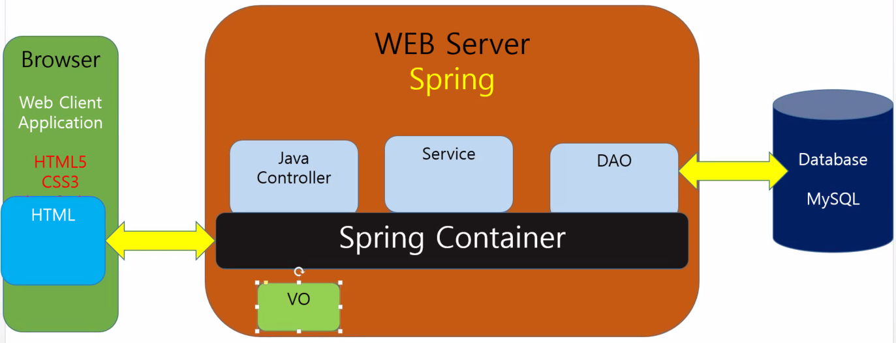

# 32일차

------

> 배운 내용을 정리해보고 추후에 배울 내용에 대해 인지한다. 
>
> Spring 의 개념인 IOC, DI , AOP 에 대해 배워본다.
>
> code : 01.02

## 1. 배운 내용 정리 or 배울 내용 추가 

   1. ### 배운 내용 

      1.  브라우저가 특정 URL 요청
        
      2. 요청한 정보를 WEB Server Spring 의 Java Controller에서 인식

      3. 알맞은 View(thymeleaf) 를 호출 

      4. thymeleaf 파일을 html파일로 변환하여 브라우저에 보냄 

      5. 

      6. 역할

         1. controller : 요청을 받아서 **일을 처리**
         2. dao : 실제로 프로그램에서 만들어진 데이터를 SQL 문을 이용해서 CRUD가 일어나 database에 **데이터를 요청 **

         - 따라서 한곳에 에러가 생기면 모든곳에서 이상이 생긴다. 

   2. ### 배울 내용 ( 서버 프로그램 구축 )

      1. **_Spring Container 에게 브라우저가 요청을 하면 필요한 클래스 ( Java Controller, Service, DAO ) 를 사용할 수 있게 만들어 준다._** 
         - 그로 인해 클래스간 **결합이 독립적**이게 된다. 
      2. **Spring 애노테이션**의 의미를 배운다. 
      3. Service를 통해 DAO를 이용해 DataBase에 데이터를 요청하고 가공해 사용한다. 
         - Java Controller는 받는 역할, Service는 주는 역할을 주로 하게된다. 
      4. 클래스간 **결합**이 높으면 하나의 클래스가 변경되었을 때 모든 클래스가 영향을 받는다. 
         1. 이것을 '디펜던시( 클래스가 다른 클래스를 무조건적으로 필요로 하는 것 ) '라고 한다.  
         2. 따라서 이 **결합도**를 낮추기 위해 **Spring** 을 사용하게 된다. 
      5. 

## 2. Spring 프레임워크 

   1. ### 프레임워크 정의

      - 어떤 것을 구성하는 구조 또는 뼈대
      - 기능을 미리 클래스나 인터페이스 등으로 만들어 제공하는 반제품

   2. ### 스프링 프레임워크

      - 프레임워크 중 가장 많이 사용
      - 자바 웹 애플리케이션 개발을 위한 오픈 소스 프레임워크
      - 경량형 프레임워크이다. 
      - 경량 컨테이너 라고도 한다. ( 컨테이너 = 톰캣 (서블릿 컨테이너))

   3. ### 스프링 특징

      1. **객체를 외부에서 생성한다. **

      2. 배우기 쉽고 경량 컨테이너의 기능을 수행

      3. **제어 역행 (IOC : Inversion of Control) **기술을 이용해 애플리케이션 간의 느슨한 결합을 제어
         - 프로그램의 흐름을 개발자가 아닌 프레임워크가 주도한다. 
         
      4. **의존성 주입 ( DI : Dependency Injection ) **

         - 방법 2가지 

         1. XML DI

            1. Spring이 객체간의 의존성을 부여한다. 
            2. 객체 스스로가 의존 객체를 생성 
            3. 모듈간 결합도를 낮춰 재사용성을 높임 

         2. Annotation DI

            1. 자동으로 스캔해서 해당하는 이름으로 넣어서 동작시킨다. 

               ```xml
               <context:component-scan base-package="com.*"/><!--com. 밑에 모든것을 자동으로 스캔   -->
               ```

               ```java
               @org.springframework.stereotype.Service("pservice")
               public class ProductService implements Service<Integer, ProductVO>{
                   @Autowired
               	Dao<Integer,ProductVO> dao;//자동으로 dao를 검색해서 가져와라 . 
               }
               
               @Repository("pdao")
               public class ProductDao implements Dao<Integer, ProductVO> {
                   @Override
               	public void register(ProductVO v) {
               		dao.insert(v);
               	}
               }
               ```

      5. **관점 지향 (AOP : Aspect-Oriented Programming)** 기능을 지원

         - 애플리케이션 개발에서 비즈니스 로직과 시스템 서비스를 분리하여 개발 
   - 개발자는 비즈니스 로직만을 구성하면 됨 
     
      6. POJO 방식 프레임워크 

   4. ### 장점

      1. 개발 용이성
      2. 시스템 복잡도 감소
      3. 이식성
      4. 품질보증
      5. 변경 용이성
      6. 개발코드의 최소화
      7. 설계와 코드의 재사용성

   5. ### 동작

      1. DAO 는 CRUD를 전담한다. -> DB와 상호작용

      2. Controller 는 화면상 사용자가 호출하는 기능을 담는다. 

         ```java
         //1. controller -> 사용자가 제어하지 않고 spring 안에서 제어가 되게 한다. 
         // service 는 dao로 부터 받은 데이터를 전달하는 역할을 하고 ( 메소드 )
         // Dao는 데이터 베이스와 상호작용해 데이터를 가져오는 역할을 한다. 
         public class Controller {
         
         	public static void main(String[] args) {
         		System.out.println("Spring Start ..");
         		
         		//Spring 환경이 만들어진다. 
         		ApplicationContext factory =
         		new ClassPathXmlApplicationContext("spring.xml");
         		System.out.println("Spring End ..");
         		
         		//IOC (Inversion Of Control) 제어 역행  -> 원래 방향은 ( Service s = new UserService())
                 // Spring이 객체를 생성해서 나에게 제공한다. 
         		//XML 파일을 이용해 객체를 생성 -> 생성하며 DI 의존성 주입이 일어난다. 
         		Service service = (Service) factory.getBean("userivce");
         		
         		
         		UserVO user = new UserVO("id01", "pwd01", "lee");
         		service.register(user);
         	}
         }
         
         
         // 2. UserService => XML 파일을 통해 dao객체에 DI 가 일어났고, UserService 객체를 통해 dao 데이터를 전달할 수 있다. 
         // IOC가 일어나며 객체간 연관관계를 주입해준다. 
         public class UserService implements Service<String,UserVO>{
         	Dao<String, UserVO> dao;
             //DI 의존성 주입이 일어난 객체 -> XML 파일에서 UserDao 의 객체를 'name = dao' 로보내서 이곳에서 받는다.
         	
         	//실제 객체를 생성하지 않고 spring을 이용해 객체를 주입한다. 
             
         }
         ```

         ```xml
         <!--3. Spring -->
         <!-- uservice 객체에 user.UserService 객체를 넣어준다. -->
         <!-- DI (Dependency Injection) : 의존성 주입 -->
         <!-- 실제 객체를 생성하지 않고 spring을 이용해 객체를 주입한다. -->
         <!-- uservice가 UserDao 을 필요로 해서 Spring이 해당 내용을 주입해준다 -->
         <bean id="userivce" class="com.multi.user.UserService">
             <property name="dao" ref="udao"></property><!-- 값으로 dao 변수에 udao의 값을 넣어 전달   -->
         </bean>
         <bean id="udao" class="com.multi.user.UserDao"></bean>
         ```

   6. ### 언어 특징

      1. DAO : SQL 언어로 데이터 베이스에서 데이터를 다룸
      2. Service : 데이터를 전달하는 역할을 함 

   7. ### DI의 주 목적

      1. 원본은 그래도 두고 **XML 문서의 내용만 변경해서 사용**할 수 있게 한다. 
      2. **객체간의 연관을 만드는 행위가 DI의 기본**이다. 
      3. **따라서 객체의 생성을 사용자가 하지 않고 Spring을 통해 객체를 생성함으로써 의존성을 만든다. **

   8. ### IOC의 주 목적

      1. **제어의 역전**으로, 사용자가 매개변수로 받은 값으로 객체를 생성하는 것이 아닌 "**메타 데이터 파일(XML, 자바 애너테이션**)" 을 이용해 **\<bean> 태그**로 객체를 생성한다. 

   9. ### 빈(bean)

         1. 애플리케이션에 존재하는 객체
         2. **new 라는 키워드를 사용하지 않고, XML 파일을 이용해서 객체를 생성**하는 방법
         3. 여러가지 방법으로 빈(객체) 을 XML 파일을 통해 만들 수 있다. (컴파일 하지 않아도 바뀐값을 바로 적용시킬수 있다. )

   10. ### Spring 환경 구축

   10. java Project 생성

 2. 해당 프로젝트에서 마우스 오른쪽 -> 

          1. Spring -> Add Spring Project Nature : 해당 프로젝트를 Spring 으로 이용한다고 선언
          2. Configure ->  Convert To Maven Project : Spring에 필용한 외부 라이브러리를 Maven을 이용해 가져온다. 

 3. pom.xml 파일에 해당 내용 추가 

       ```xml
       <!-- 버전을 선언하는 곳 -->
                	<properties>
                		<java-version>1.8</java-version>
                		<org.springframework-version>4.2.5.RELEASE</org.springframework-version>
                		<org.aspectj-version>1.6.5</org.aspectj-version>
                		<org.slf4j-version>1.7.18</org.slf4j-version>
                	</properties>
                       	<dependencies>
                       		<!-- Spring -->
                       		<dependency>
                       			<groupId>org.springframework</groupId>
                       			<artifactId>spring-context</artifactId>
                       			<version>${org.springframework-version}</version>
                       			<exclusions>
                       				<!-- Exclude Commons Logging in favor of SLF4j -->
                       				<exclusion>
                       					<groupId>commons-logging</groupId>
                       					<artifactId>commons-logging</artifactId>
                       				</exclusion>
                       			</exclusions>
                       		</dependency>
                       		<dependency>
                       			<groupId>org.springframework</groupId>
                       			<artifactId>spring-webmvc</artifactId>
                       			<version>${org.springframework-version}</version>
                       		</dependency>
                       		<dependency>
                       			<groupId>org.springframework</groupId>
                       			<artifactId>spring-aop</artifactId>
                       			<version>${org.springframework-version}</version>
                       		</dependency>
                       		<dependency>
                       			<groupId>org.springframework</groupId>
                       			<artifactId>spring-beans</artifactId>
                       			<version>${org.springframework-version}</version>
                       		</dependency>
                       		<dependency>
                       			<groupId>org.springframework</groupId>
                       			<artifactId>spring-core</artifactId>
                       			<version>${org.springframework-version}</version>
                       		</dependency>
                       		<dependency>
                       			<groupId>org.springframework</groupId>
                       			<artifactId>spring-expression</artifactId>
                       			<version>${org.springframework-version}</version>
                       		</dependency>
                       		<dependency>
                       			<groupId>org.springframework</groupId>
                       			<artifactId>spring-jdbc</artifactId>
                       			<version>${org.springframework-version}</version>
                       		</dependency>
                       		<dependency>
                       			<groupId>org.springframework</groupId>
                       			<artifactId>spring-messaging</artifactId>
                       			<version>${org.springframework-version}</version>
                       		</dependency>
                       		<dependency>
                       			<groupId>org.springframework</groupId>
                       			<artifactId>spring-tx</artifactId>
                       			<version>${org.springframework-version}</version>
                       		</dependency>
                       		<!-- AspectJ -->
                       		<dependency>
                       			<groupId>org.aspectj</groupId>
                       			<artifactId>aspectjrt</artifactId>
                       			<version>${org.aspectj-version}</version>
                       		</dependency>
                                               		<dependency>
                       			<groupId>org.aspectj</groupId>
                       			<artifactId>aspectjtools</artifactId>
                       			<version>${org.aspectj-version}</version>
                       		</dependency>
                       
                       		<dependency>
                       			<groupId>org.aspectj</groupId>
                       			<artifactId>aspectjweaver</artifactId>
                       			<version>${org.aspectj-version}</version>
                       		</dependency>
                                               		<!-- Logging -->
                       		<dependency>
                       			<groupId>org.slf4j</groupId>
                       			<artifactId>slf4j-api</artifactId>
                       			<version>${org.slf4j-version}</version>
                       		</dependency>
                       		<dependency>
                       			<groupId>org.slf4j</groupId>
                       			<artifactId>jcl-over-slf4j</artifactId>
                       			<version>${org.slf4j-version}</version>
                       			<scope>runtime</scope>
                       		</dependency>
                       		<dependency>
                       			<groupId>org.slf4j</groupId>
                       			<artifactId>slf4j-log4j12</artifactId>
                       			<version>${org.slf4j-version}</version>
                       		</dependency>
                       		<dependency>
                       			<groupId>log4j</groupId>
                       			<artifactId>log4j</artifactId>
                       			<version>1.2.15</version>
                       			<exclusions>
                       				<exclusion>
                       					<groupId>javax.mail</groupId>
                       					<artifactId>mail</artifactId>
                       				</exclusion>
                       				<exclusion>
                       					<groupId>javax.jms</groupId>
                       					<artifactId>jms</artifactId>
                       				</exclusion>
                       				<exclusion>
                       					<groupId>com.sun.jdmk</groupId>
                       					<artifactId>jmxtools</artifactId>
                       				</exclusion>
                       				<exclusion>
                       					<groupId>com.sun.jmx</groupId>
                       					<artifactId>jmxri</artifactId>
                       				</exclusion>
                       			</exclusions>
                       			<scope>runtime</scope>
                       		</dependency>
                       
                       		<!-- @Inject -->
                       		<dependency>
                       			<groupId>javax.inject</groupId>
                       			<artifactId>javax.inject</artifactId>
                       			<version>1</version>
                       		</dependency>
                       
                       		<!-- Servlet -->
                       		<dependency>
                       			<groupId>javax.servlet</groupId>
                       			<artifactId>javax.servlet-api</artifactId>
                       			<version>3.0.1</version>
                       			<scope>provided</scope>
                       		</dependency>
                       		<dependency>
                       			<groupId>javax.servlet</groupId>
                       			<artifactId>jstl</artifactId>
                       			<version>1.2</version>
                       		</dependency>
                       		<!-- Tiles3 -->
                       		<dependency>
                       			<groupId>org.apache.tiles</groupId>
                       			<artifactId>tiles-core</artifactId>
                       			<version>3.0.3</version>
                       		</dependency>
                       		<dependency>
                       			<groupId>org.apache.tiles</groupId>
                       			<artifactId>tiles-extras</artifactId>
                       			<version>3.0.3</version>
                       		</dependency>
                       
                       		<!-- MyBatis -->
                       		<dependency>
                       			<groupId>org.mybatis</groupId>
                       			<artifactId>mybatis</artifactId>
                       			<version>3.2.3</version>
                       		</dependency>
                       
                       		<dependency>
                       			<groupId>org.mybatis</groupId>
                       			<artifactId>mybatis-spring</artifactId>
                       			<version>1.2.2</version>
                       		</dependency>
                       		<!-- DBCP -->
                       
                       		<dependency>
                       			<groupId>commons-dbcp</groupId>
                       			<artifactId>commons-dbcp</artifactId>
                       			<version>1.2.2</version>
                       		</dependency>
                       		<!-- <dependency> <groupId>com.oracle</groupId> <artifactId>ojdbc6</artifactId> 
                       			<version>11.2.0</version> </dependency> -->
                       		<!-- AOP Alliance -->
                       		<!-- Test -->
                       		<dependency>
                       			<groupId>junit</groupId>
                       			<artifactId>junit</artifactId>
                       			<version>4.7</version>
                       			<scope>test</scope>
                       		</dependency>
                       		<dependency>
                       			<groupId>commons-fileupload</groupId>
                       			<artifactId>commons-fileupload</artifactId>
                       			<version>1.3.1</version>
                       		</dependency>
                       
                       		<dependency>
                       			<groupId>org.springframework</groupId>
                       			<artifactId>spring-jms</artifactId>
                       			<version>4.2.5.RELEASE</version>
                       		</dependency>
                       
                       		<dependency>
                       			<groupId>aopalliance</groupId>
                       			<artifactId>aopalliance</artifactId>
                       			<version>1.0</version>
                       		</dependency>
                       		<dependency>
                       			<groupId>cglib</groupId>
                       			<artifactId>cglib</artifactId>
                       			<version>2.2</version>
                       		</dependency>
                       		<!-- json request -->
                       		<dependency>
                       			<groupId>com.fasterxml.jackson.core</groupId>
                       			<artifactId>jackson-databind</artifactId>
                       			<version>2.3.3</version>
                       		</dependency>
                       		<dependency>
                       			<groupId>org.codehaus.jackson</groupId>
                       			<artifactId>jackson-mapper-asl</artifactId>
                       			<version>1.9.11</version>
                       		</dependency>
                       		<dependency>
                       			<groupId>taglibs</groupId>
                       			<artifactId>standard</artifactId>
                       			<version>1.1.2</version>
                       		</dependency>
                       
                       		<dependency>
                       			<groupId>com.googlecode.json-simple</groupId>
                       			<artifactId>json-simple</artifactId>
                       			<version>1.1</version>
                       		</dependency>
                       	</dependencies>
       ```

