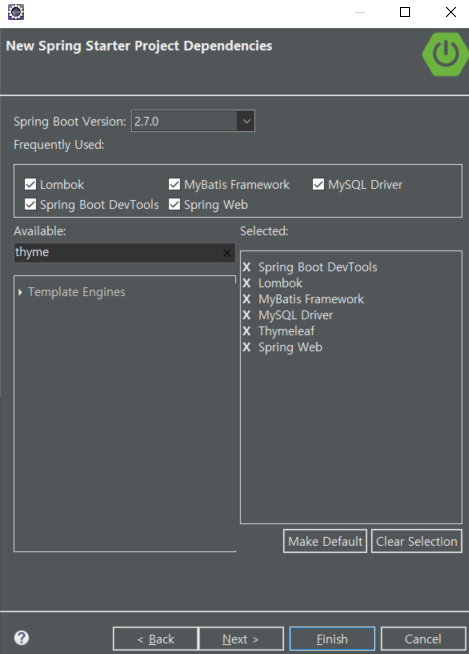

# 35일차

------

> Spring Boot 환경에서 Spring Framework와 MyBatis 이용해 Database에 CRUD를 해본다. 

# 전날 내용 복습

1. ItemDB 이용
   - searchPrice()
     - 매개변수가 2개이기 때문에 Map<Key, Value> 의 형태로 넘겨준다. 
   - searchDate()
     - 매개변수로 Date를 넣어줘도 되지만 Date 캘린더에서 날짜 선택하면 해당 날짜는 String 이다. 따라서 String으로 넘겨주고 SQL에서 변환해도 된다. 

# Join 이용

1. day03-3 내용
   - Join을 사용하게 되면 필드명이 겹칠수 있다. 따라서 SQL로 정보를 가져올때 AS name 형식으로 필드명을 변경해서 VO 객체에 만들어놓은 필드에 저장할수 있다. 

# Spring Boot, Spring Framework, Mybatis 연동

1. ## 연동 방법

   1. [Spring Boot 설정 정리본](https://cafe.naver.com/2022webservice)

   2. Spring Boot Project 생성

      1. 

   3. pom.xml에 필요한 \<dependency> 추가

   4. resource 에있는 **application.properties** 에 **포트 설정** 및 **DataBase 정보 설정 **

      - ```properties
        server.port=80
        
        # 연결할 database 정보
        spring.datasource.driverClassName=com.mysql.cj.jdbc.Driver
        spring.datasource.url=jdbc:mysql://127.0.0.1:3306/shopdb?serverTimezone=Asia/Seoul
        
        # database 비번 정보
        spring.datasource.username=admin1
        spring.datasource.password=0000
        
        # vo 설정하는 것
        mybatis.type-aliases-package=com.multi.vo
        
        # mapper 설정하는 것 
        mybatis.mapper-locations=com/multi/mybatis/*.xml
        ```

   5. html 파일들은 templates 안에 구현한다. 

      - html 파일들을 이용해 url을 변경하여 controller 에 설정되어있는 url을 호출한다. 

   6. Controller는 src/main/java 밑에 패키지로 구현한다. 

   7. **File 구조**

      

      - com.multi.biz : Service를 구현하는 패키지이다. 
      - com.multi.controller : html 파일로부터 특정 url 이 호출되었을 경우 찾는 곳이다. 
      - com.multi.frame : 뼈대를 구성하며, Service의 뼈대가 들어간다. 
      - com.multi.mapper : mybatis를 이용해 database와 연결하기 위한 mapper 인터페이스가 들어간다. 
      - com.multi.mybatis : mybatis를 사용하는 곳으로, sql문을 이용해 database로 접근한다. 
      - com.multi.vo : 데이터의 형태를 저장하는 곳으로, 객체의 틀이 저장된다. 

2. ## Lombok

   1. .jar 패키지의 일종이다. ( lombok.jar )

      - Error

        - 발생 이유 : .jar 패키지를 읽지 못할경우 발생

        1. 방법1
           1. eclipse.exe 가 있는 폴더 밑에 lombok.jar 를 넣는다. 
           2. eclipse.ini 가장밑에 "-javaagent:C:\eclipse\lombok.jar" 을 추가한다. 
           3. 이클립스 재가동 후 "해당 Project 마우스 오른쪽 -> Maven -> update Project " 을 한다. 
        2. 방법2
           1. .jar 파일을 인식하지 못하면 연결프로그램을 java.exe 로 연결해야 한다. 
           2. 연결이 안되면 cmd 에서 java -jar 로 해당 파일을 실행한다. 
              - java -jar C:\eclipse\lombok.jar

   2. 애노테이션으로 객체의 생성자, getter, setter, toString 같은 것들을 손쉽게 사용할 수 있다. 

      ```java
      package com.multi.vo;
      
      import lombok.AllArgsConstructor;
      import lombok.Getter;
      import lombok.NoArgsConstructor;
      import lombok.Setter;
      import lombok.ToString;
      
      @Getter
      @Setter
      @AllArgsConstructor
      @NoArgsConstructor
      @ToString
      public class custVO {
      	private String id;
      	private String pwd;
      	private String name;
      }
      ```

3. ## thymeleaf 사용법 

   1. 링크

      ```html
      <tr th:each="c : ${allcust}">
          <!-- th:href 사용시 a 태그의 href는 무시된다.  -->
          <td ><a href="custdetail" th:href="@{/custdetail(id=${c.id})}" th:text="${c.id}">ID</a></td>
          <td th:text="${c.name}">NAME</td>
      </tr>
      ```

   2. 반복문

      ```html
      <div th:each="cust : ${allcust}">
          <h2 th:text="${cust.id} + ${cust.name}">
          </h2>
      </div>
      ```
   
   3. 수정 불가 (readonly 사용 )
   
      ```html
      <tr><th>ID</th>
          <td><input type="text" name="id" value="" th:value="${ucust.id}" readonly="readonly"></td></tr>
      ```
   
   4. 넘어온 값 자동 출력 
   
      ```html
      <tr><th>PWD</th><td><input type="password" name="pwd" th:text="${ucust.pwd}"></td></tr>
      ```
   
   5. hidden
   
      ```html
      <tr>
          <th>ID</th>
          <td><span th:text="${ucust.id}"></span></td>
      </tr>
      <input type="hidden" name="id" value="" th:value="${ucust.id}">
      <!-- 눈에 보이지 않게해서 id값이 날아가게 한다 . 왜냐하면 form 에서는 name을 통해서만 값이 날아가기 때문이다. type="hidden" 으로 해줌으로써 우리 눈에는 보이지 않지만 id 값이 controller로 전달된다. -->
      ```
   
4. ## Controller 로 CRUD 구현 

   ```java
   @Controller
   public class MainController {
   	@Autowired
   	CustBiz biz;
   	
       //Create
       @RequestMapping("/custaddimpl")
       public ModelAndView custaddimpl(ModelAndView mv,CustVO cust) {
           //자동으로 id, pwd, name이 CustVO 클래스에 매칭되어 저장된다. 
           String page = "custaddok";
           System.out.println(cust);
   
           try {
               biz.register(cust);
               mv.addObject("rcust",cust);
           } catch (Exception e) {
               page = "custaddfail";
               e.printStackTrace();
           }
           mv.setViewName(page);
           return mv;
       }
   
       //ReadAll
       @RequestMapping("/custselect")
       public ModelAndView custselect(ModelAndView mv) {
           List<CustVO> list = null;
   
           try {
               list = biz.getAll();
               mv.addObject("allcust",list);
           } catch (Exception e) {
           }
           mv.setViewName("custselect");
           return mv;
       }
   
       //Read
       @RequestMapping("/custdetail")
       public ModelAndView custdetail(ModelAndView mv, String id) {
           //thymeleaf의 href 를 통해 날아온 id를 매개변수가 자동으로 저장한다. 
           CustVO cust = null;
           try {
               cust = biz.get(id);
               mv.addObject("dcust",cust);
           } catch (Exception e) {
   
           }
           mv.setViewName("custdetail");
           return mv;
       }
   
       //Delete
       @RequestMapping("/custDelete")
       public String custdelete(String id) {
           try {
               biz.remove(id);
           } catch (Exception e) {
           }
           return "redirect:custselect";//custselect 를 새롭게 다시 요청한다. 
       }
   
       //Read
       @RequestMapping("/custUpdate")
       public ModelAndView custUpdate(ModelAndView mv,String id) {
           CustVO cust = null;
           try {
               cust = biz.get(id);
               mv.addObject("ucust",cust);
           } catch (Exception e) {
           }
           mv.setViewName("custUpdate");
           return mv; 
       }
   
       //Update
       @RequestMapping("/custUpdateimpl")
       public String custUpdateimpl(CustVO cust) {
           try {
               biz.modify(cust);
           } catch (Exception e) {
           }
   
           return "redirect:custdetail?id=" + cust.getId(); 
       }
   
   }
   ```

