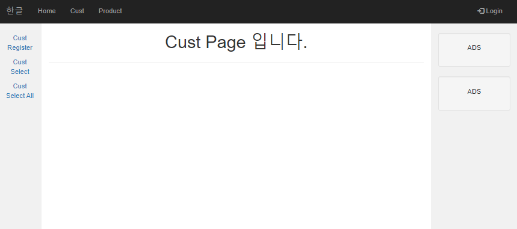
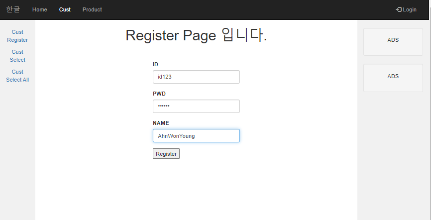
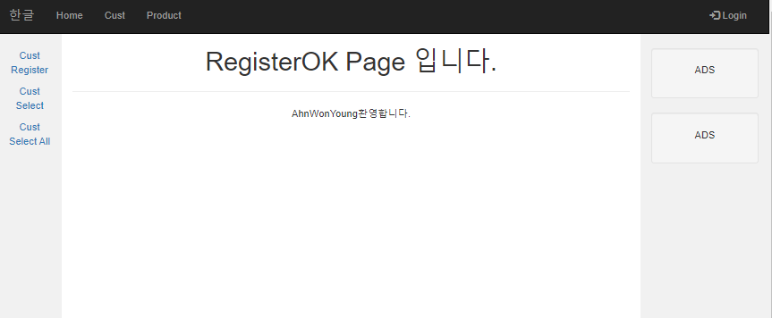
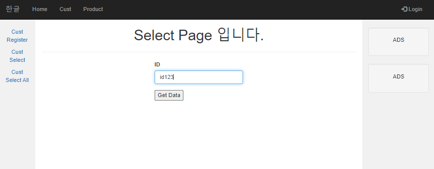
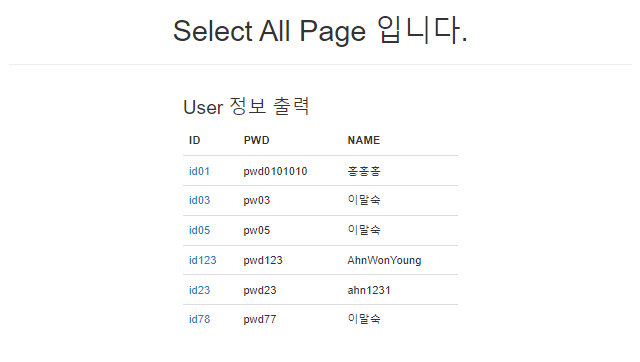
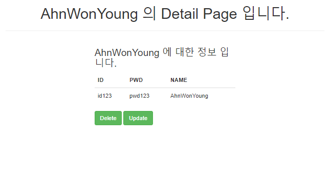
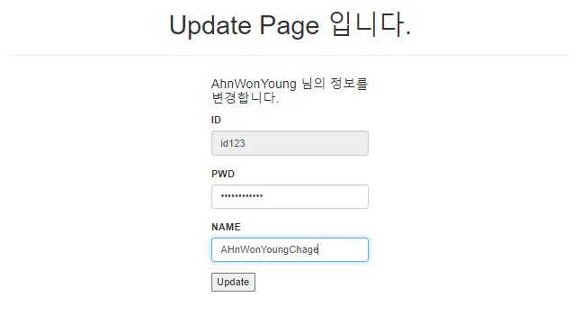
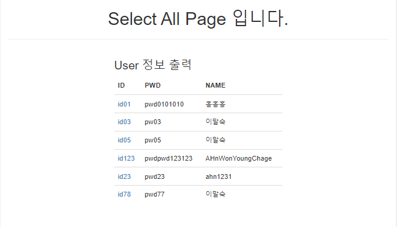
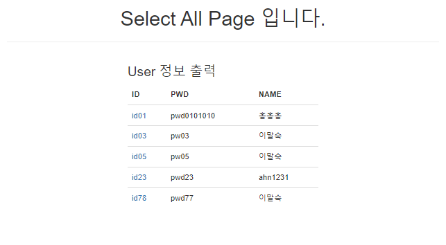

# 36일차

------

> Ajax 이용 chart 그리기 
>
> controller 의 새로운 Mapping 방법 및 redirect
>
> HTML에서 input 태그 비활성화 하는 방법
>
> Customer 을 이용한 CRUD구현 (문제만들기 )
>
> code : 07.customer CRUD

# Ajax 이용 chart 그리기

1. [차트 사이트](https://www.highcharts.com/)
2. ajaxController
   1. 다른 컨트롤러들과는 다르게 @RestController 을 사용한다. 
      - 다른 컨트롤들은 @Contoller 사용 
3. 차트 사이트 이용 방법
   1. https://www.highcharts.com/ -> demo
   2. 원하는 차트 선택 -> EDIT IN JSFIDDLE  -> html 부분의 \<script> 모두 복사
   3. 해당 컨텐츠들은 #container 에 저장될것이기 떄문에 \<div id="container"> 만들기
   4. getData() , display() 함수 선언한 뒤 getdata에는 데이터를, display() 에는 Highcharts.chart('container',{}) 부분을 넣어준다. 

# Controller

## 1. Controller url고정
   1. html에서 controller로 보낼때 "/cust/" 의 형태로 보내면 뒤에 자동으로 Controller 중 Mapping("/cust")  된 부분이 호출된다. 
   2. 이제 이 페이지에서는 url 주소를 호출하면 앞에 cust/ 가 자동으로 붙는다. 


```html
<li><a href="/cust/">Cust</a></li>
```

```java

@Controller
@RequestMapping("/cust")
// cust 가 호출되면 실행되는 클래스로, cust 뒤에 아무것도 없으면 "" Mapping을 호출한다. 
public class CustController {
	@Autowired
	CustMapper dao;
	
	@RequestMapping("")
	public ModelAndView main(ModelAndView mv) {
		mv.setViewName("main");	
		mv.addObject("left", "cust/left");
		mv.addObject("center", "cust/center");		
		return mv;
	}
}

```

## 2. redirect: 

   - 해당 방법은 화면을 리로드 하는 방법이다. 

     - 주의할점은 화면 전체를 리로드 해야하기 때문에 url 경로를 유의해야한다. 
     - 좋은점은 처리한 페이지가 가고자하는 페이지를 통해 왔을 경우 가고자 하는 페이지에 저장되어있던 thymleaf 정보들을 다시 사용할 수있다. 

     ```java
     @RequestMapping("/custDelete")//Delete
     public String custdelete(String id) {
         try {
             biz.remove(id);
         } catch (Exception e) {
         }
     
         return "redirect:custselect";
         //custselect 를 새롭게 다시 요청한다. 
     }	
     
     @RequestMapping("/custUpdateimpl")//Update
     public String custUpdateimpl(CustVO cust) {
         try {
             biz.modify(cust);
     
         } catch (Exception e) {
         }
     
         return "redirect:custdetail?id=" + cust.getId(); 
     }
     ```

# HTML

1. input 태그 비활성화 방법 2가지 

   1. readonly

      - form으로 보냈을 경우 보내진다. 

        ```html
        <input type="text" readonly>
        ```

   2. disabled

      - form으로 보내도 정보가 보내지지 않는다. 

        ```html
        <input type="text" disabled="disabled">
        ```

# Customer 

## 1. DataBase와 연동하여 소비자 정보를 CRUD 한다. 

   - thymeleaf 의 함수와 기능들을 이용해 data를 표시 및 다음 url로 데이터를 넘긴다. 
   - mybatis를 사용하여 AOP( 관점 지향 )을 접목시킨다. 
   - IOC / DI 를 구현하여 프로그램의 흐름을 Spring이 주도할 수 있도록 한다. 

## 2. 사용한 기능

   1. Spring Boot
   2. Spring Framework
   3. Mybatis
   4. SQL
   5. BootStrap
   6. Thymeleaf

## 3. 설명

   1. bootstrap에서 제공하는 navbar를 이용해 큰 틀을 잡는다. 
   2. cust 메뉴를 통해 CRUD기능을 구현한다. 
      1. Register 함수를 구현해 database에 새로운 유저 정보를 입력받는다. 
      2. Select 기능을 이용해 id를 입력하면 id에 대한 정보를 보여준다. 
      3. SelectAll 기능을 이용해 Mysql에 저장되어있는 모든 유저 정보를 보여준다. 
         1. 해당 id를 클릭시 구체적으로 볼수있도록 구현한다. 
         2. 구체적으로 구현된 곳에서는 Delete 와 Update 기능을 사용할 수있다. 
         3. Delete와 Update를 마치면 자동으로 SelectAll 창을 보여준다. 

## 4. 결과

   |     구조     |                            이미지                            |
   | :----------: | :----------------------------------------------------------: |
   |    1.main    |                       |
   |  2.Register  |  |
   |   3.Select   |  |
   | 4. SelectAll |  |
   |  5. Update   |  |
   |  6. Delete   |                     |

   

