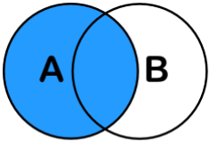
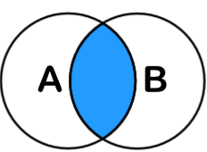
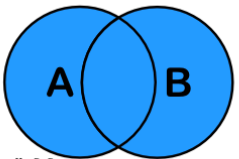

# 37일차

------

> sql 문 복습
>

# SQL 

## CRUD

- Create
  - INSERT INTO table Values( ... )
- Read
  - SELECT field FROM table
- Update
  - UPDATE table SET name='won' WHERE id=2000
- Delete
  - DELETE FROM table WHERE id=10

## Database 재생성 

- ```sql
  DROP DATABASE IF EXISTS martdb
  CREATE SCHEMA martdb
  USE martdb
  
  DROP TABLE IF EXISTS meat
   
  ```

1. 테이블에 자동 번호 부여 및 조건 부여 

   - ```sql
     -- AUTO_INCREMENT 사용하기 위해서는 PRIMARY KEY가 지정되야한다. 
     CREATE TABLE table(
     	id INT PRIMARY KEY auto_increment,
         name VARCHAR(20)
     )
     ```

   - ALTER 이용 제약조건 부여 

     ```sql
     -- 테이블 필드 이름 변경 
     ALTER TABLE table_name
     RENAME COLUMN old_name TO new_name;
     -- 같은 방법 
     ALTER TABLE meat CHANGE old_name new_name DataType;
     
     -- primary key 부여 
     ALTER TABLE cust ADD PRIMARY KEY (id);
     
     -- alter로 자동 번호 부여 
     ALTER TABLE item MODIFY id INT AUTO_INCREMENT;
     ALTER TABLE item AUTO_INCREMENT = 1000;
     
     -- 필드값을 외래키와 연결 
     -- 외래키 ( 다른 테이블의 주키를 가져와 사용 하는 것 )
     ALTER TABLE cart ADD CONSTRAINT FOREIGN KEY (custid) REFERENCES cust(id);
     
     -- 디폴트 값을 셋팅 
     ALTER TABLE cust ALTER COLUMN addr SET DEFAULT 'Seoul';
     
     -- 제약조건으로 price 의 음수값을 체크 
     ALTER TABLE product ADD CONSTRAINT CHECK (price > 0);
     ```


## SELECT 조건 

- ### 기본 조건 

  ```sql
  -- BETWEEN a AND b
  SELECT * FROM usertbl
  WHERE height BETWEEN 180 AND 183;
  
  -- IN
  SELECT * FROM usertbl
  WHERE height IN (182.170,172);
  
  -- LIKE
  SELECT * FROM usertbl
  WHERE name LIKE '%김%';
  
  -- ORDER BY
  -- 항상 조건 가장 마지막에 와야함 
  SELECT * from usertbl
  ORDER BY height
  LIMIT 0, 5;
  # 위에서부터 0부터 5개만 출력
  -- 기본값은 ASC로, 오름차순이다. DESC는 내림차순을 의미한다. 
  
  -- 중복제거 
  SELECT DISTINCT addr FROM usertbl;
  SELECT count(DISTINCT(userID)) FROM buytbl;
  
  -- 스트링 더하기 
  SELECT CONCAT(prodName, groupName ) from buytbl;
  
  -- IFNULL 
  # null이 아니면 수식1, 널이면 수식2
  SELECT prodName, IFNULL(groupName,'nullvalue') FROM buytbl;
  
  -- CASE WHEN THEN 
  SELECT userID, amount, 
  CASE
  	WHEN amount >= 1 AND amount < 2 THEN 'C'
  	WHEN amount >= 2 AND amount < 4 THEN 'B'
      ELSE 'NONE'
  END AS level -- 해당 필드 이름을 level로 
  FROM buytbl;
  
  -- char_length vs length
  -- 3, 9 가 출력. 그냥length 사용하면 한글은 3byte이기 때문에 
  SELECT char_length('가나다'), length('가나다');
  ```

- ### date 함수 이용 

  ```sql
  -- date_format() 이용 
  SELECT * FROM usertbl
  WHERE date_format(mDate,'%Y') = '2007' or date_format(mdate,'%Y') = '2009';
  
  -- dateadd() , subdate()
  SELECT mDate,adddate(mdate, interval 30 DAY),
  	subdate(mDate, INTERVAL 30 DAY)
  FROM usertbl;
  
  -- datediff()
  -- 날짜 빼기 ( 일수로 계산 )
  SELECT mdate, DATEDIFF(NOW(), mDate) FROM usertbl;
  
  -- period_diff()
  -- 날짜 빼기 ( 개월수로 계산 )
  -- 사용하기 위해서는 형태를 yyyymm으로 바꿔줘야함 
  SELECT mdate, period_diff(DATE_FORMAT(NOW(),'%Y%m') , 
  date_format(mDate,'%Y%m'))
  FROM usertbl;
  ```

- ### 서브 쿼리 이용 

  ```sql
  SELECT * FROM usertbl
  WHERE height > (SELECT height FROM usertbl WHERE name = '윤종신');
  ```

- ### 그룹핑

  ```SQL
  -- GROUP BY 
  SELECT userID, ROUND(AVG(price),1) AS pavg FROM buytbl
  GROUP BY userID
  HAVING pavg > 100
  ORDER BY pavg DESC;
  -- GROUP BY 사용시 조건은 WHERE가 아닌 HAVING을 사용
  ```

- ### 가상 테이블 

  ```SQL
  -- WITH 이용 
  # 각 지역별 가장 키가 큰 키들의 평균을 구하시오
  -- ~별 이 들어가면 그룹핑 해야한다. 
  WITH temp(addr, max)
  AS
  (SELECT addr, MAX(height) FROM usertbl
  GROUP BY addr)
  SELECT AVG(max) FROM temp;
  
  -- view 이용 
  CREATE VIEW v_table
  AS
  SELECT ca.id AS orderID , cu.id AS uID
  FROM cart ca
  ```

- ### 여러가지 조건 

  ```sql
  -- 홍영자와 같은 부서의 평균 월급보다 높은 사원 출력 
  SELECT * FROM emp
  WHERE salary > (
  SELECT AVG(salary) FROM emp 
  WHERE deptno = (SELECT deptno FROM emp WHERE empname = '홍영자')
  );
  
  -- 부서별 최고임금을 받는 사람의 평균 월급보다 많이 받는 사원 출력 
  SELECT empname,salary FROM emp
  WHERE salary >
  (SELECT AVG(a.smax) FROM (
  SELECT deptno,MAX(salary) AS smax FROM emp
  GROUP BY deptno) a);
  
  -- 부서별 입사일이 제일 오래된 직원들 중 연봉이 제일 낮은 사람을 구하시오.
  SELECT empname, salary  FROM emp
  WHERE salary = (SELECT MIN(A.salary) FROM 
  (SELECT deptno ,empname,salary, MAX(datediff(NOW(), hdate)) AS maxWorkDay FROM emp 
  GROUP BY deptno) A);
  ```

## JOIN

1. ### left join , right join 

   - outer Join 이라고도 부르며 한쪽의 데이터를 기준으로 join할때 사용한다. 

   - left join 

     - 왼쪽을 기준으로 일치하는 행만 결합되고 일치하지 않으면 null로 대체 

     ``` sql
     -- instructor 테이블을 기준으로, teaches 테이블의 id와 같은것만 join 
     SELECT *
     FROM instructor
     LEFT OUTER JOIN teaches 
     ON instructor.id = teaches.id
     ```

     

2. ### inner join

   - 내부조인으로, 기준 테이블(join의 왼쪽) 과 조인 테이블 모두에 존재하는 필드만 조회 

     ```sql
     SELECT Sales.*, Countries.Country
     FROM Sales
     JOIN Countries
     ON Sales.CountryID = Countries.ID
     ```

     

3. ### full outer join 

   - inner join과 다르게 모든 필드를 조인한다. 

     ```sql
     SELECT *
     FROM instructor
     FULL OUTER JOIN teaches 
     ON instructor.id = teaches.id
     ```

     

