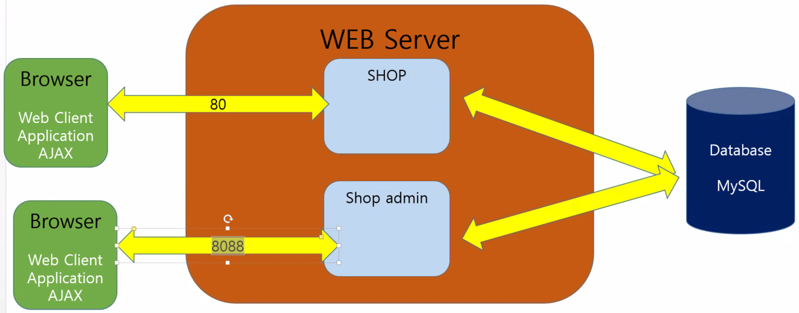
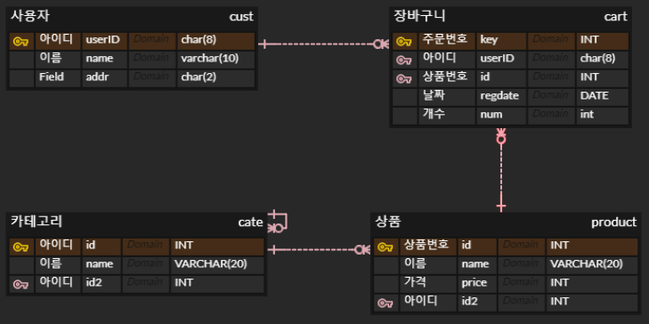

# 39일차

------

> shoppingdb에 있는 4개의 테이블 (cust, product, cate, cart) 의 CRUD 구현 
>
> 개발시 sql의 제약조건은 spring과 mybatis 연동 후 나중에 거는것이 좋다. 

# ShoppingDB 구현 

- 존재 테이블 : Cust, Product, Cate, Cart 

1. Service 의미 

   ```java
   @Service
   //Spring container 안에서 spring 컴포넌트로 만들기 위해 사용 -> 하나의 컴포넌트로 모두 지정하다 보면 나중에 어떤 기능을 하는 컴포넌트인지 햇갈리게 됨.
   // service가 mapper(database) 와 Ui(화면) 의 중점이 되서  
   // service = 업무 진행시 같이 진행되야 할 일을 처리 하는 곳 
   public class CustBiz implements Biz<String,CustVO>{
   
   	@Autowired
   	CustMapper dao;
   	
   	@Override
   	public void register(CustVO v) throws Exception {
   		// 데이터 검증 	
   		dao.insert(v);
   		// 메일 전송 
   	}
   }
   ```

2. Insert 태그 조건문

   ```xml
   <insert id="insert" parameterType="cateVO">
       <if	test="pid != 0"> 
           <!-- self join 으로 인해 pid에는 상위id값이 들어가야 한다. 0은 불가하지만 null은 들어갈 수 있다. -->
           <!-- 입력받을때 pid의 자료형이 int형이기 때문에 null값입력 못함 , 따라서 sql문에서 값을 넣을 때 null로 변경해줘야한다.  --> 
           INSERT INTO CATE VALUES (#{id},#{name},#{pid})
       </if>
       <if test="pid == 0">
           INSERT INTO CATE VALUES (#{id},#{name},NULL)
       </if>
   </insert>
   
   <!-- 최상위 id값만 가져온다.  -->
   <select id="selectmain" resultType="cateVO">
       SELECT * FROM CATE WHERE PID IS NULL
   </select>
   
   
   <!-- 카테고리 이름별 제품 가격의 평균 -->
   <select id="selectAVG" resultType="productAVGVO">
       SELECT ROUND(AVG(p.price)) AS avgprice, c.name as catename FROM
       product p
       INNER JOIN cate c ON p.cid = c.id
       GROUP BY catename;
   </select>
   ```

3. INNER JOIN 이용 

   ```sql
   -- 하위 카테고리의 이름만 출력 가능 
   SELECT p.id as id, p.name as
   name, p.price, p.regdate, p.cid as cid,
   p.imgname as imgname, c.name as
   catename FROM product p
   INNER JOIN cate c ON p.cid = c.id
   
   -- 상위 카테고리를 self join 해서 상위 카테고리 이름 출력 
   SELECT p.id as id, p.name as name, p.price, p.regdate, p.cid as cid,
   p.imgname as imgname, c.name as catename, c2.name AS catemainname FROM product p 
   INNER JOIN cate c ON p.cid = c.id-- 하위 카테고리의 이름을 출력
   INNER JOIN cate c2 ON c.pid = c2.id;-- 상위 카테고리의 이름을 출력 
   ```

## tip. 개발시 sql의 제약조건은 spring과 mybatis 연동 후 나중에 거는것이 좋다. 

# 일반계정과 Admin 계정 나누기  

1. Shop , Shop Admin
   - 일반계정(shop)과 관리자 계정(shop Admin)을 나눈다. 
   - 관리자 계정에서는 상품의 정보를 수정, 추가 할수 있다. 
   - 
   - 
2. Shop
   1. 포트번호를 80으로 설정 
3. ShopAdmin
   1. 포트번호를 8088로 설정 
   2. bootstrap theme
