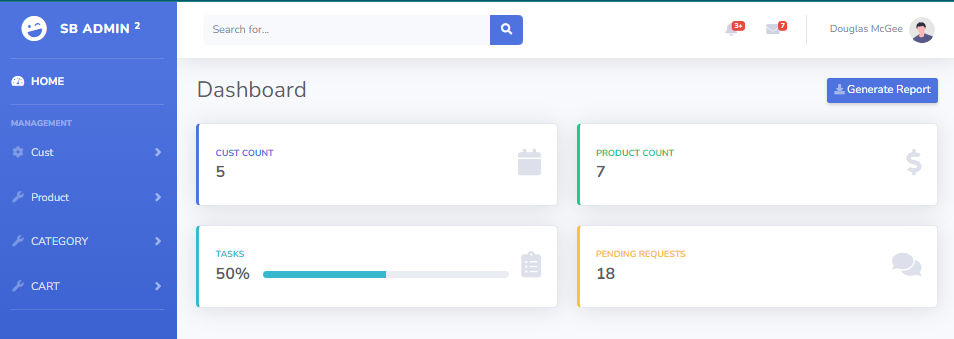
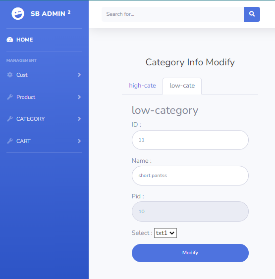

# 40일차

------

> shoppingdb를 이용해 shopAdmin을 만들어본다. 
>
> ajax, thyemleaf 함수, jquery를 사용해 구현한다. 
>
> Customer (Select, Add), Cate(Select, Add) 구현 

# ShopAdmin

## 사용 개념

- root

  - ```javascript
    $(document).ready(function(){
    	$('#update_btn').click(function(){
    		$('.user').attr({
    			'action':'update',/*/update 하면 root 인 127.0.0.1/update에서 찾는다.  */
    			'method':'post'
    		});
    		
    		$('.user').submit();
    	});
    });
    ```

- thymeleaf 기능

  - ```html
    <tbody>
        <tr th:each="cust : ${custlist}">
            <td><a href="#" th:href="@{detail(id=${cust.id})}" th:text="${cust.id}">id02</a></td>
            <td th:text="${cust.pwd}">pwd02</td>
            <td th:text="${cust.name}">name</td>
            <td th:text="${cust.addr}">Seoul</td>
            <td th:text="${#dates.format(cust.regdate, 'yyyy/MM/dd')}">2011/04/25</td>
        </tr>
    </tbody>
    ```

- Ajax 이용 

  ```java
  @RestController
  public class AjaxController {
  	@Autowired	
  	CustBiz cbiz;
  	
  	@RequestMapping("checkid")
  	public String checkid(String id) {
  		String result = "";
  		CustVO cust = null;
  		
  		try {
  			cust = cbiz.get(id);
  			if(cust == null) {//id가 존재하지 않으면 0
  				result = "0";
  			}else {// id가 존재하면 1
  				result = "1";
  			}
  		} catch (Exception e) {
  			e.printStackTrace();
  		}
  		return result;
  	}
  }
  ```

  ```javascript
  function sendId(id){
  	$.ajax({
  		url:'/checkid',
  		data:{'id':id},//매개변수 전송 
  		success:function(data){
  			if(data == '1'){
  				$('#ispan').text('사용 불가능한 ID 입니다. ');
  				$('#ispan').css('color','red');
  			}else{
  				$('#ispan').text('사용 가능한 ID 입니다. ');
  				$('#ispan').css('color','green');
  			}
  		},
  	});
  };
  
  $(document).ready(function(){
  	$('input[name="id"]').keyup(function(){
  		var id = $(this).val()// keyup하면 해당 내용을 가져옴 
  		sendId(id);
  		//alert('id key up : ' + id);
  	});
  	
  	$('#register_btn').click(function(){
  		$('.user').attr({
  			'action':'addimpl',
  			'method':'post',
  		});
  		// 사용자에게 확인/취소 물어보고 취소면 동작 x 
  		var move = confirm("회원가입 하시겠습니까?");//확인=true
  		
  		if(move == true){
  			$('.user').submit();
  		}
  
  	});
  });
  ```

## Home

- home에는 database에 저장된 customer와 product의 갯수를 출력한다. 

  

  

## Cust Table

- Add와 Select 메뉴 2가지가 있다. 

  - Select
    - select를 클릭하면 database에 저장된 cust 정보를 모두 가져와 table에 뿌려준다. 
    - select 페이지에서 Cust의 id를 클릭하면 detail 페이지로 넘어간다. 
    - detail 페이지에서는 선택한 Customer의 구체적 정보 (id, pwd, name, address, 가입날짜) 를 확인하고 변경할 수 있다. 
    - 이때 id와 날짜는 변경이 불가능하도록 한다. 
  - Add
    - id, pwd, name, address를 입력받는다. 
    - 이때 id는 Ajax를 이용해 database에 있는 id들과 중복되지 않도록 검사한다. 
    - 확인이 완료되고 Register 버튼을 누르면 confirm을 이용해 회원가입 할것인지 물어본다. 
      - 취소를 누르면 클릭이벤트가 취소된다. 
      - 확인을 누르면 submit()이 일어난다. 

- Select 

  

- Add

  

## Category Table

- 들어오는 id가 0이면 상위 카테고리 active, 0이 아니면 하위 카테고리 active

  - 추가적으로, 필요한 menu 가 아니면 숨기기 

  ```javascript
  var high_pid = $('#high-cate-form #pid').val();
  if(high_pid == 0){// high-cate 를 active
      // tap과 tap Container 둘다 active로 해줘야함 
      $('#high-cate-menu').attr({
          'class':'nav-link active',
      });
  
      $('#high-cate').attr({
          'class':'container tab-pane active',
      });
  
      $('#low-cate-form').hide();
  
  }else{//low-cate 를 active
      $('#low-cate-menu').attr({
          'class':'nav-link active',  
      });
  
      $('#low-cate').attr({
          'class':'container tab-pane active',
      });
  
      $('#high-cate-form').hide();
  }
  ```

- 들어오는 id의 첫 글자와 pid(상위 카테고리) 의 앞글자가 같아야함 

  - ```javascript
    $('#high-cate-form #id').keyup(function(){
        var high_id = $('#high-cate-form #id').val();
        if(high_id.charAt(1) == 0){//2번째 자리가 0이여야 함 
            $('#high-cate-form #span-id').text('상위 category 조건 만족');
            $('#high-cate-form #span-id').css('color','green');
    
        }else{
            $('#high-cate-form #span-id').text('2번째 자리 다시 입력');
            $('#high-cate-form #span-id').css('color','red');
        }
    });
    ```





