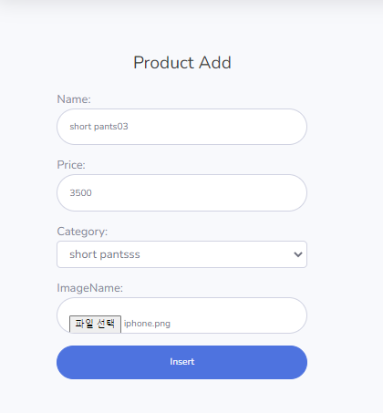
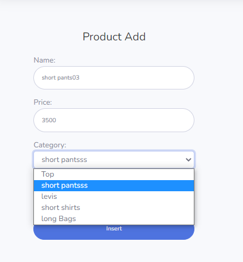
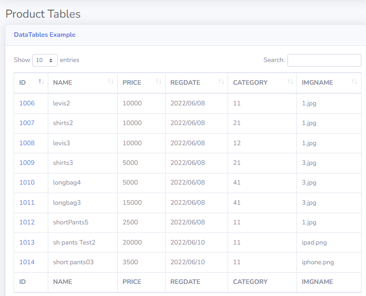
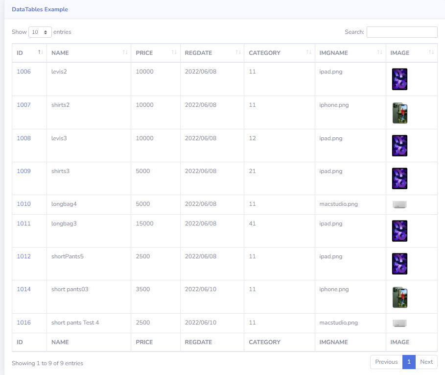
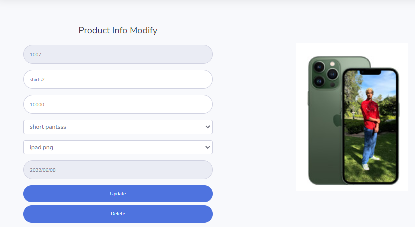
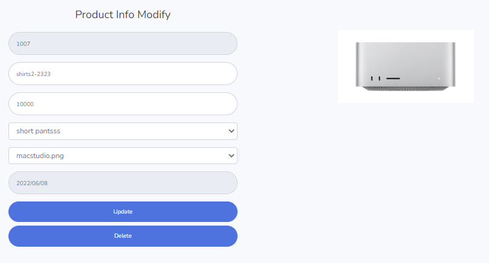

# 41일차

------

> shoppingdb를 이용해 shopAdmin을 만들어본다. 
>
> Category (Select) : select 태그에 조건 걸어서 보이는 값과 보내지는 값을 다르게 설정 하는 방법을 배운다. 
>
> Product (Add) : 서버에 파일 올리는 방법에 대해 학습한다. (Util.java 파일 필요 )
>
> bootstrap4 padding,margin  조절 방법 

# shopAdmin

## Category (add, update, delete )

1. pid select 

   - 반복문 사용. text에는 name 을, 데이터를 submit() 할때는 value:id 로해서 보이는 값과 보내지는 값을 다르게 설정 

   ```html
   <div class="form-group">
       PID: 
       <select name="pid" class="form-control">
           <option value="0" class="form-control">Top</option>
           <option th:each="cate : ${highlist}"
                   th:value="${cate.id}" 
                   th:text="${cate.name}"></option>
   
       </select>
   </div>
   ```

2. add

   - 해당 input 벗어나면 실행함 -> keyup하면 계속 서버에 요청하기 때문에 안좋음.

     ```javascript
     $('input[name="id"]').blur(function(){//해당 input 에서 나갈때 실행
         var id = $(this).val();
         sendId(id);
     });
     ```

## product (Add, Select , detail 구현)

### Add

1. 설명

   - Product 이름, 가격, imgFile을 선택해 넣을 수 있다. 
   - 이때 category는 category테이블의 id를 가져온다. 
     - 상위 카테고리는 조건문을 사용하여 제거하고 하위 카테고리만 선택할 수 있게 한다. 
   - 파일을 선택하면 input 태그의 type=file  을 이용해 file을 전송한다. 
     - file은 Util.java 에 의해 설정해놓은 directory로 저장이 되고, 해당 img의 imgName만 database에 저장된다. 

2. add 시 product는 category 의 정보를 select로 표현

   - 표현시 상위 카테고리가 아닌 하위 카테고리로만 표시해야 함 

     ```html
     <div class="form-group">
         Category:
         <select class="form-control" name="cid">
             <option value="Top">Top</option>
             <option
                     th:each="cate : ${catelist}"
                     th:if="${cate.pid != 0}"
                     th:value="${cate.id}" 
                     th:text="${cate.name}">name</option>
     
         </select>
     </div>
     ```

3. 서버로 파일 보내기 

   - 사진은 따로 저장하고, 이름만 데이터 베이스에 저장 

   1. input 태그를 이용해 파일 추가 

      ```html
      <!-- 이렇게 하면 파일 자체가 서버로 올라감 -->
      <div class="form-group">
          ImageName: <input type="file" class="form-control form-control-user" name="mf" placeholder="Enter imgname">
      </div>
      ```

   2. 파일 전송에 필요한 요소 추가 

     1. 먼저 VO 객체에서 파일요소를 받을 수 있는 변수를 생성한다. 

     ```java
     public class ProductVO {
     	//화면에서 서버로 파일을 보낼때 사용되는 변수 
         private MultipartFile mf;
     }
     ```

     2. javascript로 파일 데이터 전송시 필요한 속성인 enctype 을 추가 

     ```javascript
     $('#register_btn').click(function(){
         $('.user').attr({
             'enctype':'multipart/form-data',
             //파일 전송에 필요한 요소 
             'action':'addimpl',
             'method':'post',
         });
     });
     ```

     3. 이미지 리로드 셋팅 

        - 이미지를 insert 한다고해서 바로 리로드 되지 않는다. 따라서 바로 리로드될 수 있도록 셋팅을 해야한다. 

        - eclips -> window -> preference -> General -> Workspace -> Refresh using native hooks or polling 체크 

   3. Controller 셋팅

      - 이미지 파일을 받아 파일을 이용해 파일 이름을 imgname으로 셋팅해서 데이터베이스에 insert 한다. 

      ```java
      @RequestMapping("/addimpl")
      public String addimpl(Model m,ProductVO obj) {
          // productVO로 name, price, cid, mf(이걸 이용해 파일의 이름을 도출) 가 날라온다.
          String imgname = obj.getMf().getOriginalFilename();//파일 이름을 도출 
          obj.setImgname(imgname);// 비어있던 필드에 이름 셋팅 
      
          try {
              pbiz.register(obj);// 셋팅한 imgname으로 데이터를 추가 
              System.out.println("product : " + obj);
              //파일을 저장 
              Util.saveFile(obj.getMf());//서버에 파일을 저장하는 모듈 
      
          } catch (Exception e) {
              e.printStackTrace();
          }
      
          return "redirect:select";//저장후 select 화면으로 가라 
      }
      ```

   4. Util.java

      - 파일 보낼때 필요한 java 파일

      ```java
      package com.multi.frame;
      
      import java.io.FileOutputStream;
      import org.springframework.web.multipart.MultipartFile;
      
      public class Util {
      	public static void saveFile(MultipartFile mf) {
      		String dir = "C:\\spring\\shopAdmin\\src\\main\\resources\\static\\img\\";
              // 이때 경로 설정 잘해야함. 저장할 dir 로 가서 주소 복사 후 뒤에 "\\" 를 꼭 붙여줘야 함 
      		byte [] data;
      		String imgname = mf.getOriginalFilename();
      		try {
      			data = mf.getBytes();
      			FileOutputStream fo = 
      					new FileOutputStream(dir+imgname);
      			fo.write(data);
      			fo.close();
      		}catch(Exception e) {
      			
      		}
      	}
      }
      ```

3. 결과 화면 

   

   

### Select & Update

1. 설명

   - Select

     1. select 선택시 데이터 베이스에 저장되어있던 product 데이터를 모두 가져와 정보를 출력한다. 

     2. imgname을 사용해 img를 출력한다. 

        ```html
        
        ```

     3. ID를 누르면 Detail 화면으로 넘어가고, 해당 페이지에서 update를 진행한다. 

   - Update

     1. 기존에 데이터로 저장되어있던 이미지와 CID(Category) 를 select를 이용해 선택할수 있게 한다. 
     2. 이름, 가격, cid. imgname 을 변경할 수 있다. 

2. 결과 화면

   

# bootstrap 4

1. padding 과 margin 조절

   - [참고 사이트](https://www.w3schools.com/bootstrap4/bootstrap_utilities.asp)

   - 1~ 5까지 조절 가능 

   - ```html
     <div class="m-5 p-5">
     <!-- p는 padding, m은 margin을 의미한다. -->
     ```

# 서버 저장 파일 용량 늘리기

1. application.properties 로 들어간다. 
2. "spring.servlet.multipart.max-file-size=10MB" 을 추가한다. 
3. 서버를 다시 가동한다. 
