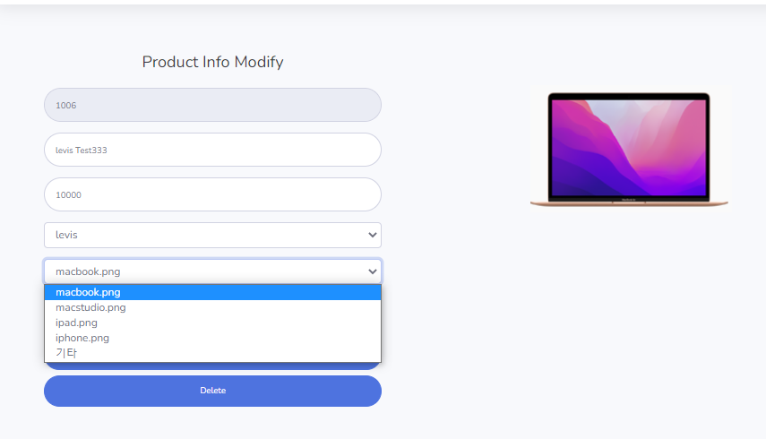
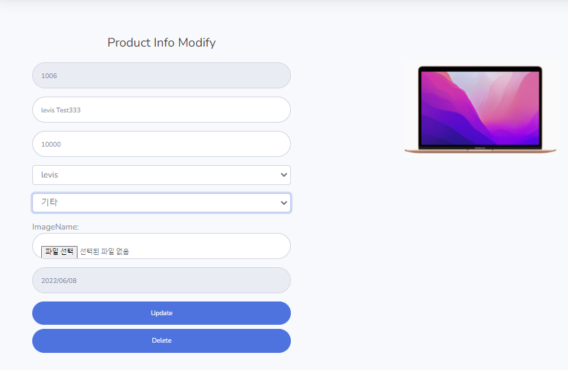
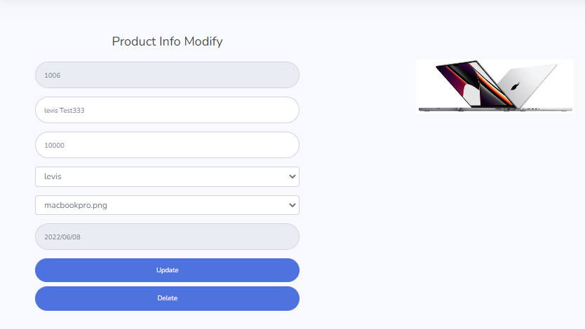
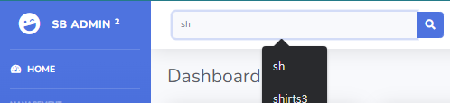
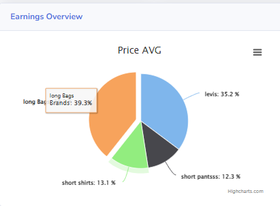
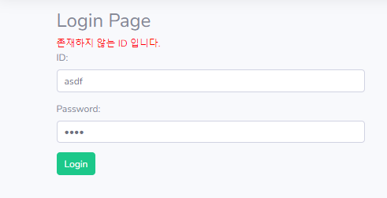
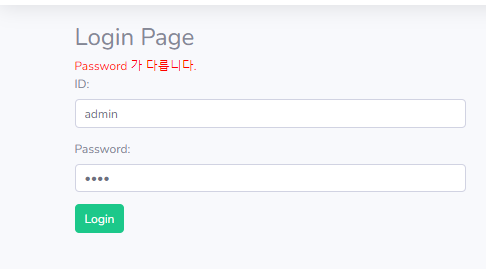
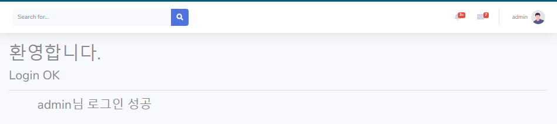
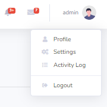

# 42일차

------

> shoppingdb의 테이블을 통해 login, search, char 기능들을 구현한다. 
>
> sql 태그에서 LIKE 기능 구현하는 방법 (concat 사용)

# shoppingdb

## 이미지 저장

- 저장시 shop Project의 img폴더에도 이미지가 저장될수 있도록 

- ```java
  package com.multi.frame;
  
  import java.io.FileOutputStream;
  import org.springframework.web.multipart.MultipartFile;
  
  public class Util {
  	public static void saveFile(MultipartFile mf) {
  		String dir = "C:\\spring\\shopAdmin\\src\\main\\resources\\static\\img\\";
  		String dir2 = "C:\\spring\\shop\\src\\main\\resources\\static\\img\\";
  		byte [] data;
  		String imgname = mf.getOriginalFilename();
  		try {
  			data = mf.getBytes();
  			FileOutputStream fo = 
  					new FileOutputStream(dir+imgname);
  			fo.write(data);
  			fo.close();
  			
  			FileOutputStream fo2 = 
  					new FileOutputStream(dir2+imgname);
  			fo2.write(data);
  			fo2.close();
  		}catch(Exception e) {
  			
  		}
  	}
  }
  ```


## Product Update

1. 설명 

   1. detail 페이지에 들어가면 기존에 저장되어있던 이미지를 이용할 것인지 또는 새로운 이미지를 사용할 것인지를 결정해야 한다. 

   2. javascript를 이용해 '기타' 가 선택될경우 이미지 파일을 선택할 수 있는 input을 보이게 하고 , '기타' 가 아닌 다른 select 이 선택되었을 경우 이미지 파일 선택기를 숨긴다. 

   3. img 를 기존것이 아닌 다른 이미지를 삽입할 경우

      1. select 문에서 '기타' 를 선택하면 fileAdd.hide() 처리했던 것을 fileAdd.show() 를 이용해 보이게 한다. 

      2. mf로 설정된 filename을 controller에서 filename만 빼서 ProductVO 의 imgname으로 설정 

      3. code


      ```html
      <script>
      $('#imgname').click(function(){
          if($('#imgname').val() == '기타'){
              // 기타 선택시에만 파일 변경할 수 있도록 
          	$('#fileAdd').show();
          }else{
          	$('#fileAdd').hide();
          }
      });
      </script>
      <div class="form-group" id="fileAdd">
          ImageName: <input type="file" class="form-control form-control-user" name="mf" placeholder="Enter imgname">
      </div>
      ```

      ```java
      @RequestMapping("/update")
      public String update(ProductVO p, Model m) {
          //System.out.println("ProductVO : " + p);
          if(p.getImgname().equals("기타")) {//기타일 경우만 img를 저장
              String imgname = p.getMf().getOriginalFilename();
              p.setImgname(imgname);
      
              Util.saveFile(p.getMf());
          }
      
          try {
              pbiz.modify(p);
          } catch (Exception e) {
              e.printStackTrace();
          }
          return "redirect:detail?id=" + p.getId();
      }
      ```

   4. Thymeleaf의 Selected 이용

      1. 기본적으로 선택되도록 해야한다. 

         ```html
         <select id="cid" name="cid" class="form-control">
             <option th:each="cate : ${catelist}" th:value="${cate.id}"
                     th:text="${cate.name}" th:selected="${cate.id} == ${product.cid}">catename</option>
         </select>
         ```

         

2. 결과 

  

  

  

## Search 기능

1. 설명
   - 글자 입력시 해당 글자가 있는 모든 product를 조회에 보여준다. 
   - 조회된 이미지 클릭시 /product/detail controller를 호출한다. 
   - 카테고리 테이블과 product 테이블을 INNER Join 한 정보를 이용힌다. 

2. 기능
   - Inner Join , thymeleaf 

     ```java
     @RequestMapping("/search")//동일한 이름만 서치 가능 
     public String search(Model m,String txt) {
         System.out.println("search Start : ");
         List<ProductVO> list = null;
         ProductVO product = null;
     
         try {
             list = mbiz.searchproduct(txt);
             m.addAttribute("productlist", list);
     
         } catch (Exception e) {
             e.printStackTrace();
         }
     
         m.addAttribute("center", "search");
     
         return "index";
     }
     ```

     ```xml
     <select id="searchproduct" parameterType="String" resultType="productVO">
         SELECT p.id
         as id, p.name as name, p.price, p.regdate, p.cid as cid,
         p.imgname as
         imgname, c.name as catename FROM product p
         INNER JOIN cate c ON p.cid =
         c.id
         WHERE p.name LIKE CONCAT('%',#{txt},'%')
     </select>
     ```

3. 결과

   

   {point.percentage:.1f}%</b>'
  		  },
  		  accessibility: {
  		    point: {
  		      valueSuffix: '%'
  		    }
  		  },
  		  plotOptions: {
  		    pie: {
  		      allowPointSelect: true,
  		      cursor: 'pointer',
  		      dataLabels: {
  		        enabled: true,
  		        format: '<b>{point.name}</b>: {point.percentage:.1f} %'
  		      }
  		    }
  		  },
  		  series: [{
  		    name: 'Brands',
  		    colorByPoint: true,
  		    data: data
  		  }]
  		});
  };
  
  function getdata(){
  	$.ajax({
  		url:'/chart',//root 꼭 붙여야함 
  		success:function(data){
  			//alert(data);// 꼭 사용전에 alert로 확인해 보기 
  			display(data);
  			
  		}
  	});
  };
  ```

  ```java
  @RequestMapping("chart")
  public Object chart() {
      //[{},{}] 의 형태로 만들어야 한다. 
      List<ProductAVGVO> list = null;
      JSONArray ja = new JSONArray();
  
      try {
          list = pbiz.getAvg();
          for(ProductAVGVO p : list) {
              JSONObject jo = new JSONObject();
              jo.put("name", p.getCatename());
              jo.put("y", p.getAvgprice());
  
              ja.add(jo);
          }
      } catch (Exception e) {
          e.printStackTrace();
      }
      return ja;
  }
  ```

- 결과 

  <img src="../images/shoppingdb/chart2.png" width="400"

## Login 기능

1. 설명

   1. session 정보를 이용해 login 유무를 판단.

      1. login을 하지 않았을 경우 login을 할수있는 링크를 띄워준다. 
      2. 만약 login을 했다면 사용자 정보와 Logout을 띄워준다. 

   2. login

      1. 만약 작성한 id가 데이터베이스에 없을경우 "존재하지 않는 ID 입니다" 를 띄우고 페이지 리로드 함 
         - 페이지 리로드 시 작성된 id와 pwd 값을 그대로 유지 
      2. 만약 작성한 pwd가 데이터베이스의 정보와 다르다면 "Password가 다릅니다. " 띄우고 페이지 리로드 
      3. id와 pwd가 같다면 session에 저장하고 main페이지 로드 

   3. Session 저장

      1. session 을 사용하기 위해서는 HttpSession 객체가 필요하다. 

         ```java
         public String loginimpl(Model m,AdminVO ad, HttpSession session) {
             session.setAttribute("cust", cust);
         }
         ```

2. 결과

   

   

   

   

