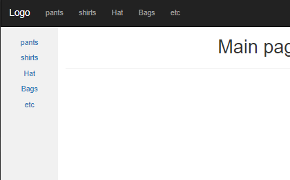
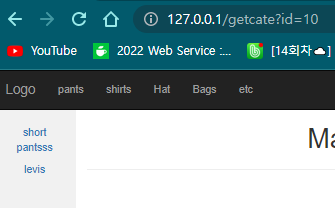
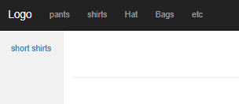
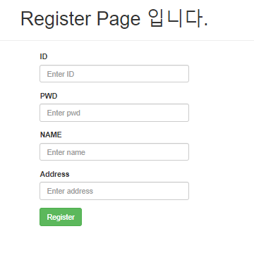
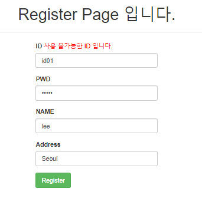
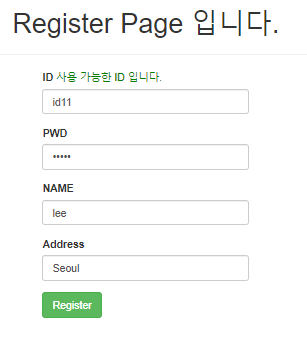
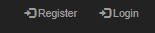

# Day43

---

>이미지 저장시 필요한 Util 을 좀더 유동적으로 구성 
>
>@ModelAttribute() 사용법 
>
>세미프로젝트 Day01

# 이미지 저장

1. 디렉토리 변경시 자바파일을 변경하지 않아도 된다. 

2. 순서

   1. Util.java의 매개변수에 admindir, userdir을 넘겨받느다. 

   2. FileOutputStream의 매개변수로 admindir+imgname을 준다. 

   3. application.properties에 admindir, userdir 을 작성해준다. 

      ```properties
      admindir = C:\\spring\\shopAdmin\\src\\main\\resources\\static\\img\\
      userdir = C:\\spring\\shop\\src\\main\\resources\\static\\img\\
      ```

   4. 사용할 Controller에서 @Value("${admindir}") 을 이용해 디렉토리 정보를 가져온다. 

      ```java
      @Value("${admindir}")
      String admindir;
      
      @Value("${userdir}")
      String userdir;
      ```

# Shopdb

## Main Category

1. 설명

   - 메인 카테고리를 클릭하면 화면 left에 클릭한 카테고리에 속한 product를 가져온다. 

   - 메인 카테고리는 계속해서 유지되야 한다. 따라서 @ModelAttribute() 를 사용해 

     - @ModelAttribute : 항상 페이지가 호출될때 자동으로 호출된다. 

       ```java
       @ModelAttribute("catelist")// 항상 페이지가 호출될때 자동으로 호출된다. 
       public List<CateVO> makemenu(){
           System.out.println("makemenu");
           List<CateVO> catelist = null;
           try {
               catelist = cabiz.getmain();
           } catch (Exception e) {
               e.printStackTrace();
           }
           return catelist;
       }
       ```

2. 결과

   

   

   

## Register

1. 설명

   - 회원가입 화면에 작성시 빈칸이 있으면 포커스
   - id중복인지 Ajax와 blur 을 이용해 체크
   - 가입시 자동 로그인 -> 화면 상단 오른쪽에 Login 문구를 Logout 으로 변경

2. 결과

   

   

   

   

   

# 세미 프로젝트 Day01

## 팀원 

- 안원영, 유정아, 김민식, 서예린 
- [Notion](https://www.notion.so/wonyoung-ahn/bfa2b084bf6141d19ae5be1726b7694e)

## 설명

- 쇼핑몰 사이트 제작

## 참고 사이트

- [Padlet : 팀원간 자료 공유](https://padlet.com/tidnjrk010/Bookmarks)
- [롯데백화점](https://www.lotteshopping.com/main/main) : 스크롤시 나타나는 애니매이션 효과
- [무료 디자인 툴](https://www.miricanvas.com/)
- [나이키](https://www.nike.com/kr/ko_kr/w/men/fw) : 왼쪽에 나오는 checkbox 선택시 원하는 자료 보여주는 방법 

## 세미프로젝트 6월 14일 첫회의
#### 브레인스토밍 : 참고할 수 있는 인터넷쇼핑몰 링크 

1. 서예린 : [Styleshare](https://www.styleshare.kr/)
   - 모바일일때 화면크기가 자동전환, 이미지 배너 자동실행

2. 김민식: [나이키](https://www.nike.com/kr/ko_kr/w/men/fw?utm_source=Google&utm_medium=PS&utm_campaign=365DIGITAL_Google_SA_Keyword_Extend_PC&cp=53055959389_search_&gclid=Cj0KCQjwwJuVBhCAARIsAOPwGASu1zlJTEmTBCrb0N4tZXo148-2hjVf16nR0uFm1gM0p62eoXTYAuAaAn5JEALw_wcB)
   - ui가 깔끔,심플 . 제품별로 세부옵션
3. 유정아: [주얼리샾](https://smartstore.naver.com/jullypink)
   - 메인화면에서 제품이미지와 가격을 한번에 볼 수 있어서 좋다. 
4. 안원영:[삼성전자](https://www.samsung.com/sec/)
   - 네이브 바에 마우스를 올렸을때 세부 옵션들이 보이는 이벤트가 좋았다.

## NOTION 정리

- [SemiProject Day01](https://www.notion.so/wonyoung-ahn/bfa2b084bf6141d19ae5be1726b7694e)
