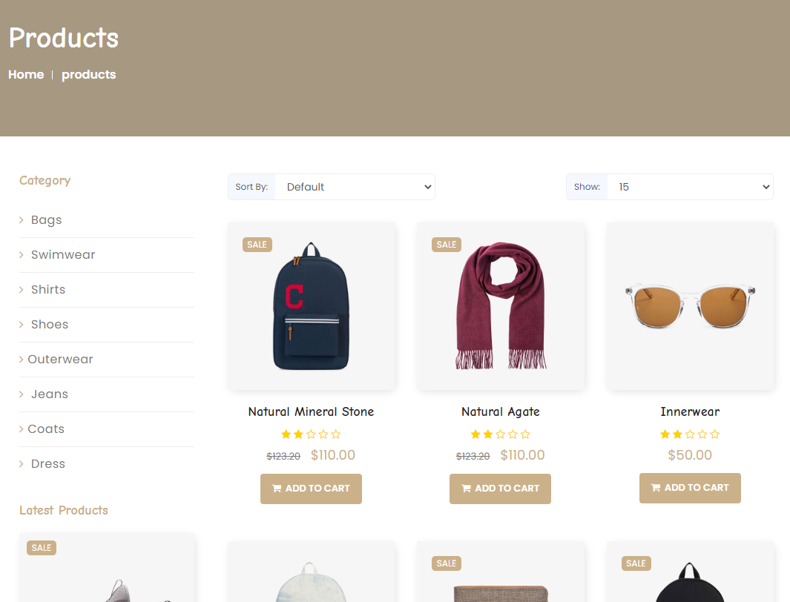
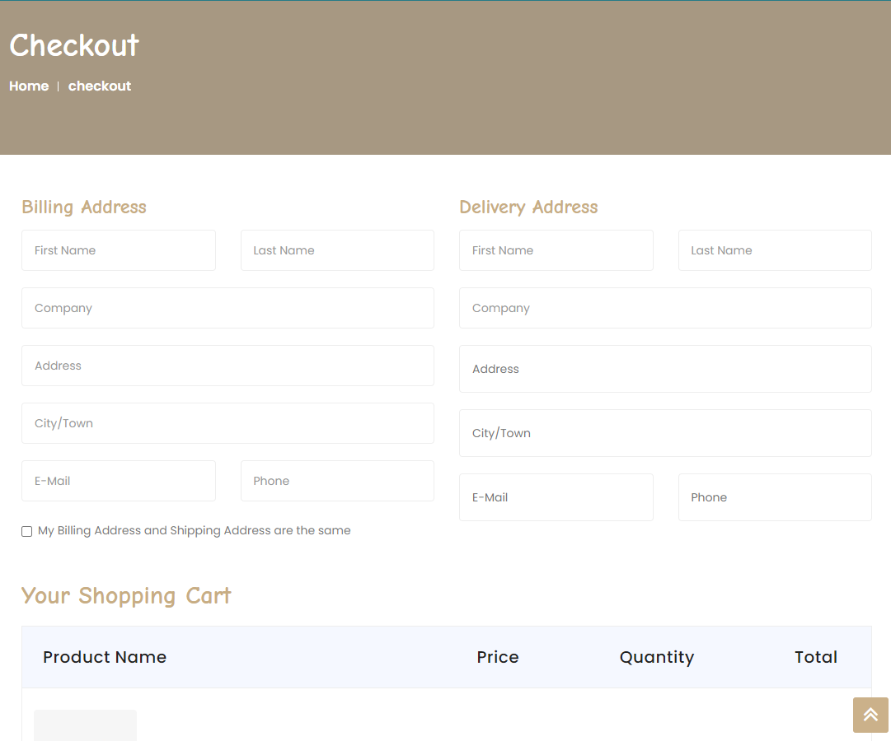

# Day44

---

>Modal 이용 product cart 만들기 
>
>로그인한 아이디의 장바구니 만들기 
>
>세미프로젝트 Day02

# Shopdb

## Product Detail 구현

1. Cart에 Modal 방식으로 넣기 

   1. 설명
      - 원하는 제품을 선택시 모달방식으로 detail을 띄운 후 cart 버튼을 누르면 uid, pid, cnt를 Cart Table에 넣는다. 

   2. 모달

      - 현재 화면에서 앞에 화면이 활성화되고 뒤의 화면은 비활성화 처리한다. 

      - 이떄 주의할점은 Model은 하나의 객체당 하나가 만들어져야 하기 때문에 th:data-target="'#'+${product.id}" 으로 해야한다. 

   ```html
   <div class="col-sm-3 text-left">
       <button type="button" class="btn btn-info btn-lg" data-toggle="modal"
               th:data-target="'#'+${product.id}">Order</button>
   </div>
   
   <!-- Modal -->
   <div class="modal fade" th:id="${product.id}" role="dialog">
       <div class="modal-dialog">
   
           <!-- Modal content-->
           <div class="modal-content text-center">
               <div class="modal-header">
                   <button type="button" class="close" data-dismiss="modal">&times;</button>
                   <h4 class="modal-title" th:text="${product.name}">Modal
                       Header</h4>
                   
               </div>
               <div class="modal-body text-left">
                   <p th:text="${product.catename}"></p>
                   <p th:text="${product.price}"></p>
   
               </div>
               <div th:if="${session.logincust != null}" class="modal-body text-left">
                   <div class="form-group">
                       <input type="hidden" th:value="${product.id}" id="pid">
                       <input type="hidden" th:value="${session.logincust.id}" id="uid">
   
                       <label for="sel1">Count : </label> <select class="form-control"
                                                                  id="cnt">
                       <option value="1">1</option>
                       <option value="2">2</option>
                       <option value="3">3</option>
                       <option value="4">4</option>
                       </select>
                   </div>
                   <button type="button" id="inputcart" class="btn btn-default">CART</button>
               </div>
               <div class="modal-footer">
                   <button type="button" class="btn btn-default" data-dismiss="modal">Close</button>
               </div>
           </div>
       </div>
   </div>
   <!-- End Modal -->
   ```

   3. 결과 화면 

   

   

## 장바구니

1. 설명 

   -  nav bar 에 있는 장바구니 아이콘을 클릭하면 로그인된 아이디의 장바구니를 불러온다.
     - 이때 로그인을 하지 않는다면 장바구니 아이콘이 보이지 않는다. 
   - 장바구니는 Cart Table 에 저장된 정보들과 Product, Category, Customer 를 Inner Join 한 결과를 Table 형태로 출력한다. 

2. 코드

3. 결과 화면

   

   

   

   

   

   

# 세미프로젝트 Day02

> [브레인스토밍 정리사이트](https://padlet.com/tidnjrk010/Bookmarks)

## 쇼핑몰 주제 선정

- 나이키 사이트와 비슷하게 신발 쇼핑몰 구현 결정
- [Nike Site](https://www.nike.com/kr/ko_kr/w/men/fw?FWSIZE=290)
  1. 왼쪽 상품 체크박스 구현이 핵심
  2. 템플릿을 이용해 구현

## 템플릿 후보 

1. [Fashion](https://www.templatebazaar.in/demo/fashion_shop/products.html)
   - 최종 결정 템플릿
   - 깔끔한 디자인, 만들고자하는 목표와 비슷
2. [Watch](https://graygrids.com/templates/estore-free-bootstrap-ecommerce-template/)
   - 유로버전, 무료버전이 따로 존재
   - 나이키와 같은 체크박스로 제품 필터링 하는 섹션 존재
3. [Shop UI](https://keenthemes.com/products/ecommerce)
   - 나이키와 같은 체크박스로 제품 필터링 하는 섹션 존재
4. [W3School 제공](https://www.w3schools.com/w3css/tryw3css_templates_clothing_store.htm)
   - W3School 제공 템플릿
5. [Shop](https://demo.htmlcodex.com/1479/online-shop-website-template/)
   - 메인화면 조금 복잡
   - shop페이지에 체크박스 존재 -> 응용가능 

## 참고자료

1. [팀 소개 페이지](https://startbootstrap.com/previews/agency)
2. [배너](https://www.miricanvas.com/templates/web_banner_hor/1186w-%EB%85%B8%EB%9E%91%EC%83%89%EA%B3%BC-%ED%8C%8C%EB%9E%91%EC%83%89%EC%9D%98-%EB%84%A4%EC%98%A8-%EC%BB%A8%EC%85%89-%EC%9D%98%EB%A5%98-%ED%94%84%EB%A1%9C%EB%AA%A8%EC%85%98-%EA%B0%80%EB%A1%9C%ED%98%95)

## 템플릿 수정 사항

- [사용 템플릿](https://www.templatebazaar.in/demo/fashion_shop/products.html)

  

  

  

  

  

  

- 페이지 상단
  - 상단바 카테고리로 수정
  - 상단바에 호버하면 나타나는 것들을 상세카테고리로 수정
  - main page 상단에 mail 클릭시 바로 메일 보낼 수 있도록 제작 (참고 사이트 : https://frontcode.tistory.com/33)
  - navbar saerch 기능 수업에서 배운내용으로 구현

- 메인 페이지
  - 홈페이지 ***\*Our Fashion Shop Work For You →\**** ajax 활용해서 브랜드 수, 상품 수, 구매 수 등등 노출 가능
  - 메인페이지 footer는 간단하게

- 상품 페이지, 상품상세 페이지
  - 상품페이지 왼쪽에 제품 필터링 추가
  - Main Menu 중 Blog Grid View Left 에서 왼쪽 menu의 tag 기능으로 물품 검색 (체크박스 부분은 다른 무료 부트스트랩의 소스를 이용 할 수도 있음)
  - 물품 리스트 아래에 있는 페이지 넘김 버튼 제작 할것인지 => < 1 2 3 4 5> 
  - 제품별 review 저장하는 Table이 필요
  - 상품페이지의 Related Product를 띄우는 기준 설정이 필요

- Contact
  - Contact Us- Map설정을 멀티캠퍼스 선릉으로 설정하기
  - Contact 페이지에 있는 이메일 또는 주소 클릭시 클립보드 복사 (참고 사이트 : http://b1ix.net/364)

- form(로그인, 회원가입, 결제)
  - Register 페이지에 JavaScript로 조건 추가하기
  - 결제 페이지에서 우편번호 API와 결제 API 사용

## 카테고리 설정

- Women, Men, Kids 3가지로 결정
- 신발 종류는 추후 설정 

## Notion 정리

- [SemiProject Day02](https://www.notion.so/220615-e7ef8898c0e147c192045ae50b3991e4)

