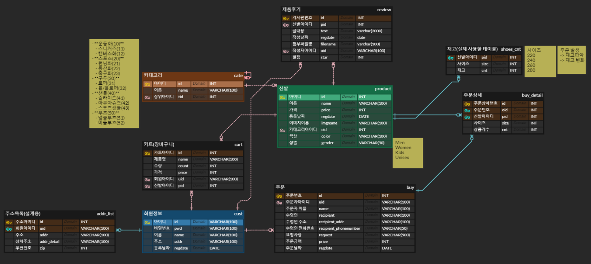

# Day45

---

>세미프로젝트 Day03

# 세미프로젝트 Day03

> [브레인스토밍 정리사이트](https://padlet.com/tidnjrk010/Bookmarks)

## 프로젝트 완료 시 제출해야 하는 것 

- 기획서
- 파워포인트
  - 기획 개요
  - 소개
  - 화면
- 코딩

## 프로젝트 참고 사이트

1. [Fasion Template](https://www.templatebazaar.in/demo/fashion_shop/products.html)
2. [쇼핑몰 ERD 예시](https://www.erdcloud.com/d/Rk9PzvGHBGBm2QGqN)
3. [ABC마트](https://www.notion.so/220616-f80fe7985c4945a3ac9f763d9a1e4324)

## 회의내용

- [ERD설계](https://www.erdcloud.com/d/tBFT5AzhSeSA2sXz7)
  - 

- 제품 성별 결정
  - Men
  - Women
  - Kids
  - Unisex
- 신발 사이즈
  - 220
  - 240
  - 260
  - 280
- 주문 발생
  - 재고파악 및 재고 변화

## 역할분담

- [역할분담 예시](https://velog.io/@hello1358/1%EC%B0%A8-%EC%BD%94%EB%94%A9-%ED%8C%80-%ED%94%84%EB%A1%9C%EC%A0%9D%ED%8A%B8-%ED%9A%8C%EA%B3%A0%EB%A1%9DMarket-ChoKurly)

- 회원가입, 로그인, Mypage(회원정보 조회, 수정, 주문내역확인, 카트(링크)

  → form, ajax, 정규식

  → 안원영

- 결제, 카트

  → 결제(API), 카트 합계(ajax) 난이도⬆️

  → 김민식

- 제품리스트, 제품상세

  → 제품 필터링 난이도⬆️

  → 서예린

- 제품 Search, 메인페이지(메뉴), Contact

  → 유정아

- 추후 설계 (관리자페이지 )

  → 회원관리, 상품관리, 입출고관리, 주문관리(주문상세도 띄워야함), 후기조회, 카트조회

## 구현할 기능

1. 페이지별 상세 기능 정하기

   무조건 카트에 넣어서 구매

   비회원구매 불가

2. 카테고리 정하기(ABC mart 참고)

   - 운동화(10)
     - 스니커즈(11)
     - 캔버스화(12)
   - 스포츠(20)
     - 런닝화(21)
     - 등산화(22)
     - 축구화(23)
   - 구두(30)
     - 로퍼(31)
     - 뮬/블로퍼(32)
   - 샌들(40)
     - 슬라이드(41)
     - 아쿠아슈즈(42)
     - 스포츠샌들(43)
   - 부츠(50)
     - 앵클부츠(51)
     - 미들부츠(52)

3. 제품리스트 왼쪽 필터 종류 정하기

   (필터 중복체크가 적용되게 설계)

   - 하위카테고리
   - 가격대
   - 색상
   - 사이즈

4. Sort by(제품리스트 순서)

   - 이름순
   - 별점순
   - 가격순

5. 로그인 기능

   - 배운 내용

   - 아이디/비번찾기, 아이디 기억, 자동로그인

6. 카트 기능

   - 배운내용

   - 전체선택, 개별선택

## SQL문 작성

1. [DDL]()
2. [DML]()
