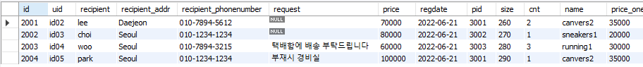

# Day49

---

> Mybatis Logger 활용법 
>
> 세미프로젝트 Day06
>

# Mybatis Logger

- Logger 란?

  - consol에 log 를 남긴다. 
  - mybatis를 이용해 Database 에 날린 sql 문을 확인한다. 

- 사용 방법

  1. maven library 에 다음 내용 추가

     ```xml
     <!-- log4j2 -->   
     <dependency>
     	<groupId>org.bgee.log4jdbc-log4j2</groupId>
     	<artifactId>log4jdbc-log4j2-jdbc4.1</artifactId>
     	<version>1.16</version>
     </dependency>
     ```

  2. scr/main/resources 폴더 아래 logback.xml 생성

     ```xml
     <?xml version="1.0" encoding="UTF-8"?>
     <configuration>
     
     	<appender name="STDOUT"
     		class="ch.qos.logback.core.ConsoleAppender">
     		<encoder>
     			<!-- 출력되는 형태를 지정 -->
     			<pattern>%d{yyyyMMdd HH:mm:ss.SSS} [%thread] %-3level %logger{5}-%msg
     				%n</pattern>
     		</encoder>
     	</appender>
     
     	<logger name="jdbc" level="OFF" /><!-- level="OFF" 를하면 사용하지 않는것 -->
     	<logger name="jdbc.sqlonly" level="DEBUG" /><!-- level="DEBUG" 를하면 
     		사용하는 것 -->
     	<logger name="jdbc.sqltiming" level="DEBUG" />
     	<logger name="jdbc.audit" level="OFF" />
     	<logger name="jdbc.resultset" level="DEBUG" />
     	<logger name="jdbc.resultsettable" level="DEBUG" />
     	<logger name="jdbc.connection" level="OFF" />
     
     
     	<!-- <root level="DEBUG"> --> <!-- 모든 정보를 표시 -->
     	<root level="INFO"> <!-- 단순 정보만 화면에 표시 따라서 서비스(사용자 제공)시 이렇게 바꾼다.  -->
     		<appender-ref ref="STDOUT" />
     	</root>
     
     </configuration>
     ```

     

# 세미프로젝트 Day06

> 개인 개발 
>
> 개발 내용 : register , Mypage ( 구조, Profie, 쇼핑정보 )

## Bootstrap \<i> 태그 Icon 크기

```html
<i class="fa fa-user fa-2x"> </i>
```

## th:include 로 여러 페이지 표시

- MainConroller

  ```java
  @Controller
  public class MainController {	
  	@RequestMapping("/")
  	public String main() {
          m.addAttribute("center", "center");
          return "index";
  	}
  }
  
  ```

- SubController

  ```java
  @Controller
  @RequestMapping("/mypage")
  public class MypageController {
  	@RequestMapping("")
  	public String mypage(Model m) {
  		
  		m.addAttribute("left", "mypage/left");// mypage 안에있는 left
  		m.addAttribute("mypage_center", "mypage/center");// mypage 안에 있는 center
  		
  		m.addAttribute("center", "mypage/mypage");
          //main 페이지의 센터에 resource/templates/mypage 경로에 있는 mypage.html을 넣는다. 
  		
  		return "index";
  	}
  }
  
  ```

## 3개의 테이블 INNER Join

- Buy, Buy_detail, Product을 이용해 원하는 값을 가져온다. 

- 이떄 가져오는 필드의 이름대로 BuyVO 에 필드를 만들어줘야한다. 

  - 생성자도 갯수에 맞게 만들어줘야 한다. 

- ```xml
  <select id="selectUserBuy" parameterType="String"
          resultType="buyVO">
      SELECT b.id, b.uid, b.recipient, b.recipient_addr, b.recipient_phonenumber,
      b.request, b.price, b.regdate,
      bd.pid , bd.size, bd.cnt,
      p.name, p.price AS price_one,p.imgname1
      FROM buy b
      INNER JOIN buy_detail bd ON b.id = bd.oid
      INNER JOIN product p ON p.id = bd.pid
      WHERE b.uid = #{id};
  </select>
  ```

- 
