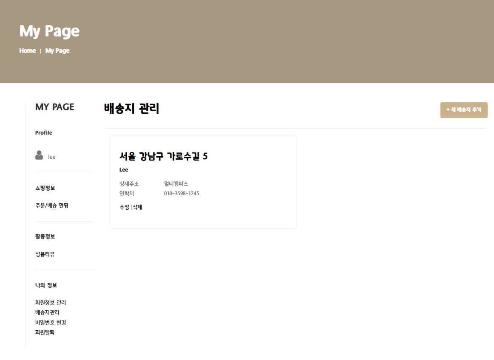

# Day53

---

> 세미프로젝트 마무리 

# 세미프로젝트 마무리

> 내가 개발한 내용

## Header 

1. 로그인과 비 로그인에 따라 다르게 표시

   - 비 로그인시 Login / Register 가 표시 

     

   - 로그인시 Logout / UserName 표시

     

## Login (로그인 화면)

1. 로그인 버튼 클릭시 login 시 공백값 체크 후 공백이라면 해당 input에 알려주기 

2. 공백이 아니라면 controller에서 DataBase에 저장되어있는 ID와 Password가 맞는지 판단 후 맞다면 로그인, 아니라면 login 페이지로 이동. 이동 후 오류 message 표시

   

   

## Register (회원가입 화면)

- 

### 전체 Check

1. 공백인 경우 해당 칸에 "필수입력요소입니다." 를 표시 

   

### ID Check

1. blur( 포커스 벗어나면 실행 ) 시 Ajax를 이용해 Database에 있는 Id와 비교.  
   - 만약 Id가 존재한다면 "사용불가능한 ID"
   - ID가 존재하지 않는다면 "사용가능한 ID" 를 출력 

### Password Check

- Password 

  1. 포커스가 가기전에는 Password 조건을 표시하는 박스를 .hide() 를 사용하여 숨기고 포커스를 받을경우 Password 조건을 표시하는 박스를 .show() 를 사용하여 표시 

  2. Password 조건은 총 3가지로, 조건을 만족하면 초록색 글씨와 V 표시를, 조건을 만족하지 않는다면 빨간색 글씨와 X 표시로 나타낸다. 

  3. 사용 가능한 Password면 "사용할 수 있는 password입니다." 를 표시 

     

     

     

- Password 확인 

  1. 앞에서 작성한 Password와 동일한 값을 입력하면 "password와 같습니다. 이용가능 " 을 표시하고 동일하지 않다면 "password와 다릅니다. 다시입력해주세요. " 를 표시 

### TelPhone Check

1. 정규식을 사용하여 전화번호 형식 ( 010-1234-5678 ) 에 맞는지를 확인한다. 

   - 정규식으로 조건을 확인하고 전화번호 형식과 다르다면 "전화번호 형식에 맞지 않습니다. 010-1111-1111 형식으로 작성하세요, "를 표시 
   - 조건이 맞다면 "사용가능한 전화번호 형식입니다. " 를 표시 

2. Maxlength() 를 이용해 입력 글자수를 전화번호 자리수인 13자리로 제한했다.

   

- 가입성공시 자동 로그인. 만약 회원가입 조건 1개라도 만족하지 않을 시 submit이 발생하지 않는다. 

## MyPage

- 로그인한 경우만 이용할 수 있도록 구성. 

  

- 로그인한 id를 이용해 mypage의 값들을 표시한다. 

### 주문내역 / 배송현황

- 로그인된 id로 주문한 물품을 표시한다. 1개의 주문번호에는 여러개의 결재내용( buy_detail ) 이 들어갈 수 있다. 

- **물품 이름과 사진을 클릭**하면 해당 물건의 detail 페이지로 연결된다. 

  - 가격에는 결제한 물건갯수와 가격을 곱한 값이 표시된다. 

- **상세주문내역**을 클릭하면 해당 주문번호로 주문된 물건의 리스트가 나온다. 

- **주문취소** 클릭시 해당 주문번호로 된 주문이 취소되고 주문과 연결되어있는 "상세주문내역" 의 정보또한 삭제된다. 

  

  

  

### 상품리뷰

1. 나의 상품리뷰 쓰기

   - 로그인한 ID로 구매된 물건 중 1달 이내에 구매한 상품만 "나의 상품리뷰 쓰기" 에 띄운다. 

     - 만약 모든 구매한 상품을 보고싶다면 "전체보기" 를 클릭한다. 

     

     

   - 만약 해당 Product 행을 클릭하면 Product Detail 페이지로 연결된다. 

     

2. 나의 상품리뷰 모아보기
   - 자신이 작성한 리뷰 목록을 모두 보여준다. 
   - 별점 정보를 Star로 변경하여 표시한다. 
   - 해당 리뷰를 클릭하면 Product Detail로 이동할 수 있다. 

### 회원정보 관리

- 회원의 정보를 수정할 수 있는 공간 . 

- 이름과 휴대폰 번호를 변경할 수 있다. 이때 휴대폰입력란을 정규식을 사용하여 010-1234-5678 형식으로 작성할 수 있도록 한다. 

  

  

### 배송지 관리

- 로그인한 ID로 작성된 배송지 리스트를 표시한다. 

- 배송지는 **"새 배송지 추가" 버튼**을 이용해 추가할 수있다. 

  - 배송지 추가버튼을 누르게 되면 "베송지 추가" 페이지로 이동한다. 

  - 우편주소 API를 사용하여 주소를 추가할 수있다. 

    

  ​	

  ​	

  ​	

- 각각의 배송지는 **수정/ 삭제**를 할 수 있다. 

  - 삭제시 "정말로 삭제하시겠습니까?" 를 물어보고 확인을 누르면 해당 배송지가 삭제된다. 

    

    

### 비밀번호 변경

- 사용자의 비밀번호를 변경할 수 있다. 

  ​	

- 기존 비밀번호 

  - Ajax를 통해 로그인한 ID의 비밀번호와 비교한다. 만약 기존 비밀번호와 다르다면 "현재 비밀번호와 다릅니다." 출력

    

- 새 비밀번호

  - 3가지 조건 만족시 비밀번호 사용할 수 있도록 만들었다. 

    

- 해당 모든 조건들을 만족해야 submit이 일어난다. 

### 회원탈퇴

- 로그인한 비밀번호를 이용해 회원을 탈퇴할 수 있도록 만들었다. 

- Ajax를 이용해 기존비밀번호와 비교한다. 

- 맞는 비밀번호입력하고 탈퇴버튼을 누르면 해당 사용자에 대한 모든 정보가 삭제된다. 

  - 회원 테이블
  - 주소지 목록 테이블
  - 주문 테이블
  - 주문 디테일 테이블
  - 리뷰 테이블
  - 장바구니 테이블 

  
