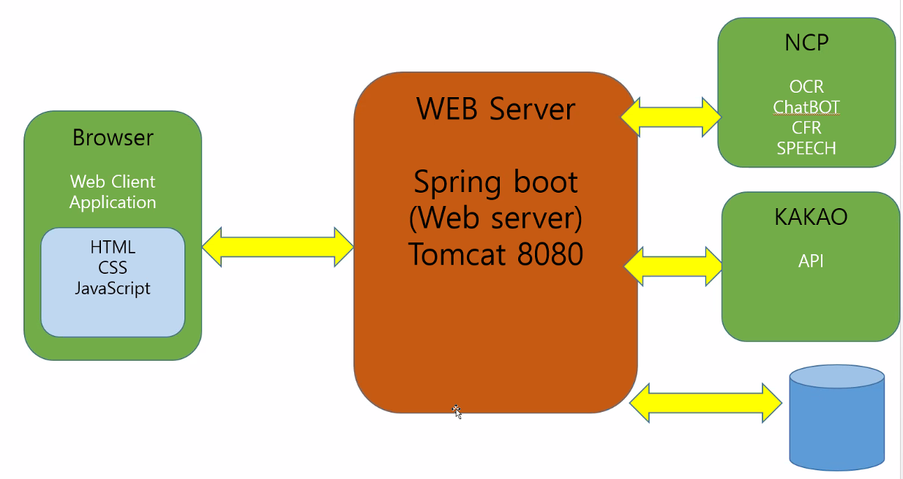
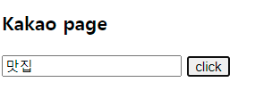
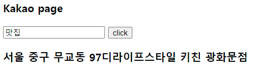
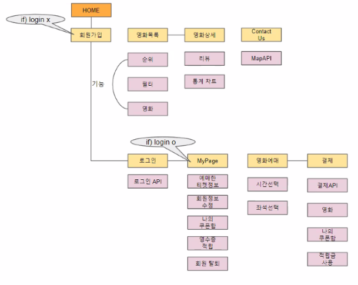

# Day60

---

> NCP ( CLOVA OCR 사용 - 문자 판독기 )
>
> JSON 데이터 정제 방법 

# NCP 

### 구조

​	

### 카카오 지도 API 사용 

- ncp 서버를 통해 지도를 불러와야 하기 때문에 javascript Key 가 아닌 Rest Key 를 사용해야한다. 

- KaKaoTest.java 파일

  ```java
  @Component
  public class KakaoAPI {
  
  	public String kakaolocalapi(String keyword) throws Exception {
  		String address = "https://dapi.kakao.com/v2/local/search/keyword.JSON";
          
  		String param = "query=" + keyword
  				//+ "&category_group_code=" + "FD6"
  				+ "&x=" + "37.5606326" // 현재 나의 위치 x 좌표
  				+ "&y=" + "126.9433486" // 현재 나의 위치 y 좌표
  				+ "&radius=" + "1000"; // 1km 안에서 검색 
  
  		String apiKey = "bf688fae49b592a5af93829db4dd43d3";	//발급받은 restapi key
  
  		URL url = new URL(address);  			//접속할 url 설정
  		HttpURLConnection conn;					//httpURLConnection 객체
  		conn = (HttpURLConnection) url.openConnection();	//접속할 url과 네트워크 커넥션을 연다.
  		conn.setRequestMethod("POST");             
  		conn.setDoOutput(true);
  		conn.setUseCaches(false);
  		conn.setRequestProperty("Authorization", "KakaoAK " + apiKey);	//Property 설정
  
  		OutputStreamWriter ds = new OutputStreamWriter(conn.getOutputStream());
  		ds.write(param);
  		ds.flush();
  		ds.close();
  
  
  		int responseCode = conn.getResponseCode();		//responseCode를 받아옴.
  
  		InputStream inputStream = conn.getInputStream();	//데이터를 받아오기 위한 inputStream
  		BufferedReader br;		//inputStream으로 들어오는 데이터를 읽기 위한 reader
  		String json = null;
  		Charset charset = Charset.forName("UTF-8");
  		if(responseCode == 200) {
  			br = new BufferedReader(new InputStreamReader(inputStream,charset));
  			json = br.readLine();
  			br.close();
  		}
  		else {
  			System.out.println(" ERROR !!! ");
  		}
  
  		inputStream.close();
  		conn.disconnect();
  		System.out.println(json);
  
  		return json;
  	}
  }
  ```
  
- 결과

  - data 형태 

    - ```
      {"documents":[{"address_name":"서울 중구 무교동 97","category_group_code":"FD6","category_group_name":"음식점","category_name":"음식점 \u003e 양식","distance":"","id":"444516464","phone":"02-6273-0100","place_name":"디라이프스타일 키친 광화문점","place_url":"http://place.map.kakao.com/444516464","road_address_name":"서울 중구 세종대로 136","x":"126.978257891095","y":"37.5684224971952"},{"address_name":"서울 종로구 청진동 128","category_group_code":"FD6","category_group_name":"음식점","category_name":"음식점 \u003e 한식 \u003e 한정식","distance":"","id":"967729291","phone":"02-6226-8191","place_name":"진진수라 광화문점","place_url":"http://place.map.kakao.com/967729291","road_address_name":"서울 종로구 종로5길 7","x":"126.980543813707","y":"37.5706357409413"}],"meta":{"is_end":false,"pageable_count":45,"same_name":{"keyword":"맛집","region":[],"selected_region":""},"total_count":850408}}
      ```

  - 데이터 정제 

    ```javascript
    function display(data){
    	var info = data.documents[0];
    	
    	$('#result').text(info['address_name'] + info['place_name']);
    }
    
    $(document).ready(function(){
    	$('#bt').click(function(){
    		var param = $('#param').val();
    		$.ajax({
    			url: 'kakaolocal',
    			data : {'keyword' : param},
    			success : function(data){
    				display(data);
    			}
    		});
    	});
    });
    ```

  - 결과 화면 

    

    


# Final Project

> 사람별 페이지 나누기 
>
> 기능 구현 상의 
>
> 기획안 및 I.A 설계

### 깃허브 구축 ( 브랜치 점검 )

- [GithubProject 소스 ](https://github.com/JangHyojoon/Ticket_SaJo)

### [기획안 완성](https://docs.google.com/document/d/1MbLavEHwsvxEfyyYkqMv0_yCHno2QccQ/edit)

### UI 설계 ( 홈페이지 계층 구조도)


