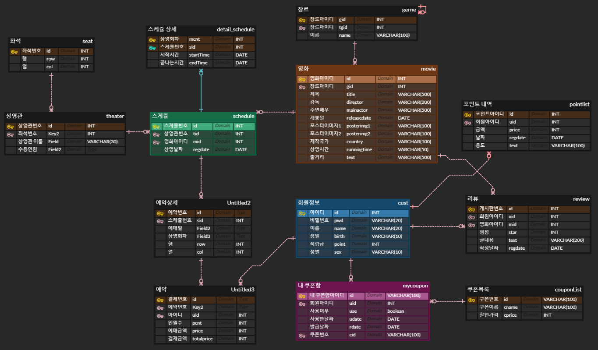

# Day61

---

> NCP ( papago ( 언어 번역기 ) , CFR ( 얼굴 인식기 ))
>
> 입력한 단어로 구글 search 이용 

# NCP

## PaPaGo

- 한글을 입력하면 영어로 번역할 수 있다. 

```java
@Component
public class NaverAPI {
	// key 값
	String clientId = "ld3ug5ep18";// 애플리케이션 클라이언트 아이디값";
	String clientSecret = "Wa93tYarqBJgeHCAcn5yEfK9c764G1tTf5bLGFHn";// 애플리케이션 클라이언트 시크릿값";

	public Object papago(String txt) {
		String result = "";

		try {
			String text = URLEncoder.encode(txt, "UTF-8");// 텍스트 값
			String apiURL = "https://naveropenapi.apigw.ntruss.com/nmt/v1/translation";// ncp 주소로 요청을 보낸다.
			URL url = new URL(apiURL);
			HttpURLConnection con = (HttpURLConnection) url.openConnection();
			con.setRequestMethod("POST");
			con.setRequestProperty("X-NCP-APIGW-API-KEY-ID", clientId);
			con.setRequestProperty("X-NCP-APIGW-API-KEY", clientSecret);
			// post request
			String postParams = "source=ko&target=en&text=" + text;
			con.setDoOutput(true);
			DataOutputStream wr = new DataOutputStream(con.getOutputStream());
			wr.writeBytes(postParams);
			wr.flush();
			wr.close();
			int responseCode = con.getResponseCode();
			BufferedReader br;
			if (responseCode == 200) { // 정상 호출
				br = new BufferedReader(new InputStreamReader(con.getInputStream()));
			} else { // 오류 발생
				br = new BufferedReader(new InputStreamReader(con.getErrorStream()));
			}
			String inputLine;
			StringBuffer response = new StringBuffer();
			while ((inputLine = br.readLine()) != null) {
				response.append(inputLine);
			}
			br.close();
			
			result = response.toString();
			System.out.println(result);
			System.out.println(response.toString());
		} catch (Exception e) {
			System.out.println(e);
		}

		JSONParser parser = new JSONParser();
		Object obj = null;
		try {
			obj = parser.parse(result);
		}catch(Exception e) {
			e.printStackTrace();
		}
		return obj;
	}
}
```


## CFR ( face 인식)

- 닮은 사람 찾아주는 API

- 이미지 파일을 AI가 인식해 유명인과 비교하여 가장 비슷하게 생긴 유명인을 출력한다. 일치도, 감정 등 여러가지 속성을 포함하고 있다. 

- 종류

  - 닮은 유명인 검색
  - 얼굴의 표정을 인식하여 기쁜지 슬픈지 등 감정을 판단.

- 닮은 유명인 검색 

  ```java
  @Test
  void contextLoads() {
      StringBuffer reqStr = new StringBuffer();
      String clientId = "ld3ug5ep18";// 애플리케이션 클라이언트 아이디값";
      String clientSecret = "Wa93tYarqBJgeHCAcn5yEfK9c764G1tTf5bLGFHn";// 애플리케이션 클라이언트 시크릿값";
      // 이미지를 가져올 디렉토리 정보
      // C -> Spring -> ncp -> src -> resources -> img 파일에서 사진을 가져온다.
      String imgpath = Paths.get(System.getProperty("user.dir"), "src", "main", "resources", "static", "img")
          .toString();
  
      try {
          String paramName = "image"; // 파라미터명은 image로 지정
          String imgFile = imgpath + "\\img1.jpg";
          File uploadFile = new File(imgFile);
          String apiURL = "https://naveropenapi.apigw.ntruss.com/vision/v1/celebrity"; // 유명인 얼굴 인식
          URL url = new URL(apiURL);
          HttpURLConnection con = (HttpURLConnection) url.openConnection();
          con.setUseCaches(false);
          con.setDoOutput(true);
          con.setDoInput(true);
          // multipart request
          String boundary = "---" + System.currentTimeMillis() + "---";
          con.setRequestProperty("Content-Type", "multipart/form-data; boundary=" + boundary);
          con.setRequestProperty("X-NCP-APIGW-API-KEY-ID", clientId);
          con.setRequestProperty("X-NCP-APIGW-API-KEY", clientSecret);
          OutputStream outputStream = con.getOutputStream();
          PrintWriter writer = new PrintWriter(new OutputStreamWriter(outputStream, "UTF-8"), true);
          String LINE_FEED = "\r\n";
          // file 추가
          String fileName = uploadFile.getName();
          writer.append("--" + boundary).append(LINE_FEED);
          writer.append("Content-Disposition: form-data; name=\"" + paramName + "\"; filename=\"" + fileName + "\"")
              .append(LINE_FEED);
          writer.append("Content-Type: " + URLConnection.guessContentTypeFromName(fileName)).append(LINE_FEED);
          writer.append(LINE_FEED);
          writer.flush();
          FileInputStream inputStream = new FileInputStream(uploadFile);
          byte[] buffer = new byte[4096];
          int bytesRead = -1;
          while ((bytesRead = inputStream.read(buffer)) != -1) {
              outputStream.write(buffer, 0, bytesRead);
          }
          outputStream.flush();
          inputStream.close();
          writer.append(LINE_FEED).flush();
          writer.append("--" + boundary + "--").append(LINE_FEED);
          writer.close();
          BufferedReader br = null;
          int responseCode = con.getResponseCode();
          if (responseCode == 200) { // 정상 호출
              br = new BufferedReader(new InputStreamReader(con.getInputStream()));
          } else { // 오류 발생
              System.out.println("error!!!!!!! responseCode= " + responseCode);
              br = new BufferedReader(new InputStreamReader(con.getInputStream()));
          }
          String inputLine;
          if (br != null) {
              StringBuffer response = new StringBuffer();
              while ((inputLine = br.readLine()) != null) {
                  response.append(inputLine);
              }
              br.close();
              System.out.println(response.toString());
          } else {
              System.out.println("error !!!");
          }
      } catch (Exception e) {
          System.out.println(e);
      }
  }
  ```

  - 마동석 이미지를 넣었을 경우 결과 출력물 

    ```
    {"info":{"size":{"width":559,"height":373},"faceCount":1},"faces":[{"celebrity":{"value":"마동석","confidence":1.0}}]}
    ```

    - confidence 가 정확도임 

- 얼굴의 표정을 인식하여 기쁜지 슬픈지 등 감정을 판단.

  ```java
  @Test
  void contextLoads() {
      StringBuffer reqStr = new StringBuffer();
      String clientId = "ld3ug5ep18";// 애플리케이션 클라이언트 아이디값";
      String clientSecret = "Wa93tYarqBJgeHCAcn5yEfK9c764G1tTf5bLGFHn";// 애플리케이션 클라이언트 시크릿값";
      String imgpath = Paths.get(System.getProperty("user.dir"), "src", "main", "resources", "static", "img")
          .toString();
  
      try {
          String paramName = "image"; // 파라미터명은 image로 지정
          String imgFile = imgpath + "\\img1.jpg";
          File uploadFile = new File(imgFile);
          String apiURL = "https://naveropenapi.apigw.ntruss.com/vision/v1/face"; // 얼굴 감지
          URL url = new URL(apiURL);
          HttpURLConnection con = (HttpURLConnection) url.openConnection();
          con.setUseCaches(false);
          con.setDoOutput(true);
          con.setDoInput(true);
          // multipart request
          String boundary = "---" + System.currentTimeMillis() + "---";
          con.setRequestProperty("Content-Type", "multipart/form-data; boundary=" + boundary);
          con.setRequestProperty("X-NCP-APIGW-API-KEY-ID", clientId);
          con.setRequestProperty("X-NCP-APIGW-API-KEY", clientSecret);
          OutputStream outputStream = con.getOutputStream();
          PrintWriter writer = new PrintWriter(new OutputStreamWriter(outputStream, "UTF-8"), true);
          String LINE_FEED = "\r\n";
          // file 추가
          String fileName = uploadFile.getName();
          writer.append("--" + boundary).append(LINE_FEED);
          writer.append("Content-Disposition: form-data; name=\"" + paramName + "\"; filename=\"" + fileName + "\"")
              .append(LINE_FEED);
          writer.append("Content-Type: " + URLConnection.guessContentTypeFromName(fileName)).append(LINE_FEED);
          writer.append(LINE_FEED);
          writer.flush();
          FileInputStream inputStream = new FileInputStream(uploadFile);
          byte[] buffer = new byte[4096];
          int bytesRead = -1;
          while ((bytesRead = inputStream.read(buffer)) != -1) {
              outputStream.write(buffer, 0, bytesRead);
          }
          outputStream.flush();
          inputStream.close();
          writer.append(LINE_FEED).flush();
          writer.append("--" + boundary + "--").append(LINE_FEED);
          writer.close();
          BufferedReader br = null;
          int responseCode = con.getResponseCode();
          if (responseCode == 200) { // 정상 호출
              br = new BufferedReader(new InputStreamReader(con.getInputStream()));
          } else { // 오류 발생
              System.out.println("error!!!!!!! responseCode= " + responseCode);
              br = new BufferedReader(new InputStreamReader(con.getInputStream()));
          }
          String inputLine;
          if (br != null) {
              StringBuffer response = new StringBuffer();
              while ((inputLine = br.readLine()) != null) {
                  response.append(inputLine);
              }
              br.close();
              System.out.println(response.toString());
          } else {
              System.out.println("error !!!");
          }
      } catch (Exception e) {
          System.out.println(e);
      }
  }
  ```

  - 마동석 이미지를 넣었을 경우 출력물

    ```
    {"info":{"size":{"width":559,"height":373},"faceCount":1},"faces":[{"roi":{"x":171,"y":77,"width":115,"height":115},"landmark":null,"gender":{"value":"male","confidence":0.658607},"age":{"value":"40~44","confidence":0.120769},"emotion":{"value":"neutral","confidence":0.944595},"pose":{"value":"part_face","confidence":0.666718}}]}
    ```


# Final Project

> 1차 ERD Cloud 작성
>
> 질문 정리 
>
> 기획안 완성

### ERD 작성

- [Ticket_SaJo](https://www.erdcloud.com/d/Gb6vzq6LdsJjFpduL)

  

### 질문 정리

1. 예약상세테이블 필요한지
2. PK없이 FK로만 테이블 구성 가능한지 (예매상세, 상영상세)
3. imDb이용해서 데이터 정제 생각, 데이터 정제 방법?
4. 쿠폰 사용 유무에 따라 삭제 or true/false
5. AiTEMS 사용법

### 기획완 완성

[파이널프로젝트 기획안 4조.docx - Google Docs](https://docs.google.com/document/d/1MbLavEHwsvxEfyyYkqMv0_yCHno2QccQ/edit)

- AI Platform (CLOVA CFR)을 활용한 닮은 꼴 배우 찾기 이벤트 페이지 구현 추가
- 챗봇 기능 제외
- 성인인증 API 제외

# google search 이용

- html 로 입력받은 단어를 google 검색을 통해 보여준다. 
- [참고 사이트 ](https://codemate.kr/@kjw5394/HTMLCSS-12.-%EA%B2%80%EC%83%89-%EA%B8%B0%EB%8A%A5-%EA%B5%AC%ED%98%84)
- 이용 방법 
  - "google.com/search?q=" 을 이용해야한다. 
  - google은 q 에 검색하는 언어가 들어간다. 

1. form 이용

   ```html
   <form action="https://www.google.com/search" method="GET">
   	<input name="q" type="text">
   	<input type="submit">
   </form>
   ```

2. a 태그 이용 

   ```html
   <a href="https://www.google.com/search?q=김밥" target="_blank">김밥 새창에서 검색 </a>
   ```
