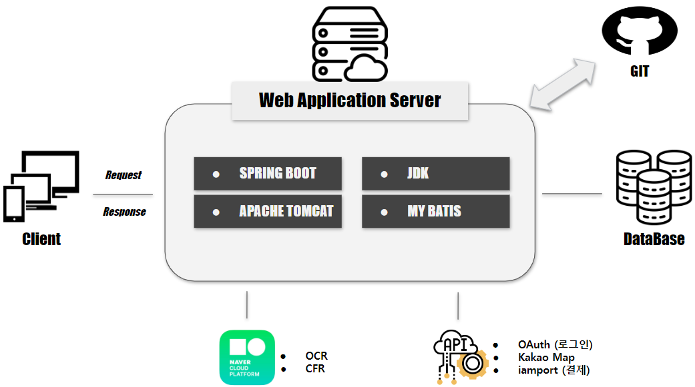

# Day63

---

> NCP ( ORC, Chatbot )
>
> Final Project 

## ORC

- [가이드](https://api.ncloud-docs.com/docs/ai-application-service-ocr)

- 이미지(사진) 속 글자 위치를 찾고 어떤 글자인지 자동으로 알아내는 기술

- 이용순서

  1. 도메인 생성 
     - 서비스 타입 : Template
     - 인식 모델 : Basic
     - 서비스 플랜 : Free
  2. 템플릿 빌드
     - 외부연동 - 연동설정 - API GW 자동연동 수정 클릭 - Secret Key , URL 복사 
  3. 템플릿 생성 
     - 대표 샘플명 설정
     - 이미지 업로드
     - 인식할 필드 설정 - 범위 설정 - 필드 추가 - 필드명 입력 
  4. 서비스 배포 

  ```java
  @SpringBootTest
  class ORCTest {
  
  	@Test
  	void contextLoads() {
  		String apiURL = "https://xtwbhr7su2.apigw.ntruss.com/custom/v1/17117/6f110091285c7ebd50a9791420901fcd45eeb5aa0bd61fa069f94727ebb1df08/infer";
  		String secretKey = "dXBQTWlza3dEV1pyQUlOdWFKRE1sb2xaaUpLcUpqcFo=";// 
  	    String imgpath = Paths.get(System.getProperty("user.dir"), "src", "main", "resources", "static","img").toString();//이미지 저장 경로 
  	    String imageFile = imgpath +"\\biz2.jpg";//이미지 이름 
  		try {
  			URL url = new URL(apiURL);
  			HttpURLConnection con = (HttpURLConnection)url.openConnection();
  			con.setUseCaches(false);
  			con.setDoInput(true);
  			con.setDoOutput(true);
  			con.setReadTimeout(30000);
  			con.setRequestMethod("POST");
  			String boundary = "----" + UUID.randomUUID().toString().replaceAll("-", "");
  			con.setRequestProperty("Content-Type", "multipart/form-data; boundary=" + boundary);
  			con.setRequestProperty("X-OCR-SECRET", secretKey);
  
  			JSONObject json = new JSONObject();
  			json.put("version", "V2");
  			json.put("requestId", UUID.randomUUID().toString());
  			json.put("timestamp", System.currentTimeMillis());
  			JSONObject image = new JSONObject();
  			image.put("format", "jpg");
  			image.put("name", "demo");
  			JSONArray images = new JSONArray();
  			images.put(image);
  			json.put("images", images);
  			String postParams = json.toString();
  
  			con.connect();
  			DataOutputStream wr = new DataOutputStream(con.getOutputStream());
  			long start = System.currentTimeMillis();
  			File file = new File(imageFile);
  			System.out.println("----------"+file.getName());
  			System.out.println("----------"+file.getPath());
  			System.out.println("----------"+file.getAbsolutePath());
  			writeMultiPart(wr, postParams, file, boundary);
  			wr.close();
  
  			int responseCode = con.getResponseCode();
  			BufferedReader br;
  			if (responseCode == 200) {
  				br = new BufferedReader(new InputStreamReader(con.getInputStream()));
  			} else {
  				br = new BufferedReader(new InputStreamReader(con.getErrorStream()));
  			}
  			String inputLine;
  			StringBuffer response = new StringBuffer();
  			while ((inputLine = br.readLine()) != null) {
  				response.append(inputLine);
  			}
  			br.close();
  			System.out.println("REsult:");
  			System.out.println(response);
  		} catch (Exception e) {
  			System.out.println(e);
  		}
  	}
  	private void writeMultiPart(OutputStream out, String jsonMessage, File file, String boundary) throws
  	IOException {
  		StringBuilder sb = new StringBuilder();
  		sb.append("--").append(boundary).append("\r\n");
  		sb.append("Content-Disposition:form-data; name=\"message\"\r\n\r\n");
  		sb.append(jsonMessage);
  		sb.append("\r\n");
  	
  		out.write(sb.toString().getBytes("UTF-8"));
  		out.flush();
  	
  		if (file != null && file.isFile()) {
  			out.write(("--" + boundary + "\r\n").getBytes("UTF-8"));
  			StringBuilder fileString = new StringBuilder();
  			fileString
  				.append("Content-Disposition:form-data; name=\"file\"; filename=");
  			fileString.append("\"" + file.getName() + "\"\r\n");
  			fileString.append("Content-Type: application/octet-stream\r\n\r\n");
  			out.write(fileString.toString().getBytes("UTF-8"));
  			out.flush();
  	
  			try (FileInputStream fis = new FileInputStream(file)) {
  				byte[] buffer = new byte[8192];
  				int count;
  				while ((count = fis.read(buffer)) != -1) {
  					out.write(buffer, 0, count);
  				}
  				out.write("\r\n".getBytes());
  			}
  	
  			out.write(("--" + boundary + "--\r\n").getBytes("UTF-8"));
  		}
  		out.flush();
  	}	
  }
  
  ```

  

## ChatBot

- [가이드](https://api.ncloud-docs.com/docs/ai-application-service-chatbot)

- 빌더에서 설정한 도메인의 학습결과를 기반으로 질의 응답을 제공하는 API로, 사용자의 질문을 입력받고, 그에 맞는 답변을 다양한 형식으로 반환한다. 

- 이용순서

  1. 도메인 생성 
  2. 대화 목록 다운로드 
     - 챗봇 설정 - Built in 템플릿 - 템플릿 적용
  3. 대화 확인 
     - 다운받은 템플릿 확인 
  4. 모델 빌드
     - 오른쪽 상단 - 대화 모델 빌드 - 빠른빌드 ( 빨리 학습됨)
  5. 서비스 배포 
     - 오른쪽 상단  -  서비스 배포 
  6. 테스트
     - 오른쪽 메뉴 - 수동 테스트 - 바로시작 - 대화목록에 있는 질문 입력 - 답변확인 

  ```java
  package com.ncp;
  
  import java.io.BufferedReader;
  import java.io.DataOutputStream;
  import java.io.IOException;
  import java.io.InputStreamReader;
  import java.net.HttpURLConnection;
  import java.net.URL;
  import java.util.Base64;
  import java.util.Date;
  
  import javax.crypto.Mac;
  import javax.crypto.spec.SecretKeySpec;
  
  import org.json.simple.JSONArray;
  import org.json.simple.JSONObject;
  import org.json.simple.parser.JSONParser;
  import org.junit.jupiter.api.Test;
  import org.springframework.boot.test.context.SpringBootTest;
  
  
  
  @SpringBootTest
  class ChatbotTest {
  	private String secretKey = "elRrU2J5UWhJb0pzVGVuaHFETnlBdG9xZ2VSelpMY3g=";
  	private String apiUrl = "https://vhigwthcip.apigw.ntruss.com/custom/v1/7259/8205b494ebf87aad265bf236548f2c5a12a87f3546e5db2face4c8b54e75c3e3";
  //	private String secretKey = "aUtDWGx5RVhLTmV5Qm5meVFJUHNYY251TlZWREdneVc=";
  //	private String apiUrl = "https://y9w15yhj9a.apigw.ntruss.com/custom/v1/7149/dbd51ea13cb71d83b8809e57cb2e7db47698813fe7b8aa1ecbfe2f2cc922ad8c";
  	
  	@Test
  	void contextLoads() throws IOException {
  		URL url = new URL(apiUrl);
  		String chatMessage = "요즘 뭐해";
  		String message =  getReqMessage(chatMessage);
  		String encodeBase64String = makeSignature(message, secretKey);
  		System.out.println(message);
  		System.out.println(encodeBase64String);
  		HttpURLConnection con = (HttpURLConnection)url.openConnection();
  		con.setRequestMethod("POST");
  		con.setRequestProperty("Content-Type", "application/json;UTF-8");
  		con.setRequestProperty("X-NCP-CHATBOT_SIGNATURE", encodeBase64String);
  
  		con.setDoOutput(true);
  		DataOutputStream wr = new DataOutputStream(con.getOutputStream());
  
  		wr.write(message.getBytes("UTF-8"));
  		wr.flush();
  		wr.close();
  		int responseCode = con.getResponseCode();
  		System.out.println("responseCode:"+responseCode);
  
  		BufferedReader br;
  
  		if(responseCode==200) { // 정상 호출
  
  			BufferedReader in = new BufferedReader(
  					new InputStreamReader(
  							con.getInputStream()));
  			String decodedString;
  			String jsonString = "";
  			while ((decodedString = in.readLine()) != null) {
  				jsonString = decodedString;
  			}
  			//chatbotMessage = decodedString;
  			
  			JSONParser jsonparser = new JSONParser();
  			try {
  
  				JSONObject json = (JSONObject)jsonparser.parse(jsonString);
  				JSONArray bubblesArray = (JSONArray)json.get("bubbles");
  				JSONObject bubbles = (JSONObject)bubblesArray.get(0);
  				JSONObject data = (JSONObject)bubbles.get("data");
  				String description = "";
  				description = (String)data.get("description");
  				chatMessage = description;
  			} catch (Exception e) {
  				System.out.println("error");
  				e.printStackTrace();
  			}
  
  			in.close();
  
  		} else {  // 에러 발생
  			System.out.println("Error");
  
  			chatMessage = con.getResponseMessage();
  		}
  		System.out.println("REsult:"+chatMessage);
  	}	
  	
  	public String getReqMessage(String voiceMessage) {
  
  		String requestBody = "";
  
  		try {
  
  			JSONObject obj = new JSONObject();
  
  			long timestamp = new Date().getTime();
  
  			System.out.println("##"+timestamp);
  
  			obj.put("version", "v2");
  			obj.put("userId", "U47b00b58c90f8e47428af8b7bddc1231heo2");
  			obj.put("timestamp", timestamp);
  
  			JSONObject bubbles_obj = new JSONObject();
  
  			bubbles_obj.put("type", "text");
  
  			JSONObject data_obj = new JSONObject();
  			data_obj.put("description", voiceMessage);
  
  			bubbles_obj.put("type", "text");
  			bubbles_obj.put("data", data_obj);
  
  			JSONArray bubbles_array = new JSONArray();
  			bubbles_array.add(bubbles_obj);
  
  			obj.put("bubbles", bubbles_array);
  			obj.put("event", "send");
  
  			requestBody = obj.toString();
  
  		} catch (Exception e){
  			System.out.println("## Exception : " + e);
  		}
  		return requestBody;
  	}
  	public String makeSignature(String message, String secretKey) {
  
  		 String encodeBase64String = "";
  
  	        try {
  	            byte[] secrete_key_bytes = secretKey.getBytes("UTF-8");
  
  	            SecretKeySpec signingKey = new SecretKeySpec(secrete_key_bytes, "HmacSHA256");
  	            Mac mac = Mac.getInstance("HmacSHA256");
  	            mac.init(signingKey);
  
  	            byte[] rawHmac = mac.doFinal(message.getBytes("UTF-8"));
  	            encodeBase64String = Base64.getEncoder().encodeToString(rawHmac);
  
  	            return encodeBase64String;
  
  	        } catch (Exception e){
  	            System.out.println(e);
  	        }
  	        return encodeBase64String;
  	}	
  }
  
  ```

  

# Final Project

>시스템 구성도 제작 
>
>역할 분배 및 Controller 생성
>
>개발 환경 셋팅 마무리 



