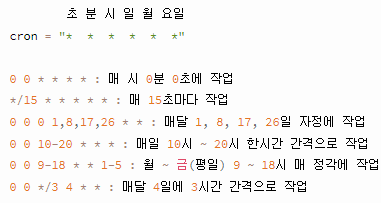

# Day64

---

> ncp ( WebSocket, Scheduler)
>
> Final Project 

# NCP 

## WebSocket

- 다음 사이트의 증권 거래 처럼, 실시간으로 정보를 내려받을 수 있다. 

  - HTML5 에서 기본적으로 제공한다. 

- Stopm

  - websocket을 쉽게 사용할 수 있게 하는 라이브러리

- 사용방법 

  1. [정리 사이트](https://cafe.naver.com/2022webservice)

  2. pom.xml 에 websocket 사용 정의

     ```xml
     <!-- WebSocket -->
     <dependency>
         <groupId>org.springframework.boot</groupId>
         <artifactId>spring-boot-starter-websocket</artifactId>
     </dependency>
     
     <dependency>
         <groupId>org.webjars</groupId>
         <artifactId>webjars-locator-core</artifactId>
     </dependency>
     <dependency>
         <groupId>org.webjars</groupId>
         <artifactId>sockjs-client</artifactId>
         <version>1.0.2</version>
     </dependency>
     <dependency>
         <groupId>org.webjars</groupId>
         <artifactId>stomp-websocket</artifactId>
         <version>2.3.3</version>
     </dependency>
     <dependency>
         <groupId>org.webjars</groupId>
         <artifactId>bootstrap</artifactId>
         <version>3.3.7</version>
     </dependency>
     ```

  3. websocket 에대한 config 생성

     ```java
     @EnableWebSocketMessageBroker
     @Configuration
     public class StomWebSocketConfig implements WebSocketMessageBrokerConfigurer {
     
     	@Override
     	public void registerStompEndpoints(StompEndpointRegistry registry) {
     		registry.addEndpoint("/ws").setAllowedOrigins("http://localhost:8080").withSockJS();
     		// ws는 경로를 뜻한다. 즉 browser와 browser가 서버의 ws로 동일하게 접속하고 url 포트번호는 localhost:8080 이다. 
     	}
     
     	/* 어플리케이션 내부에서 사용할 path를 지정할 수 있음 */
     	@Override
     	public void configureMessageBroker(MessageBrokerRegistry registry) {
     		registry.enableSimpleBroker("/send");
     		// 현재 접속되어있는 browser로 메시지를 전송해줌 
     	}
     }
     ```

  4. MessageVO 구현

     - 주고받을 메시지 형태 정의

     ```java
     @AllArgsConstructor
     @NoArgsConstructor
     @ToString
     @Getter
     @Setter
     public class Msg {
     	private String sendid;
     	private String receiveid;
     	private String content1;
     	private String content2;
     }
     ```

  5. controller 구현

     - recevieall, receiveme, receiveto 3가지의 형태가 있다. 

     ```java
     @Controller
     public class MsgController {
     	
     	@Autowired
     	SimpMessagingTemplate template;
     	
     	@MessageMapping("/receiveall") // 모두에게 전송
     	public void receiveall(Msg msg, SimpMessageHeaderAccessor headerAccessor) {
     		System.out.println(msg);
     		template.convertAndSend("/send",msg);
     	}
     	@MessageMapping("/receiveme") // 나에게만 전송 ex)Chatbot
     	public void receiveme(Msg msg, SimpMessageHeaderAccessor headerAccessor) {
     		String id = msg.getSendid();
     		msg.setContent2("TR Message");
     		template.convertAndSend("/send/"+id,msg);
     	}
     	@MessageMapping("/receiveto") // 특정 Id에게 전송
     	public void receiveto(Msg msg, SimpMessageHeaderAccessor headerAccessor) {
     		String id = msg.getSendid();
     		String target = msg.getReceiveid();
     		template.convertAndSend("/send/to/"+target,msg);
     	}
     }
     ```

  6. html 구현 

     ```html
     <!DOCTYPE html>
     <html xmlns:th="http://www.thymeleaf.org">
     <head>
     <meta charset="UTF-8">
     <title>Insert title here</title>
     <script
     	src="https://ajax.googleapis.com/ajax/libs/jquery/3.6.0/jquery.min.js"></script>
     <script src="/webjars/sockjs-client/sockjs.min.js"></script>
     <script src="/webjars/stomp-websocket/stomp.min.js"></script>
     <style>
     	#all{
     		width:400px;
     		height:200px;
     		overflow: auto;
     		border:2px solid red;
     	}
     	#me{
     		width:400px;
     		height:200px;
     		overflow: auto;
     		border:2px solid blue;
     	}
     	#to{
     		width:400px;
     		height:200px;
     		overflow: auto;
     		border:2px solid green;
     	}
     </style>
     
     <script th:inline="javascript">
     	var stompClient = null;
     	var id = [[${session.loginid}]];
     	// 서버소켓에 연결
     	function connect() {
     		var socket = new SockJS('/ws');//ws로 접속한다. 
     		stompClient = Stomp.over(socket);// socket을 쉽게 사용하기 위한 라이브러리 
     
     		stompClient.connect({}, function(frame) { //소켓에 connect를 한다. 
     			setConnected(true);
     			console.log('Connected: ' + frame);
     			
     			//받을 준비 하는 곳 
     			stompClient.subscribe('/send', function(msg) {// send가 오면 여기서 처리  
     				$("#all").append(
     						"<h4>" + JSON.parse(msg.body).sendid +":"+
     						JSON.parse(msg.body).content1
     								+ "</h4>");
     			});
     			stompClient.subscribe('/send/'+id, function(msg) { // send+id 가 오면 여기서 처리 
     				$("#me").append(
     						"<h4>" + JSON.parse(msg.body).sendid +":"+
     						JSON.parse(msg.body).content1+":"+
     						JSON.parse(msg.body).content2
     								+ "</h4>");
     			});
     			stompClient.subscribe('/send/to/'+id, function(msg) { // send/to+id 가 오면 여기서 처리 
     				$("#to").append(
     						"<h4>" + JSON.parse(msg.body).sendid +":"+
     						JSON.parse(msg.body).content1
     								+ "</h4>");
     			});
     		});
     	}
     
     	// 서버소켓에 연결끊기
     	function disconnect() {
     		if (stompClient !== null) {
     			stompClient.disconnect();
     		}
     		setConnected(false);
     		console.log("Disconnected");
     	}
     
     	// connect&disconnect버턴 활성화/비활성화
     	function setConnected(connected) {
     		if (connected) {
     			$("#status").text("Connected");
     		} else {
     			$("#status").text("Disconnected");
     		}
     		
     	}
     
     	// 서버에 메세지 요청 메서드
     	function sendAll() {// 전체에게 메시지를 보냄 
     		var msg = JSON.stringify({
     			'sendid' : id,// 보내는 사람 
     			'content1' : $("#alltext").val()
     		});
     		stompClient.send("/receiveall", {}, msg);// receiveall 을 호출 
     	}
     	function sendMe() {// 나에게 메시지를 보낸다. 
     		var msg = JSON.stringify({
     			'sendid' : id,// 보내는 사람 
     			'content1' : $('#metext').val()
     		});
     		stompClient.send("/receiveme", {}, msg); // receiveme를 호출 
     	}
     	function sendTo() {// 상대방에게 메시지를 보낸다. 
     		var msg = JSON.stringify({
     			'sendid' : id,// 보내는 사람 
     			'receiveid' : $('#target').val(),// 보낼 상대방 id 
     			'content1' : $('#totext').val()
     		});
     		stompClient.send('/receiveto', {}, msg);// 상대방에게 보낸다.
     	}
     	$(document).ready(function() {
     		$("#connect").click(function() {
     			connect();
     		});
     		$("#disconnect").click(function() {
     			disconnect();
     		});
     		$("#sendall").click(function() {
     			sendAll();
     		});
     		$("#sendme").click(function() {
     			sendMe();
     		});
     		$("#sendto").click(function() {
     			sendTo();
     		});
     	});
     </script>
     </head>
     <body>
     	<H1 th:text="${session.loginid}">ID</H1>
     	<H1 id="status">Status</H1>
     	<button id="connect">Connect</button>
     	<button id="disconnect">Disconnect</button>
     	
     	<h3>All</h3><!-- 모든 접속한 사람에게 보낸다.  -->
     	<input type="text" id="alltext"><button id="sendall">Send</button>
     	<div id="all"></div>
     	
     	<h3>Me</h3><!-- 나에게 메시지를 보낸다.  -->
     	<input type="text" id="metext"><button id="sendme">Send</button>
     	<div id="me"></div>
     	
     	<h3>To</h3><!-- 타겟에게 메시지를 보낸다.  -->
     	<input type="text" id="target">
     	<input type="text" id="totext"><button id="sendto">Send</button>
     	<div id="to"></div>
     
     </body>
     </html>
     ```
     
     

## Scheduler

- 작업을 자동으로 실행할 수있도록 지시하는 것 

- 사용방법

  1. [정리 사이트 ](https://cafe.naver.com/2022webservice)

  2. XXXApplication.java 에 @EnableScheduling 추가

     ```java
     @SpringBootApplication
     @EnableScheduling
     public class NcpApplication {
     
     	public static void main(String[] args) {
     		SpringApplication.run(NcpApplication.class, args);
     	}	
     }
     ```

  3. config 설정

     ```java
     @Configuration
     public class ScheduleConfig implements SchedulingConfigurer
     
     {
     	private final int POOL_SIZE = 6;
     
     	@Override
     	public void configureTasks(ScheduledTaskRegistrar registry) {
     		ThreadPoolTaskScheduler threadPoolTaskScheduler = new ThreadPoolTaskScheduler();
     
     		threadPoolTaskScheduler.setPoolSize(POOL_SIZE);
     		threadPoolTaskScheduler.setThreadNamePrefix("CommB-Scheduled-task-");
     		threadPoolTaskScheduler.initialize();
     
     		registry.setTaskScheduler(threadPoolTaskScheduler);
     	}
     }
     ```

  4. Schedular 설정 

     ```java
     @Component
     public class Scheduler {
     	@Autowired
     	private SimpMessageSendingOperations messagingTemplate;
     
     	
         @Scheduled(cron = "*/15 * * * * *")// websocket으로 15초 간격으로 랜덤한 숫자를 보내라 .
         public void cronJobDailyUpdate() {
         	
         	System.out.println("----------- Scheduler ------------");
         	Msg msg = new Msg();
         	Random r = new Random();
         	int data = r.nextInt(100);
         	int data2 = r.nextInt(100);
         	msg.setContent1("Server Message1:"+data);
         	msg.setContent2("Server Message2:"+data2);
         	messagingTemplate.convertAndSend("/send/serversend", msg);
         }
         @Scheduled(cron = "1 0 0 1,8,15,22 * *")
         public void cronJobWeeklyUpdate(){
         }
     }
     ```

     


# Final Project

>개발 환경 셋팅 마무리 
>
>개인 개발 시작 - 메인페이지 animation, search 제작 
>
>동적 sql문 작성 

## 동적 SQL문 작성법

- 동적 sql문은 mybatis 의 강점중 하나이다. 

  - [참고 사이트](https://mybatis.org/mybatis-3/ko/dynamic-sql.html)

- 기본 동적쿼리

  - ```sql
      <select id="search" resultMap="searchVo" parameterType="map">
          SELECT * FROM KH.EMPLOYEE WHERE ${searchType} = #{keyword}
        </select>
    ```

- where 앨리먼트 

  - where 엘리먼트는 태그에 의해 컨텐츠가 리턴되면 단순히 “WHERE”만을 추가한다. 게다가 컨텐츠가 “AND”나 “OR”로 시작한다면 그 “AND”나 “OR”를 지워버린다.

  - ```sql
    <select id="findActiveBlogLike"
         resultType="Blog">
      SELECT * FROM BLOG
      <where>
        <if test="state != null">
             state = #{state}
        </if>
        <if test="title != null">
            AND title like #{title}
        </if>
          </where>
    </select>
    ```

- #{ } 와 ${ } 차이점

  - #{ }

    - 데이터 문자열을 자동인식해서 자동 따옴표를 붙인다. 
    - 쿼리 주입을 예방할 수 있어서 보안 측면에서 유리

  - ${ }

    - 전달할 문자열에 따옴표가 붙지 않는다. 
    - 테이블이나 컬럼명을 파라미터로 전달하고 싶을 때 사용한다. 
    - 보안측면에서 불리하다. 
    - ORDER BY 함수를 사용할 때 자동 따옴표가 붙으면 함수가 안먹기 때문에 ${}를 써야한다고 한다.

  - ```sql
    <select id="select3" resultType="student" parameterType="map">
    	select * from student
    		where ${col} = #{value}
    </select>
    ```

- Search 기능에서의 동적 쿼리문 

  ```sql
  <select id="search" parameterType="map" resultType="movieVO">
  		SELECT m.id, m.gid, m.title, m.director, m.mainactor, m.releasedate,
  		m.posterimg1, m.posterimg2, m.country, m.runningtime, m.text,
  		g.name as
  		gname, g.tid as hgid,
  		ROUND(AVG(r.star),1) as star
  		FROM movie m
  		INNER JOIN genre g ON m.gid=g.id
  		INNER JOIN reviews r ON
  		r.mid=m.id
  		<where>
  			<if test="searchfield == 'category'.toString()">
  				g.name LIKE CONCAT('%',#{searchtxt},'%')
  			</if>
  			<if test="searchfield == 'actors'.toString()">
  				m.mainactor LIKE CONCAT('%',#{searchtxt},'%')
  			</if>
  			<if test="searchfield == 'director'.toString()">
  				m.director LIKE CONCAT('%',#{searchtxt},'%')
  			</if>
  			<if test="searchfield == 'country'.toString()">
  				m.country LIKE CONCAT('%',#{searchtxt},'%')
  			</if>
  		</where>
  		GROUP BY id;
  </select>
  ```


