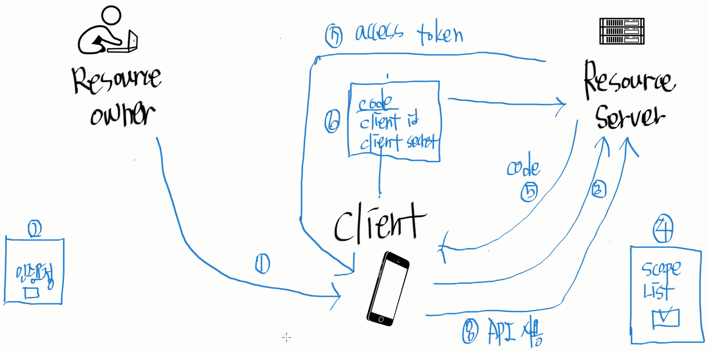

# Day75

---

> 쿠폰기능 
>
> 로그인 후 이전 페이지 기억 

# Final Project

>Ticket 구매 - javascript에서 split사용 
>
>google OAuth 로그인 

- javascript에서 split을 사용한다. 

  ```javascript
  coupon_cid = coupon_id.split(' ',2); // 띄어쓰기를 기준으로 2개까지 스플릿 한다. 
  $("#selectcid").val(coupon_cid[1]);//coupon_cid에는 배열로 값이 저장된다. 따라서 index를 적어주면 split한 값을 꺼낼 수 있다. 
  ```

## OAuth 로그인 

- [유튜브 강의-나도코딩](https://opentutorials.org/course/2473/16571)

- 구조

  

  1. **_사용자( Owner )_**가 client 와 연결된다.
     - client는 내가 개발하는 web, app 이다. 
  2. **_Client_**의 화면에서 사용자에게 Resorce Server 로 요청하기 위한 동의를 구한다. -> 동의 버튼은 **_Resorce Server_**로 연결되어 있어 바로 3번이 진행된다. 
     - Resorce Server 는 신뢰할 수 있는 기업인 google, naver, Kakao 같은 server 를 뜻한다. 
  3. 동의를 구하면 Resorce Server 로 인증 내용을 보낸다. 
  4. Resorce Server 가 인증요청을 받고 **_Client에서 필요로 하는 정보 ( Scope List )_ **가 무엇인지 사용자에게 보여준다. 사용할 정보 리스트( Scope List ) 를 가지고 Client가 이용할 수 있도록 허락하는지 사용자에게 물어본다. 
  5. 이때 동의 버튼을 클릭하면  Resorce Server 가 Client에게 사용자의 정보 ( Scope List ) 를 볼 수 있도록 허락하는  **_비밀번호 ( Code )_**를 보낸다. 
     - 따라서 Code에는 사용자가 자신의 정보를 볼 수 있도록 Client에게 권한을 줬다는 것을 뜻한다. 
  6. Client가 Resorce Server 로부터 받은 Code를 **_Client id, Client secretKey_** 와 함께 묶어 다시 Resorce Server 로 보낸다. 
     - Resorce Server 는 전달받은 3가지의 정보 ( Code와 해당 클라이언트 id. SecretKey) 가 맞는지 판단한다.
  7. Resorce Server 가 판단을 통해 Client에게 **_Access Token_** 을 보내준다. 
     - Access Token을 가지고 Client는 해당 사용자가 허락한 범위 내에서 정보를 열람할 수있다. 
  8. Client 는 Access Token을 가지고 API를 사용할 수 있다. 

- Spring Boot 에서 제공하는 google, KaKoo, Naver OAuth 를 이용한다. 

- 이용과정

  - 소셜 로그인 요청
  - 백엔드로 GET “/oauth2/authorization/{provider-id}?redirect_uri=http://localhost:3000/oauth/redirect”으로 OAuth 인가 요청
  - Provider 별로 Authorization Code 인증을 할 수 있도록 리다이렉트 (Redirect: GET “https://oauth.provider.com/oauth2.0/authorize?…”)
  - 리다이렉트 화면에서 provider 서비스에 로그인
  - 로그인이 완료된 후, Athorization server로부터 백엔드로 Authorization 코드 응답
  - 백엔드에서 인가 코드를 이용하여 Authorization Server에 엑세스 토큰 요청
  - 엑세스 토큰 획득
  - 엑세스 토큰을 이용하여 Resource Server에 유저 데이터 요청
  - 획득한 유저 데이터를 DB에 저장 후, JWT 엑세스 토큰과 리프레시 토큰을 생성
  - 리프레시 토큰은 수정 불가능한 쿠키에 저장하고, 엑세스 토큰은 프로트엔드 리다이렉트 URI 에 쿼리스트링에 토큰을 담아 리다이렉트 (Redirect: GET http://localhost:3000/oauth/redirect?token={jwt-token})
  - 프론트엔드에서 토큰을 저장 후, API 요청 시 헤더에 `Authroization: Bearer {token}`을 추가하여 요청
  - 백엔드에서는 토큰을 확인하여 권한 확인
  - 토큰이 만료된 경우, 쿠키에 저장된 리프레시 토큰을 이용하여 엑세스 토큰과 리프레시 토큰을 재발급

- redirect url

  ```
  https://accounts.google.com/o/oauth2/auth?
    client_id=[Your Client ID]&
    redirect_uri=http://localhost:8080/redirectCode&
    scope=https://www.googleapis.com/auth/indexing&
    response_type=code
  ```

  - client id : 애플리케이션의 고유 ID
  - redirect uri : 사용자의 확인이 완료되면 리다이렉트 되어 돌아올 uri
  - scope : 구글 서버에 저장된 데이터 중 사용자의 어떤 정보에 접근할 것인가
