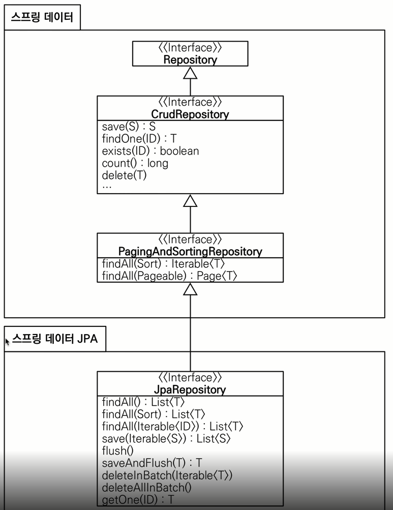

# Day81

---

# Final Project

>Google OAuth 로그인 구현
>
>JPA 개념 

### JPA

- [inflearn.com 사이트에서의 강의](https://www.inflearn.com/course/%EC%8A%A4%ED%94%84%EB%A7%81-%EC%9E%85%EB%AC%B8-%EC%8A%A4%ED%94%84%EB%A7%81%EB%B6%80%ED%8A%B8/unit/49598?tab=curriculum&volume=1.00)

- 간단한 SQL 문의 CRUD 기능을 스프링 데이터 JPA가 모두 제공한다.  

  - 실무에서 많이 사용됨 

- 스프링 데이터 JPA는 JPA를 편리하게 사용하도록 도와주는 기술이다. 따라서 JPA를 먼저 학습한 후에 스프링 데이터 JPA를 학습하는 것이 좋다. 

- 

- 이곳에서 사용되는 함수명을 "쿼리 메소드(Query Methods )" 라고 부른다.
  
  ```java
  package com.multi.oauth;
  // 레포지토리 인터페이스를 생성한다. 
  public interface UserRepository extends JpaRepository<User, Long> , MemberRepository{
      // 해당 인터페이스는 JPA레포지토리를 상속받아서 사용된다. 이때 JPA 레포지토리 클래스에는 findByEmail 함수 외 여러가지 함수를 포함하고 있다. 
      
      //email을 이용해서 찾을 수 있도록 findByEmail 도 만들어줍니다.
  	//소셜 로그인으로 반환되는 값 중에서 email을 통해 이미 생성된 사용자인지 처음 가입한 사용자인지 판단한다.
      @Override
      Optional<User> findByEmail(String email);
      // findAll, save(Iterable<ID>), getOne(ID) 등의 기능을 상속받아 사용할 수 있다. 
      
      // select m from Member m where m.name = ?   이런형식으로 쿼리문을 날림 
      Optional<User> findByEmailAndId(String email, String id);
      // And Or 등을 섞어서 사용할 수도 있다. 
      
  }
  
  ```
  
- 사용방법

  - 사용자가 기능을 등록하는 것이 아닌 spring Data JPA가 JpaRepository 상속받은 클래스를 인식하고 자동으로 만들어준다. 
  - 사용자는 사용하고자 하는 클래스에서 해당 인터페이스를 선언하면 Spring 컨테이너에서 멤버 레포지토리를 찾는다.  
  - 해당 레포지토리를 Spring이 자동으로 Bean 에다가 등록해놓는다. 

### 스프링부트 시큐리티

- [인프런 강의](https://www.inflearn.com/course/%EC%8A%A4%ED%94%84%EB%A7%81%EB%B6%80%ED%8A%B8-%EC%8B%9C%ED%81%90%EB%A6%AC%ED%8B%B0/dashboard)
  - [깃허브 자료](https://github.com/codingspecialist/-Springboot-Security-OAuth2.0-V3)

