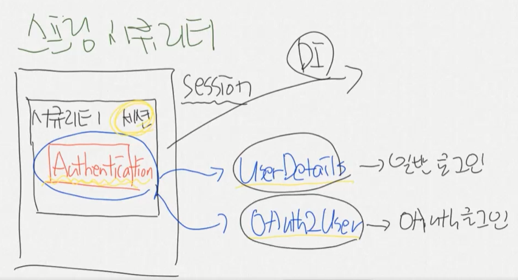

# Day82

---

# Final Project

>Google OAuth 로그인 구현
>

### 스프링부트 시큐리티

- [인프런 강의](https://www.inflearn.com/course/%EC%8A%A4%ED%94%84%EB%A7%81%EB%B6%80%ED%8A%B8-%EC%8B%9C%ED%81%90%EB%A6%AC%ED%8B%B0/dashboard)

  - [깃허브 자료](https://github.com/codingspecialist/-Springboot-Security-OAuth2.0-V3)

- Error

  - 403 에러 : 해당 에러는 URL 에 대한 권한이 없기 때문에 발생한다. 

- 스프링 시큐리티 Session

  - Session은 시큐리티 세션이 관리하는 세션과 일반 세션이 구분되어있다. 

  - 시큐리티 세션에 들어갈 수 있는 객체형태는 Authentication 형태밖에 없다. 

    - Authentication 형태안에는 2가지의 형태가 들어갈 수있다. 

      1. UserDetails => 일반로그인시 저장됨 
      2. OAuth2User => 플렛폼 로그인시 저장됨 

      

    - 이떄 Controller 에서 일반로그인과 플렛폼 로그인을 나눠서 작성해줘야한다는 문제가 발생한다.  이러한 문제를 해결하기 위해서 PrincipalDetails 형태로 받아준다. 

      - 


    ```java
    // 로그인 세션정보 확인 - 일반 로그인시 사용 
    @RequestMapping("/test/login")
    public @ResponseBody String testLogin(Authentication authentication, 
                                          @AuthenticationPrincipal PrincipalDetails userDetails) {//DI(의존성 주입) 
        System.out.println("test/login/ ==========");
    
        // 로그인한 유저 정보를 찾는 방법 
    
        // 첫번째. Authentication 객체를 이용해서 유저 정보 찾기 
        PrincipalDetails principalDetails = (PrincipalDetails) authentication.getPrincipal();
        System.out.println("Authentication : " + principalDetails.getUser());//로그인한 유저의 정보가 담겨있다.
    
    
        // 두번째. @AuthenticationPrincipal 걸어서 유저정보 찾기  
        // @AuthenticationPrincipal 어노테이션을 이용해서 세션정보에 접근할 수 있다. 
        System.out.println("userDetails : " + userDetails.getUser());
    
        return "세션정보 확인하기 ";
    }
    
    // 로그인 세션정보 확인 - 플랫폼 로그인시 사용 (google, facebook) 
    @RequestMapping("/test/oauth/login")
    public @ResponseBody String testOAuthLogin(Authentication authentication,
                                               @AuthenticationPrincipal OAuth2User userDetails) {//DI(의존성 주입) 
        System.out.println("test/oauth/login/ ==========");
    
        OAuth2User oauth2User = (OAuth2User) authentication.getPrincipal();
        // 방법 1
        System.out.println("Authentication : " + oauth2User.getAttributes());//로그인한 유저의 정보가 담겨있다.
    
        // 방법 2
        System.out.println("userDetails : " + userDetails.getAttributes());//로그인한 유저의 정보가 담겨있다.
        return "OAuth 세션정보 확인하기 ";
    }
    
    
    // 로그인 세션정보 확인 - 플랫폼 로그인시 사용 (google, facebook) 
    // 일반로그인 , 플랫폼 로그인으로 해도 모두 PrincipalDetails 로 받을 수 있다. 
    @RequestMapping("/user")
    public String user(	@AuthenticationPrincipal PrincipalDetails principalDetails) {//DI(의존성 주입) 
        System.out.println("principalDetails : " + principalDetails.getUser());
    
        return "user";
    }
    	
    ```

- 순서

  - userRequest 에 담겨있는 정보
    1. 구글 로그인 버튼 클릭 
    2. 구글 로그인창 
       - /oauth2/authorization/google 해당 주소로 이동하면 google server가 받는다. 
         - google api 콘솔 - OAuth동의화면 에서 승인된 리디렉션 URL에 "
           http://127.0.0.1:80/login/oauth2/code/google" 로 설정이 되어있어야 하며 application.properties 에 "spring.security.oauth2.client.registration.google.client-id" 와 "spring.security.oauth2.client.registration.google.client-secret" 설정이 되어있어야한다. 
         - 이때 계정이 1개면 계정선택창이 안뜬다. -> 자동으로 선택되서 바로 다음으로 넘어감 
    3. 로그인 완료
    4. code를 리턴받음 (OAuth-Client라이브러리가 대신받아줌) -> PrincipalOauth2UserService 에서 후처리가 진행됨 
    5. AccessToken 요청
    6. userRequest 에 담겨있는 정보를 활용해 회원프로필 정보를 받아야한다. (loadUser 함수 이용)


