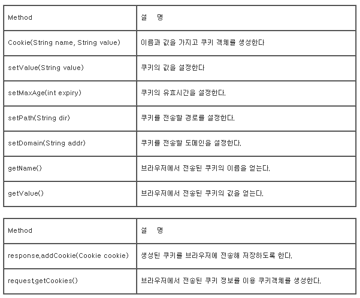

# Day86

---

# Final Project

>admin page 의 center 꾸미기
>
>쿠키와 Ajax 이용 해당 사이트 방문자 수 채크 

## 사이트 방문자 수 체크 

### 쿠키

- **쿠키(Cookie)**는 웹 사이트가 사용자 정보를 ‘저장’하기 위해서, 사용자의 PC나 스마트폰, 태블릿과 같은 디바이스에 저장하는 파일을 의미

  

- 쿠키 형태

  - **쿠키키=쿠키값; path=/; expires=Sat, 02 Oct 2021 17:46:04 GMT;**
  - 쿠키는 하나의 문자열로 각 속성 값을 세미콜론(;) 으로 구분해서 문자열로 만든다. 
  - 쿠키의 만료 표시 시각은 GMT (Greenwich Mean Time ) 시간으로 나타낸다.  이때 **GMT는 쿠키의 필수 요소** 이므로 자바스크립트의 Date 객에에서 제공하는 **toGMTString() 메소드**를 이용해서 날짜 객체를 GMT 시각 문자열로 변환한다. 

- 쿠키 정보

  - 쿠키를 추가할 때는 document.cookie 속성에 새 쿠키 문자열을 대입만 하면 기존 쿠키 정보에 새 쿠키가 추가

- 만료일

  - 만료일은 GMT 시각 문자열로, 현재시각 이전으로 만료일을 지정하면 자동으로 만료되어 삭제된다. 
  - 초단위 지정시 1000을 곱해줘야한다. 
    - ex)   date.setTime(date.getTime() + 60*1000) =>  60초동안 유지 


  ```javascript
  //쿠키 저장
  // expiredays 는 일자 정수 - 365년 1년 쿠키
  function setCookie(key, value, expiredays) {
      let todayDate = new Date();
      todayDate.setDate(todayDate.getDate() + expiredays); // 현재 시각 + 일 단위로 쿠키 만료 날짜 변경
      //todayDate.setTime(todayDate.getTime() + (expiredays * 24 * 60 * 60 * 1000)); // 밀리세컨드 단위로 쿠키 만료 날짜 변경
      document.cookie = key + "=" + escape(value) + "; path=/; expires=" + todayDate.toGMTString() + ";";
  }
  ```

- 쿠키 저장 및 보기 예제

  ``` html
  <h1>Cookie Test Page</h1><br>
  
  <button onclick="cookieCheck()">모든 쿠키 확인하기</button>
   
  <!-- 'cookie_test'라는 이름을 가진 쿠키의 값을 'success'로 '1'일동안 저장한다. -->
  <button onclick="setCookie('cookie_test', 'success', '1');">쿠키 저장하기</button>
  <button onclick="getCookie('cookie_test')">특정 쿠키 value 가져오기</button>
  <button onclick="deleteCookie('cookie_test')">특정 쿠키 삭제하기</button>
   
  <script>
      function cookieCheck() {
          if (!document.cookie) {
              alert('null')
          } else {
              alert(document.cookie.split(';'))//쿠키의 형태는 key1=value1; key2=value2; 처럼 나눠짐 
          }
      }
   
      function setCookie(cookie_name, value, days) {
          var exdate = new Date();
          exdate.setDate(exdate.getDate() + days);
          // date.setTime(date.getTime() + expireDays * 24 * 60 * 60 * 1000); // 초단위 설정가능 
          //exdate.setTime(exdate.getTime() + 60*1000); // 60초동안 유지 
   
          var cookie_value = escape(value) + ((days == null) ? '' : '; expires=' + exdate.toUTCString());
          document.cookie = cookie_name + '=' + cookie_value;
      }
   
      function getCookie(cookie_name) {
          var x, y;
          //모든 쿠키를 가진 변수 
          var val = document.cookie.split(';'); 
   
          for (var i = 0; i < val.length; i++) {
              x = val[i].substr(0, val[i].indexOf('='));
              y = val[i].substr(val[i].indexOf('=') + 1);
              x = x.replace(/^\s+|\s+$/g, '');
              if (x == cookie_name) {
                  alert(y);
              }
          }
      }
   
      function deleteCookie(cookie_name) {
          document.cookie = cookie_name + '=; expires=Thu, 01 Jan 1999 00:00:10 GMT;';
      }
  </script>
  ```

### 쿠키이용 방문자수 체크 

- 순서
  1. 쿠키가 있는지 체크 
  2. 쿠키가 없으면 쿠키를 만들고 Ajax 함수 호출
     1. ajax함수는 데이터베이스에 있는 방문자수 테이블의 데이터를 가져와 증가시킴 
  3. 쿠키 있으면 방문자수 증가 안됨 

