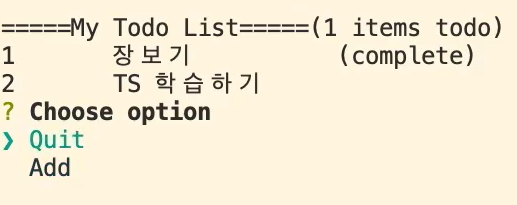

# Day2

---

> Map
>
> 전개연산자 
>
> 제네릭
>
> Type allas
>
> 사용자 키보드 입력 ( readline-sync)

## TypeScript

### Map

- 순서가 없고 key와 value로 구성되어 있는 Collection

- 사용법

  ```typescript
  930
  class TodoCollection{
      private itemMap : Map<number, TodoItem>; // Map은 선언 후 무조건 초기화되어야한다. 
      constructor(public userName : string, todoItems : TodoItem[] ){
          this.itemMap = new Map<number , TodoItem>();
          todoItems.forEach( (item) => itemMap.set(item.id, item)); // Map은 set으로 값을 넣고 get으로 읽는다. 
          
      }
      
      getTodoItems(includeComplete : boolean) : TodoItem[] {
      	return [...this.itemMap.values()].filter(
              (item) => includeComplete || !item.complete
          );// 전개연산자를 이용해 Map의 value들을 배열로 변환한다.  
  	}
  }
  
  ```

- 전개연산자 ( Spread Operator ) => ' ... ' 을 사용 

  - 배열 혹은 객체요소를 전개하기위해 사용되는 연산자.  

  - 배열에 있는 값들을 다른 배열로 옮길 때 사용 

    ```typescript
    let arr: number[] = [1,2];
    let arr2: number[] = [...arr, 3, 4];
    ```

---

## 제네릭

### 정의

- 어떤타입의 객체를  넣고 어떤타입으로 꺼낼지 명시적으로 넣을 수 있는 형태
- 재사용 가능한 클래스 , 함수를 만들기 위해 다양한 타입에서 사용 가능 하게 하기위해 사용하는 것 
- 모든 타입의 객체를 다루면서 객체 타입의 무결성을 지킬 수 있다. 

### 사용법

```typescript
class Box<T>{
    constructor(private fruit : T) {}
    getFruit() : T {
        return this.fruit;
    }
}

const box : Box<Orange> = new Box(new Orange(5));
console.log(box.getFruit().getName());

// Compile Error 발생 
const strBox = new Box('Banana');
console.log(strBox.getFruit().getName()); // 여기서 에러발생 : 이유는 box안의 값이 fruit 객체가 아닌 string 이기 때문에 fruit 객체 안에있는 getName() 을 호출할 수 없다. 
```

---

## Type Allas

### 정의

- 기존에 정의되어있는 타입이 아닌 사용자가 만들고자 하는 타입을 만들 때 사용한다. 
- 새로운 타입을 정의하는 방법은 크게 2가지이다. 
  1. Type Allas
  2. interface

### 사용법

- type 이라는 키워드를 이용해 type 다음에 오는 변수를 타입의 이름으로 만들고 ' = ' 를 사용해 타입을 지정한다. 

```typescript
// type allas 를 사용한 경우 
type mynum = number;
const num : mynum = 14;

type UserType = {name : string, age : number}; // 2개의 타입을 가지는 객체형태를 만들 수 있다. 
const testUser : UserType = {name : 'kim', age : 14};

// type allas 를 사용하지 않은경우 
const user : {name : string, age : number} = {name : 'kim', age : 14};


// 함수에 type allas  적용 전 
getItemCounts() : {total : number, incomplete : number }{
    return {
        total : this.itemMap.size,
        incomplete : this.getTodoItems(false).length
    }
}

// 함수에 type allas 적용 후 
type ItemCouns = {
    total : number,
    incomplete : number
}

getItemCounts() : ItemCouns{
    return {
        total : this.itemMap.size,
        incomplete : this.getTodoItems(false).length
    }
}

```

---

## 사용자 입력받기

- 사용자로부터 입력받기 위해서는 
- **readline-sync**
  - readline의 경우, 입력을 비동기적으로 처리함.
  - 입력을 동기적으로 처리하기 위한 package임.
  - readline-sync -npm
- sync VS async
  - 모든 메소드는 sync 와 async로 구분할 수 있다. 

### 발생 에러

- Could not find a declaration file for module 'readline-sync'

  - 모듈을 찾지 못할때이다. readline-sync 모듈을 사용하기 위해서는 npm으로 install 해야하는데, install 하고도 에러가 났다. 

  - 다음 코드로 npm install을 하니 해결되었다

    ```shell
    npm install --save @types/readline-sync
    
    // 다르게 사용한 경우 
    npm i --save readline-sync @types/readline-sync
    // i : install 을 의미함 
    // 두개의 모듈을 설치함 ( readline-sync (기본모듈) 와 @types/readline-sync ())
    // 기본모듈만 설치했을 경우 typeScript에서는 에러남. 따라서 @types/readline-sync 모듈도 설치해야함
    ```
    

- npm(Node Package Manager) 은 프로젝트에 필요한 라이브러리를 다운로드 또는 관리 할 수 있도록 해주는 프로그램

  -  -save 옵션은 package.json의 dependency 항목에 모듈을 추가한다는 의미

- **TypeScript에서는 모듈 설치 시 @types 의 전용 모듈을 같이 설치해야 사용할 수 있다.**

---

 ## 템플릿 리터럴 ( \` `)

### 정의 

- bakcktick( ` ) 문자를 사용하여 문자열을 표현한 것 
- JavaScript 의 ES6버전부터 나온 개념 . 
- 따라서 템플릿 리터럴은 새로운 문자연결 표기 방식 이라고 할수있다. 

### 기능 

1. 줄바꿈을 쉽게 할 수 있다. 
2. 문자열 내부에 표현식을 포함할 수 있다. 

```typescript
a = 3;
b = 2;
c = 5;
console.log(`This is BackTick. ${ a + b } = 
${ c } 이다. `) 
// 출력문 : This is BackTick. 5 = 
// 5

// 여기서 backTick의 강점은 ${} 라는 표현식을 문자열 내부에 넣은것과 \n 을 사용하지 않고 실제 enter를 눌러 줄바꿈 할 수 있다는 것이다. 
```

---

## inquirer

- 사용자로부터 화살표(방향키)로 움직여 선택항목을 선택해  입력을 받는다. 

### 사용방법

1. 'npm install inquirer @types/inquirer  '  을 통해 2가지 모듈을 받는다. ( inquirer 의 기본모듈과 typescript에서 사용할수 있는 모듈 )

2. 모드지정 ( prompt 함수에 리터럴 타입으로 값을 넣어서 모드를 만든다. )

   ```typescript
   // Commends.ts
   export enum Commans{
       Quit = "Quit",
       Add = "Add"
   }
   
   // TodoConsole.ts
   inquirer.prompt({
       type : 'list', // list형태로 항목을 뿌려줌 
       name : 'command',
       message : 'Choose Option',  
       choice : Object.values(Commands)// 선택할 수있는 항목들 ( 여기서는 열거형 enum 을 사용한다. )
   }).then((answers) => { // 사용자가 화살표로 선택한 항목 
       if(answers['command'] !== Commands.Quit ){ // 항목들중 Quit을 화살표로 선택하면 실행
           this.promptUser();
       }
   })
   ```



### 발생 오류

- inquirer 은 npm으로 실행시키면 사용자 방향키 입력에 에러가 난다.

  - 따라서 node로 실행한다. 

    ```shell
    node build/index.js
    ```

---

## Enum ( 열거형 타입)

### 정의

- **상수들을 관리하기 위한 객체**로, 상수의 집합을 정의

### 상수와 일반상수

- 상수 : 시용자 정의 상수 => const 를 이용한 변수 
  - 속성을 변경할 수 없음 
  - const PI = 3.14    => PI라는 변수는 사용자 정의 변수가 되어 다른 곳에서 PI의 값을 변경하지 못한다. 변경하고 싶으면 초기화 부분의 값을 변경해줘야한다. 
- 일반상수 : nummber , string ...
  - 속성의 변경이 가능 

### 사용방법

1. enum 키워드로 시작
2. 클래스처럼 중괄호 { }  사용 
3. key = value 의 형태로 나열 
4. 열거형 속성은 **숫자와 문자열만 허용**한다. 

```typescript
enum Coloe{
    red = 'r',
    blue = 'b',
    green = 'g'
}
// 상수의 집합 = enum(열거형)
const color : Color = Color.red;
```

### 리버스 멥핑 

- key로 값을꺼낼 수 있고, 값으로도 key를 꺼낼 수 있는 구조 

- 열거형 앞에 **const 가 안붙는다면** 일반적으로 리버스 맵핑이 가능하다. 

  ```typescript
  console.log(color.red ) // 출력 : r
  console.log(color['r']) // 출력 : red
  ```

  

---

## 문법

### trim()

- 문자열의 양 끝의 공백을 제거한 문자열을 반환 

### question ( ' 콘솔 출력 ')

- 해당 함수를 사용하기 위해서는 import {question} from 'readline-sync' 로 모듈을 불러와 사용해야한다. 

### 반복문

1. for of
   - 반복문을 돌며 속성 값 , 즉 value 를 출력한다. 
2. for in
   - 반복문을 돌며 속성 이름 , 즉 index를 출력한다.

```javascript
let arr = [3,5,7];
arr.foo = 'hello';

for(let i in arr){
    console.log(i); // 0,1,2,foo 가 출력된다. => 즉 속성이름이 출력된다. 
}

for(let i of arr){
    console.log(i); // 3,5,7,hello 가 출력된다. => 즉 속성값이 출력된다. 
}
```

---

## git

- git init 으로 로컬 저장소가 된 폴더를 다시 일반폴더로 변경하는 방법
  - rm -rf .git

