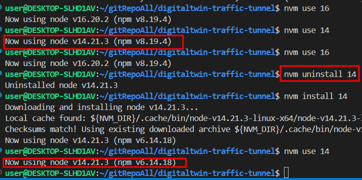

# node 버전과 npm 버전 관계.md

---

>

## 문제발생

1. 상황
   1. npm 을 이용해 프로젝트를 실행하고있었다. 
   2. 로컬에서는 잘 동작했던 node_modules 가 다른 사람쪽에선 재대로 동작하지 않았다. 
   3. 같은 node version 사용해서 npm 을 실행했는데 결과가 다름.  (package.json 도 같았음) 
   4. 의존 라이브러리가 부족하다고 나오고 해당 라이브러리를 설치하면 재대로 동작함 
2. 원인
   1. 문제가 뭔지 찾아보다가 **npm 버전이 다르다는것을 발견**했다. 
   2. 나는 nvm install 로 npm 이 설치되었고, 다른분은 npm을 직접설치(global) 해서 발생한 일이였다. 

## 결론

1. node version 에 따라 npm 도 동적으로 같이 변하게된다. 
   1. 이때 전역으로 npm 을 설치하게되면 node version에 맞게 동적으로 변경이 되지 않는다. 
2. 따라서 nvm install 시 자동 설치되는 npm 의 버전으로 동작시키는것이 맞다. 

## 해결방법

1. 문제가 있는 node 버전을 uninstall 후 다시 install 하면 됨