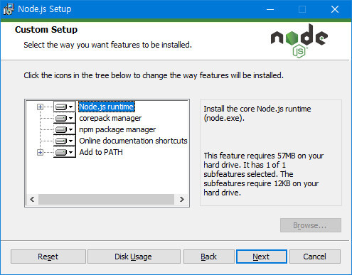
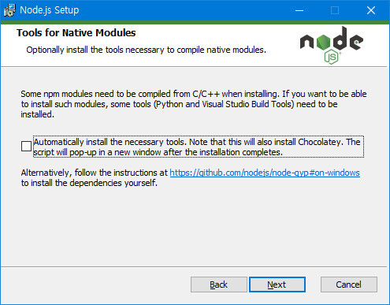
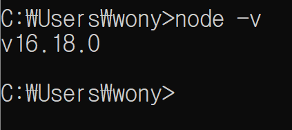
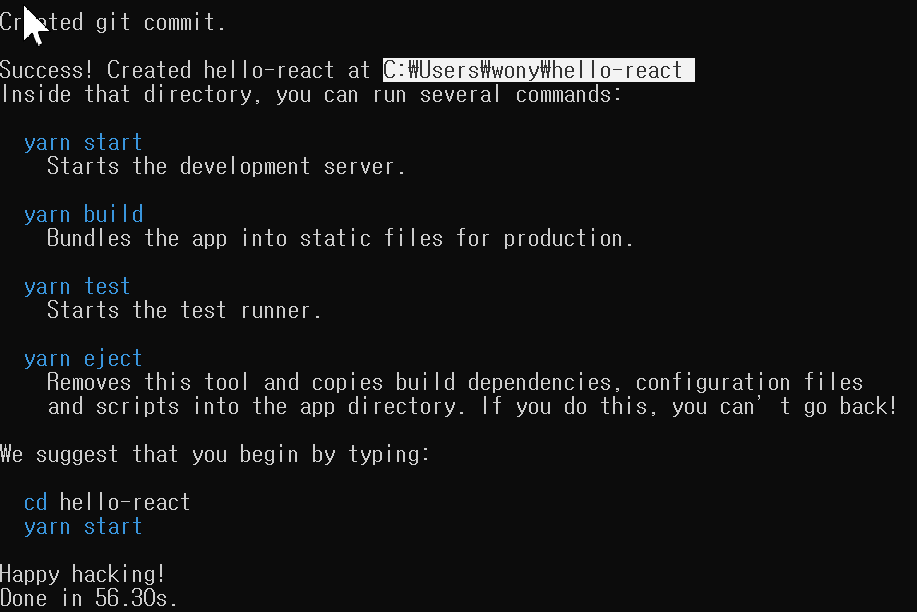
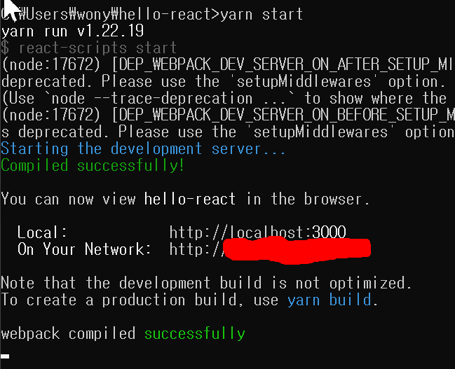
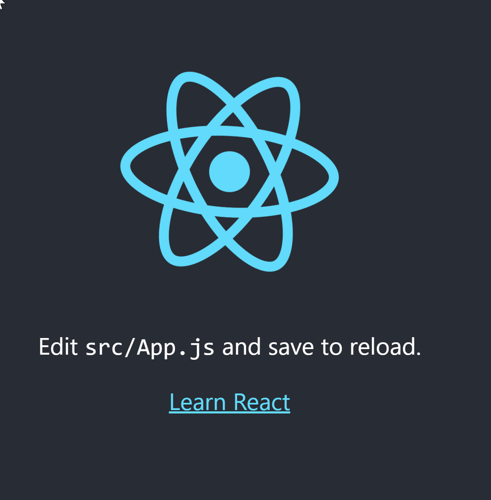
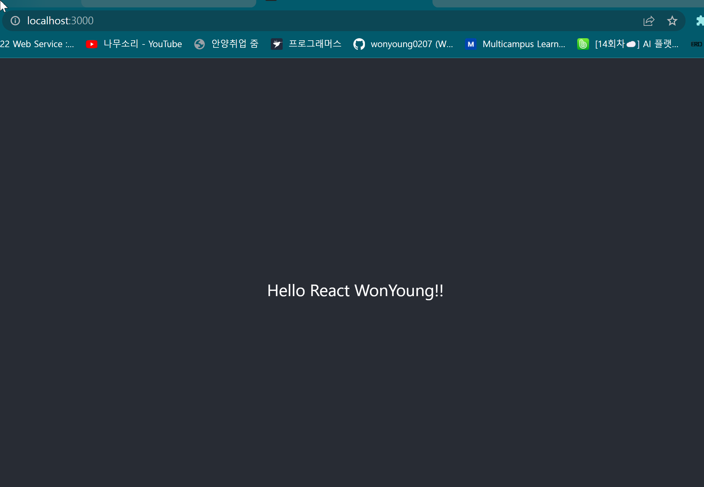

# Day1

> [참고사이트](https://offbyone.tistory.com/441)

---

## 환경설정

1. [Nodejs 설치](https://nodejs.org/en/) 

   

   - Node.js runtime : Node.js 런타임 본체가 되겠습니다. 
   - corepack manager : 패키지 관리로 npm, yarn등의 패키지 관리자의 여러 버전을 설치하고, 사용여부를 지정한다. 서로 다른 개발 또는 배포 환경에서 상호간의 설치 호환성을 유지하기 위해서 사용되어질 수 있다. 
   - npm package manager : 패키지 관리자
   - Online documentation shortcuts : 온라인 문서에 대한 바로가기
   - Add to PATH : PATH 환경변수에 등록하기

   

   - Native 모듈들을 위한 툴을 설치할지 선택합니다. 선택하지 않는다. npm 모듈중에 컴파일이 필요한 것이 있을때 필요한 도구(Python, Visual Studio Build Toos)를 자동으로 설치할지 물어 보는 것

   

2. yarn 설치 

   - nodejs 설치시 npm 이 함께 설치된다. 

   - npm을 이용해 yarn을 설치한다. 

   - 설치방법

     1. cmd 창을 열어 nodejs와 npm 의 버전을 확인한다. 

        ```\
        node -v
        npm -v
        ```

     2. npm을 이용해 yarn을 설치한다. 

        ```
        npm install -g yarn
        ```

3. 프로젝트 만들기 

   - 명령프롬프트에서 yarn을 이용해 프로젝트 생성 

     ```
     yarn create react-app hello-react
     ```

   - 프로젝트 생성 결과화면 

     

   - 기본 생성 위치는 "C드라이브 - 사용자 - UserName " 밑에 설치된다. 

4. 프로젝트 실행 

   1. 실행할 리액트 파일로 이동 후 명령프롬프트를 켠다 
   2. 프롬프트에 "yarn start" 명령어를 입력한다. 

   

   

   

   

---

## React

### React란?

- 리액트는 UI 자바스크립트 라이브러리로써 싱글 페이지 애플리케이션의 UI(User Interface)를 생성하는데 집중한 라이브러리입니다
- 리액트는 자바스크립트에 HTML을 포함하는 JSX(JavaScript XML)이라는 간단한 문법과 단방향 데이터 바인딩(One-way Data Binding)을 사용하고 있습니다. 그리고 가상 돔(Virtual DOM)이라는 개념을 사용하여 웹 애플리케이션의 퍼포먼스를 최적화한 라이브러리이다. 
- 단점 
  - 리액트는 **싱글 페이지** 애플리케이션에서 UI를 만드는 자바스크립트 라이브러리이다보니, 싱글 페이지 애플리케이션 제작을 하는 다른 프레임워크에 비해 부족한 부분이 있습니다. 예를 들어 리액트는 페이지 전환 기능을 제공하지 않기 때문에, 리액트를 사용하여 페이지 전환을 해야한다면, react-router와 같은 추가적인 라이브러리를 사용해야 합니다.

### React와 기존 웹의 차이점 

- 기존의 웹 방식은 MPA 로, 서버에 모든 페이지가 저장되어있어 클라이언트가 서버에 Request 하면 서버가 요청에 따른 웹 페이지를 생성한 후 클라이언트에게 보내는 과정으로 이루어진다. 
- React 웹 애플리케이션의 방식은 SPA 로, 클라이언트가 요청하면 서버는 페이지를 만들지 않고 빈 페이지와 사용될 Data(JSON) 을 클라이언트에게 보낸다. 해당 정보를 이용해 클라이언트가 웹 페이지를 생성하는데 이때 React가 페이지를 만들어준다. 
- React가 빈페이지와 데이터를 가지고 만든 단위를 Component 라고한다. 

### react Element

-  react로 구성하는 사용자 UI에서 가장 작은 단위
-  단순히 Data만 모여있는 형태를 가지고 있다. 
- 따라서 React.js 패키지의 React.createElement(type, props, children ) 를 써서 리액트 엘리먼트를 만들수 있다. 
- 하지만 이렇게 만들게 되면 태그별로 많은 내용을 만들어야 한다. 따라서 엘리먼트를 만들지 않고 다른방법으로 페이지를 만든다. 

### Virtual Dom

- 리액트는 화면을 렌더링할때 Virtual Dom 을 사용한다. 
- Virtual Dom 각 요소는 React Element로 구성되어있다. 

### JSX ( JavaScript  XML)

- React Element 를 쉽게 만들 수 있는 방법 

- 자바 스크립트 문법의 확장 

- 리액트 컴포넌트를 생성할 때 JSX 문법을 사용해서 만든다  .

- JSX 예시 

  ``` jsx
  ReactDOM.rander(
  	<h1 className='heading'> Hello world</h1>
      document.getElementById('content')
  )
  ```

- JSX로 작성한 코드가 Transcompile 과정을 거쳐 JavaScript 가 된다. 

  - TransComplie 과정 
    - 리액트 버전을 맞춰주는 역할
    - JSX문법을 JavaScript로 변경하는 역할 

- 주의해야할 점 

  1. 태그의 앞 글자 대소문자 구분 
     - JSX를 JavaScript로 변경하는 과정에서 대소문자를 잘 구분해야한다.
     - 태그 사용시 앞 글자를 대문자로 하면 React 컴포넌트로 인식하고, 소문자로 하면 HTML 요소로 인식하게 된다. 
  2. JSX 코드상에서 JavaScript 코드를 사용해야할 때 중괄호 안에 작성한다. 
