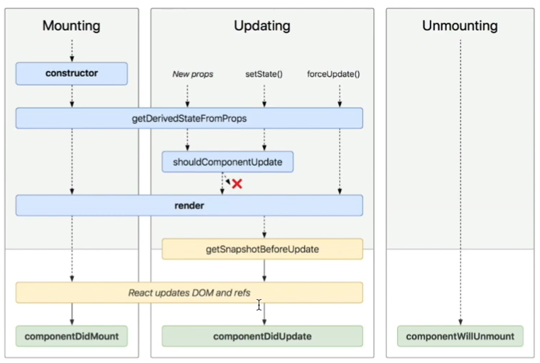

# Day4

> 5-1 ~ 5-2 까지의 내용 

---

## LifeCycle ( 생명 주기 )

- 컴포넌트에 존재하는 특정 메서드들의  호출되는 시점. 총 8개의 메서드가 존재한다.

- 종류

  

  - Mounting ( 마운트 )
    - 해당 컴포넌트가 생성되서 사용자에게 보여지기 까지의 전체 과정 
    - 해당되는 메서드 : Constructor , render, getDerivedStateFromProps, componentDidMount
  - Updating ( 업데이트 )
    - 이미 Mount된 컴포넌트가 특정한 경우에 다시 rendering 이 되어야 하는데 그때 사용되는 메서드 
    - 해당되는 메서드 : getDerivedStateFromProps, shouldComponentUpdate, getSnapshotBeforeUpdate, componentDidUpdate
  - Unmounting ( 마운트 해제 )

### 마운트 ( Mounting )

- React 컴포넌트가 실제 Dom 에 삽입된다는 것을 의미한다
- Constructor : 컴포넌트 인스턴스가 생성될 때 호출되는 메서드 . State 객체를 초기화 하거나 특정 메서드를 바인딩 하는 작업을 진행 
- componentDidMount : 마운트가 된 직후 호출되며 데이터 로딩과 같은 작업 등을 한다. 
  - 데이터 로딩 : 서버에서 데이터를 가져와 State에 값을 넣어 다시 rendering 될 수 있게 하는 것 
  - 마운트 ( 사용자 화면 ) 가 다 올라간 이후에 호출된다. 
- 바인딩 하는 방법 
  1. 생성자 안에서 진행하는 바인딩
  2. 컴포넌트 선언시 이벤트 안에서 바인딩
  3. Arrow Function 을 사용 ( 이렇게 하면 바인딩 안해도 됨 )
  4. Auto - Bind 라이브러리 사용 

### Updating

- getDerivedStateFromProps : 상태변화 있을 때 사용되는 메서드 
- shouldComponentUpdate : 성능을 최적화 하기 위한 메서드 
- getSnapshotBeforeUpdate : Dom에서 변화가 일어나기 바로 직전 상태를 가져올때 사용 

