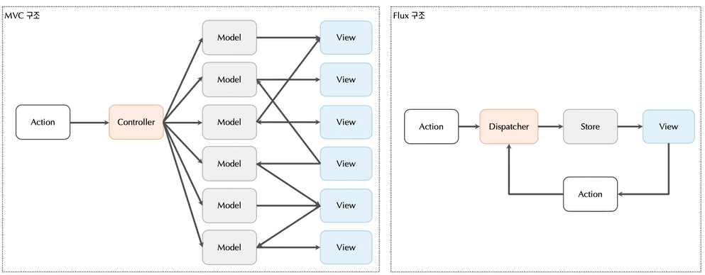

# Day5

> 6-1 ~ 6-2 까지의 내용 

---

## Flux

- 정의

  - 리액트를 이용한 UI구성에서 데이터의 흐름을 관리하는 어플리케이션 아키텍처이다. 

- MVC 와 Flux 구조의 차이점 

  

  - MVC 구조
    - 양방향 데이터 흐름으로, view , model 두 군대에서 데이터의 변경이 발생할 수 있다. 
    - 데이터 변경이 있으면 다시 View를 호출한다.
    - view가 많아질수록 데이터 흐름과 관리가 어려워진다. 
  - Flux 구조 ( React의 구조 )
    - 단반향 데이터 흐름으로, Store 를 통해 View에서 사용되는 데이터를 관리한다. 
    - 단방향 데이터 흐름은 구조를 단순화할 수 있으며 데이터의 이동 또한 명확하게 확인할 수 있다. 
    - View 각각의 state는 Store를 통해 관리되고 Store의 데이터는 Action을 이용해 제어한다. 
  - Reactd에서 사용되는 구조 
    1. Store
       - State 데이터를 통합 관리하는 곳 
       - State 
         - React 컴포넌트에서 사용되는 다양한 데이터
         - 컴포넌트는 state 객체를 이용해 변경 가능한 데이터를 관리한다. 
         - 하지만 다수의 컴포넌트에서 state객체가 사용되면 데이터 관리가 어렵다. 
         - 따라서 공통의 데이터 관리 영역 ( Store ) 를 사용해 state를 한곳에 모아놓고 관리한다. 
    2. Action
       - Store에 있는 데이터를 변경하는 과정 ( 값에 대한 변경과정 )
    3. Dispatcher
       - 특정 데이터와의 매핑을 하는 곳 

- 정리 

  

  - React 컴포넌트에서 사용되는 데이터인 State를 Store에서 통합관리하고 해당 State를 사용하기 위해서 Dispatcher 를 한다. 

  

##  Mobx

- 정의
  - 리액트의 상태를 관리하는 상태관리 컨테이너(라이브러리) 이다. 
  - Flux 아키텍처를 따르는 라이브러리이다.  
  - Mobx는 Dispacher 과정을 맡아 진행하는 라이브러리로, 컴포넌트에서 Store에 있는 State를 사용할 수 있게 해주는 라이브러리이다. 

- 사용 개념 

  - 라이브러리로, 별도로 설치해야 사용가능하다. 
  - "mobx"라는 라이브러리와 해당 라이브러리를 리액트로 사용할 수 있게 해주는 "mobx-react"라이브러리를 같이 사용한다. 

  

  - Observable
    - Mobx에 의해 관리되는 State들을 감싸는 함수 
    - Observer가 바라보는 데이터를 가진 함수이다. 
    - 따라서 Observable로 감싼 변수는 Mobx가 Store에서 관리하는 State이다. 

  - Observer
    - Observable한 특정 데이터를 바라보는 컴포넌트이다. 
    - 따라서 해당 어노테이션이 있는 클래스 컴포넌트는 Mobx가 Store에서 관리하는 State를 사용한다는 의미이다. 

  - Action 또는 runInAction
    - Observable 데이터를 변경할 때에는 Action 함수로 변경해야한다. 
    - Action : 대부분 사용 
    - runInAction : 비동기 액션일 경우 사용 

