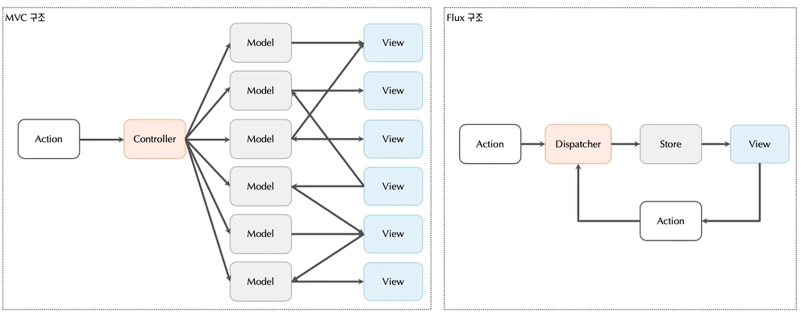
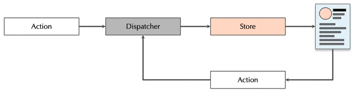

# Day5 ~  Day 6

> 6-1 ~ 6-4 까지의 내용 

---

## Flux

### 정의

- 리액트를 이용한 UI구성에서 데이터의 흐름을 관리하는 어플리케이션 아키텍처이다. 

### MVC 와 Flux 구조의 차이점 



- MVC 구조
  - 양방향 데이터 흐름으로, view , model 두 군대에서 데이터의 변경이 발생할 수 있다. 
  - 데이터 변경이 있으면 다시 View를 호출한다.
  - view가 많아질수록 데이터 흐름과 관리가 어려워진다. 
- Flux 구조 ( React의 구조 )
  - 단반향 데이터 흐름으로, Store 를 통해 View에서 사용되는 데이터를 관리한다. 
  - 단방향 데이터 흐름은 구조를 단순화할 수 있으며 데이터의 이동 또한 명확하게 확인할 수 있다. 
  - View 각각의 state는 Store를 통해 관리되고 Store의 데이터는 Action을 이용해 제어한다. 

### Reactd에서 사용되는 구조 

1. Store
   - State 데이터를 통합 관리하는 곳 
   - State 
     - React 컴포넌트에서 사용되는 다양한 데이터
     - 컴포넌트는 state 객체를 이용해 변경 가능한 데이터를 관리한다. 
     - 하지만 다수의 컴포넌트에서 state객체가 사용되면 데이터 관리가 어렵다. 
     - 따라서 공통의 데이터 관리 영역 ( Store ) 를 사용해 state를 한곳에 모아놓고 관리한다. 
2. Action
   - Store에 있는 데이터를 변경하는 과정 ( 값에 대한 변경과정 )
3. Dispatcher
   - 특정 데이터와의 매핑을 하는 곳 

### 정리 



- React 컴포넌트에서 사용되는 데이터인 State를 Store에서 통합관리하고 해당 State를 사용하기 위해서 Dispatcher 를 한다. 

---

##  Mobx

- 정의
  - 리액트의 상태를 관리하는 상태관리 컨테이너(라이브러리) 이다. 
  - Flux 아키텍처를 따르는 라이브러리이다.  
  - Mobx는 Dispacher 과정을 맡아 진행하는 라이브러리로, 컴포넌트에서 Store에 있는 State를 사용할 수 있게 해주는 라이브러리이다. 

- Mobx 에서 사용되는 라이브러리 

  1. mobx.js
  
     - @obsevable : 해당 변수가 mobx에 의해 관리되고 있는 State라는 것을 나타낸다. 
  
  2. mobx-react.js : mobx와 react를 연결하는데 필요 
  
     - **@inject** : Store객체를 주입하는 것으로, 사용할 컴포넌트 위에 정의한다. 
  
       - inject로 주입된 객체들은 props에서 꺼내 this.props를 이용해 사용한다. 
       - inject 되기 위해서는 해당 컴포넌트들이 \<provider> 를 통해 전체 Store가 제공되어야한다. 
  
       ```react
       @inject('counterStore')
       class CounterComponent extends Component{
           render(){
               const {counterStore } = this.props;
               return(
               	<div>
                   	<Button onClick={() => counterStore.decrement()}>
                           -
                       </Button>
                   	<Box
                           component='span' m={5} > {counterStore.count} <!-- get메소드 이용 -->
                       
                       </Box>
                   
                   </div>
               )
           }
       }
       ```
  
     - **\<provider>**: Store들을 정의하는 것으로, mobx는 여러 Store를 만들어 관리할 수 있다. 
  
       - 예를들어, CounterStore 라는 count를 관리하는 Store와 UserStore라는 User 관련 정보를 관리하는 Store 이렇게 여러개로 나눌 수 있다. 
       - provider 태그안의 컴포넌트들은 Store에 있는 State를 사용할 수 있다. 
         - 만약 App 를 Provider 안에 넣으면 App 컴포넌트 안의 모든 컴포넌트에서 Store 를 사용할 수 있다. 
       - 이때 provider 안에 컴포넌트에는 **props로 Store의 정보가 전달**된다.  
  
  - 어떤 라이브러리에 어떤 API가 있는지 알아야 한다. 
    - 예를들어, mobx 라이브러리에는 observable API가 있다. 
  

----

## Mobx 에서 사용되는 API 

- 라이브러리로, 별도로 설치해야 사용가능하다. 
- "mobx"라는 라이브러리와 해당 라이브러리를 리액트로 사용할 수 있게 해주는 "mobx-react"라이브러리를 같이 사용한다. 


### 1. Observable ( mobx 라이브러리 ) : Store안에있는 변수에 사용된다. 

- Mobx에 의해 관리되는 State들을 감싸는 함수 
- Observer가 바라보는 데이터를 가진 함수이다. 
- 특정 데이터를 관찰가능한 데이터로 만들어 react 컴포넌트가 state로 사용할 수 있게 한다. 
  - 따라서 Observable로 감싼 변수는 Mobx가 Store에서 관리하는 State이다. 

- Observable이 붙은 변수의 값은 항상 @action 에 의해서만 변경된다. 
- observable 데이터가 변경되면 rendering 을 다시해야한다. 

### 2. Observer ( mobx-react 라이브러리 ) : Observable 한 데이터를 사용하는 컴포넌트 (  Container, View)에서 사용된다. 

- Observable한 특정 데이터를 바라보는 컴포넌트로, Observable 데이터가 변경되면 다시 rendering을 한다. 
- 따라서 해당 어노테이션이 있는 클래스 컴포넌트는 Mobx가 Store에서 관리하는 State를 사용한다는 의미이다. 
- observer API는 " @autorun + render()" 를 뜻한다. 
- observer 어노테이션을 붙여줘야 변경된 값이 컴포넌트에 적용된다. 

  - 이때 반드시 Store 컴포넌트 부분에서 생성자 안에 **makeObservable(this)** 를 선언해 줘야한다. 

  ```react
  import { observable , action, makeObservable } from 'mobx';
  
  class CounterStore{
      constructor(){
          makeObservable(this);
      }
      @observable
      _todo = {} // id, title, date
      
      get todo(){
          return this._todo;
      }
      
      @action
      setTodoProps(name, value){
          this._todo = {
          	...this._todo,
              [name] = value
          }
      }
  }
  
  export default new CounterStore();
  
  ```

### 3. Action 또는 runInAction ( mobx 라이브러리 )

- Observable 데이터를 변경할 때에는 Action 함수로 변경해야한다. 
- 관찰하고 있는 데이터 ( Observable 한 데이터) 를 변경하고자 하는 메소드에서는 action API를 붙여줘야한다.
- Action : 대부분 사용 
- runInAction : 비동기 액션일 경우 사용 

### 4. inject 

-  Store객체를 주입하는 것으로, 사용할 컴포넌트 위에 정의한다. 
- inject로 주입된 객체들은 props에서 꺼내 this.props를 이용해 사용한다. 
- inject 되기 위해서는 해당 컴포넌트들이 \<provider> 를 통해 전체 Store가 제공되어야한다. 

### 5. autorun

- 특정 observable한 데이터가 변경되었을 때 수행되어야 하는 작업을 뜻한다. 
- 리액트가 autorun과 render() 를 함께 수행하기 때문에 observer api로 합쳐 사용된다.

