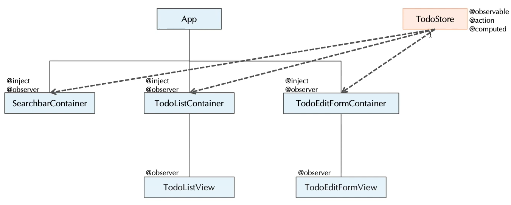

# Day7

> 6-5 ~ 6-9 까지의 내용 

---

## React와 Mobx의 패키지 구성



1. Container
   - Store와 React Component를 연결하는 역할을 담당
   - Container는 Store와 연결되어 @Inject를 통해 Store를 주입받아 State를 사용한다. 이때 View 에 필요한 데이터를 Props로 내려준다. 
   - @Inject , @observer 를 사용한다. 
2. View
   - Container에 포함된다. 
   - @observer만 사용한다. 
3. repogitory ( = api )
   - API 라고도 하며 서버와 통신을 담당하는 클래스로 구성한다. 
4. Store
   - 전역 State를 관리하는 Store클래스로 구성한다.    
   - @action , @observable , @computed 를 사용한다. 
5. Model
   - 서버의 Model과 View Model의 전환을 담당 

- View보다 큰 개념의 Container가 Store와 연결되어서 State를 통해 데이터들을 View에 보내준다. 이때 View는 Props로 데이터를 받고 Props의 값이 바뀌게 되면 다시 rendering() 한다. 


## Observable 데이터의 형태

- @observable 
  - @observable 한 데이터는 JavaScript 객체가 아닌 mobx 객체로 감싸져 관리된다. 따라서 observable객체 출력시 observableObjectAdmin... 이런형태로 객체가 들어가게 된다. 
  - 해당 객체를 JavaScript 형식으로 변경하기 위해서는 toJS 라는 패키지가 필요하다. 
  - import {toJS} from 'mobx'; 로 불러와 사용하고, observable 한 객체를 넘겨줄 때 toJS(this._todos) 로 넘겨준다. 
- @computed 
  - observable 데이터간에 연산이 일어날 때 꼭 사용해줘야하는 API이다. 

```react
import {toJS} from 'mobx';
class TodoStore{
    @observable
    _todos = [];
    
    @computed
    get todos(){
        // return this._todos ? this._todos.slice() : [] 
        return toJS(this._todos);// mobxObject 형태를 javascript 객체 형태로 변경하는 함수 
    }
}
```

