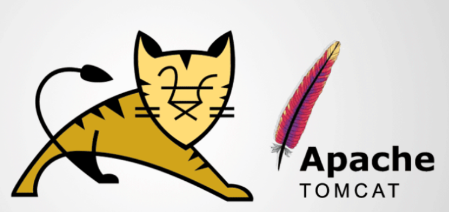
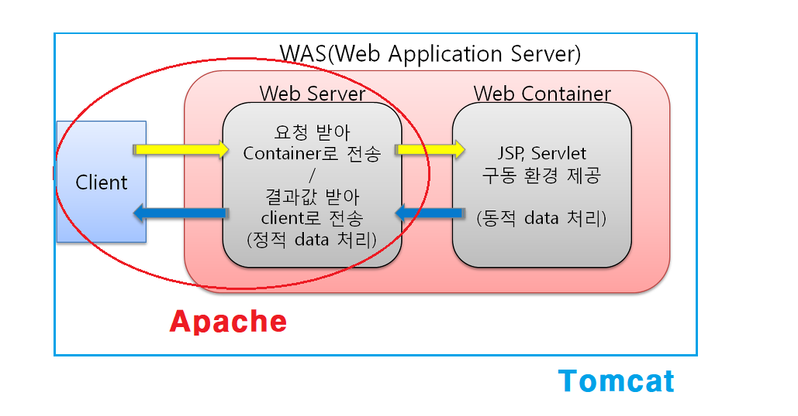

# Apache Tomcat 개념정리 

---

>[참고 사이트1](https://ssd0908.tistory.com/entry/%EC%95%84%ED%8C%8C%EC%B9%98Apache%EC%99%80-%ED%86%B0%EC%BA%A3Tomcat%EC%9D%98-%EC%B0%A8%EC%9D%B4%EC%A0%90-%EB%B0%8F-%EC%9D%B4%ED%95%B41)
>
>[참고 사이트2](https://velog.io/@kdhyo/Apache-Tomcat-%EB%91%98%EC%9D%B4-%EB%AC%B4%EC%8A%A8-%EC%B0%A8%EC%9D%B4%EC%A7%80)
>
>[참고 사이트3](https://yoo-hyeok.tistory.com/137)
>
>[참고 사이트4](https://ithub.tistory.com/101)

## Apache Tomcat ( 아파치 톰켓 )

### 정의 

- 아파치와 톰캣이 합쳐진 것으로, 페이지에서 정적인 내용을 다루는 아파치와 동적인 내용을 다루는 톰켓으로 나뉜다. 
- **Web Server + WAS ( Web Application Server )  의 구조**를 가진다. 
  - **아파치** : Web Server 
  - **톰켓** : WAS( Web Server + Web Container )
- 따라서 정적인 내용들은 Web Server가 처리하고, 동적인 내용들은 WAS 가 처리한다. 

### Apache

- 아파치 재단에서 만든 소프트웨어 
- Web Server (**정적**인 내용 : html, css, img로 바뀌지 않는 정보들 )
- 장점
  1. 처리 속도가 빠르다. 
  2. 구조가 단순하여 비용절감된다. 
  3. 트래픽 과부하에 강하다. 
- 단점
  1. 정적인 데이터만 처리가능하다. 
  2. 다른 서비스와 상호작용이 불가능하다 .

### Tomcat

- WAS( Web Server + Web Container ) ( **동적**인 내용 : 상호작용하거나 DB에 의해 변경되는 부분) 
- 통상적으로 Apach Tomcat 이라고 부르기도 한다. 
- 장점
  1. 데이터의 흐름이 유동적이다. 
  2. DB등 여러 서비스에서 이용할 수 있다.  
- 단점
  1. 아파치에 비해 속도가 느리다. 
  2. 부가적 비용이 발생한다. 
  3. 트래픽 과부하에 약하다. 

### Apache Tomcat

- 웹 서버 + WAS 

### 웹 서버 ( Web Server )

- **정적**인 자료를 처리하는 서버로 html, css, image 등 내용이 변하지 않는 파일들을 요청한 곳에 뿌려주는 역할을 한다. 
  - 따라서 클라이언트가 GET, POST, DELETE 등등의 메소드를 이용해 요청을 하면 그에 대한 결과를 돌려주는 기능을 하는것이 웹서버이다. 
- 서버에 정적인 모든 파일들을 저장하고 요청 발생시 파일을 보내줘야하기 때문에 데이터 저장에 **자원이 많이 소모**된다. 
  - 이것을 해결한것이 WAS이다. 
- **Apache 서버가 담당**한다. 

### WAS (  Web Server + Web Container )

- **동적**인 자료를 처리하는 서버로, 웹 서버에 Servlet Container 개념이 추가되었다. 
- 클라이언트가 웹 페이지 요청시 Servelet Container 가 요청정보를 파악해 **실시간으로 페이지에 필요한 파일을 생성**한다. 
  - 요청이 올때마다 정보를 생성하므로 서버의 리소스 부하를 줄일 수 있다. 
- 따라서 정적인 부분도 처리할 수 있지만 동적인 부분도 처리할 수 있는 서버가 WAS이다. 
- **Tomcat 서버가 담당**한다. 

### Apache와 Tomcat 을 나누는 이유 

- WAS는 정적인것과 동적인것을 같이 해결할 수 있다. 
  - 하지만 정적과 동적을 분리해서 하면 더 효율적으로 서버를 구동할 수 있게 된다. 
- 따라서 정적인 부분은 Apache 가 담당하고 동적인 부분은 Tomcat 서버가 담당하게 된다. 

### 장점

1. 효율적으로 자원을 활용한다. 
   - 정적인 부분은 Apache 가 처리하고, 동적인 부분은 Tomcat 이 처리한다. 
   - 이렇게 하면 정적인 요청은 **웹 서버에서 바로 Response** 할 수 있기때문에 부하를 줄일 수 있다. 
2. 로드벨런싱
   - 많은 트래픽이 발생하는 조건인 경우, 여러 WAS로 로드벨런싱에 유리.

